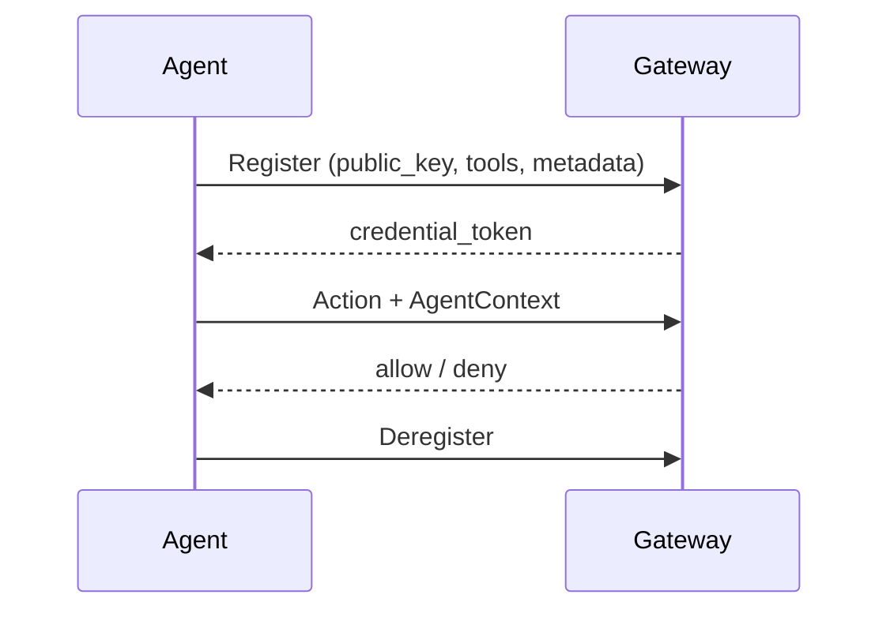

# Agent

## Definition

An **agent** is the workload Agent Assembly governs: an LLM-driven program that
decides, at runtime, which actions to take to accomplish a goal. From the
gateway's point of view an agent is a stable identity that performs *actions* —
calling a tool, making an LLM request, or reaching out over the network. Each
agent is organized under a **team** and an **org**, which is the scope at which
policy and budget are applied.

Two identity types distinguish a long-lived agent from a single run. `AgentId`
is the stable identifier carried across every session; `SessionId` is generated
fresh for each execution and ties together all governance events within that
run. Both are 16-byte UUID v4 values. The `AgentContext` carries these together
with the OS process ID, a start timestamp, free-form metadata, the governance
level, and the agent's position in any delegation hierarchy (`parent_agent_id`,
`root_agent_id`, `depth`, `team_id`).

## How it works

An agent's lifecycle has three phases:

1. **Register.** The SDK calls the gateway's lifecycle service with the agent's
   name, framework (for example `langgraph` or `crewai`), declared tool names,
   an Ed25519 `public_key`, and metadata. The gateway validates the key, stores
   an `AgentRecord`, and issues a short-lived `credential_token` the agent
   presents on subsequent calls. This token-vs-`public_key` binding is how the
   gateway rejects impersonation.
2. **Operate.** For each governed action the runtime builds an `AgentContext`
   and submits it for a decision. The gateway evaluates [policy](policy.md),
   tracks budget, and records an [audit](audit.md) entry — for both allows and
   denies. Sub-agents spawned by an agent inherit lineage so a delegation chain
   can be reconstructed from any node.
3. **Deregister.** A clean shutdown unwinds the SDK hooks and closes the gateway
   connection. Agents that stop sending heartbeats past their configured maximum
   age are force-deregistered by the gateway.



## Example

Each SDK wires an agent into the gateway with a single call. Tool invocations
after that point are governed.

```python
from agent_assembly import init_assembly

with init_assembly(
    gateway_url="http://localhost:7391",
    api_key="dev-key",
    agent_id="quickstart-agent",
    mode="sdk-only",
):
    ...  # every governed tool call now goes through the policy gate
```

```ts
import { initAssembly } from "@agent-assembly/sdk";

const ctx = await initAssembly({
  gatewayUrl: "http://localhost:7391",
  agentId: "demo",
  langchain: { tools: { searchWeb } },
});
await ctx.shutdown();
```

```go
ctx := assembly.WithAgentID(context.Background(), "my-agent")
a, err := assembly.Init(ctx, assembly.WithGatewayURL(url), assembly.WithAPIKey(key))
if err != nil {
    log.Fatal(err)
}
defer a.Close()
```

## Related

- [Policy](policy.md) — what an agent is and is not allowed to do.
- [Approval](approval.md) — how an agent's high-risk actions reach a human.
- [Trace](trace.md) — how an agent's actions are observed per session.
- [DID](did.md) — the cryptographic identity an agent registers with.
- [API reference](../src/api-reference.md) — `aa-core` (`AgentId`, `AgentContext`)
  and `aa-gateway` (registry, lifecycle service) rustdoc entry points.
- Quickstart (tracked under AAASM-418) — end-to-end first-run walkthrough.
