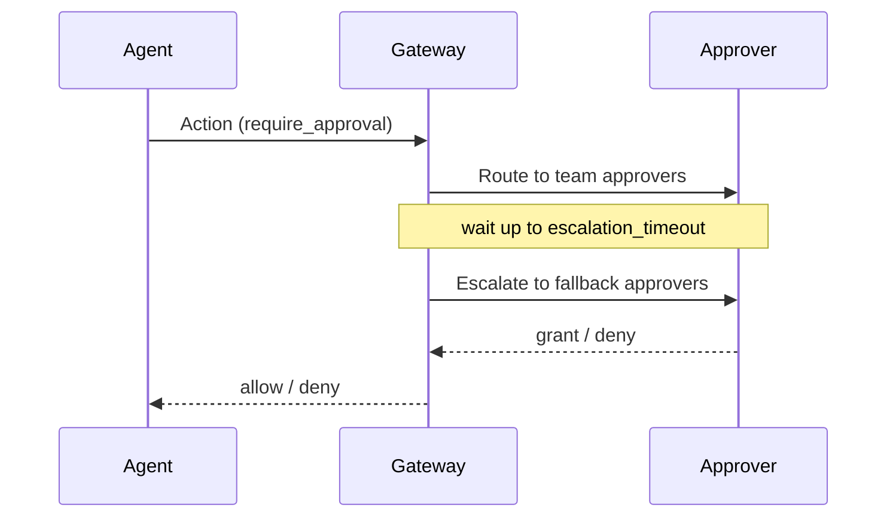

# Approval

## Definition

An **approval** is a human-in-the-loop (HITL) checkpoint: a high-risk action is
held by the gateway until a designated person grants or denies it. Approvals
turn a binary allow/deny policy into a third path — *require approval* — so an
agent can attempt a sensitive action while a human stays in control of whether
it actually runs.

An approval request is categorized by an `ApprovalKind`: `spawn` (an agent tried
to spawn a child agent), `tool_use` (an agent invoked a tool that requires
approval), `budget_increase` (an agent requested more budget), or a
caller-defined `custom` kind. The kind is used as a routing key so different
action types can reach different approvers within the same team.

## How it works

A policy rule with `effect: require_approval` — or a per-tool
`requires_approval_if` CEL expression that evaluates true — pauses the action and
raises a request. The gateway then:

1. **Routes** the request using the requesting agent's `team_id`. Each team's
   `TeamRoutingConfig` names an ordered list of `approvers`, an
   `escalation_timeout_secs`, and a fallback list of `escalation_approvers`.
   Routing may be filtered by `ApprovalKind`.
2. **Waits** for a decision. The action blocks until an approver responds or the
   timeout expires. The default approval timeout is 300 seconds; a policy may
   override it via `approval_timeout_secs`.
3. **Escalates** if the first approvers do not respond before
   `escalation_timeout_secs`. A restart-safe scheduler fires the escalation and
   re-routes the request to the `escalation_approvers`.
4. **Resolves.** A grant lets the action proceed; a deny blocks it; a timeout
   resolves to *pending/denied* so a stalled request never silently allows.

Every transition is recorded in the [audit](audit.md) trail —
`ApprovalRequested`, `ApprovalRouted`, `ApprovalEscalated`, `ApprovalGranted`,
`ApprovalDenied`, and `ApprovalTimedOut` — so the full decision history is
reconstructable.



## Example

Who can approve is configured per team. A routing entry pairs the primary
approvers with an escalation fallback:

```json
{
  "team_id": "platform",
  "approvers": ["ops-oncall"],
  "escalation_timeout_secs": 300,
  "escalation_approvers": ["eng-manager"],
  "approval_kind": "tool_use"
}
```

The matching policy rule that triggers this flow:

```yaml
- id: require-approval-for-writes
  match:
    actions: ["db:write", "api:delete"]
  effect: require_approval
  approval:
    timeout_seconds: 300
    approvers: ["ops-team"]
```

## Related

- [Policy](policy.md) — the `require_approval` effect that triggers an approval.
- [Audit](audit.md) — the `Approval*` events recorded for each transition.
- [Agent](agent.md) — the `team_id` that determines routing.
- [API reference](../src/api-reference.md) — `aa-gateway` approval router and
  escalation scheduler rustdoc entry points; `aa-core` (`ApprovalKind`).
- Quickstart (tracked under AAASM-418) — approving an action end-to-end.
