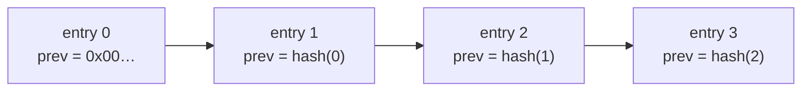

# Audit

## Definition

The **audit log** is the immutable, append-only record of every decision the
gateway makes — both allows and denies — together with the action that prompted
it. It is the accountability layer: for any agent it answers *what did it do,
when, and was it permitted?* Audit records use one wire format regardless of
which interception layer observed the action, so the gateway presents a single
unified history.

The unit of the log is an `AuditEntry`. Each entry carries a monotonic `seq`, a
nanosecond `timestamp_ns`, an `AuditEventType` (for example
`ToolCallIntercepted`, `PolicyViolation`, `CredentialLeakBlocked`,
`ApprovalGranted`, `BudgetLimitExceeded`), the `agent_id` and `session_id`, a
serialized `payload`, optional lineage (team, org, delegation chain), and the
hash-chain fields below.

## How it works

Every entry commits to its tamper-meaningful fields via a **SHA-256 hash** that
includes the hash of the preceding entry, forming a tamper-evident chain. The
genesis entry uses `[0u8; 32]` as its `previous_hash`. The canonical hash input
is a fixed byte sequence:

```text
SHA-256(
    seq.to_be_bytes()                    //  8 bytes
    || timestamp_ns.to_be_bytes()        //  8 bytes
    || (event_type as u32).to_be_bytes() //  4 bytes
    || agent_id.as_bytes()               // 16 bytes
    || session_id.as_bytes()             // 16 bytes
    || previous_hash                     // 32 bytes
    || payload.as_bytes()                // variable
)
```

An `AuditLog` is a session-scoped sequence that enforces two invariants on every
append: each entry's `seq` is exactly one greater than the last, and each
entry's `previous_hash` equals the prior entry's `entry_hash`. `verify_chain`
re-validates both across the whole log and re-computes every hash, so any altered
field — even via `unsafe` — is detected.



Records are kept **free of secrets**. Before any event is persisted it passes a
write-boundary sanitizer that strips banned keys (prompts, completions, full
tool payloads, packet bodies) and a credential scanner that redacts detected
secrets — only the `[REDACTED:<kind>]` label and byte offset are stored, never
the raw secret. Heartbeats are collapsed into a "last seen" update rather than
written per beat.

## Example

The hash chain makes tampering detectable. Mutating any persisted field causes
re-verification to fail:

```rust
let mut log = AuditLog::new(agent_id, session_id);
log.next_entry(AuditEventType::ToolCallIntercepted, ts, payload);
log.next_entry(AuditEventType::PolicyViolation, ts, payload);
assert!(log.verify_chain()); // true for an untouched log
// Altering any entry's payload, seq, or hash would flip this to false.
```

Retention and export are operational concerns: the unified trail is what
[compliance export](../src/operations/compliance-export.md) reads to produce a
verifiable record for downstream systems.

## Related

- [Policy](policy.md) — the decisions that produce audit entries.
- [Approval](approval.md) — the `Approval*` events recorded per transition.
- [Trace](trace.md) — the per-session view over governed actions.
- [Audit and assurance](../src/security/audit-assurance.md) — sanitizer,
  redaction, and the publish path.
- [Compliance export](../src/operations/compliance-export.md) — retention and
  export.
- [API reference](../src/api-reference.md) — `aa-core` (`AuditEntry`,
  `AuditLog`) and `aa-security` (scanner, redaction) rustdoc entry points.
