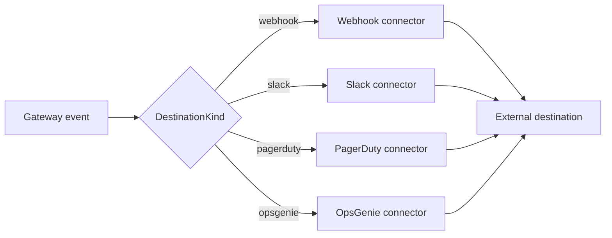

# Connector

## Definition

A **connector** is an outbound dispatcher that delivers a governance
notification to an external destination — a webhook endpoint, a Slack channel,
PagerDuty, or OpsGenie. When the gateway needs to tell a human system that
something happened (an action was blocked, an anomaly was detected), it hands
the message to the connector for the destination's kind, which knows how to
format and deliver it.

A **destination** is the configured target; a **connector** is the code that
delivers to it. Each destination has a `DestinationKind` — `webhook`, `slack`,
`pagerduty`, or `opsgenie` — and the gateway selects the matching connector at
dispatch time.

## How it works

Every connector implements one trait, `NotificationConnector`, with a single
async method:

```rust
#[async_trait::async_trait]
pub trait NotificationConnector: Send + Sync {
    async fn dispatch(
        &self,
        destination: &Destination,
        req: &DispatchRequest,
    ) -> Result<DispatchOutcome, ConnectorError>;
}
```

A `DispatchRequest` carries a `severity` label (for example `LOW` or
`CRITICAL`) and a human-readable `message`. On success the connector returns a
`DispatchOutcome` with the delivery timestamp, the observed HTTP status, and a
bounded snippet of the destination's response body. On failure it returns a
`ConnectorError`: `Http { status, body }` when the destination replied non-2xx,
or `Transport` when delivery failed before an HTTP response (DNS, TCP, TLS, or
timeout). Response bodies are capped (2048 bytes) so error envelopes stay
bounded.

All connectors share one pooled `reqwest` client so connection reuse and TLS
configuration are consistent. PagerDuty and OpsGenie are gated behind cargo
features (`connector-pagerduty`, `connector-opsgenie`) so the binary stays small
when only webhook and Slack are needed. Connectors can be test-fired through the
control-plane API:
`POST /alerts/destinations/{id}/test`.



## Example

Supported connector types map one-to-one to `DestinationKind`:

| Kind        | Delivers to                          | Feature-gated |
|-------------|--------------------------------------|---------------|
| `webhook`   | A generic webhook URL                | no            |
| `slack`     | A Slack incoming-webhook URL         | no            |
| `pagerduty` | PagerDuty Events API v2 routing key  | yes           |
| `opsgenie`  | OpsGenie REST API key + team         | yes           |

A policy's `notifications` block decides which events fire a dispatch:

```yaml
notifications:
  on_block: true
  on_allow: false
  on_anomaly: true
```

## Related

- [Policy](policy.md) — the `notifications` block that triggers a dispatch.
- [Audit](audit.md) — the durable record alongside outbound notifications.
- [Approval](approval.md) — approvals frequently route through the same
  notification destinations.
- [API reference](../src/api-reference.md) — `aa-api` destinations / connectors
  (`NotificationConnector`, `DestinationKind`) rustdoc entry points.
- Quickstart (tracked under AAASM-418) — wiring a first destination end-to-end.
