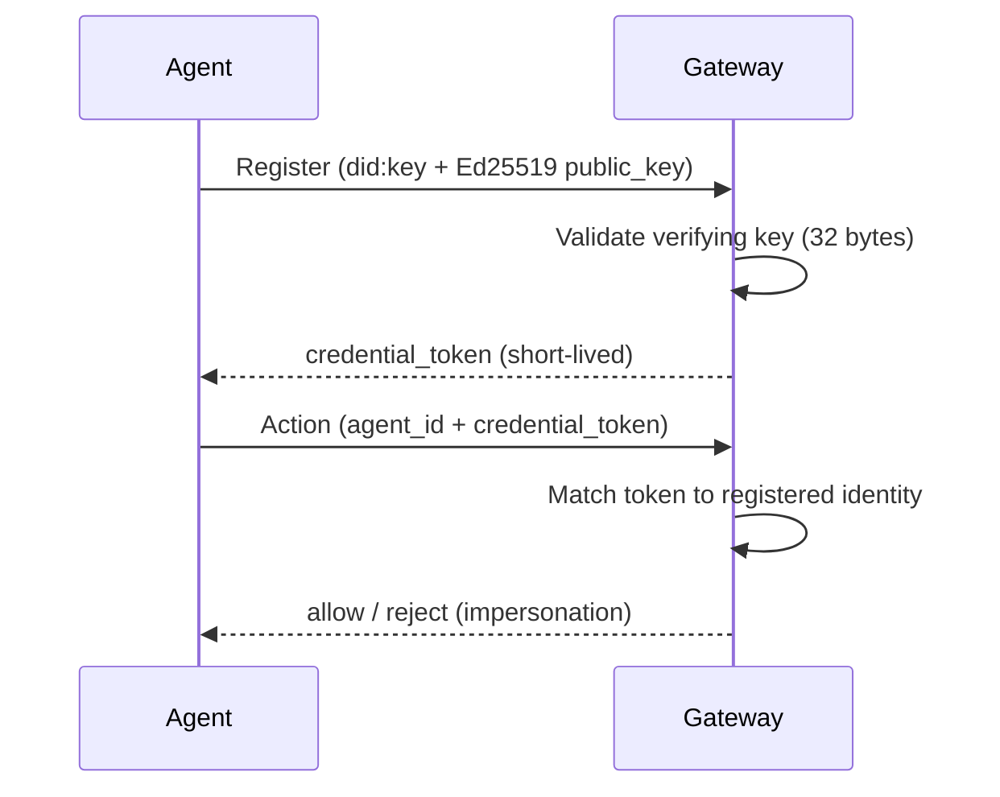

# DID

## Definition

A **DID** (Decentralized Identifier) is a self-describing identifier whose
trust is rooted in a public key rather than in a central registrar. Agent
Assembly uses the `did:key` method, where the identifier encodes an Ed25519
public key directly — for example
`did:key:z6Mkm5rByiqq5UNbvPFPfXtGJwdg2kD1T`. The DID *is* the key, so anyone
holding the DID can verify a signature without consulting an external directory.

## How it works

When an agent registers, it presents an Ed25519 `public_key` alongside its name,
framework, and declared tools. The gateway validates that the key is a
well-formed Ed25519 verifying key (32 bytes, hex-encoded) before storing the
agent's `AgentRecord`, and rejects anything malformed at the lifecycle boundary.
The agent's `agent_id` can itself be a `did:key` string, making the identifier
and the verification key one and the same.

In return the gateway issues a short-lived `credential_token`. That token — not
the public key — is what the agent presents on subsequent calls, and it is the
basis of the zero-trust agent-to-agent (A2A) check: when agent A calls a tool
exposed by agent B, the gateway validates the supplied `credential_token`
against the **callee's** registered token *before any policy rule runs*. An
impersonator presenting another agent's `agent_id` with its own token is
rejected at the front door and the attempt is recorded as
`A2AImpersonationAttempted` in the [audit](audit.md) log.



**Why a DID for agent identity.** Agents are ephemeral and may be spawned by
other agents across teams and orgs. A key-rooted identifier gives each agent a
verifiable identity that does not depend on a shared secret or a central
authority, and lets the gateway distinguish the *callee* (the agent performing
an action) from the *caller* (an attestation, not a credential) on every A2A
dispatch.

**Key rotation.** Because the identity is rooted in a public key, rotating a
key means re-registering the agent with the new Ed25519 `public_key`; the
gateway issues a fresh `credential_token` and the old token is invalidated. With
`did:key`, a new key is a new identifier, so rotation is deliberate and
auditable rather than silent.

## Example

A registration carries the DID and its Ed25519 key; the conformance wire-format
vectors use exactly this shape:

```json
{
  "agent_id": "did:key:z6Mkm5rByiqq5UNbvPFPfXtGJwdg2kD1T",
  "public_key": "<64 hex chars — 32-byte Ed25519 verifying key>",
  "framework": "langgraph"
}
```

A delegated sub-agent references its parent the same way:

```json
{
  "agent_id": "did:key:child",
  "parent_agent_id": "did:key:parent"
}
```

## Related

- [Agent](agent.md) — the identity a DID names and the registration lifecycle.
- [Audit](audit.md) — `A2AImpersonationAttempted` and A2A audit events.
- [Approval](approval.md) — `spawn` approvals gate delegated identities.
- [Agent-to-agent identity](../src/operations/a2a-identity.md) — the full
  zero-trust A2A verification flow.
- [API reference](../src/api-reference.md) — `aa-gateway` lifecycle service and
  registry rustdoc entry points.
