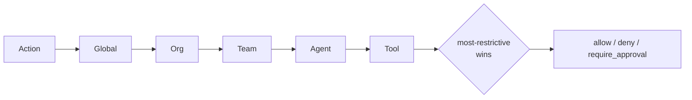

# Policy

## Definition

A **policy** is a declarative document — written in YAML — that states what
agents are and are not allowed to do. Rules match on the action type, target,
and labels of a request and resolve to an effect: *allow*, *deny*, or
*require approval*. Policy is evaluated **server-side, in the gateway** — never
by the agent or the dashboard — so the workload it governs cannot tamper with
the decision.

## How it works

A policy document carries an envelope (`apiVersion`, `kind`, `metadata`) and a
`spec` with a risk `tier`, a list of `rules`, and optional sections for
`network` egress, `schedule` active-hours, `budget` caps, `data` PII patterns,
and per-`tools` limits. Each rule has a `match` block (`actions`, and optional
target/label predicates), an `effect`, and an `audit` flag.

Policies are **scoped and they cascade.** A document's `scope` field attaches it
to one of five levels — `global`, `org:<id>`, `team:<id>`, `agent:<uuid>`, or
`tool:<name>`. When an action is evaluated the engine walks those scopes in the
order `Global → Org → Team → Agent → Tool` and merges them with a
**most-restrictive-wins** rule. A broad organizational deny therefore cannot be
loosened by a narrower team- or agent-level allow. `Tool` sits at the
most-restrictive end so a policy can deny one MCP server for every agent in a
team even when team-level rules would otherwise permit it.



Budget participates in the decision: a request that *would* breach a team's
configured limit is downgraded from allow to deny, making budget a hard
guardrail rather than an after-the-fact report.

## Example

A medium-risk policy that gates writes behind human approval and allows reads
outright:

```yaml
apiVersion: agent-assembly/v1
kind: Policy
metadata:
  name: medium-risk-approval-gate
spec:
  tier: medium
  rules:
    - id: require-approval-for-writes
      match:
        actions: ["fs:write", "db:write", "api:post", "api:delete"]
      effect: require_approval
      approval:
        timeout_seconds: 300
        approvers: ["ops-team"]
      audit: true
    - id: allow-read-actions
      match:
        actions: ["fs:read", "db:read", "api:get"]
      effect: allow
      audit: true
```

Scope a document by adding a `scope:` key, for example `scope: team:platform`
or `scope: tool:slack-mcp`. Reference policies for low, medium, and high risk
tiers live under `policy-examples/`.

## Related

- [Approval](approval.md) — what `require_approval` triggers and who can decide.
- [Audit](audit.md) — the record every allow and deny produces.
- [Agent](agent.md) — the identity policy is scoped to and evaluated for.
- [Capability matrix](../src/governance/capability-matrix.md) — capability
  allow/deny restrictions referenced by policy scopes.
- [API reference](../src/api-reference.md) — `aa-gateway` policy engine
  (`PolicyScope`, `PolicyDocument`) rustdoc entry points.
- Quickstart (tracked under AAASM-418) — applying a first policy end-to-end.
