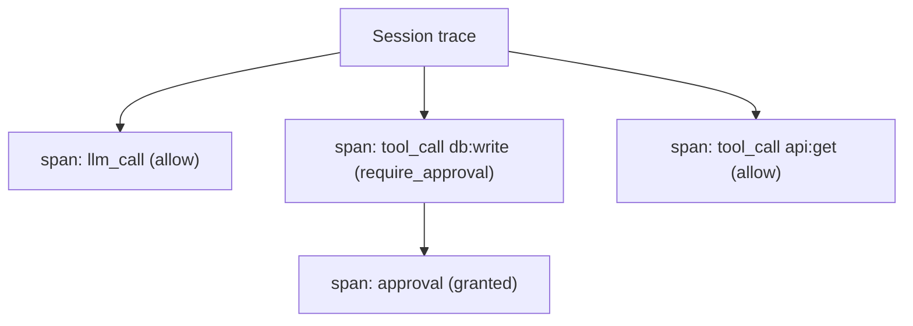

# Trace

## Definition

A **trace** is the ordered record of everything one agent session did, broken
into **spans**. A trace is keyed by `session_id` and `agent_id`; a **span** is a
single operation within that session — a tool call, an LLM request, or a
governance decision. Traces are how an operator reconstructs *what an agent did,
in what order, and what the gateway decided* for a single run.

## How it works

The gateway records a `TraceResponse` per session containing an ordered list of
`TraceSpan` values. Each span carries:

- `span_id` — the span's identifier.
- `parent_span_id` — links the span to the calling action, forming a tree.
- `operation` — the operation name.
- `decision` — the governance result for the span (for example `allow` or
  `deny`), when the span represents a governed action.
- `start_time` / `end_time` — ISO 8601 timestamps; `end_time` is absent while
  the span is still open.

The `span_id` / `parent_span_id` parent-child structure mirrors the
OpenTelemetry span model, so a trace maps cleanly onto OTel concepts: a session
trace is a trace, each governed action is a span, and the `decision` field is an
attribute on the span. SDKs propagate identity and trace context per request —
the Go SDK, for example, reads an explicit trace ID via `WithTraceID` and falls
back to the active OpenTelemetry span context's trace ID when none is set — so
governance spans line up with the application's own OTel spans.



## Example

The agent registry keeps a list of recent trace sessions per agent. From the
CLI, inspecting an agent lists them, and a single session can be visualized:

```console
$ aasm agent inspect quickstart-agent
SESSION_ID                        TIMESTAMP
9f3c…                             2026-06-15T12:04:11Z
Tip: run `aasm trace <session-id>` to visualize a trace

$ aasm trace 9f3c...
```

In the dashboard, traces surface on the **Live Operations** route: the
`L1 → L2 → L3` traffic pipeline (Identity → Capability → Scrub → External) and a
`tail -f` event stream with agent / team / op-type / status filters render
spans as they happen. The **Audit Log** route shows the durable per-decision
record that backs each governed span.

## Related

- [Audit](audit.md) — the immutable per-decision record behind governed spans.
- [Agent](agent.md) — `session_id` keys a trace to one agent run.
- [Policy](policy.md) — the source of each span's `decision`.
- [Observe in the dashboard](../src/usage-guide/observe-in-dashboard.md) — Live
  Ops and Audit Log routes.
- [API reference](../src/api-reference.md) — `aa-api` (`TraceSpan`,
  `TraceResponse`) rustdoc entry points.
- Quickstart (tracked under AAASM-418) — viewing a first trace end-to-end.
