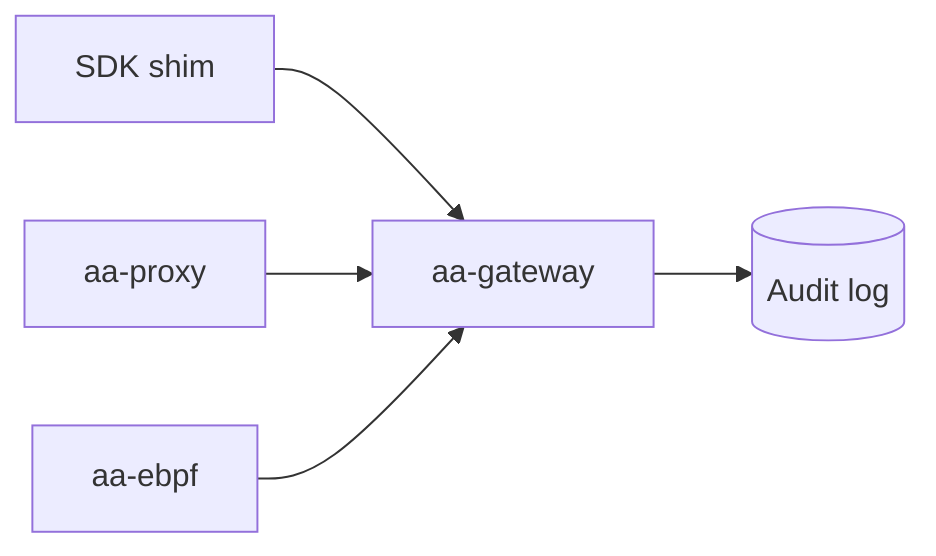

# agent-assembly

Welcome to the developer documentation for **agent-assembly** — the open-source core of the AI Agent Assembly governance platform.

## What you'll find here

- **Project Status** — version compatibility matrix and protocol versioning policy
- **Architecture** — component overview, IPC flow, sidecar lifecycle, and policy evaluation path
- **Protocol** — wire-protocol changelog and contract details
- **Migration** — guidance for moving between protocol versions
- **Benchmarks** — performance baselines and SLAs

## Audience

This book targets contributors and operators of `agent-assembly`. SDK users (Python, TypeScript, Go) should refer to the per-SDK READMEs in the sibling repositories.

## See also

- [README](https://github.com/ai-agent-assembly/agent-assembly/blob/master/README.md) — top-level project overview, prerequisites, quickstart
- [CONTRIBUTING](https://github.com/ai-agent-assembly/agent-assembly/blob/master/CONTRIBUTING.md) — development workflow, branch naming, PR rules
- API reference — generate locally with `cargo doc --workspace --no-deps --open`

## Diagram rendering

This book renders Mermaid diagrams via the `mdbook-mermaid` preprocessor:

