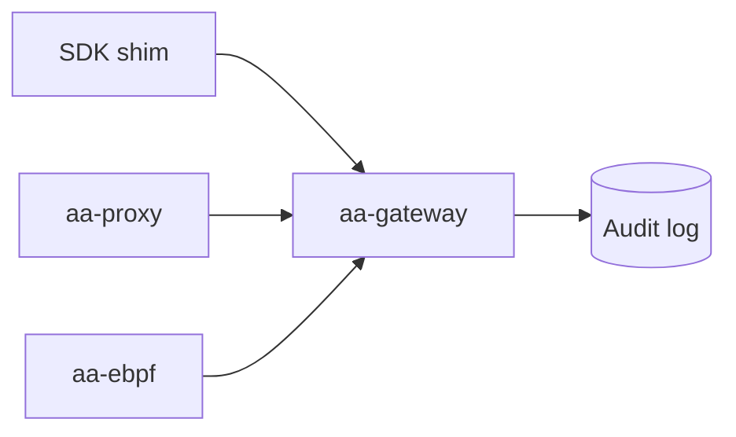

# agent-assembly

**agent-assembly** is the open-source core of the AI Agent Assembly governance platform. It enforces policy on AI agents — what they may call, spend, and connect to — and records every decision in an immutable audit trail.

This book is the contributor and operator reference for the core. If you build *with* a language SDK instead, read the per-SDK guides below.

> **Other docs:** [Docs Hub](https://ai-agent-assembly.github.io/agent-assembly-docs/) · [Python SDK](https://ai-agent-assembly.github.io/python-sdk/) · [Node SDK](https://ai-agent-assembly.github.io/node-sdk/) · [Go SDK](https://ai-agent-assembly.github.io/go-sdk/)

## Run it locally

Point the gateway at a bundled reference policy and you have a governing daemon listening on `127.0.0.1:50051`:

```bash
git clone https://github.com/ai-agent-assembly/agent-assembly.git
cd agent-assembly
cargo run -p aa-gateway -- --policy policy-examples/low-risk.yaml
```

From there, attach an SDK shim, the `aa-proxy` sidecar, or the eBPF layer to start intercepting agent actions. The [Architecture overview](architecture.md) explains how those three layers fit together.

## Where to go next

| You want to… | Read |
|---|---|
| Understand how the parts fit together | [Architecture overview](architecture.md) |
| Install the `aasm` CLI | [Installation](installation.md) |
| Drive a deployment from the terminal | [Command-line interface](cli.md) |
| Check which SDK versions are compatible | [Compatibility matrix](compatibility.md) |
| Read the wire-protocol contract | [Protocol changelog](protocol/CHANGELOG.md) |
| See latency and build-time numbers | [Benchmarks — baseline](benchmarks/BASELINE.md) |

## Audience

This book targets contributors and operators of `agent-assembly`. SDK users (Python, TypeScript, Go) should refer to the per-SDK guides in the sibling repositories.

## See also

- [README](https://github.com/ai-agent-assembly/agent-assembly/blob/master/README.md) — top-level project overview, prerequisites, quickstart
- [CONTRIBUTING](https://github.com/ai-agent-assembly/agent-assembly/blob/master/CONTRIBUTING.md) — development workflow, branch naming, PR rules
- API reference — generate locally with `cargo doc --workspace --no-deps --open`

## Diagram rendering

This book renders Mermaid diagrams via the `mdbook-mermaid` preprocessor:


