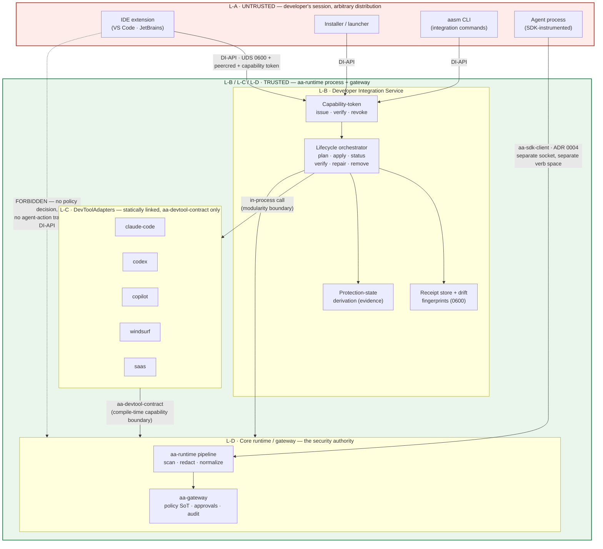

# ADR 0030: Developer Integration Boundaries, Capability Model & Local Trust Model

**Status**: Proposed
**Date**: 2026-07
**Ticket**: [AAASM-5275](https://lightning-dust-mite.atlassian.net/browse/AAASM-5275)

This ADR fixes the architectural boundaries and the trust model for **Developer
Integrations** — the machinery by which AASM installs, verifies, repairs and removes
governance for a developer's AI coding tool (Claude Code, Codex, Copilot, Windsurf, a
SaaS coding agent) — *before* the shared lifecycle contract
([AAASM-5277](https://lightning-dust-mite.atlassian.net/browse/AAASM-5277)), the
plan/receipt model ([AAASM-5278](https://lightning-dust-mite.atlassian.net/browse/AAASM-5278))
and the local client API ([AAASM-5279](https://lightning-dust-mite.atlassian.net/browse/AAASM-5279))
are implemented against it. It is the contract those three tickets implement.

It **complements and does not supersede** [ADR 0002](0002-sdk-security-boundary.md)
(the SDK is not a security boundary; `aa-runtime` is the authoritative chokepoint),
[ADR 0004](0004-governance-enforcement-flow.md) (all client↔core *governance* traffic
goes through the single `aa-sdk-client` transport boundary; REST is the non-SDK
operator surface), [ADR 0015](0015-dlp-trust-boundary-and-redaction-semantics.md)
(fail-closed redaction, audit-visible resolution failures) and
[ADR 0029](0029-capability-over-permission-derivation.md) (capability is a structural,
declared-vs-effective property; fail-absent, never fabricate a grant).

---

## Context

### The four concepts that keep getting conflated

The product vision names several things that are easy to collapse into one another,
and every collapse produces a different security failure:

| Concept | What it actually is | The failure if conflated |
| --- | --- | --- |
| A **plugin / IDE extension / installer / CLI** | A user-facing shell distributed through a marketplace or a package manager. Untrusted code running as the developer. | If it carries policy or DLP logic, the guarantee is anchored in attacker-controllable code — the exact mistake ADR 0002 exists to prevent. |
| A **`DevToolAdapter` crate** | Per-tool knowledge: where the settings live, what the native config dialect is, how to wire a proxy. | If it is given the whole of `aa-core`, one under-reviewed adapter PR reaches identity, storage and gateway tokens (AAASM-3565). |
| An **integration mechanism** (managed settings, hooks, base URL, proxy, MCP) | One of several *optional* levers, each supported by a different subset of tools. | If MCP is treated as *the* plugin protocol, every non-MCP tool needs a misleading no-op, and the product is coupled to one vendor's extension model. |
| The **core runtime / gateway** | Policy evaluation, sensitive-data detection and redaction, approvals, audit. | If duplicated per plugin, N divergent policy engines with no single source of truth. |

### The constraint that forces the design: there is already a trust model in-tree

`aa-runtime` already runs a local IPC server, and its trust model is written down and
tested. Any new local surface must reuse it rather than invent a second one:

- **`aa-runtime/src/ipc/server.rs`** binds a `UnixListener` under a tightened
  `umask(0o077)` so the socket inode is `0600` *from the first instant* — the earlier
  bind→`chmod` sequence left a TOCTOU window (AAASM-3581). A test asserts
  `mode == 0o600`. Connections are semaphore-bounded and dispatched to a reader/writer
  task pair. The socket path is `/tmp/aa-runtime-{agent_id}.sock`
  (`IpcServerConfig::from_runtime_config`).
- **`aa-runtime/src/ipc/peercred.rs`** rejects any connection whose peer UID is not the
  runtime's own effective UID, portably (`SO_PEERCRED` on Linux,
  `getpeereid`/`LOCAL_PEERCRED` on macOS/BSD).
- **`aa-runtime/src/ipc/handshake.rs`** performs a per-session Ed25519 challenge over
  `nonce || sdk_version` (AAASM-3585 / AAASM-3666). Its module doc is explicit
  (AAASM-3922) that this is **not** an authentication secret:

  > The expected verifying key is derived deterministically from the configured
  > **agent id** … and the agent id is the UDS socket filename — a public, non-secret
  > identifier. Any local process that can reach the socket can recompute the same
  > keypair and produce a valid signature, so the signature proves *integrity and
  > version-binding*, not possession of a secret.
  >
  > The real trust boundary for the IPC channel is enforced elsewhere: the socket is
  > created with `0600` permissions, and the runtime checks the connecting peer's
  > credentials (peercred UID) against the expected owner.

  That distinction is load-bearing for this ADR. A per-client capability token that was
  derived from a public identifier would repeat exactly the mistake AAASM-3922 documented,
  and would be a regression rather than a new control.

### The compile-time boundary that already exists

`aa-devtool-contract` (AAASM-3565) is the **compile-time analogue of a restricted IPC
interface**. Adapters depend on it and never on `aa-core`; its module doc states that a
smuggled `aa_core::storage::…` call is *"a **compile error** in a plugin crate, not a
silent capability"*. The re-export list is deliberately flat and CODEOWNERS/security
reviewed: `DevToolAdapter`, `DevToolInfo`, `DevToolKind`, `GovernanceLevel`,
`McpServerInfo`, `AdapterError`, `EnforcementMode`, `PolicyDecision`, `PolicyDocument`,
`PolicyRule`, `Capability`, `CapabilitySet`, `AuditEntry`. Whatever this ADR adds must
stay inside that boundary and keep the widening reviewable.

### Why the current `DevToolAdapter` cannot carry the product

The only definition of the trait is `aa-core/src/dev_tool.rs:231-341`: `detect()`,
`generate_managed_settings()`, `apply_settings()`, `build_launch_command()`,
`list_mcp_servers()`, `apply_mcp_governance()`, `governance_level()`. Three structural
problems follow directly from that shape:

1. **Every mechanism is mandatory.** `aa-devtool-codex/src/lib.rs:312` implements
   `apply_mcp_governance` as `Ok(())` with the comment *"Codex does not expose MCP
   governance"*. A tool that cannot do a thing is forced to claim it can and then lie
   quietly.
2. **Unsupported capabilities fail at the wrong time.** `aa-devtool-copilot` returns
   `AdapterError::LaunchFailed("GitHub Copilot is a VS Code extension and cannot be
   launched by `aasm run`…")` — a *run-time* error for a fact that is knowable at
   *plan* time.
3. **There is no lifecycle at all.** No plan, no receipt, no verify, no drift, no repair,
   no remove. Nothing in the trait can answer "is this developer actually protected right
   now, and how do you know?".

### The registration model is build-time linking, and that is not an accident

`docs/devtools/plugins.md` is explicit:

> Right now Agent Assembly uses **build-time linking**… There is **no**
> `inventory::submit!`-style runtime registration in `aa-core` today, and there is no
> dynamic shared-library loading. Both were proposed in early designs but neither has
> been implemented; do not write code that assumes either exists.

This ADR turns that observation into a decision: build-time linking is the *chosen*
model, not a temporary gap (see Decision 6).

### Known current-state divergence (not fixed here)

Three disconnected Claude Code adapters exist today —
`aa-devtool/src/adapters/claude_code.rs` (detection-only, `L3Native`),
`aa-devtool-claude-code` (a full `L2Enforce` implementation, orphaned), and
`PlaceholderAdapter` in `aa-cli/src/commands/run.rs:124` (`L0Discover`, the one
`aasm run claude` actually uses) — and `GET /api/v1/tools` always returns `[]` because
`aa-api/src/state.rs:370` constructs `DiscoveryService::with_adapters(vec![])`.
Reconciling those is
[AAASM-5274](https://lightning-dust-mite.atlassian.net/browse/AAASM-5274), in flight on a
parallel branch. This ADR describes the target boundaries and assumes 5274 has produced
exactly one adapter per tool; it does not attempt the reconciliation.

### Threat model

The design must hold against three distinct adversaries, which want different answers:

| Adversary | Capability | What must still hold |
| --- | --- | --- |
| **A compromised or malicious thin client** (a trojaned marketplace extension, a supply-chained installer, a mis-scoped script) running as the developer's own UID | Can open the local socket, replay any request it has ever seen, and present any token it can read from the developer's home directory | It must not be able to obtain or shortcut a policy decision, forge agent events, read raw prompts/tool outputs or audit content, reach storage/identity, act on a tool it was not scoped to, or acquire a credential usable against the gateway |
| **An unrelated local user** on a shared host | Can enumerate `/tmp` and attempt to connect to any socket | It must not be able to connect at all — OS-enforced, not application-enforced |
| **A steered agent inside the trust boundary** (the ADR 0015 adversary) | Controls payload content, may attempt to make the product *report* protection it does not have | Protection state must never be reported higher than the evidence supports; missing evidence must lower the reported state, never raise it |

The developer's own UID is *not* an adversary: nothing here defends against a user who
edits their own settings file, and it is not supposed to. Host-level tamper prevention is
out of scope (it is an explicit non-goal of AAASM-5278).

---

## Decision

### 1. Four layers, two boundaries — and only one of them is a *trust* boundary

Developer Integrations are structured as four layers. Naming them is not the point;
saying which separations are **security** boundaries and which are merely **modularity**
boundaries is.

| # | Layer | Runs where | Trust |
| --- | --- | --- | --- |
| **L-A** | **Thin client** — IDE extension, marketplace plugin, installer, launcher, `aasm` CLI | The developer's session, developer's UID, arbitrary distribution channel | **Untrusted.** Carries no policy, no DLP, no audit authority. Its only powers are *ask* and *display*. |
| **L-B** | **Developer Integration Service (DIS)** | Inside the `aa-runtime` process | **Trusted.** Owns lifecycle orchestration, capability-token issuance and verification, plan execution, receipt durability, drift detection, protection-state derivation. |
| **L-C** | **Tool-specific `DevToolAdapter` / integration** | Statically linked into the same trusted process as L-B | **Trusted, but capability-restricted at compile time.** Reaches core only through `aa-devtool-contract`. |
| **L-D** | **AASM core runtime / gateway** | `aa-runtime` pipeline + `aa-gateway` | **The security authority.** Policy, detection, redaction, approval, audit. Unchanged by this ADR. |

**Boundary L-A ↔ L-B is a trust boundary.** It is crossed by the *restricted local
Developer Integration API* (the **DI-API**, Decision 5) and enforced by the operating
system (`0700` directory, `0600` socket, peercred UID) plus a capability token, not by
convention or by the client's good behaviour.

**Boundary L-C ↔ L-D is a capability boundary enforced at compile time** by
`aa-devtool-contract`. It is honest about what it is: an adapter runs *inside* the
trusted process, so it is not runtime-contained — a genuinely malicious in-tree adapter
is game over. What the boundary buys is that the reachable API surface is small,
mechanically enforced (`aa_core::storage::…` does not compile), and its widening is a
reviewable diff in one file with a CODEOWNERS gate. That is why out-of-tree adapters are
**not** linked into official binaries (Decision 6) — the compile-time boundary limits
accident and review scope, not a determined in-process attacker.

**Boundary L-B ↔ L-C is modularity only.** Same process, same privileges. It exists so
that per-tool knowledge is replaceable without touching lifecycle logic, not because the
adapter is less trusted than the service.

**Inside L-D nothing changes.** The runtime↔gateway relationship, the mandatory
chokepoint, and the SDK fast-path remain exactly as ADR 0002 and ADR 0004 specify.

#### 1.1 Component and trust-boundary diagram



The single red arrow is the whole point of the ADR: the untrusted layer reaches the
trusted layer through exactly one authenticated, capability-scoped, closed-verb-set
socket, and there is no edge from it to the policy/audit path at all.

#### 1.2 Reconciliation with ADR 0004 — the DI-API is a lifecycle surface, not a second transport

ADR 0004 forbids ad-hoc transports: *"The user-facing SDK public API NEVER calls a core
or REST endpoint directly"*, and all client↔core governance traffic goes through the one
`aa-sdk-client` boundary, which internally picks gRPC→`aa-gateway` or UDS→`aa-runtime`.
It simultaneously carves out REST (`aa-api`) as the surface for *"dashboard, operators,
CLI data commands"* — explicitly *"never on the SDK path"*.

The DI-API sits in that same carve-out, one level more restricted:

| | `aa-sdk-client` (ADR 0004) | REST `aa-api` (ADR 0004) | **DI-API (this ADR)** |
| --- | --- | --- | --- |
| Consumers | SDK fast-path only | Dashboard, operators, `aasm` data commands | Local lifecycle clients (extension, installer, `aasm` integration commands) |
| Carries policy decisions? | **Yes** — `CheckAction` is the authoritative decision | No | **No — forbidden** |
| Carries agent-action / audit-emit traffic? | Yes | No | **No — forbidden** |
| Verb space | Governance RPCs | Read/administrative HTTP | **Closed enum: plan · apply · status · verify · repair · remove · scoped events · approval relay** |
| Reachable from | In-process SDK shim | Network | **Local UDS only, peercred + token** |

An agent that wants a decision still goes SDK → `aa-sdk-client` → runtime/gateway. A
plugin that wants to *install governance* goes through the DI-API. These are disjoint
verb spaces on disjoint sockets, so the DI-API cannot become "the other way to ask for an
allow/deny" — there is no verb for it (see the forbidden-designs section, which states
this as a standing prohibition, and Decision 5.6, which explains why it is structural
rather than a rule to remember).

### 2. Responsibility matrix — exactly one owner per responsibility

Every responsibility below has **one** owning layer. Where the ticket named a
responsibility that turned out to be two separable jobs with different owners, it is
split into two rows rather than shared — a shared responsibility is an unowned one.

| # | Responsibility | Owner | Explicitly **not** owned by | Why this owner |
| --- | --- | --- | --- | --- |
| 1 | **Tool discovery and version compatibility** — is the tool installed, at what version, is that version within this adapter's supported range | **L-C adapter** | L-B (does no version parsing), L-A (never probes the host on the service's behalf) | Only the adapter knows what a version *means* for its tool: which config dialect, which mechanisms exist at that version. A generic comparator in the service would have to encode per-tool knowledge, which is the adapter's whole reason to exist. |
| 2 | **Integration plan authoring** — which steps this tool needs to reach a requested protection level | **L-C adapter** | L-B, L-A | The steps are tool-specific by definition. The adapter *authors* a plan; it does not execute it. |
| 3 | **Plan execution, receipt durability, apply/rollback transactionality, idempotence** | **L-B service** | L-C (never writes a receipt), L-A | Rollback correctness and crash recovery are one problem solved once, not N times. This is [AAASM-5278](https://lightning-dust-mite.atlassian.net/browse/AAASM-5278)'s scope. |
| 4 | **Runtime process start/stop (bootstrap)** | **L-A thin client** | L-B (cannot start the process it lives in) | The client is the only layer that exists when the runtime does not. Its power is strictly "start/stop a process" — it can change *whether* the runtime runs, never *what it decides*. |
| 5 | **Runtime/gateway health and readiness reporting** | **L-D core** | L-A (must not synthesize health from a socket connect succeeding) | Health is a property of the thing being reported on. A client-side inference is a guess. |
| 6 | **Policy retrieval and profile selection** | **L-D core** | L-C (never fetches a policy), L-A (selects a profile *name*, never a document) | ADR 0002: the gateway/control plane is the policy source of truth. The client names a profile; the core resolves, validates and returns a derived reference (Decision 5.5). |
| 7 | **Model-path protection** — interception, credential scanning, redaction of model traffic | **L-D core** | L-A, L-C | `aa_security::CredentialScanner` → `Interceptor::intercept_request` (`aa-proxy/src/intercept/mod.rs:165-232`) → `VerdictDecision::{Block, ForwardRedacted, AlertAndForward}`, with an independent second scan site in `aa-gateway/src/engine/mod.rs`. ADR 0015 owns its fail-safety. The adapter only *wires the tool into* this path (row 2). |
| 8 | **Tool / action governance** — allow, deny, require-approval for an agent action | **L-D core** | L-A, L-B, L-C | The policy engine is the only decision authority (ADR 0002/0004). A plugin, service or adapter that decided this would be a second policy engine. |
| 9 | **Protection verification** — running the protection test and adjudicating whether it passed | **L-B service** | L-A (must not self-certify), L-C (supplies a probe *descriptor*, does not judge the result) | The verdict is evidence for a security claim; it must be produced inside the trust boundary, by the layer that also owns the receipt it is recorded against. |
| 10 | **Drift detection and repair** | **L-B service** | L-C (supplies the fingerprint recipe, not the comparison), L-A | Drift is "receipt vs. reality"; only the receipt owner can compute it, and repair must be constrained to AASM-owned keys, which only the receipt enumerates. |
| 11 | **Approval decision authority** | **L-D core** | L-A, L-B | An approval is a policy outcome. |
| 12 | **Notification and approval presentation / user-input relay** | **L-A thin client** | L-D (does not render UI) | The client is where the human is. It relays a decision it did not make, over a narrowly scoped DI-API verb, and only when its token carries that scope. |
| 13 | **Audit storage and event retrieval** | **L-D core** | L-A (receives only a data-minimized, integration-scoped projection), L-B (does not keep a second event store) | One audit trail, one retention policy, one redaction contract. |
| 14 | **Protection-state derivation** — turning evidence into a reported state | **L-B service** | L-A (must never compute or upgrade a state locally) | Decision 4. A client-computed state is a claim, not a measurement. |

Two derived rules make the matrix enforceable rather than aspirational:

- **No layer may re-implement a responsibility it does not own**, even "as a fast path" or
  "for offline UX". A cached *display* of a state the service produced is fine; a locally
  *derived* state is not.
- **A responsibility moves by amending this ADR**, not by a convenient call site.

### 3. Capability model — MCP is one optional capability, never the architecture

#### 3.1 The naming constraint that comes first

`aa_core::Capability` / `CapabilitySet` already exist and are already re-exported by
`aa-devtool-contract`. They model **agent action capabilities** (`FileWrite`,
`TerminalExec`, `NetworkOutbound`, …) and are the subject of ADR 0029. The concept this
decision introduces — *what integration mechanisms a tool exposes* — is a different axis
entirely and **must not reuse those names**. Conflating them would make ADR 0029's
over-permission rule read as if it applied to integration mechanisms.

The new types are therefore named `IntegrationCapability` / `CapabilitySupport` /
`DevToolCapabilities`, and `aa-devtool/src/capability_bridge.rs` (which bridges the
*agent-capability* axis) keeps its current meaning untouched.

#### 3.2 The capability vocabulary

```rust
/// What integration mechanisms a dev tool exposes. NOT `aa_core::Capability`
/// (that is the agent-action axis governed by ADR 0029).
#[non_exhaustive]
pub enum IntegrationCapability {
    Discovery,            // adapter can detect presence + version
    ManagedSettings,      // adapter can render + merge a managed settings block
    ManagedLaunch,        // adapter can build a governed launch command
    ModelGatewayBaseUrl,  // tool honours a configurable model base URL
    HttpProxy,            // tool honours HTTP(S)_PROXY / equivalent
    Hooks,                // tool exposes pre/post hooks AASM can install
    McpDiscovery,         // tool exposes its configured MCP servers
    McpGovernance,        // tool honours an MCP allow/deny list
    ToolActionApproval,   // tool can gate individual tool/actions on approval
    NativeIdeUi,          // a first-class in-IDE surface exists for status/approval
    HostEnforcement,      // integration can be backed by eBPF / proxy-CA host controls
}

/// How a capability is supported. Absence of a key means *not declared*, which is
/// NOT the same as `Unsupported` — see 3.4.
pub enum CapabilitySupport {
    Supported,
    Unsupported { reason: Cow<'static, str> },
    RequiresVersion { min: Version, detected: Option<Version> },
}

pub struct DevToolCapabilities {
    declared: BTreeMap<IntegrationCapability, CapabilitySupport>,
}
```

`Unsupported` carries a **reason string that is user-facing**. This is what replaces
`aa-devtool-copilot`'s run-time `LaunchFailed("GitHub Copilot is a VS Code extension…")`:
the same sentence, surfaced at plan time as
`ManagedLaunch: Unsupported { reason: "Copilot is a VS Code extension and has no launch command" }`,
where the user can still choose a different mechanism.

#### 3.3 How "unsupported" avoids a mandatory no-op

Composition, not one oversized trait. The lifecycle trait every adapter implements is
small and mechanism-free:

```rust
#[async_trait]
pub trait DevToolIntegration: Send + Sync {
    fn capabilities(&self) -> DevToolCapabilities;
    fn detect(&self) -> Option<DevToolInfo>;

    async fn plan_integration(&self, req: &IntegrationRequest) -> Result<IntegrationPlan, AdapterError>;
    async fn integration_status(&self, receipt: Option<&IntegrationReceipt>) -> Result<IntegrationStatus, AdapterError>;
    async fn verify_integration(&self, receipt: &IntegrationReceipt) -> Result<VerificationResult, AdapterError>;
    async fn plan_removal(&self, receipt: &IntegrationReceipt) -> Result<RemovalPlan, AdapterError>;

    // Optional mechanism surfaces — `None` is the honest answer, not a no-op impl.
    fn as_mcp_governed(&self) -> Option<&dyn McpGovernedTool> { None }
    fn as_launchable(&self) -> Option<&dyn LaunchableTool> { None }
    fn as_hookable(&self) -> Option<&dyn HookableTool> { None }
}
```

`aa-devtool-codex` deletes its `apply_mcp_governance` → `Ok(())` stub and simply does not
declare `McpGovernance`; `as_mcp_governed()` returns `None` by the default method body.
Nothing lies.

**Apply is not on the adapter trait.** The adapter authors a plan (matrix row 2); the
service executes it (row 3). This is why there is no `apply_integration` above: making it
an adapter method would immediately re-create the shared-ownership problem the matrix
exists to prevent.

#### 3.4 Declared vs. effective — the ADR 0029 transfer

A capability has two readings, and they are not interchangeable:

- **Declared** — what `capabilities()` returns. A static, build-time property of the
  adapter.
- **Effective** — declared **and** the evidence for it observed on this host at this
  version (the binary is present, the settings path is writable, the detected version
  satisfies `RequiresVersion`).

Only the *effective* set may raise a protection state or appear as a guarantee to the
user. Three rules, transferred directly from ADR 0029's fail-absent discipline:

1. **A capability absent from `declared` is absent**, not `Unsupported` and never
   `Supported`. An adapter that has not been updated for a new capability must not be
   read as having answered the question.
2. **`RequiresVersion` with `detected: None` resolves to absent**, never to supported.
   Missing version data is a missing comparison, not a pass (this is ADR 0029's rule 1,
   verbatim in shape: *"A missing baseline is a missing comparison, not a clean bill of
   health"*).
3. **Never fabricate a capability from missing data.** No inference from "the tool is
   popular", "the settings file exists", or "the sibling adapter supports it".

Declaring `Supported` for a capability whose accessor returns `None` is a contract
violation and is caught by a conformance test (Validation requirements).

#### 3.5 The schema covers CLI, IDE and SaaS tool categories

The three tool categories differ precisely in which capabilities they can declare, which
is the evidence that the axis is the right one:

| Capability | Claude Code / Codex (CLI) | Copilot / Windsurf (IDE-hosted) | SaaS coding agent |
| --- | --- | --- | --- |
| `Discovery` | Supported | Supported (extension marker) | `Unsupported { "no local install to detect" }` or account-scoped |
| `ManagedSettings` | Supported | Supported (host settings JSON) | Usually unsupported |
| `ManagedLaunch` | Supported | **`Unsupported { reason }`** — no launch command | Unsupported |
| `ModelGatewayBaseUrl` | Supported | Tool-dependent | Sometimes (tenant config) |
| `HttpProxy` | Supported | IDE-host dependent | Only via egress interception |
| `Hooks` | Supported | Rarely | No |
| `McpDiscovery` / `McpGovernance` | Claude Code yes, Codex **no** | Tool-dependent | Usually no |
| `ToolActionApproval` | Supported | `NativeIdeUi`-dependent | No |
| `NativeIdeUi` | No | **Supported** | No |
| `HostEnforcement` | Supported (proxy/eBPF) | Supported | Supported (egress only) |

Read down the `McpDiscovery` row: two of the five tool families support it. **MCP is one
optional capability among ten, never the integration architecture.** A design in which
"plugin" means "MCP server" is forbidden (see the forbidden-designs section).
