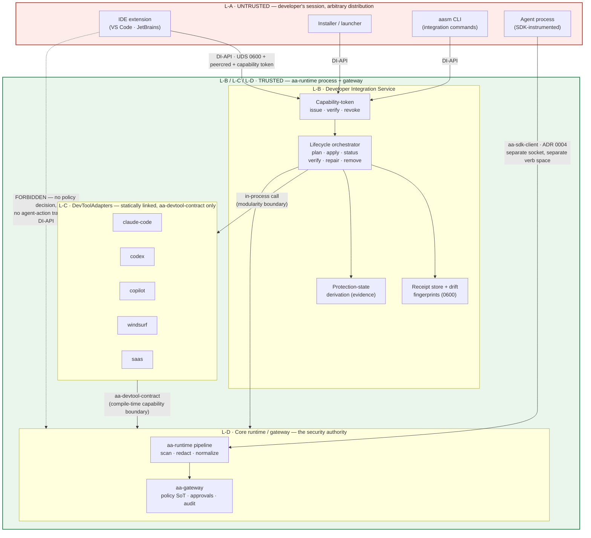
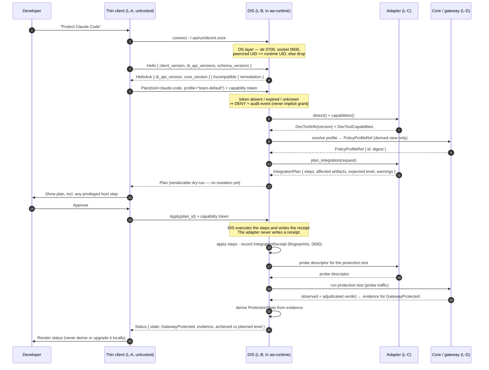

# ADR 0030: Developer Integration Boundaries, Capability Model & Local Trust Model

**Status**: Accepted
**Date**: 2026-07
**Ticket**: [AAASM-5275](https://lightning-dust-mite.atlassian.net/browse/AAASM-5275)

---

> **Amendment (AAASM-5325, 2026-08)** — **citations only; no decision changes.**
> This ADR quoted `docs/src/devtools/plugins.md` in two places, and
> [AAASM-5322](https://lightning-dust-mite.atlassian.net/browse/AAASM-5322)
> rewrote that file afterwards, so both quotations named text their cited source
> no longer contained. One was load-bearing: §7.2's backward-compatibility
> argument rested on a pinning rule scoped to `aa-core`, which the rewrite
> withdrew *because it was wrong* — adapters depend on `aa-devtool-contract` and
> never on `aa-core` directly. The guarantee always held in substance; only the
> citation was broken, and it now quotes the rule that exists. §7.2's deferral of
> the migration section ("owned by a parallel branch") has also expired — that
> commitment now lives in `plugins.md` itself.
>
> Every decision, forbidden design and consequence below is unchanged.

This ADR fixes the architectural boundaries and the trust model for **Developer
Integrations** — the machinery by which AASM installs, verifies, repairs and removes
governance for a developer's AI coding tool (Claude Code, Codex, Copilot, Windsurf, a
SaaS coding agent) — *before* the shared lifecycle contract
([AAASM-5277](https://lightning-dust-mite.atlassian.net/browse/AAASM-5277)), the
plan/receipt model ([AAASM-5278](https://lightning-dust-mite.atlassian.net/browse/AAASM-5278))
and the local client API ([AAASM-5279](https://lightning-dust-mite.atlassian.net/browse/AAASM-5279))
are implemented against it. It is the contract those three tickets implement.

It **complements and does not supersede** [ADR 0002](0002-sdk-security-boundary.md)
(the SDK is not a security boundary; `aa-runtime` is the authoritative chokepoint),
[ADR 0004](0004-governance-enforcement-flow.md) (all client↔core *governance* traffic
goes through the single `aa-sdk-client` transport boundary; REST is the non-SDK
operator surface), [ADR 0015](0015-dlp-trust-boundary-and-redaction-semantics.md)
(fail-closed redaction, audit-visible resolution failures) and
[ADR 0029](0029-capability-over-permission-derivation.md) (capability is a structural,
declared-vs-effective property; fail-absent, never fabricate a grant).

---

## Context

### The four concepts that keep getting conflated

The product vision names several things that are easy to collapse into one another,
and every collapse produces a different security failure:

| Concept | What it actually is | The failure if conflated |
| --- | --- | --- |
| A **plugin / IDE extension / installer / CLI** | A user-facing shell distributed through a marketplace or a package manager. Untrusted code running as the developer. | If it carries policy or DLP logic, the guarantee is anchored in attacker-controllable code — the exact mistake ADR 0002 exists to prevent. |
| A **`DevToolAdapter` crate** | Per-tool knowledge: where the settings live, what the native config dialect is, how to wire a proxy. | If it is given the whole of `aa-core`, one under-reviewed adapter PR reaches identity, storage and gateway tokens (AAASM-3565). |
| An **integration mechanism** (managed settings, hooks, base URL, proxy, MCP) | One of several *optional* levers, each supported by a different subset of tools. | If MCP is treated as *the* plugin protocol, every non-MCP tool needs a misleading no-op, and the product is coupled to one vendor's extension model. |
| The **core runtime / gateway** | Policy evaluation, sensitive-data detection and redaction, approvals, audit. | If duplicated per plugin, N divergent policy engines with no single source of truth. |

### The constraint that forces the design: there is already a trust model in-tree

`aa-runtime` already runs a local IPC server, and its trust model is written down and
tested. Any new local surface must reuse it rather than invent a second one:

- **`aa-runtime/src/ipc/server.rs`** binds a `UnixListener` under a tightened
  `umask(0o077)` so the socket inode is `0600` *from the first instant* — the earlier
  bind→`chmod` sequence left a TOCTOU window (AAASM-3581). A test asserts
  `mode == 0o600`. Connections are semaphore-bounded and dispatched to a reader/writer
  task pair. The socket path is `/tmp/aa-runtime-{agent_id}.sock`
  (`IpcServerConfig::from_runtime_config`).
- **`aa-runtime/src/ipc/peercred.rs`** rejects any connection whose peer UID is not the
  runtime's own effective UID, portably (`SO_PEERCRED` on Linux,
  `getpeereid`/`LOCAL_PEERCRED` on macOS/BSD).
- **`aa-runtime/src/ipc/handshake.rs`** performs a per-session Ed25519 challenge over
  `nonce || sdk_version` (AAASM-3585 / AAASM-3666). Its module doc is explicit
  (AAASM-3922) that this is **not** an authentication secret:

  > The expected verifying key is derived deterministically from the configured
  > **agent id** … and the agent id is the UDS socket filename — a public, non-secret
  > identifier. Any local process that can reach the socket can recompute the same
  > keypair and produce a valid signature, so the signature proves *integrity and
  > version-binding*, not possession of a secret.
  >
  > The real trust boundary for the IPC channel is enforced elsewhere: the socket is
  > created with `0600` permissions, and the runtime checks the connecting peer's
  > credentials (peercred UID) against the expected owner.

  That distinction is load-bearing for this ADR. A per-client capability token that was
  derived from a public identifier would repeat exactly the mistake AAASM-3922 documented,
  and would be a regression rather than a new control.

### The compile-time boundary that already exists

`aa-devtool-contract` (AAASM-3565) is the **compile-time analogue of a restricted IPC
interface**. Adapters depend on it and never on `aa-core`; its module doc states that a
smuggled `aa_core::storage::…` call is *"a **compile error** in a plugin crate, not a
silent capability"*. The re-export list is deliberately flat and CODEOWNERS/security
reviewed: `DevToolAdapter`, `DevToolInfo`, `DevToolKind`, `GovernanceLevel`,
`McpServerInfo`, `AdapterError`, `EnforcementMode`, `PolicyDecision`, `PolicyDocument`,
`PolicyRule`, `Capability`, `CapabilitySet`, `AuditEntry`. Whatever this ADR adds must
stay inside that boundary and keep the widening reviewable.

### Why the current `DevToolAdapter` cannot carry the product

The only definition of the trait is `aa-core/src/dev_tool.rs:231-341`: `detect()`,
`generate_managed_settings()`, `apply_settings()`, `build_launch_command()`,
`list_mcp_servers()`, `apply_mcp_governance()`, `governance_level()`. Three structural
problems follow directly from that shape:

1. **Every mechanism is mandatory.** `aa-devtool-codex/src/lib.rs:312` implements
   `apply_mcp_governance` as `Ok(())` with the comment *"Codex does not expose MCP
   governance"*. A tool that cannot do a thing is forced to claim it can and then lie
   quietly.
2. **Unsupported capabilities fail at the wrong time.** `aa-devtool-copilot` returns
   `AdapterError::LaunchFailed("GitHub Copilot is a VS Code extension and cannot be
   launched by `aasm run`…")` — a *run-time* error for a fact that is knowable at
   *plan* time.
3. **There is no lifecycle at all.** No plan, no receipt, no verify, no drift, no repair,
   no remove. Nothing in the trait can answer "is this developer actually protected right
   now, and how do you know?".

### The registration model is build-time linking, and that is not an accident

[`docs/src/devtools/plugins.md` §"How adapters get loaded — build-time linking, by
decision"](../devtools/plugins.md#how-adapters-get-loaded--build-time-linking-by-decision)
is explicit:

> Agent Assembly links adapters **at build time**. An adapter is loaded by linking
> its crate into a binary that constructs it explicitly and registers it in an
> in-memory registry at startup.
>
> There is **no** `inventory::submit!`-style runtime registration and **no**
> dynamic shared-library loading.

This ADR is what makes that a decision rather than an observation: build-time linking
is the *chosen* model, and dynamic loading is forbidden rather than merely absent (see
Decision 6). The wording above already reflects that — when this ADR was written the
same file described dynamic loading as an unimplemented gap, and it was rewritten by
[AAASM-5322](https://lightning-dust-mite.atlassian.net/browse/AAASM-5322) once this
ADR settled the question.

### Known current-state divergence (not fixed here)

Three disconnected Claude Code adapters exist today —
`aa-devtool/src/adapters/claude_code.rs` (detection-only, `L3Native`),
`aa-devtool-claude-code` (a full `L2Enforce` implementation, orphaned), and
`PlaceholderAdapter` in `aa-cli/src/commands/run.rs:124` (`L0Discover`, the one
`aasm run claude` actually uses) — and `GET /api/v1/tools` always returns `[]` because
`aa-api/src/state.rs:370` constructs `DiscoveryService::with_adapters(vec![])`.
Reconciling those is
[AAASM-5274](https://lightning-dust-mite.atlassian.net/browse/AAASM-5274), in flight on a
parallel branch. This ADR describes the target boundaries and assumes 5274 has produced
exactly one adapter per tool; it does not attempt the reconciliation.

### Threat model

The design must hold against three distinct adversaries, which want different answers:

| Adversary | Capability | What must still hold |
| --- | --- | --- |
| **A compromised or malicious thin client** (a trojaned marketplace extension, a supply-chained installer, a mis-scoped script) running as the developer's own UID | Can open the local socket, replay any request it has ever seen, and present any token it can read from the developer's home directory | It must not be able to obtain or shortcut a policy decision, forge agent events, read raw prompts/tool outputs or audit content, reach storage/identity, act on a tool it was not scoped to, or acquire a credential usable against the gateway |
| **An unrelated local user** on a shared host | Can enumerate `/tmp` and attempt to connect to any socket | It must not be able to connect at all — OS-enforced, not application-enforced |
| **A steered agent inside the trust boundary** (the ADR 0015 adversary) | Controls payload content, may attempt to make the product *report* protection it does not have | Protection state must never be reported higher than the evidence supports; missing evidence must lower the reported state, never raise it |

The developer's own UID is *not* an adversary: nothing here defends against a user who
edits their own settings file, and it is not supposed to. Host-level tamper prevention is
out of scope (it is an explicit non-goal of AAASM-5278).

---

## Decision

### 1. Four layers, two boundaries — and only one of them is a *trust* boundary

Developer Integrations are structured as four layers. Naming them is not the point;
saying which separations are **security** boundaries and which are merely **modularity**
boundaries is.

| # | Layer | Runs where | Trust |
| --- | --- | --- | --- |
| **L-A** | **Thin client** — IDE extension, marketplace plugin, installer, launcher, `aasm` CLI | The developer's session, developer's UID, arbitrary distribution channel | **Untrusted.** Carries no policy, no DLP, no audit authority. Its only powers are *ask* and *display*. |
| **L-B** | **Developer Integration Service (DIS)** | Inside the `aa-runtime` process | **Trusted.** Owns lifecycle orchestration, capability-token issuance and verification, plan execution, receipt durability, drift detection, protection-state derivation. |
| **L-C** | **Tool-specific `DevToolAdapter` / integration** | Statically linked into the same trusted process as L-B | **Trusted, but capability-restricted at compile time.** Reaches core only through `aa-devtool-contract`. |
| **L-D** | **AASM core runtime / gateway** | `aa-runtime` pipeline + `aa-gateway` | **The security authority.** Policy, detection, redaction, approval, audit. Unchanged by this ADR. |

**Boundary L-A ↔ L-B is a trust boundary.** It is crossed by the *restricted local
Developer Integration API* (the **DI-API**, Decision 5) and enforced by the operating
system (`0700` directory, `0600` socket, peercred UID) plus a capability token, not by
convention or by the client's good behaviour.

**Boundary L-C ↔ L-D is a capability boundary enforced at compile time** by
`aa-devtool-contract`. It is honest about what it is: an adapter runs *inside* the
trusted process, so it is not runtime-contained — a genuinely malicious in-tree adapter
is game over. What the boundary buys is that the reachable API surface is small,
mechanically enforced (`aa_core::storage::…` does not compile), and its widening is a
reviewable diff in one file with a CODEOWNERS gate. That is why out-of-tree adapters are
**not** linked into official binaries (Decision 6) — the compile-time boundary limits
accident and review scope, not a determined in-process attacker.

**Boundary L-B ↔ L-C is modularity only.** Same process, same privileges. It exists so
that per-tool knowledge is replaceable without touching lifecycle logic, not because the
adapter is less trusted than the service.

**Inside L-D nothing changes.** The runtime↔gateway relationship, the mandatory
chokepoint, and the SDK fast-path remain exactly as ADR 0002 and ADR 0004 specify.

#### 1.1 Component and trust-boundary diagram



The single red arrow is the whole point of the ADR: the untrusted layer reaches the
trusted layer through exactly one authenticated, capability-scoped, closed-verb-set
socket, and there is no edge from it to the policy/audit path at all.

#### 1.2 Reconciliation with ADR 0004 — the DI-API is a lifecycle surface, not a second transport

ADR 0004 forbids ad-hoc transports: *"The user-facing SDK public API NEVER calls a core
or REST endpoint directly"*, and all client↔core governance traffic goes through the one
`aa-sdk-client` boundary, which internally picks gRPC→`aa-gateway` or UDS→`aa-runtime`.
It simultaneously carves out REST (`aa-api`) as the surface for *"dashboard, operators,
CLI data commands"* — explicitly *"never on the SDK path"*.

The DI-API sits in that same carve-out, one level more restricted:

| | `aa-sdk-client` (ADR 0004) | REST `aa-api` (ADR 0004) | **DI-API (this ADR)** |
| --- | --- | --- | --- |
| Consumers | SDK fast-path only | Dashboard, operators, `aasm` data commands | Local lifecycle clients (extension, installer, `aasm` integration commands) |
| Carries policy decisions? | **Yes** — `CheckAction` is the authoritative decision | No | **No — forbidden** |
| Carries agent-action / audit-emit traffic? | Yes | No | **No — forbidden** |
| Verb space | Governance RPCs | Read/administrative HTTP | **Closed enum: plan · apply · status · verify · repair · remove · scoped events · approval relay** |
| Reachable from | In-process SDK shim | Network | **Local UDS only, peercred + token** |

An agent that wants a decision still goes SDK → `aa-sdk-client` → runtime/gateway. A
plugin that wants to *install governance* goes through the DI-API. These are disjoint
verb spaces on disjoint sockets, so the DI-API cannot become "the other way to ask for an
allow/deny" — there is no verb for it (see the forbidden-designs section, which states
this as a standing prohibition, and Decision 5.6, which explains why it is structural
rather than a rule to remember).

### 2. Responsibility matrix — exactly one owner per responsibility

Every responsibility below has **one** owning layer. Where the ticket named a
responsibility that turned out to be two separable jobs with different owners, it is
split into two rows rather than shared — a shared responsibility is an unowned one.

| # | Responsibility | Owner | Explicitly **not** owned by | Why this owner |
| --- | --- | --- | --- | --- |
| 1 | **Tool discovery and version compatibility** — is the tool installed, at what version, is that version within this adapter's supported range | **L-C adapter** | L-B (does no version parsing), L-A (never probes the host on the service's behalf) | Only the adapter knows what a version *means* for its tool: which config dialect, which mechanisms exist at that version. A generic comparator in the service would have to encode per-tool knowledge, which is the adapter's whole reason to exist. |
| 2 | **Integration plan authoring** — which steps this tool needs to reach a requested protection level | **L-C adapter** | L-B, L-A | The steps are tool-specific by definition. The adapter *authors* a plan; it does not execute it. |
| 3 | **Plan execution, receipt durability, apply/rollback transactionality, idempotence** | **L-B service** | L-C (never writes a receipt), L-A | Rollback correctness and crash recovery are one problem solved once, not N times. This is [AAASM-5278](https://lightning-dust-mite.atlassian.net/browse/AAASM-5278)'s scope. |
| 4 | **Runtime process start/stop (bootstrap)** | **L-A thin client** | L-B (cannot start the process it lives in) | The client is the only layer that exists when the runtime does not. Its power is strictly "start/stop a process" — it can change *whether* the runtime runs, never *what it decides*. |
| 5 | **Runtime/gateway health and readiness reporting** | **L-D core** | L-A (must not synthesize health from a socket connect succeeding) | Health is a property of the thing being reported on. A client-side inference is a guess. |
| 6 | **Policy retrieval and profile selection** | **L-D core** | L-C (never fetches a policy), L-A (selects a profile *name*, never a document) | ADR 0002: the gateway/control plane is the policy source of truth. The client names a profile; the core resolves, validates and returns a derived reference (Decision 5.5). |
| 7 | **Model-path protection** — interception, credential scanning, redaction of model traffic | **L-D core** | L-A, L-C | `aa_security::CredentialScanner` → `Interceptor::intercept_request` (`aa-proxy/src/intercept/mod.rs:165-232`) → `VerdictDecision::{Block, ForwardRedacted, AlertAndForward}`, with an independent second scan site in `aa-gateway/src/engine/mod.rs`. ADR 0015 owns its fail-safety. The adapter only *wires the tool into* this path (row 2). |
| 8 | **Tool / action governance** — allow, deny, require-approval for an agent action | **L-D core** | L-A, L-B, L-C | The policy engine is the only decision authority (ADR 0002/0004). A plugin, service or adapter that decided this would be a second policy engine. |
| 9 | **Protection verification** — running the protection test and adjudicating whether it passed | **L-B service** | L-A (must not self-certify), L-C (supplies a probe *descriptor*, does not judge the result) | The verdict is evidence for a security claim; it must be produced inside the trust boundary, by the layer that also owns the receipt it is recorded against. |
| 10 | **Drift detection and repair** | **L-B service** | L-C (supplies the fingerprint recipe, not the comparison), L-A | Drift is "receipt vs. reality"; only the receipt owner can compute it, and repair must be constrained to AASM-owned keys, which only the receipt enumerates. |
| 11 | **Approval decision authority** | **L-D core** | L-A, L-B | An approval is a policy outcome. |
| 12 | **Notification and approval presentation / user-input relay** | **L-A thin client** | L-D (does not render UI) | The client is where the human is. It relays a decision it did not make, over a narrowly scoped DI-API verb, and only when its token carries that scope. |
| 13 | **Audit storage and event retrieval** | **L-D core** | L-A (receives only a data-minimized, integration-scoped projection), L-B (does not keep a second event store) | One audit trail, one retention policy, one redaction contract. |
| 14 | **Protection-state derivation** — turning evidence into a reported state | **L-B service** | L-A (must never compute or upgrade a state locally) | Decision 4. A client-computed state is a claim, not a measurement. |

Two derived rules make the matrix enforceable rather than aspirational:

- **No layer may re-implement a responsibility it does not own**, even "as a fast path" or
  "for offline UX". A cached *display* of a state the service produced is fine; a locally
  *derived* state is not.
- **A responsibility moves by amending this ADR**, not by a convenient call site.

### 3. Capability model — MCP is one optional capability, never the architecture

#### 3.1 The naming constraint that comes first

`aa_core::Capability` / `CapabilitySet` already exist and are already re-exported by
`aa-devtool-contract`. They model **agent action capabilities** (`FileWrite`,
`TerminalExec`, `NetworkOutbound`, …) and are the subject of ADR 0029. The concept this
decision introduces — *what integration mechanisms a tool exposes* — is a different axis
entirely and **must not reuse those names**. Conflating them would make ADR 0029's
over-permission rule read as if it applied to integration mechanisms.

The new types are therefore named `IntegrationCapability` / `CapabilitySupport` /
`DevToolCapabilities`, and `aa-devtool/src/capability_bridge.rs` (which bridges the
*agent-capability* axis) keeps its current meaning untouched.

#### 3.2 The capability vocabulary

```rust
/// What integration mechanisms a dev tool exposes. NOT `aa_core::Capability`
/// (that is the agent-action axis governed by ADR 0029).
#[non_exhaustive]
pub enum IntegrationCapability {
    Discovery,            // adapter can detect presence + version
    ManagedSettings,      // adapter can render + merge a managed settings block
    ManagedLaunch,        // adapter can build a governed launch command
    ModelGatewayBaseUrl,  // tool honours a configurable model base URL
    HttpProxy,            // tool honours HTTP(S)_PROXY / equivalent
    Hooks,                // tool exposes pre/post hooks AASM can install
    McpDiscovery,         // tool exposes its configured MCP servers
    McpGovernance,        // tool honours an MCP allow/deny list
    ToolActionApproval,   // tool can gate individual tool/actions on approval
    NativeIdeUi,          // a first-class in-IDE surface exists for status/approval
    HostEnforcement,      // integration can be backed by eBPF / proxy-CA host controls
}

/// How a capability is supported. Absence of a key means *not declared*, which is
/// NOT the same as `Unsupported` — see 3.4.
pub enum CapabilitySupport {
    Supported,
    Unsupported { reason: Cow<'static, str> },
    RequiresVersion { min: Version, detected: Option<Version> },
}

pub struct DevToolCapabilities {
    declared: BTreeMap<IntegrationCapability, CapabilitySupport>,
}
```

`Unsupported` carries a **reason string that is user-facing**. This is what replaces
`aa-devtool-copilot`'s run-time `LaunchFailed("GitHub Copilot is a VS Code extension…")`:
the same sentence, surfaced at plan time as
`ManagedLaunch: Unsupported { reason: "Copilot is a VS Code extension and has no launch command" }`,
where the user can still choose a different mechanism.

#### 3.3 How "unsupported" avoids a mandatory no-op

Composition, not one oversized trait. The lifecycle trait every adapter implements is
small and mechanism-free:

```rust
#[async_trait]
pub trait DevToolIntegration: Send + Sync {
    fn capabilities(&self) -> DevToolCapabilities;
    fn detect(&self) -> Option<DevToolInfo>;

    async fn plan_integration(&self, req: &IntegrationRequest) -> Result<IntegrationPlan, AdapterError>;
    async fn integration_status(&self, receipt: Option<&IntegrationReceipt>) -> Result<IntegrationStatus, AdapterError>;
    async fn verify_integration(&self, receipt: &IntegrationReceipt) -> Result<VerificationResult, AdapterError>;
    async fn plan_removal(&self, receipt: &IntegrationReceipt) -> Result<RemovalPlan, AdapterError>;

    // Optional mechanism surfaces — `None` is the honest answer, not a no-op impl.
    fn as_mcp_governed(&self) -> Option<&dyn McpGovernedTool> { None }
    fn as_launchable(&self) -> Option<&dyn LaunchableTool> { None }
    fn as_hookable(&self) -> Option<&dyn HookableTool> { None }
}
```

`aa-devtool-codex` deletes its `apply_mcp_governance` → `Ok(())` stub and simply does not
declare `McpGovernance`; `as_mcp_governed()` returns `None` by the default method body.
Nothing lies.

**Apply is not on the adapter trait.** The adapter authors a plan (matrix row 2); the
service executes it (row 3). This is why there is no `apply_integration` above: making it
an adapter method would immediately re-create the shared-ownership problem the matrix
exists to prevent.

#### 3.4 Declared vs. effective — the ADR 0029 transfer

A capability has two readings, and they are not interchangeable:

- **Declared** — what `capabilities()` returns. A static, build-time property of the
  adapter.
- **Effective** — declared **and** the evidence for it observed on this host at this
  version (the binary is present, the settings path is writable, the detected version
  satisfies `RequiresVersion`).

Only the *effective* set may raise a protection state or appear as a guarantee to the
user. Three rules, transferred directly from ADR 0029's fail-absent discipline:

1. **A capability absent from `declared` is absent**, not `Unsupported` and never
   `Supported`. An adapter that has not been updated for a new capability must not be
   read as having answered the question.
2. **`RequiresVersion` with `detected: None` resolves to absent**, never to supported.
   Missing version data is a missing comparison, not a pass (this is ADR 0029's rule 1,
   verbatim in shape: *"A missing baseline is a missing comparison, not a clean bill of
   health"*).
3. **Never fabricate a capability from missing data.** No inference from "the tool is
   popular", "the settings file exists", or "the sibling adapter supports it".

Declaring `Supported` for a capability whose accessor returns `None` is a contract
violation and is caught by a conformance test (Validation requirements).

#### 3.5 The schema covers CLI, IDE and SaaS tool categories

The three tool categories differ precisely in which capabilities they can declare, which
is the evidence that the axis is the right one:

| Capability | Claude Code / Codex (CLI) | Copilot / Windsurf (IDE-hosted) | SaaS coding agent |
| --- | --- | --- | --- |
| `Discovery` | Supported | Supported (extension marker) | `Unsupported { "no local install to detect" }` or account-scoped |
| `ManagedSettings` | Supported | Supported (host settings JSON) | Usually unsupported |
| `ManagedLaunch` | Supported | **`Unsupported { reason }`** — no launch command | Unsupported |
| `ModelGatewayBaseUrl` | Supported | Tool-dependent | Sometimes (tenant config) |
| `HttpProxy` | Supported | IDE-host dependent | Only via egress interception |
| `Hooks` | Supported | Rarely | No |
| `McpDiscovery` / `McpGovernance` | Claude Code yes, Codex **no** | Tool-dependent | Usually no |
| `ToolActionApproval` | Supported | `NativeIdeUi`-dependent | No |
| `NativeIdeUi` | No | **Supported** | No |
| `HostEnforcement` | Supported (proxy/eBPF) | Supported | Supported (egress only) |

Read down the `McpDiscovery` row: two of the five tool families support it. **MCP is one
optional capability among ten, never the integration architecture.** A design in which
"plugin" means "MCP server" is forbidden (see the forbidden-designs section).

### 4. Protection-state model — a state is a claim, and a claim needs evidence

#### 4.1 The states and the evidence required to enter each

Protection state is **derived from evidence on every read**, never stored as a fact and
replayed. Each state carries the evidence that justified it, so a user or an auditor can
see *why* — never a bare boolean (this is [AAASM-5277](https://lightning-dust-mite.atlassian.net/browse/AAASM-5277)'s
"achieved protection level plus evidence, not only booleans").

| State | Evidence **required** to enter | Notes |
| --- | --- | --- |
| `NotInstalled` | `detect()` → `None`. | The tool is absent. |
| `DetectedNotIntegrated` | `detect()` → `Some(info)`, **and** no receipt exists for this (tool, user) pair. | A settings file that AASM did not write lands here, not higher. |
| `PartiallyIntegrated` | A receipt exists, **and** at least one but not all of the plan's *required* steps verify present by fingerprint. | Also the resting state of an interrupted apply. |
| `Integrated` | A receipt exists; **every** required step's fingerprint matches the receipt; **and** a successful `verify_integration` was recorded within the freshness window. | Configuration is present *and* proven consistent. Still says nothing about traffic. |
| `GatewayProtected` | `Integrated`, **plus** the protection test's probe traffic was observed and adjudicated by the core (`aa-runtime`/`aa-gateway`) and attributed to this integration's model path within the verification window. | The first state that claims traffic is actually governed. Requires a core-side observation, not a client-side or adapter-side assertion. |
| `HostEnforced` | `GatewayProtected`, **plus** a host-enforcement layer reports healthy and attributes coverage to the tool's process — the proxy CA is present in the trust store and in use, or the eBPF probes are attached (Linux). | The only state that claims bypass resistance. |
| `Drifted` | A receipt exists **and** ≥1 AASM-owned fingerprint mismatches or an AASM-owned artifact is missing. | Changes to keys the receipt does **not** claim never produce `Drifted` — that is a user-managed change and is none of AASM's business. |
| `Degraded` | Integrated, but a runtime dependency of a planned capability is unavailable (runtime unreachable, gateway unreachable, proxy CA no longer trusted), so the *achieved* level is strictly below the *planned* level. | Carries both levels, so the gap is legible. |
| `Incompatible` | The detected tool version is outside the adapter's supported range, **or** the receipt's schema version is newer than the running core. | Terminal until the user upgrades one side; must carry actionable remediation. |

`NotInstalled → DetectedNotIntegrated → PartiallyIntegrated → Integrated →
GatewayProtected → HostEnforced` is a monotone ladder. `Drifted`, `Degraded` and
`Incompatible` are **overriding** states: they replace the ladder rung in what is
reported, and carry the highest rung last held so the user sees what was lost.

#### 4.2 The rules that keep the ladder honest

1. **File existence is never sufficient for `Integrated` or above.** A settings file — even
   one whose contents look exactly like what AASM would write — proves only that a file
   exists. Without a receipt attributing it to AASM it is `DetectedNotIntegrated`; with a
   receipt but no fresh verification it is at most `PartiallyIntegrated`. This is the
   single most important rule in this decision and it is restated in the forbidden
   designs.
2. **Missing evidence lowers the state, never raises it.** An unreadable settings file, an
   unreachable runtime, an unresolvable version — every one of them resolves *downward*.
   This is ADR 0015's fail-closed discipline applied to reporting: a claim you cannot
   substantiate is a claim you do not make.
3. **Evidence has a freshness window.** `Integrated` and above decay to
   `PartiallyIntegrated` (respectively `Integrated`) when the last successful verification
   falls outside the window, rather than persisting on the strength of an old result.
4. **The state is computed inside the trust boundary** (matrix row 14). A client renders
   it; it never derives or upgrades it.

#### 4.3 Protection state is not `GovernanceLevel`

Two superficially similar signals must not be conflated — the same discipline ADR 0029
applied to `flagged` vs. the trust score:

| Signal | Question it answers | Kind |
| --- | --- | --- |
| `GovernanceLevel` (`aa-core/src/dev_tool.rs:33`, `L0Discover < L1Observe < L2Enforce < L3Native`, default `L0Discover`) | *What is the highest level this adapter could ever achieve for this tool?* | A static, build-time **ceiling** |
| `ProtectionState` (this decision) | *What is proven to be true on this host right now, and by what evidence?* | A derived, evidence-backed **measurement** |

An adapter capped at `L1Observe` can be `Integrated`; an `L3Native` adapter can be
`DetectedNotIntegrated`. The ceiling never implies the measurement. `EnforcementMode`
(`aa-core/src/policy.rs:74` — `Enforce` default / `Observe` / `Disabled`) is a third,
independent axis: it says what the core does with a decision, not what is installed.
`docs/src/governance/capability-matrix.md` remains the L0–L3 source of truth and is
unchanged by this ADR.

### 5. Trust and IPC — a dedicated Unix domain socket, reusing the trust model that already exists

#### 5.1 The recommendation

**The DI-API is served over a Unix domain socket (a named pipe on Windows), on a socket
dedicated to Developer Integrations and distinct from the SDK fast-path socket, using the
same framing stack `aa-runtime` already uses (`aa-runtime/src/ipc/codec.rs`,
`message.rs`, wire types in `aa-proto`'s `assembly::ipc::v1`).**

- **Path**: under the existing `~/.aa/` root that `aa-proxy` already uses for its CA
  (`~/.aa/ca/`) — `~/.aa/run/devint.sock`, in a directory created `0700`, with the socket
  itself `0600` created under a tightened `umask` exactly as
  `aa-runtime/src/ipc/server.rs` does today (AAASM-3581). It deliberately does **not**
  live in world-writable `/tmp`, unlike the legacy `/tmp/aa-runtime-{agent_id}.sock`.
- **Discovery**: the client resolves the path from a documented convention plus an
  `AA_DEVINT_SOCKET` override, and treats "socket absent" as *runtime not running*
  (a `NotInstalled`/bootstrap prompt), not as an error to retry silently.
- **A separate socket is a security property, not tidiness.** A DI client never holds a
  file descriptor onto the agent fast-path socket, so agent-action and policy-decision
  traffic is unreachable to it *by construction* rather than by an authorization rule
  someone has to remember to write.

#### 5.2 Why not loopback HTTP or loopback gRPC

| Option | Verdict | Reasoning |
| --- | --- | --- |
| **Loopback HTTP (`127.0.0.1:port`)** | **Rejected** | A TCP loopback port is reachable by *every* local user and *every* process on the host, including a browser. The OS supplies no peer identity, so the entire boundary would rest on a bearer secret in a file — and if the secret is in a file readable only by the owner, the file permission was doing the work all along, minus the kernel-enforced peer check. It additionally opens port-scanning, CSRF and DNS-rebinding surface from a browser context, which ADR 0012 already had to reason about for the WebSocket path. |
| **Loopback gRPC** | **Rejected as a transport** | Identical exposure to loopback HTTP (it *is* HTTP/2 over TCP), plus a heavier stack and a TLS/credential story to design for a purely local hop. Note that this rejects the *loopback socket*, not the RPC framing: gRPC-style framing over UDS would have been acceptable, but reusing the existing `aa-proto` IPC codec means one framing implementation to review instead of two. |
| **Unix domain socket / named pipe** | **Chosen** | The kernel enforces the boundary: directory `0700` + socket `0600` means an unrelated local user cannot even `connect()`, and `peer_uid_is_allowed(peer_uid, runtime_uid)` (`aa-runtime/src/ipc/peercred.rs`) makes the check explicit and unit-testable. Both controls are already implemented, tested and reviewed in this repo. On Windows the equivalent is a named pipe with an owner-only DACL plus `GetNamedPipeClientProcessId` for peer attribution. |

#### 5.3 Authentication — two layers, and the token must be a real secret

**Layer 1 (OS).** Directory `0700`, socket `0600`, peercred UID equality. This is the
same boundary AAASM-3922 identified as the *real* one for the SDK socket.

**Layer 2 (capability token).** OS-level identity says "the developer's UID"; it does not
distinguish the VS Code extension from a trojaned npm postinstall script running as the
same user. The token supplies that distinction:

- **Issued per installation, per client**, at an explicit user-visible enrolment step
  (the installer or `aasm integration enrol`), not implicitly on first connect.
- **256 bits from a CSPRNG.** It is an opaque random identifier, **not** derived from any
  public value. This is the direct lesson of AAASM-3922: the SDK handshake key derives
  from the agent id, which is the public socket filename, so *"any local process that can
  reach the socket can recompute the same keypair"* — the signature proves integrity and
  version-binding, not possession of a secret. **A DI capability token derived from a
  public identifier would be a regression, not a control.** Its value is knowable only
  from the `0600` file it was written to.
- **Server-side record, not a self-contained grant.** The runtime stores
  `{token_id, client_name, issued_at, expires_at, scope}`; the wire carries only the
  opaque token. No JWT, no signed-claims blob — a self-contained credential that verifies
  offline cannot be revoked, and revocation is a hard requirement of
  [AAASM-5279](https://lightning-dust-mite.atlassian.net/browse/AAASM-5279).
- **Scope is per operation set and per tool.** A token enrolled for the Claude Code
  integration cannot `plan`/`apply`/`repair`/`remove` the Codex integration. Cross-tool
  attempts are rejected server-side and are a required negative test.
- **Lifetime and rotation.** Tokens carry an absolute expiry and are rotatable in place
  (issue-new-then-revoke-old) so rotation never requires a window with no valid token.
- **Revocation is deleting the record.** Immediate, total, and observable — because the
  token was never self-verifying.

**Absent, expired, unknown or unresolvable token ⇒ DENY, and emit an audit event.** There
is no fall-through to an implicit grant, no "local connections are trusted", no anonymous
read-only tier. This is ADR 0015's rule transferred: a resolution failure must be
audit-visible and must fail closed, never quietly permit. The audit event records the
token *id* and the outcome — never the token value, and never why-it-almost-matched.

#### 5.4 Version negotiation — explicit, and never a silent downgrade

The first exchange on every connection, before any lifecycle verb is accepted:

```text
→ Hello    { client_name, client_version,
             di_api_versions: [u32],            // versions the client can speak
             lifecycle_schema_versions: [u32] } // 5277/5278 schema versions
← HelloAck { di_api_version, core_version, lifecycle_schema_version,
             min_supported, max_supported }
  or
← Incompatible { reason, remediation }          // actionable, e.g. "update the extension to ≥ 1.4"
```

- The server selects the **highest** version both sides offer. If the intersection is
  empty, or the client's best offer is below `min_supported`, the answer is
  `Incompatible` with remediation text — **never** a silent degrade to an older
  behaviour.
- `Degraded` (a subset of capabilities available at the negotiated version) is an
  **explicit outcome the client must surface**, not an implicit fallback.
- The negotiated version is fixed for the connection's lifetime; there is no
  mid-connection renegotiation to downgrade into. Downgrade attempts are a required
  threat-model test.

#### 5.4a Update — AAASM-5628: the handshake states which build is answering

*Added by [AAASM-5628](https://lightning-dust-mite.atlassian.net/browse/AAASM-5628). §5.4
above is unchanged; this extends the same frame.*

§5.4 gave `HelloAck` a `core_version` so "a client can report what it is talking to without
inferring it". That turned out to be necessary and not sufficient. During the
[AAASM-5453](https://lightning-dust-mite.atlassian.net/browse/AAASM-5453) QA campaign, two
runtimes produced **confident wrong answers** that were indistinguishable from product
regressions:

1. A runtime built from a **different checkout** answered and reported `DI-API v2` where the
   checkout under test declared `DI_API_MAX_SUPPORTED = 3`. Every measurement in that
   campaign was silently against the wrong build. Two checkouts share a `core_version`, so
   nothing on any surface disagreed.
2. A runtime whose **worktree had been deleted** kept serving and reported
   `claude-code … not_installed` while Claude Code 2.1.220 was healthy and on `PATH`.
   `aasm integrations plan` exited 3 with "Claude Code is not installed on this host" — a
   sentence a contributor would reasonably file as a regression, or "fix" in a detection path
   that was never broken.

Later, two runtimes from the **same** build were observed serving simultaneously (pids 35757
and 87718). Both were correct, and it was still an attribution failure: a client that cannot
say *which* process answered cannot attribute its result to one.

**Port reachability is never sufficient.** In every case the socket was reachable and the
runtime was healthy. It simply was not the build under test — or not the only one.

**Decision.** `HelloAck` carries a `RuntimeProvenance` at **DI-API v4**
(`DI_API_PROVENANCE_SINCE`): `core_version`, `build_sha`, `build_id_source`, `pid`,
`executable_path`, `executable_present`, `source_path`, `started_at_unix_secs`. Like v3 it
adds **no verb**, so a v2/v3 peer is not `Degraded`. The client compares it against the
identity compiled into its own `aa-runtime` — `aa-cli` depends on `aa-runtime`, so equal
constants mean "compiled together" — and refuses rather than report what an unidentified
runtime said. The comparison is three-state and the refusal splits by caller; see
[§5.4a.1](#54a1-correction--absence-of-provenance-is-not-agreement).

Three conditions are kept as *separate* answers, because a fix for one does not cover the
others:

| Condition | Why it is not folded into the others |
| --- | --- |
| **Mismatch** — a different `build_sha` or `core_version` | The case a version string cannot see |
| **Executable missing** — the binary it serves from is gone | Its identity can no longer be re-derived *even though the SHA matches* |
| **Ambiguous** — more than one runtime reachable | Two runtimes from one commit have **identical** identities; no identity comparison can notice there are two |
| **Unverifiable** — neither side carries an authoritative identity | Nothing was established *either way*, which is not the same as a finding and does not get a finding's answer (§5.4a.1) |

`executable_present` is evaluated when the frame is written, never when the runtime started:
the failure is a worktree deleted *while the runtime keeps serving*.

**This does not widen §5.5.** Every field is a fact about the runtime's own process, and the
peer on this socket already shares the runtime's UID (§5.2), so it could read all of it from
the OS. What the message adds is that the runtime *states* it, in the same breath as the
answer it is being trusted for.

**`source_path` is a build-machine path, and nothing suppresses it today.** `build.rs` honours
an explicitly-empty `AA_BUILD_SOURCE_PATH`, but **no workflow or script in this repository sets
it** — `grep -rn AA_BUILD_SOURCE_PATH .github .ci scripts Makefile` returns nothing. So every
shipped `aa-runtime` carries the absolute path of the tree it was compiled from: a CI runner
path for official release artifacts, and a developer's home directory for a local build. That
path is reported on every `aasm integrations status` and in `--output json` as
`runtime.provenance.source_path`, and
`scripts/measure-claude-code-managed-enforcement.sh` embeds the whole status JSON verbatim into
the Markdown evidence file it writes for pasting into a ticket — so a locally-built runtime's
username and directory layout travel with that artifact.

This is stated as an exposure rather than a mitigation because the mitigation does not exist.
It is bounded: the value is a path string, never a credential, and §5.5 still holds. Closing it
means either setting `AA_BUILD_SOURCE_PATH=""` in the release workflow or redacting
`source_path` where evidence artifacts are written; neither is done here, and until one is, do
not cite the knob as though it were applied.

##### 5.4a.1 Correction — absence of provenance is not agreement

*This supersedes the accepted risk originally recorded in §5.4a. The risk is **rejected**, not
mitigated.*

The first revision of §5.4a accepted that a build made outside a checkout reports
`build_sha = "unknown"`, that two `unknown`s compare equal, and that this was tolerable
because "two binaries from the same published tarball genuinely are one build". **That
reasoning is invalid.** It concludes *identity* from *shared ignorance*, and the same argument
holds word for word for two binaries from two entirely unrelated tarballs. Two peers that both
answer "I do not know what I am" have established nothing about each other.

**Decision.** The comparison is **three-state**, and `unknown` on both sides is never a match:

| Case | Result |
| --- | --- |
| two equal **authoritative** identities | `Match` |
| two different **authoritative** identities | `Mismatch` |
| `unknown` vs `unknown` | **`Unverifiable`** — never `Match` |
| known vs `unknown` | **`Unverifiable`** |

An identity is *authoritative* only when a recorded mechanism produced it. `build.rs` emits
`AA_BUILD_IDENTITY_SOURCE` beside the SHA — `injected` (`AA_BUILD_SHA` at build time),
`checkout` (`git rev-parse HEAD`), `packaged` (`.cargo_vcs_info.json`), or `absent` — and only
the first three can raise a comparison to `Match`. Recording the mechanism rather than
inferring it from the shape of the string is what stops a plausible-looking placeholder from
reading as an identity.

**`AA_BUILD_SHA` is trusted build-time input.** `injected` exists for a build with no checkout
to read that is also not a `cargo package` tarball — a container build from an exported source
tree, or a release job that already knows the commit it checked out. Whoever sets the variable
is *asserting* the identity the resulting binary will claim for the rest of its life, and
nothing downstream can re-derive it. It may be set by **the release workflow or an equivalent
first-party build system**, to the commit that produced the source tree being compiled; it must
**not** be set by a developer to paper over a missing checkout, and must not be plumbed through
from anything a third party controls, because an injected value is indistinguishable downstream
from one `git` produced. This is not an authentication boundary and is not claimed as one —
anyone able to set a build variable can also edit the source. `build.rs` validates the value as
a commit object id (40+ hex digits) exactly as it validates cargo's `.cargo_vcs_info.json`
`sha1`, and refuses anything else with a `cargo:warning`, falling through to `checkout` /
`packaged` / `absent`. Without that check `AA_BUILD_SHA=deadbeef` would be reported as an
*authoritative* identity and would compare `Match` against any other binary carrying the same
mistake.

**`pid`, executable name, executable path, DI-API version and package version are not proof of
identical build content** — individually or in combination — and none of them may upgrade a
verdict. `core_version` is compared because it can *falsify* (two different versions cannot be
one build) but never *verify*: two checkouts sat at the same `core_version` in reproduction 1.

**A real shared identity for packaged installations.** The guarantee is not weakened for
users who install a release:

- **Official release artifacts** (GitHub Release tarballs, Homebrew, the curl installer) are
  built by `release.yml` from an `actions/checkout` working tree, in a *single*
  `cargo build --release -p aa-cli -p aa-gateway -p aa-runtime -p aa-api`. Both halves
  therefore carry the same `checkout` identity and pair as `Match` with **no release-process
  change**.
- **`cargo package` / crates.io tarballs** carry `.cargo_vcs_info.json`, which cargo writes
  into every `.crate` recording the commit the crate was published from. `build.rs` reads it
  as the `packaged` source. That is a *real artifact-level identity* — every crate published
  from one commit carries the same `sha1` — as opposed to version-string equality, which
  proves nothing about build content. A tarball packaged from a dirty tree carries
  `"dirty": true` and is refused, because the commit it names is not an identity for its
  contents.
- Note that the crates.io pairing is in any case unreachable today: `.ci/strip-for-publish.sh`
  removes the DI-API bring-up from the published `aa-runtime` and `aasm integrations` from the
  published `aa-cli` (AAASM-5309), so a `cargo install aasm` has neither the client nor the
  socket. The `packaged` source is there so the mechanism is honest wherever a packaged build
  *is* reachable, not to rescue a pairing that exists.

**Operational rule.** `Unverifiable` is never rendered as verified or matching, on any surface
or in JSON, and it splits by what the caller is about to do:

| Caller | Behaviour under `Unverifiable` |
| --- | --- |
| Read-only surfaces (`list`, `plan`, `status`) | **Proceed**, reporting provenance as `unverifiable` on stderr and in `--output json` |
| Privileged writes and mutating operations (`install`, `repair`, `remove`) | **Refuse** — `aasm` exit 11, `runtime_unverifiable` |
| `Host Enforced` claims and enforcement adjudication (`verify`) | **Refuse** — exit 11 |
| Manual enforcement evidence (`scripts/measure-claude-code-managed-enforcement.sh`) | **Refuse** — script exit 11 |

Read-only surfaces proceed because refusing them makes the situation undiagnosable: they are
exactly the commands an operator uses to see *which* runtime answered and stop the wrong one.
A `Refuted` standing — a different build, a deleted executable, or more than one runtime
reachable — is a positive finding rather than an absence, and refuses **everywhere**, exit 10.

Diagnostics name **which provenance fields were absent, matched or mismatched**, rather than
collapsing to a single "provenance check failed" — that generic sentence is the same failure
mode one level up.

**What a `Match` does and does not establish.** Two limits, stated so neither is read as
more than it is:

- **The peer is self-reporting.** Every provenance field is a claim the runtime makes about
  itself. A process that can bind `~/.aa/run/devint.sock` can claim any `build_sha` and any
  `build_id_source` and be reported `Verified`. This is an **attribution** control — it
  catches a stale, duplicated or wrong-checkout runtime — **not an authentication** control,
  and it is not weaker than what precedes it: a peer that can bind that socket already shares
  the runtime's UID (§5.2) and can therefore replace the `aa-runtime` binary outright. Nothing
  here should be cited as defence against a hostile local process.
- **`checkout` names `HEAD`, not the working tree.** A build from a *dirty* checkout reports
  its `HEAD` commit, so two dirty worktrees at the same `HEAD` with different uncommitted
  changes compare as `Match`. Marking a dirty build `absent` was considered and rejected:
  almost every development build is dirty, so it would make `Unverifiable` — and therefore a
  refusal on every privileged command — the normal state during development, which is a worse
  failure than the one it removes. `packaged` has no such gap, because a tarball packaged from
  a dirty tree is refused outright.

*Reconsideration trigger:* if release artifacts ever ship without a resolvable commit, released
users degrade to `Unverifiable` — read-only commands keep working and say so, and privileged
ones refuse. That is a loud degradation rather than a silent one, but it is still a
degradation, and the release build must be fixed rather than the rule relaxed.

#### 5.5 Data minimisation — the response types cannot carry what must not leave

Minimisation is enforced by the *shape of the response types*, not by a redaction pass
someone might forget:

| Instead of | The DI-API returns |
| --- | --- |
| `PolicyDocument` | `PolicyProfileRef { id, display_name, digest }` — enough to name and compare, not to read |
| Raw prompts / tool outputs / audit rows | An integration-scoped, already-redacted event projection (counts, verdict kinds, timestamps, redaction labels) |
| A settings file's contents | Fingerprints and AASM-owned key names |
| Any storage credential or gateway token | Nothing — no DI-API type has a field that can hold one |

No DI-API response type may transitively contain `PolicyDocument`, a raw payload, or a
credential-bearing field. That is checkable mechanically (Validation requirements), which
is the point of stating it as a type-level property.

#### 5.6 Why a compromised thin client cannot reach unrestricted core operations — by construction

Five independent structural reasons, none of which is "the client is well behaved":

1. **The verb space is a closed enum.** `plan · apply · status · verify · repair ·
   remove · list-tools · scoped-events · approval-relay`. There is no generic
   "call core", no path or method passthrough, no filter/predicate/SQL passthrough, no
   opaque forwarded envelope. **An operation that does not exist cannot be requested**,
   however the request is crafted.
2. **The server module's dependency graph excludes what must be unreachable.** The DI-API
   server depends on the lifecycle service, not on `aa_core::storage`, identity, or the
   gateway credential types — the same compile-time containment `aa-devtool-contract`
   gives adapters. A handler that wanted to read storage would not compile without a
   dependency edit, which is a reviewable diff behind CODEOWNERS.
3. **Tokens are capability-scoped per tool and per operation set**, so even a valid,
   unexpired, stolen token is bounded to the integration it was enrolled for.
4. **There is no policy-decision or audit-emit verb, on a socket that is not the agent
   fast-path socket.** A compromised plugin therefore cannot obtain a decision, shortcut
   one, or forge agent events — not because it is denied, but because neither the verb nor
   the channel exists for it.
5. **No DI token is usable upstream.** DI tokens are local records that the runtime
   resolves and discards; they are never relayed to `aa-gateway`. The runtime authenticates
   to the gateway with its own credential, which never traverses the DI-API in either
   direction. Compromising a client yields no reusable organization or gateway credential.

Replay is bounded by the same construction: a replayed request can only re-invoke a verb
the token was already scoped for, and lifecycle verbs are idempotent by
[AAASM-5278](https://lightning-dust-mite.atlassian.net/browse/AAASM-5278)'s contract, so
replay cannot produce a state the legitimate client could not have produced itself.

#### 5.7 Install lifecycle, end to end



### 6. Packaging — four artifact classes, and no dynamic library loading

| Class | What it is | How it is built and shipped | Privilege |
| --- | --- | --- | --- |
| **6.1 In-tree adapter crates** (`aa-devtool-*`) | Per-tool knowledge (L-C) | **Statically linked at build time** into the AASM binaries. Registration is an explicit construction into an in-memory registry at startup — no `inventory::submit!`, no `dlopen`. | Inside the trusted process, restricted at compile time to `aa-devtool-contract` |
| **6.2 User-facing plugin / extension packages** | The thin client (L-A): VS Code extension, JetBrains plugin, installer, `aasm` itself | Distributed through each tool's own marketplace / package manager, on an **independent release cadence** from the core | None. A DI-API client and nothing more — no policy, no DLP, no audit authority |
| **6.3 Out-of-tree / community adapters** | A third-party `DevToolIntegration` impl | Supported **as a source crate** consumed by a build of AASM — the pattern `docs/src/devtools/plugins.md` already documents. Getting into an official binary requires a PR and a CODEOWNERS review | Exactly `aa-devtool-contract`, same as in-tree. No additional capability is available to them, and none is granted by being third-party |
| **6.4 Core runtime distribution and update** | `aa-runtime` + `aa-gateway` + the linked adapters | **One versioned unit**, owned by the AASM release process (Homebrew tap, container image, installer). Version is reported over the DI-API `HelloAck` | Trusted. Its updates are never triggered silently by a thin client |

#### 6.5 Why build-time linking is sufficient — and why dynamic loading is forbidden, not merely absent

The only thing that must vary at run time is **which integrations a given developer
installs**, and that is *data*: a plan, a receipt, a capability set, a protection state.
The set of *tools the product knows how to integrate* changes at the pace of releases, not
at the pace of user actions, and it is bounded by what shipped in the binary. So the
architecture needs no loader:

- Adding a tool = a new crate + a registry entry + a release. That is a normal, reviewed,
  signed artifact.
- Everything the lifecycle does with a tool afterwards is data-driven, so a shipped binary
  handles new profiles, new policies and new plans without a rebuild.

Dynamic loading would add nothing the product needs and would **place unreviewed
third-party code inside the trusted process** (L-B/L-C), which is the exact boundary this
ADR exists to protect: `aa-devtool-contract`'s compile-time restriction has no force over
a `.so` that was never compiled against it. It is therefore forbidden, not deferred.

#### 6.6 Privileged host components are always explicit

Anything that changes host state outside the developer's own tool configuration —
installing the proxy CA into the system trust store
(`aa-proxy/src/tls/{ca,keychain}.rs`, macOS `security add-trusted-cert` /
`remove_trusted_cert`), attaching eBPF probes, installing a launch agent — is a
**distinct, user-visible, individually consentable plan step**, with a matching removal
step recorded in the receipt. It is never bundled into "install", never implied by a
profile selection, and never performed by a thin client on its own authority. Silent
installation of a privileged host component is a forbidden design.

### 7. Migration — additive first, with a shim so nothing breaks on day one

The migration mechanism is a **new, separate trait plus a blanket shim**, not an edit to
`DevToolAdapter`. `aa-core`'s `DevToolAdapter` (`aa-core/src/dev_tool.rs:231-341`) is
**retained unchanged** for the whole migration.

```rust
/// Lets any existing `DevToolAdapter` satisfy the new lifecycle contract
/// without being rewritten.
pub struct LegacyAdapterShim<A: DevToolAdapter>(A);
```

The shim maps `detect()` → discovery; `generate_managed_settings()` + `apply_settings()`
→ a single-step `IntegrationPlan`; `governance_level()` → the plan's *planned* level
ceiling; and declares every capability it cannot substantiate as
`Unsupported { reason: "legacy adapter — not migrated" }`. Because the shim is generic,
`examples/aa-devtool-sample-myeditor` continues to compile and pass its existing
`tests/contract.rs` **untouched**, and yields a valid one-step plan through the new
lifecycle. No third-party adapter breaks.

#### 7.1 Impact per component

| Component | Impact | Breaking? |
| --- | --- | --- |
| **`aa-devtool-contract`** | Adds a second, still-flat re-export group: `DevToolIntegration`, the optional sub-traits (`McpGovernedTool`, `LaunchableTool`, `HookableTool`), `DevToolCapabilities`, `IntegrationCapability`, `CapabilitySupport`, `IntegrationRequest`, `IntegrationPlan`, `IntegrationStep`, `IntegrationReceipt`, `IntegrationStatus`, `ProtectionState`, `ProtectionEvidence`, `VerificationResult`, `RemovalPlan`, `LegacyAdapterShim`. The prohibition is unchanged: **no whole `aa-core` modules, no `storage`/`identity`/`config`**. Naming these here does **not** pre-approve them — each is still a CODEOWNERS-reviewed widening at the PR that adds it. | No — additive |
| **`aa-core`** | New domain types + the new trait alongside `DevToolAdapter`. `AdapterError` gains variants; it is `#[non_exhaustive]`, so that is not breaking. | No |
| **`aa-devtool`** | `discovery.rs` (`DiscoveryService`) becomes the discovery half of the DIS. `capability_bridge.rs` keeps its current *agent-capability* meaning and must not be repurposed for `IntegrationCapability` (§3.1). | No |
| **`aa-devtool-claude-code`** | First native implementor of `DevToolIntegration` (it already reaches `L2Enforce`). Which Claude Code adapter survives is [AAASM-5274](https://lightning-dust-mite.atlassian.net/browse/AAASM-5274)'s decision, on a parallel branch; this ADR only requires that afterwards there is **exactly one**. | No |
| **`aa-devtool-codex`** | Deletes the `apply_mcp_governance` → `Ok(())` stub (`src/lib.rs:312`) by simply not declaring `McpGovernance`. The comment *"Codex does not expose MCP governance"* becomes a machine-readable fact. | No |
| **`aa-devtool-copilot` / `aa-devtool-windsurf`** | `build_launch_command`'s `LaunchFailed("… is a VS Code extension …")` becomes `ManagedLaunch: Unsupported { reason }`, moving the failure from run time to plan time. The old method keeps its behaviour while the shim is in place. | No |
| **`aa-devtool-saas`** | Declares the SaaS column of §3.5 — mostly `Unsupported` with reasons, `HostEnforcement` where egress interception applies. | No |
| **`aa-cli`** | The largest shape change: `PlaceholderAdapter` (`src/commands/run.rs:124`) is retired, and `aasm` stops constructing adapters in-process for lifecycle operations, becoming a **DI-API client** ([AAASM-5280](https://lightning-dust-mite.atlassian.net/browse/AAASM-5280)). Consequence: lifecycle commands need the runtime running. An in-process `--local` fallback is **deliberately not offered** — it would be a second code path with a different trust model, which is what ADR 0004 rejected for transports. | Behavioural, gated on 5274/5280 |
| **`aa-api`** | `DiscoveryService::with_adapters(vec![])` (`src/state.rs:370`) is why `GET /api/v1/tools` returns `[]`. REST may render an integration **read-only** projection for the dashboard (its ADR 0004 operator role), but must never carry a lifecycle **mutation** — those are DI-API only. | No |
| **`examples/aa-devtool-sample-myeditor`** | Unchanged, compiles as-is via the shim. Its contract tests stay green. | No |

#### 7.2 If a break becomes unavoidable

`DevToolAdapter` is removed only in a **major `aa-core` bump**, with `LegacyAdapterShim`
retained for at least one minor release after the last in-tree consumer migrates, and a
migration section added to [`docs/src/devtools/plugins.md`](../devtools/plugins.md#if-this-contract-breaks),
which now carries that commitment in the file third parties actually read rather than only
here.

What makes this safe for third parties is the coupling rule that file states under
[§Versioning](../devtools/plugins.md#versioning) — scoped to **`aa-devtool-contract`**, not
to `aa-core`:

> An adapter is coupled to the `aa-devtool-contract` / `aa-core` version it was
> built against, and the core distributes as **one versioned unit** (runtime +
> gateway + the linked adapters), so a git or path dependency pinned to a tag is
> the practical form of that coupling.

The distinction is not cosmetic. Adapters depend on `aa-devtool-contract` and never on
`aa-core` directly — that facade is the security boundary Decision 4 establishes — so an
argument resting on third parties pinning `aa-core` would be resting on a dependency they
are forbidden to have. The guarantee holds either way, but only the `aa-devtool-contract`
form is one an adapter author can act on. Every adapter crate is also `publish = false`,
so the pin is a git or path dependency on a tag, not a crates.io version requirement.

#### 7.3 Sequencing

1. **This ADR** (AAASM-5275) — ratified when 5277 lands.
2. [AAASM-5274](https://lightning-dust-mite.atlassian.net/browse/AAASM-5274) — one adapter per tool (in flight, parallel).
3. [AAASM-5277](https://lightning-dust-mite.atlassian.net/browse/AAASM-5277) — the lifecycle contract + capability types + shim.
4. [AAASM-5278](https://lightning-dust-mite.atlassian.net/browse/AAASM-5278) — plan / receipt / drift / rollback.
5. [AAASM-5279](https://lightning-dust-mite.atlassian.net/browse/AAASM-5279) — the DI-API (transport, tokens, versioning).
6. [AAASM-5280](https://lightning-dust-mite.atlassian.net/browse/AAASM-5280) / [AAASM-5281](https://lightning-dust-mite.atlassian.net/browse/AAASM-5281) — CLI commands and the productized Claude Code integration.

Steps 4–6 are blocked on step 3 in the same boundary-first way ADR 0002's migration order
gated its steps 6–9 on the runtime becoming authoritative.

---

## Accepted risks

- **An in-process adapter is not runtime-contained.** `aa-devtool-contract` is a
  compile-time restriction; a genuinely malicious in-tree adapter runs with the runtime's
  privileges. This is accepted because in-tree adapters are reviewed, CODEOWNERS-gated
  code shipped in a signed release, and because the mitigation that would remove the risk
  (out-of-process adapters) would multiply the local-IPC surface this ADR is trying to
  keep to one socket. It is *why* out-of-tree adapters are never linked into official
  binaries (§6.3).
- **A capability token stolen from the developer's own home directory is indistinguishable
  from the legitimate client.** Nothing local defends against an attacker who already has
  the developer's UID and filesystem read access. The scope limits the blast radius (one
  tool, one operation set, expiring, revocable) and every use is audited; it does not
  prevent the theft.
- **The developer can always defeat their own integration** by editing settings, removing
  the CA, or not launching the tool through AASM. Detecting that is `Drifted`/`Degraded`;
  preventing it is host-level tamper prevention, an explicit non-goal of AAASM-5278.
- **Protection-state freshness windows admit a gap.** Between two verifications, a state
  can be reported that has since become false. The window is bounded and the evidence
  carries its timestamp, so the claim is "verified at T", not "true now" — but a consumer
  that ignores the timestamp will over-read it.
- **Windows named pipes are a different implementation of the same idea.** Peer attribution
  uses `GetNamedPipeClientProcessId` rather than `SO_PEERCRED`, and DACLs rather than mode
  bits. The decision assumes equivalence; it must be re-verified when a Windows client is
  actually built (see Reconsideration triggers).
- **Restore is semantics-exact, not byte-exact** (AAASM-5276 condition C3, accepted by
  [AAASM-5278](https://lightning-dust-mite.atlassian.net/browse/AAASM-5278)).
  `aa-devtool-claude-code/src/apply.rs:85` reserialises the whole settings document on every
  write, so a user file in non-canonical formatting — hand-chosen key order, indentation,
  trailing layout — cannot survive an install→remove cycle byte-for-byte regardless of how
  good the receipt is. What removal does restore is the document's **meaning**: every value
  AASM displaced is put back, every key AASM added is deleted, and every key the user
  changed after installation is carried through untouched. Two consequences are deliberate
  and follow from accepting it rather than working around it: fingerprints are taken over
  canonical JSON, so a reformat is correctly reported as *no drift*; and a removal report
  states the limitation rather than implying a guarantee the write path cannot keep. The
  alternative — preserving the original document verbatim — was rejected as disproportionate
  for the MVP: it needs a format-preserving JSON editor in the write path that no in-tree
  adapter has, and it buys byte-identity in a file the tool itself rewrites.

## Explicitly forbidden designs

1. **Embedding the policy engine or the sensitive-data engine independently in each
   plugin.** Detection and redaction live in `aa-security`, run authoritatively inside the
   trusted layers (ADR 0002/0015). A plugin-side copy is advisory at best and a divergent
   second source of truth at worst.
2. **Giving a plugin unrestricted `aa-core` access, or reusable gateway credentials.**
   The compile-time restriction of `aa-devtool-contract` and the local-only,
   non-relayable, per-tool-scoped capability token are both load-bearing. No DI token is
   ever presented upstream, and no gateway/organization credential is ever handed to a
   thin client.
3. **Defining "plugin" as a synonym for MCP.** MCP is one of ten integration capabilities
   and is supported by a minority of tool families (§3.5). A design in which the plugin
   protocol *is* MCP couples the product to one vendor's extension model and forces
   misleading no-ops on every other tool.
4. **Reporting full protection because a settings file exists.** File existence is
   evidence of a file. `Integrated` requires a receipt plus matching fingerprints plus a
   fresh verification; `GatewayProtected` additionally requires a core-side observation of
   probe traffic (§4.1, §4.2).
5. **Installing privileged host components silently.** Trust-store changes, eBPF
   attachment and launch agents are individually consented, individually reversible plan
   steps (§6.6).
6. **Using the Developer Integration API to obtain or shortcut a policy decision.** The
   DI-API carries no policy decisions and no agent-action traffic. Agent decisions go
   SDK → `aa-sdk-client` → runtime/gateway, exactly as
   [ADR 0004](0004-governance-enforcement-flow.md) requires. Adding a `check`-like verb,
   an approval *decision* verb (as opposed to the presentation relay of matrix row 12), or
   any passthrough that could carry one, reopens this ADR **and** ADR 0004.
7. **Loopback TCP for the DI-API.** Reachable by every local user and by a browser, with
   no kernel-supplied peer identity (§5.2).
8. **Dynamic shared-library loading of adapters, or `inventory`-style implicit
   registration.** Forbidden, not deferred — it would place unreviewed code inside the
   trusted process where the compile-time boundary has no force (§6.5).
9. **A self-contained (JWT-style) capability token, or one derived from a public
   identifier.** The first cannot be revoked; the second is not a secret at all — the
   precise mistake AAASM-3922 documented for the SDK handshake key (§5.3).
10. **Deriving or upgrading a protection state client-side.** The client renders what the
    service computed; a locally derived state is a claim wearing a measurement's clothes.
11. **A second, "convenient" ad-hoc local surface** (an extra socket, an HTTP shim, a
    file-drop command queue) for lifecycle operations. One boundary, one verb space —
    the same rule ADR 0004 applied to transports.

## Consequences

### Positive

- **One core, many tools.** Policy, detection, redaction, approval and audit stay in a
  single runtime/gateway shared by every integration; adding a tool adds an adapter, never
  a second engine.
- **Unsupported stops being a lie.** A tool that has no launch command says so at plan
  time with a reason a user can read, instead of implementing a method that fails later or
  returns `Ok(())` and does nothing.
- **Protection claims become auditable.** Every state carries the evidence that produced
  it, so "are we protected?" has an answer with a provenance rather than a boolean.
- **The security work is already half done.** The chosen transport reuses
  `aa-runtime`'s existing, tested `0600` + peercred model rather than introducing a second
  local trust model to review.
- **Nothing breaks on day one.** The shim keeps every existing adapter — including the
  public sample — compiling and working while migration proceeds.

### Negative / accepted costs

- **A new local API surface exists**, and it must be defended: it is a real trust boundary
  with real negative tests, threat-model tests and an audit obligation
  ([AAASM-5279](https://lightning-dust-mite.atlassian.net/browse/AAASM-5279)).
- **`aa-cli` lifecycle commands require a running runtime.** Deliberate: the alternative
  (an in-process fallback) is a second code path with a different trust model.
- **`aa-devtool-contract`'s re-export list grows substantially.** The surface is still
  flat and audited, but it is bigger, and each addition costs a security review. That cost
  is the mechanism, not a side effect.
- **Two capability vocabularies now coexist** (`aa_core::Capability` for agent actions,
  `IntegrationCapability` for tool mechanisms). Distinct names are mandatory, and reviewers
  must keep them apart.
- **Windows support is designed but unproven** until a named-pipe implementation lands.

## Operational guidance

- **Operators / deployers:** the runtime owns its own update cadence (§6.4). Do not let a
  thin client update the runtime, and do not distribute a runtime bundled inside a
  marketplace extension.
- **Anything that touches the system trust store or attaches kernel probes must be a
  visible, individually approved step** with a working removal path. If a support process
  cannot describe how to undo it, it should not have been installed.
- **`~/.aa/run/` must be `0700` and the DI socket `0600`.** A deployment that relocates the
  socket (e.g. via `AA_DEVINT_SOCKET`) must preserve both, or the OS layer of the two-layer
  authentication is gone and only the token remains.
- **Treat a `Degraded` or `Drifted` report as an incident signal, not noise** — it is the
  only way an operator learns that protection that was installed has stopped holding.
- **Never read a protection state without its timestamp.** The claim is "verified at T".

## Validation requirements

A reviewer should be able to confirm this ADR is enforced, not merely written down. The
implementing tickets must carry:

| # | Check | Enforces |
| --- | --- | --- |
| V1 | A `trybuild` compile-fail test: a crate depending only on `aa-devtool-contract` cannot name `aa_core::storage::…`, `aa_core::identity::…` or a gateway credential type | §1, forbidden design 2 |
| V2 | A DI-API request with an **absent**, **expired**, **unknown** or **unresolvable** token is denied **and** produces an audit event; no verb has an anonymous or implicitly granted path | §5.3, ADR 0015 transfer |
| V3 | A token scoped to tool A is rejected for every lifecycle verb on tool B (one negative test per verb) | §5.3, forbidden design 2 |
| V4 | Protection state cannot reach `Integrated` from file existence: fixture (a) settings file present, no receipt ⇒ `DetectedNotIntegrated`; (b) receipt present, verification stale ⇒ at most `PartiallyIntegrated`; (c) `GatewayProtected` requires a recorded core-side probe observation | §4.2, forbidden design 4 |
| V5 | Every missing-evidence path resolves **downward** — unreadable settings, unreachable runtime, unresolvable version each lower the state; none raises it | §4.2 rule 2 |
| V6 | Version negotiation: a client offering only versions below `min_supported` receives `Incompatible` with remediation, never a silent downgrade; a mid-connection downgrade attempt is rejected | §5.4 |
| V7 | A schema/type assertion that no DI-API response type transitively contains `PolicyDocument`, a raw payload field, or a credential-bearing field | §5.5 |
| V8 | An enumeration test over the DI-API verb set asserting no verb returns or influences a policy decision, and that the set matches the closed list in §1.2 | Forbidden design 6, ADR 0004 |
| V9 | Peercred + permission tests for the DI socket, mirroring `aa-runtime/src/ipc/peercred.rs` and the `mode == 0o600` assertion in `aa-runtime/src/ipc/server.rs`: a mismatched UID is rejected; the socket is `0600`; the parent directory is `0700` | §5.2, §5.3 |
| V10 | A conformance test that an adapter declaring `Supported` for a capability whose optional accessor returns `None` fails | §3.3, §3.4 |
| V11 | A capability absent from `declared`, and a `RequiresVersion` with `detected: None`, both resolve to **absent** — never `Supported`, never `Unsupported` | §3.4, ADR 0029 fail-absent |
| V12 | `examples/aa-devtool-sample-myeditor` compiles unchanged against `LegacyAdapterShim` and produces a valid one-step plan; its existing `tests/contract.rs` stays green | §7 |
| V13 | Replaying a captured, still-valid request produces no state the legitimate client could not have produced (idempotence), and a revoked token's replay is denied | §5.6 |
| V14 | A runtime reporting a different `build_sha` is refused by the client; a runtime whose `executable_path` no longer exists is reported unidentifiable **even when its build matches**; two reachable runtimes are reported rather than resolved **even when they are the same build**; and a test asserting only that some runtime is reachable passes while identity mismatches. Each proved by mutation. | §5.4a |
| V15 | `unknown` vs `unknown` and known vs `unknown` both resolve to `Unverifiable`, never `Match`; two matching packaged build ids resolve to `Match` and two differing ones to `Mismatch`; a privileged or enforcement-claiming command refuses an `Unverifiable` runtime while a read-only one answers and reports it as `unverifiable`; and no surface or JSON field renders `Unverifiable` as verified or matching. Each proved by mutation. | §5.4a.1 |

Until [AAASM-5279](https://lightning-dust-mite.atlassian.net/browse/AAASM-5279) lands
there is no DI-API to test, so V2/V3/V6–V9/V13 are stated here as the acceptance bar for
that ticket rather than as checks present in this documentation-only change.

## Reconsideration triggers

- **A Windows named-pipe client is actually built** — the peer-attribution and DACL
  equivalence assumed in §5.2/§5.3 must be re-verified, not inherited.
- **A remote or SaaS-hosted Developer Integration client is required** — OS peer identity
  does not exist over a network; that needs a real transport-level authentication decision,
  which this ADR does not make.
- **A partner genuinely requires a loadable adapter** the release process cannot absorb —
  would force a re-examination of §6.5, and would need an out-of-process adapter model,
  not `dlopen`.
- **A tool whose native integration requires the client to hold a gateway credential** —
  would collide head-on with forbidden design 2 and must be escalated, not worked around.
- **ADR 0004's REST carve-out changes**, or a REST lifecycle mutation is proposed —
  §1.2 is derived from that carve-out.
- **Host enforcement becomes default-on** — `HostEnforced` moves from an opt-in ceiling to
  an expectation, which changes the meaning of `Degraded`.
- **The protection-test probe becomes unable to reach the core** for some tool family —
  `GatewayProtected` would then be unreachable for it, and the ladder needs a stated answer
  rather than an implicit cap.
- **An adapter's settings write path stops reserialising** — a format-preserving JSON editor,
  or a managed block written into a region of a file whose remainder is copied verbatim. At
  that point byte-exact restore becomes achievable, and the semantics-exact constraint above
  would be a *choice* rather than a constraint; it should then be revisited rather than
  inherited.

## Traceability

| Reference | Relation |
| --- | --- |
| [AAASM-5272](https://lightning-dust-mite.atlassian.net/browse/AAASM-5272) | Epic — Developer Integrations |
| [AAASM-5273](https://lightning-dust-mite.atlassian.net/browse/AAASM-5273) | Product — user journey, guarantees and MVP scope this ADR must support |
| [AAASM-5274](https://lightning-dust-mite.atlassian.net/browse/AAASM-5274) | Reconciles the three duplicate Claude Code adapters — prerequisite, in flight on a parallel branch; not fixed here |
| [AAASM-5275](https://lightning-dust-mite.atlassian.net/browse/AAASM-5275) | **This ADR** |
| [AAASM-5276](https://lightning-dust-mite.atlassian.net/browse/AAASM-5276) | Spike — macOS Claude Code install/protect/repair/remove lifecycle; supplies the evidence the protection-state model is calibrated against |
| [AAASM-5277](https://lightning-dust-mite.atlassian.net/browse/AAASM-5277) | Implements Decisions 3 and 4 (lifecycle contract, capability + status types). **This ADR is ratified when 5277 lands.** |
| [AAASM-5278](https://lightning-dust-mite.atlassian.net/browse/AAASM-5278) | Implements the plan / receipt / drift / rollback machinery Decisions 2 and 4 depend on |
| [AAASM-5279](https://lightning-dust-mite.atlassian.net/browse/AAASM-5279) | Implements Decision 5 (transport, tokens, version negotiation, data minimisation) |
| [AAASM-5281](https://lightning-dust-mite.atlassian.net/browse/AAASM-5281) | First productized integration (Claude Code) exercising the whole model end to end |
| [AAASM-5453](https://lightning-dust-mite.atlassian.net/browse/AAASM-5453) | QA campaign that found the provenance gap — recorded as AAASM-5480, Executed Fail |
| [AAASM-5628](https://lightning-dust-mite.atlassian.net/browse/AAASM-5628) | Adds §5.4a: DI-API v4 runtime provenance, and the client-side refusal. Blocks a trustworthy [AAASM-5308](https://lightning-dust-mite.atlassian.net/browse/AAASM-5308) privileged run |
| [ADR 0002](0002-sdk-security-boundary.md) | Complements — "position, not code, confers authority"; the untrusted client / trusted runtime split this ADR extends to Developer Integrations |
| [ADR 0004](0004-governance-enforcement-flow.md) | Complements — the DI-API sits in the same non-SDK carve-out as REST and carries no policy decisions (§1.2). **Not superseded.** |
| [ADR 0015](0015-dlp-trust-boundary-and-redaction-semantics.md) | Complements — fail-closed and audit-visible resolution failures, transferred to capability-token resolution (§5.3) and protection-state reporting (§4.2) |
| [ADR 0029](0029-capability-over-permission-derivation.md) | Complements — fail-absent, declared-vs-effective, never fabricate a grant (§3.4) |
| AAASM-3565 | `aa-devtool-contract` — the compile-time restricted boundary this ADR preserves |
| AAASM-3579 / AAASM-3581 / AAASM-3585 / AAASM-3666 / AAASM-3922 | The existing `aa-runtime` IPC trust model reused by Decision 5, including the "derived from a public identifier is not a secret" finding |
| [#1821](https://github.com/ai-agent-assembly/agent-assembly/pull/1821) | Implementation PR — [AAASM-5277](https://lightning-dust-mite.atlassian.net/browse/AAASM-5277): the capability model (Decision 3), the protection-state model (Decision 4), the lifecycle traits and `LegacyAdapterShim` (§7). **Ratifies this ADR.** |
