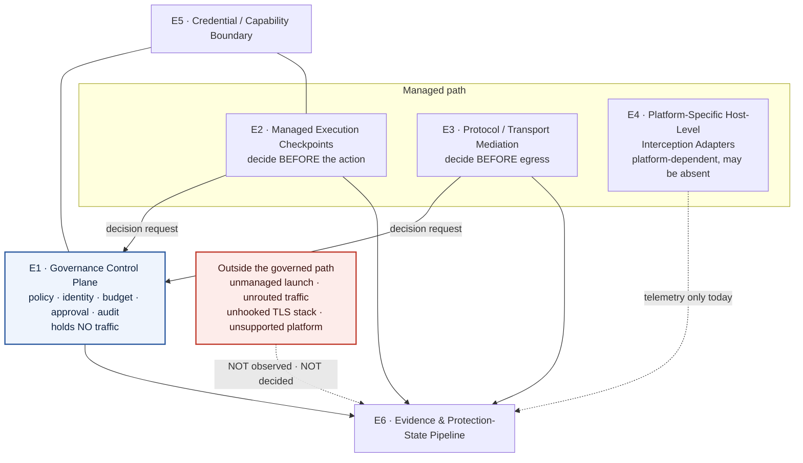

# ADR 0033: Canonical Governance & Enforcement Architecture

**Status**: Accepted
**Date**: 2026-08
**Ticket**: [AAASM-5604](https://lightning-dust-mite.atlassian.net/browse/AAASM-5604) (Epic [AAASM-5526](https://lightning-dust-mite.atlassian.net/browse/AAASM-5526))

This ADR is the **canonical architecture source** for how Agent Assembly governs and
enforces AI-agent behaviour. It replaces the "three universal interception layers"
framing — the fixed `SDK → Proxy → eBPF` pipeline — with six named architectural
elements, and it separates the **logical** architecture from the **deployment**
topology and from **platform-specific** implementation mechanisms. It fixes the
placement of the gateway as a control-plane/runtime service rather than a fourth
interception layer, and it re-describes Linux eBPF as *one possible implementation
mechanism* behind a Platform-Specific Host-Level Interception Adapter rather than as the
abstraction itself.

It **complements and does not supersede**
[ADR 0002](0002-sdk-security-boundary.md) (the SDK is not a security boundary),
[ADR 0004](0004-governance-enforcement-flow.md) (all client↔core governance traffic
crosses the single `aa-sdk-client` transport boundary),
[ADR 0015](0015-dlp-trust-boundary-and-redaction-semantics.md) (fail-closed
redaction),
[ADR 0029](0029-capability-over-permission-derivation.md) (declared vs. effective
capability — note 0029 is itself still `Proposed`) and
[ADR 0032](0032-local-first-sensitive-data-provider-architecture.md) (local-first
sensitive-data detection). Where any of those ADRs states a mechanism, this ADR
places that mechanism in the canonical model; it does not restate or relax it.

It **amends two ADRs**, and says so rather than quietly diverging:

- **[ADR 0018](0018-canonical-runtime-verdict-and-enriched-decision-record.md) §A** —
  0018's schema freeze and its five-way `RuntimeVerdict` stand. But `0018:134`
  describes the *point of derivation* as *"the authoritative enforcement pipeline in
  `aa-runtime` (`RuntimeScanner`), which is where an action's outcome is actually
  decided"*, and `0018:3` records item A as approved for implementation under
  AAASM-5100 Phase 1. Verified against the code, `RuntimeScanner::enforce` runs only on
  the `IpcFrame::EventReport` arm (`aa-runtime/src/pipeline/mod.rs:127`) — after the action —
  and its output is *"a counter on this internal outcome, **not** a verdict"*
  (`struct EnforcementOutcome`, `aa-runtime/src/pipeline/enforcement.rs:115-127`). Forbidden design 9 withdraws the
  "authoritative enforcement pipeline" characterisation; the pre-execution gate is
  `handle_policy_query`. An `Update — AAASM-5604` note is recorded in 0018 itself.
- **[ADR 0030](0030-developer-integration-boundaries-and-trust-model.md) §4.1** — 0030's
  protection-state ladder and evidence rules stand, and this ADR adopts them wholesale
  as element E6. The amendment is narrow: `0030:465` admits `HostEnforced` through two
  routes only — *"the proxy CA is present in the trust store and in use, or the eBPF
  probes are attached (Linux)"*. The route actually shipped on macOS is neither; it is
  an opt-in, authorized, read-back-verified managed-settings write (AAASM-5298). §5.3
  records the third route.

It deliberately does **not** define documentation source-of-truth, claim-precedence
or waiver rules. Those are owned by
[AAASM-5621](https://lightning-dust-mite.atlassian.net/browse/AAASM-5621) and its ADR.
This ADR supplies the *architecture vocabulary* that the documentation-governance
model will police; it does not police documentation itself.

### A naming collision this ADR must not create

Element **E4** was originally drafted as "Host **Enforcement** Adapters", which collides
with ADR 0030's ladder rung **`HostEnforced`** — same words, different referents, inside
the document whose purpose is fixing vocabulary. They are now deliberately distinct:

| Term | Owner | Refers to |
| --- | --- | --- |
| **E4 · Host-Level Interception Adapters** | this ADR | An *architectural role* — OS-level mediation of processes, files, syscalls and TLS. Linux eBPF is one implementation; macOS and Windows have none. |
| **`HostEnforced`** | ADR 0030 §4.1 | A *measured protection state* for one tool on one host, entered only on evidence. Reachable on macOS **without** any E4 adapter, via the managed-settings route. |

An E4 adapter is neither necessary nor sufficient for the `HostEnforced` rung. Do not
treat one as evidence of the other.

---

## Context

> **Citation provenance.** Every `file:line` in this ADR was derived against
> `agent-assembly` at the commit this ADR was published on (branch
> `v0.0.1-rc.7/AAASM-5604/canonical_enforcement_architecture_adr`, rebased onto
> `main`; `aa-proxy/src/proxy/mod.rs` blob `e2c79cdf7`, 2918 lines). Line numbers rot;
> where the argument depends on a citation, the **symbol name is given alongside the
> line** so a reader who finds the line moved can re-locate the anchor and detect drift
> instead of dismissing the claim. If a line number does not land, search the symbol
> before concluding the ADR is wrong.

### What the superseded model asserts

The current material states the model as a fixed, ordered pipeline. From
`docs/src/introduction/three-layer-model.md:1-9`: *"Agent Assembly intercepts agent
actions at **three independent layers**, each catching what the layers above it
might miss."* The same page orders them *"lowest latency first, highest detection
authority first"* and describes layer 3 as catching *"Everything else, including
bypass attempts."* `docs/src/architecture/README.md:32-40` renders it as a single
`3 interception layers (SDK · proxy · eBPF)` box feeding the runtime. The repository's own
`.claude/CLAUDE.md` repeats it verbatim (*"catches everything, including bypass
attempts"*), and `README.md` carries it to every first-time reader.

### Why it is wrong

The model is not merely imprecise; each of its load-bearing claims is contradicted by
the implementation.

1. **It conflates a logical role with an implementation mechanism.** "eBPF" is a Linux
   kernel facility, not an architectural role. Naming the layer after the mechanism
   makes the architecture untranslatable to any platform that lacks that mechanism —
   which is every platform except Linux.

2. **It presents a Linux-only, x86_64-only mechanism as the universal final layer.**
   `aa-runtime` depends on `aa-ebpf` only under
   `[target.'cfg(target_os = "linux")'.dependencies]` (`aa-runtime/Cargo.toml:81-82`).
   Off Linux every loader entry point returns
   `EbpfError::ProgramLoad("eBPF is only supported on Linux")`
   (`aa-ebpf/src/loader.rs:90-93`, `:128-131`, `:530-533`, `:578-581`, `:630-634`) and
   the runtime emits a `LayerDegradation` (`aa-runtime/src/runtime.rs:393-405`,
   `:492-506`, `:550-563`). Even on Linux the file-I/O kprobes attach exclusively to
   x86_64 syscall entry symbols — all fourteen targets in
   `KPROBE_TARGETS` (`aa-ebpf/src/kprobe.rs:145-160`) are `__x64_sys_*`, and no `__arm64_sys_*` target
   exists anywhere in the eBPF crates. A "final layer that catches everything" is in
   fact a mechanism available on one OS and one CPU architecture.

3. **It implies a fixed ordered pipeline where the code models an independently
   probed capability set.** `aa-runtime/src/layer.rs:10-21` defines `LayerSet` as a
   *bitflag*, and `LayerDetector::detect` (`:164-179`) probes each member
   independently: eBPF requires kernel ≥ 5.8, a BTF blob at `/sys/kernel/btf/vmlinux`,
   and a reachable privileged loader-daemon socket (`:133-135`); the proxy requires
   Linux-or-macOS and an `aa-proxy` binary on `$PATH` (`fn probe_proxy`, `:142-145`); SDK is recorded as
   *"always available"* (`:19`, `:169`). There is no ordering, no fall-through, and no
   guarantee that any given member is present. Absent members are not "covered by the
   layer below" — they are simply absent.

4. **It implies uniform prevention authority.** The three named layers do not have
   comparable authority, and two of them cannot prevent anything at all:
   - Every TLS, file-I/O and exec eBPF program is observe-only and returns `0` after
     submitting telemetry (`aa-ebpf-probes/src/syscall_guard.rs:3-4`). The path
     blocklist sets an alert bit and lets the syscall proceed
     (`aa-ebpf-probes/src/main.rs:119-121`; `aa-ebpf-probes/src/maps.rs:94-95`:
     *"this layer is **OBSERVE-ONLY** (it sets an alert flag; it does not deny)"*).
     `PathVerdict::Deny` (`aa-ebpf/src/maps.rs:16`) is a misleading name for an event
     trigger.
   - The single enforcing program, the syscall guard, does not perform a synchronous
     deny. It sends `bpf_send_signal(SIGKILL)`
     (`aa-ebpf-probes/src/syscall_guard.rs:174-176`, `:193-195`), and its own
     documentation records the consequence (`:55-60`): *"the offending syscall still
     executes once before the task dies — a single `connect`/`sendto`/`write`/`unlink`
     can land. A truly synchronous deny (return `-EPERM` before the handler runs) needs
     seccomp-BPF or an LSM `bpf_lsm` hook, which is out of scope here."* No `bpf_lsm`
     hook, `SEC("lsm/…")` program or `bpf_override_return` call exists in the tree.
   - `aa-gateway` has no *direct* dependency on `aa-ebpf` (it depends on `aa-runtime` unconditionally, `aa-gateway/Cargo.toml:46`, which in turn takes `aa-ebpf` only under `cfg(target_os = "linux")`). No eBPF signal is consulted in any
     allow/deny decision; eBPF events terminate in the audit publisher and the
     correlation engine.

5. **It leaves the gateway unplaced**, which invites readers to file it as a fourth
   interception layer. The gateway does not intercept anything: it holds the policy
   source of truth, the agent registry, budgets, approvals and audit, and it answers
   decision requests. Interception happens elsewhere and is *routed to* it.

6. **It presents self-reported availability as coverage.** `AA_LAYERS`
   (`fn from_env_override`, `aa-runtime/src/layer.rs:182-197`) replaces the entire probe result with an
   environment variable. `probe_proxy` is satisfied by a binary being on `$PATH`
   (`:142-145`), which says nothing about whether any traffic is routed through it.
   `SDK` is asserted unconditionally, whether or not any agent adopted it.

### The constraint that forces the design

Two facts cannot both be accommodated by a single ordered pipeline:

- **Coverage is a property of the deployment, not of the product.** Whether an action
  is governed depends on whether the process was launched onto a managed path, whether
  its traffic was routed through the mediator, whether the platform has a host adapter,
  and whether that adapter is healthy. Every one of those is a per-host, per-tool,
  per-launch fact.
- **Different mechanisms decide at different times relative to the action.** A
  pre-execution wrapper decides *before*; a transport mediator decides *before egress
  but after the caller committed*; the syscall guard reacts *after the syscall ran*;
  an audit consumer learns *afterwards*. Collapsing these into "layers" of one pipeline
  erases the distinction that determines what may truthfully be claimed.

An architecture description that cannot express "this mechanism is absent on this
platform" or "this mechanism detects but does not prevent" will keep producing
overstated claims, because the vocabulary has no way to state the limitation.

### Threat model

Three adversaries want different answers from this architecture.

| Adversary | Capability | What must still hold |
| --- | --- | --- |
| **An unmanaged process** — an agent that never adopted the SDK, was not launched through `aasm run`, or had its proxy environment removed | Runs as the developer's own UID; can unset `HTTPS_PROXY`, use a TLS stack the uprobes do not hook (Go `crypto/tls`, Node's statically linked BoringSSL — `aa-ebpf-probes/src/ssl_probes.rs:19-27`), or simply never link the SDK | The product must report this as **outside the governed path**, not as governed. Absence of an event must never render as absence of activity. |
| **A steered agent inside the boundary** (the ADR 0015 adversary) | Controls payload content; may try to make the product *report* protection it does not have | Reported protection state must never exceed the evidence (ADR 0030 §4.2). Missing evidence resolves downward. |
| **An evaluator misled by the product's own description** | Reads the website, Docs Hub or repo README and provisions on that basis | Every claim must name its platform, its decision timing and its failure posture. A reader must not be able to conclude "eBPF catches bypass attempts on my Mac" or "this cannot be bypassed" from any published sentence. |

The third adversary is the one this ADR exists for. The other two are already
addressed by ADR 0015 and ADR 0030; this ADR ensures the architecture *vocabulary*
does not undo them.

The developer's own UID is not an adversary here — consistent with ADR 0030, host-level
tamper prevention against the user's own account is an explicit non-goal.

---

## Decision

### 1. The canonical model is six elements, not three layers

Agent Assembly's governance architecture is described by the following six elements.
They are **roles**, not products, not crates and not an ordered pipeline. A deployment
instantiates some subset of them; which subset is a deployment fact, and the product
must report it rather than assume it.

| # | Element | What it is | Implemented today by | Availability |
| --- | --- | --- | --- | --- |
| **E1** | **Governance Control Plane** | The authority that holds policy, identity, budgets, approvals and audit, and answers decision requests. Holds no traffic. | `aa-gateway` (gRPC: `PolicyService`, `AgentLifecycleService`, `AuditService`, `ApprovalService`, `SecretsService`, `TopologyService`, `InvalidationService` — `aa-gateway/src/server.rs:22-28`), `aa-api` (HTTP/OpenAPI read surface), `aa-storage*` | Platform-independent |
| **E2** | **Managed Execution Checkpoints** | Points on a *managed path* where an action is presented for a decision before it runs. | `aa-runtime`'s `handle_policy_query` (`fn handle_policy_query`, `aa-runtime/src/pipeline/mod.rs:407`, dispatched from the `IpcFrame::PolicyQuery` arm at `:159-175`); `aa-sdk-client::query_policy` + `resolve_decision` (`aa-sdk-client/src/client.rs:247-279`, `aa-sdk-client/src/decision.rs:58-97`); `aasm run` managed launch (`aa-cli/src/commands/run.rs`); `aa-sandbox` for WASM-marked tools | Checkpoint reachable only if the agent opts in (see §4) |
| **E3** | **Protocol / Transport Mediation** | A mediator placed on the wire that can refuse, redact or rewrite a request before it leaves the machine. | `aa-proxy` — CONNECT-time egress control, in-tunnel host re-check, credential/DLP scan, MCP `tools/call` adjudication | Unix only; see §5 |
| **E4** | **Platform-Specific Host-Level Interception Adapters** | The *abstraction* for OS-level mediation of processes, files, syscalls and TLS. Each platform needs its own mechanism, and a platform without one has none. | **Linux:** eBPF via the privileged `aa-ebpf-loaderd` (`aa-ebpf/src/bin/loaderd.rs`). **macOS:** no OS-level mediation; an opt-in, authorized managed-settings write is the route to ADR 0030's `HostEnforced` rung (§5.3). **Windows:** none. | Per-platform; see §5 |
| **E5** | **Credential / Capability Boundary** | What a component is *allowed to ask for*, and how a credential or capability is bound to an identity. | `aa-security` (scanner, redaction, canonical policy AST — a leaf crate with no inherent authority); `credential_token` validation in `PolicyService::check_action` (`aa-gateway/src/service/policy_service.rs:1623-1625`); `did:key` registration (ADR 0004); DI-API capability tokens and the compile-time `aa-devtool-contract` boundary (ADR 0030) | Platform-independent |
| **E6** | **Evidence & Protection-State Pipeline** | How a protection *claim* is substantiated, degraded, and reported. | ADR 0030 §4's protection-state ladder; adjudication reported by the component that actually decided (`aa-proxy/src/probe_adjudication.rs:1-14`); audit publication; `LayerDegradation` reporting | Platform-independent |

Two structural rules follow, and they are the point of the model:

- **An element may be absent.** Absence is a reportable state (E6), never a silent
  fall-through to another element. There is no "layer below" that picks up what an
  absent element would have done.
- **An element's authority is a property of the element, not of the model.** E1 decides
  but holds no traffic. E3 holds traffic and can refuse it. E4's Linux implementation
  today mostly observes. Nothing in the model implies that these are interchangeable.

### 2. The Governance Control Plane is not an interception layer

`aa-gateway` is a **control-plane / runtime service**. It is a request/response policy
oracle: `PolicyService::check_action` (`aa-gateway/src/service/policy_service.rs:1599`)
→ `PolicyEngine::evaluate` (`aa-gateway/src/engine/mod.rs:946`, routing to
`evaluate_primary` or `evaluate_with_cascade` at `:974-978`). The agent's bytes never
traverse it.

`check_action` is a real decision pipeline, not a logger — credential-token validation
short-circuits to `Deny` (`aa-gateway/src/service/policy_service.rs:1623-1625`), observe-mode applies a shadow
transform (`:1646-1648`), approval submission blocks (`:1652-1657`), anomaly detection
can be promoted to a hard `Deny` (`:1662-1663`), atomic budget reservation can `Deny`
(`:1669`), and agent suspension is enforced (`:1700`).

But its Deny stops nothing by itself. **The gateway prevents only transitively, and is
exactly as strong as the caller that blocks on its answer.** The set of callers that do
so is narrower than "the proxy":

| Caller | Blocks on a gateway answer? | Consequence of `Deny` |
| --- | --- | --- |
| `aa-proxy`, **MCP `tools/call` on a non-LLM MitM'd host, gateway configured** | Yes, synchronously, before dialling upstream | `handle_non_llm_mitm` (`aa-proxy/src/proxy/mod.rs:801`) calls `evaluate_mcp_request` (`:614`, invoked at `:834`) — *"MCP detection — only when a gateway is configured"* (`:832`). On `McpEvalOutcome::Deny` the handler answers the client and returns **without** reaching `dial_upstream_tls` (`:552`, reached at `:910`). This is the only gateway-bound pre-dial block in the system. |
| `aa-proxy`, **LLM-provider hosts** (the only hosts MitM'd under the `llm_only` default) | **No** | `handle_llm_mitm` (`:1038-1241`) contains **zero** gateway references. It refuses locally at two points, both returning 403 on its own authority: `in_tunnel_deny_reason` (`:984`, called at `:1055`, 403 at `:1066`) and the `Interceptor`'s `VerdictDecision::Block` (`:1153`, 403 at `:1173`). |
| `aa-proxy`, **CONNECT-time egress** | **No** | Refusal comes from local configuration — the denied-host list and `is_host_allowed_by_egress_allowlist(host, &self.config.network_allowlist)` (`:960-966`) — not from the control plane. |
| **Any host not MitM'd** (the `llm_only` default sends every non-LLM host here) | **No** | Still evaluated at CONNECT by the same local egress policy as the row above — `connect_deny_reason` (`:934`) runs at `:1308`, *before* the `llm_only` branch at `:1333`. What is skipped is **payload** inspection: `handle_llm_mitm`/`handle_non_llm_mitm` are never entered and the bytes are relayed by `transparent_tunnel` (`:1397`). Per §6 the **connection is Observed** — `transmission_evidence::forwarded(…).persist(…)` (`:1402-1408`) — while the **payload is Unmeasured**. |
| `aa-runtime` `handle_policy_query` (`fn handle_policy_query`, `aa-runtime/src/pipeline/mod.rs:407`) | Yes | A `Deny` is returned to the SDK — which must then honour it (§4). |

> **A truthfulness defect this table exposes.** At `aa-proxy/src/proxy/mod.rs:1325` the
> proxy calls `emit_policy_decision(host, false)` — an **allow** decision
> (`aa-proxy/src/intercept/mod.rs:303`, where the parameter is `denied: bool`) — for a
> connection it is about to tunnel without inspecting. That is precisely what §4's
> semantic rule forbids: an uninspected path must not be reported as allowed. The
> adjacent `transparent_tunnel` code gets this right, persisting *"forwarded, and
> nothing looked at it — never clean"* (`:1398-1408`, AAASM-5358); the CONNECT-level
> decision event does not. Logged in the migration checklist, section B, as a code fix
> rather than a documentation one.

The distinction matters for anyone choosing an enforcement path: a gateway `Deny` stops
bytes **only** for MCP tool-call envelopes on non-LLM MitM'd hosts with a gateway
endpoint configured. Everything else the proxy refuses, it refuses on its own local
policy — which is real prevention, but it is *not* the control plane deciding.

Therefore: **the gateway is E1 and only E1.** Describing it as a fourth interception
layer misstates both what it holds (no traffic) and what it can do alone (nothing to
the traffic). Conversely, describing the interception elements without the gateway
misstates where the decision is actually made.

### 3. Three views, kept distinct

Most of the confusion this ADR corrects comes from collapsing three different pictures
into one diagram. They must be published separately and labelled.

#### 3.1 Logical view — roles and the decision relationship

The dashed edge from E4 is not a drafting shortcut: on Linux today the host adapter
feeds the evidence pipeline and is **not** consulted in any allow/deny decision (§5.1).

#### 3.2 Deployment view — what is actually running

The deployment view answers "which processes exist on this host, and what is wired to
what". It is the only view in which coverage can be assessed, because coverage depends
on process launch and traffic routing, not on architecture.

| Process | Role | Present when |
| --- | --- | --- |
| `aa-gateway` | E1 | Operator runs it (local or remote mode) |
| `aa-runtime` | E2 chokepoint; UDS server at `/tmp/aa-runtime-{agent_id}.sock` (`aa-runtime/src/ipc/server.rs:38`) | Operator runs it |
| `aa-proxy` | E3 | Binary on `$PATH` **and** started (`aasm proxy start`, PID file at `$AA_DATA_DIR/proxy.pid` — `aa-cli/src/commands/proxy/pid.rs:55-65`) or spawned by `aa-runtime` |
| `aa-ebpf-loaderd` | E4 (Linux) | Linux, privileged, socket present at `/run/aa-ebpf-loaderd.sock` |
| The agent / dev tool process | The governed subject | Launched by the operator — **on or off the managed path** |

`LayerDetector::detect` (`aa-runtime/src/layer.rs:164-179`) reports a *deployment* fact,
and reports it weakly: `probe_proxy` is satisfied by `which::which("aa-proxy")`
(`:142-145`), and `AA_LAYERS` (`:182-197`) overrides the probes entirely. A detected
layer set is therefore **an availability hint, not evidence of coverage** (§7).

#### 3.3 Platform-specific view — mechanisms, per OS

This view must never be merged into the logical view, because a mechanism named in it
does not exist on every platform. See §5 for the verified matrix.

### 4. Governed path and outside-boundary semantics

**Definition.** An action is on the **governed (managed) path** when, before it takes
effect, it is presented to a checkpoint (E2) or a mediator (E3) that is configured to
consult the control plane (E1) and to honour the answer.

An action is **outside the boundary** when any link in that chain is missing. The
verified ways this happens today:

| Condition | Mechanism | Evidence |
| --- | --- | --- |
| The agent never calls the checkpoint | `query_policy` is a voluntary call over UDS; a non-cooperating process simply does not make it | `aa-sdk-client/src/client.rs:247-279` |
| The SDK's answer is not honoured | `resolve_decision` has **no in-tree caller that refuses to execute**; refusal lives in the out-of-repo FFI shims | `aa-sdk-client/src/decision.rs:32-33`: *"The SDK remains advisory: `aa-runtime` / proxy / eBPF are the authoritative enforcement points. This is a defense-in-depth posture, not the primary gate."* |
| Traffic is not routed to the mediator | `HTTPS_PROXY` is injected only on the managed launch path; an ambient or removed value changes coverage | `aa-cli/src/commands/run.rs:322-326`; adapters at `aa-devtool-codex/src/lib.rs:301`, `aa-devtool-windsurf/src/lib.rs:312`, `aa-devtool-claude-code/src/lib.rs:379` |
| The tool has no managed launch at all | `aa-devtool-copilot::build_launch_command` returns `AdapterError::LaunchFailed` (`aa-devtool-copilot/src/lib.rs:347-357`); `aa-devtool-saas` is hard-capped at `L1Observe` (`aa-devtool-saas/src/adapter.rs:66,122`) | No proxy env is injected, so no data-path mediation exists for these tools |
| The host is mediated but the destination is not inspected | `llm_only` defaults to **true**: any host outside the built-in LLM set or operator `mitm_hosts` is **transparently tunnelled, uninspected** | `aa-proxy/src/proxy/mod.rs:1333-1336`; the default is `fn parse_llm_only` → `Err(_) => true` (`aa-proxy/src/config.rs:434-439`) |
| The TLS stack is not hooked | The uprobes hook only OpenSSL `SSL_read`/`SSL_write`; Go `crypto/tls` and Node's statically linked BoringSSL expose no such symbols | `aa-ebpf-probes/src/ssl_probes.rs:19-27` |
| The platform has no host adapter | macOS and Windows — §5 | — |

**The semantic rule.** For anything outside the boundary the product knows *nothing
about the action*. It must not report that action as allowed, as clean, or as absent.
The only truthful report is that **the action or its payload was not inspected**, and
its governance state is **Unmeasured**. This is ADR 0030 §4.2 rule 2 ("missing evidence
lowers the state, never raises it") applied to the architecture as a whole.

Scope this rule precisely: it is about the **action**, not necessarily the connection
carrying it. The two can differ, and §2 row 4 is the case that proves it — a host the
proxy does not MitM is still adjudicated at CONNECT by local egress policy, and its
connection *is* recorded as evidence, while its payload is never inspected. So the
honest report there is **connection Observed, payload Unmeasured** — not "not observed".
Do not quote this rule as "nothing is observed outside the boundary"; quote it as
"nothing is known about the *action* outside the boundary".

Correspondingly, an empty audit log is evidence about the *observer*, not about the
agent.

### 5. Host-level interception is platform-specific and optional; eBPF is one Linux mechanism

**eBPF is not an architectural layer. It is one implementation of E4, available on
Linux, and today it is predominantly an observation mechanism.**

#### 5.1 What the Linux eBPF implementation actually does

| Program | Attach | Behaviour |
| --- | --- | --- |
| `ssl_write`, `ssl_read_entry`, `ssl_read_exit` | uprobes/uretprobe on OpenSSL `SSL_write` / `SSL_read` (`aa-ebpf-probes/src/ssl_probes.rs:91,123,151`) | Observe only. Events are logged but **not bridged** to the audit pipeline (`aa-runtime/src/runtime.rs:302-305`, `:344-350`) |
| File-I/O kprobes | 14 targets, all `__x64_sys_*` (`aa-ebpf/src/kprobe.rs:145-160`) | Observe only. The path blocklist sets an alert bit; the syscall proceeds (`aa-ebpf-probes/src/main.rs:119-121`) |
| Exec tracepoints | `sched_process_{fork,exec,exit}` (`aa-ebpf-probes/src/exec_probes.rs:182,292,356`) | Observe only; no ring-buffer reader is wired yet (`aa-runtime/src/runtime.rs:510-512`) |
| **Syscall guard** | `raw_syscalls/sys_enter` + fork/exit (`aa-ebpf-probes/src/syscall_guard.rs`) | The **only** enforcing program. Default-denies syscalls outside the allowlist by `bpf_send_signal(SIGKILL)` (`:174-176`, `:193-195`) |

Four properties of that single enforcing program must be stated wherever it is
mentioned:

1. **It is not a synchronous deny.** `aa-ebpf-probes/src/syscall_guard.rs:55-60`: *"the offending syscall
   still executes once before the task dies … A truly synchronous deny (return `-EPERM`
   before the handler runs) needs seccomp-BPF or an LSM `bpf_lsm` hook, which is out of
   scope here."* No `bpf_lsm` program, `SEC("lsm/…")` hook or `bpf_override_return`
   call exists in the tree.
2. **It is off by default.** It is planned only when `AA_EBPF_CONFINE_PID` names a PID
   *and* the lowered policy yields a non-empty allowlist
   (`aa-runtime/src/ebpf_control.rs:137-140`); `confine_pid()` treats `0`/unparseable
   as unset *"so the SIGKILL-capable guard stays off by default"* (`:154-162`).
3. **It has a documented load-time window.** `aa-runtime/src/ebpf_control.rs:114-121` records a window
   between guard load and allowlist update in which the confined PID runs with an empty
   allowlist; a race-free fix needs a protocol change.
4. **The fork tracepoint cannot block a fork** — an acknowledged fail-open
   (`aa-ebpf-probes/src/syscall_guard.rs:105`).

**No eBPF signal participates in any allow/deny decision.** `aa-gateway` has no *direct* dependency on `aa-ebpf`
(`aa-gateway/Cargo.toml:46` takes `aa-runtime` unconditionally; `aa-runtime` takes
`aa-ebpf` only under `cfg(target_os = "linux")`); events terminate in the audit publisher
(`aa-runtime/src/runtime.rs:689-722`) and the correlation engine
(`aa-runtime/src/correlation/mod.rs:64-66`). The only reverse link is policy lowering
pushing a syscall allowlist into the opt-in guard
(`aa-security/src/policy/ebpf.rs:161,173` → `aa-runtime/src/ebpf_control.rs:36,190`).

#### 5.2 Prerequisites, and what they mean for a claim

Linux eBPF is reachable only when **all** of: kernel ≥ 5.8, BTF at
`/sys/kernel/btf/vmlinux`, and a reachable `aa-ebpf-loaderd` socket
(`fn probe_ebpf`, `aa-runtime/src/layer.rs:133-135`); `bpf_send_signal` additionally requires ≥ 5.3.
`aa-runtime` holds no `CAP_BPF` — the loader daemon is the sole capability holder
(`aa-ebpf/Cargo.toml:49-50`), which is a deliberate privilege separation, not an
inconvenience. The file-I/O kprobes are additionally **x86_64-only**: there is no
`__arm64_sys_*` attach target anywhere in the eBPF crates, so aarch64 Linux gets no
file-I/O coverage from this mechanism.

#### 5.3 The verified platform matrix

| Platform | E3 Transport Mediation | E4 Host-Level Interception | Status to publish |
| --- | --- | --- | --- |
| **Linux x86_64** | `aa-proxy`; CA trust via CLI `update-ca-certificates` (`aa-cli/src/commands/proxy/ca.rs:149,173`) | eBPF observation (TLS/file/exec); syscall guard as opt-in asynchronous kill | **Implemented**, with the §5.1 limits stated |
| **Linux aarch64** | `aa-proxy` | eBPF TLS/exec only; **no** file-I/O kprobe targets | **Implemented (partial)** — must say which probes are absent |
| **macOS** | `aa-proxy`; a System Keychain trust install **attempted automatically at proxy start**, gated only on whether the certificate is already installed — `pub async fn run` (`aa-proxy/src/lib.rs:41`) executes `if !ca.is_installed()? { … ca.install()?; }` unconditionally on macOS (`aa-proxy/src/lib.rs:64-69`). `CaStore::install` (`aa-proxy/src/tls/ca.rs:215`, calling `keychain::add_trusted_cert` at `:219`) shells out to `security add-trusted-cert` (`fn add_trusted_cert`, `aa-proxy/src/tls/keychain.rs:18`; the `Command::new("security")` invocation is `:23-32`), which **requires admin authorization** — macOS prompts for it (`aa-proxy/src/tls/keychain.rs:16`) — and because `ca.install()?` propagates out of `run`, **a refused prompt fails proxy startup**. The Claude Code integration deliberately does **not rely on** this trust store, establishing trust per-launch through `NODE_EXTRA_CA_CERTS` instead (`aa-devtool-claude-code/src/lifecycle.rs:658-659`). **Read that citation with care:** the same comment asserts at `:657-658` that *"the proxy CA is still never added to the macOS system trust store"*, which is true of the integration path but **false at product scope** — the first half of this very cell disproves it. Do not carry that sentence into any page; it is a user-visible CLI reason string and is tracked as [AAASM-5639](https://lightning-dust-mite.atlassian.net/browse/AAASM-5639). An independent in-tree witness that `run` installs unconditionally, which is not the code under discussion, is `aa-integration-tests/examples/proxy_with_mock_upstream.rs:58-61`: *"[`aa_proxy::run`] is deliberately **not** called. It installs the CA into the macOS System Keychain, which every fixture in this crate is forbidden from doing."* | **None.** Endpoint Security / Network Extension is an **explicit non-goal** — asserted in product docs (`docs/src/devtools/product-brief.md:448,655` — *"macOS Endpoint Security and Network Extension remain explicit non-goals"*, and `aa-ebpf` is *"Linux-only and is a **detection** layer that cannot modify traffic in flight"*) and pinned by a test asserting the literal limitation string (`aa-cli/src/commands/integrations/model.rs:1200,1204`) | Transport mediation **Implemented**; **E4 host-level interception Unsupported**. **Do not read this as "no host enforcement on macOS"** — see the note below: macOS is the *only* platform on which ADR 0030's `HostEnforced` rung is reachable today. |
| **Windows** | **None** — `aa-proxy`'s accept loop uses `tokio::signal::unix` unconditionally (`aa-proxy/src/proxy/mod.rs:296,298`), so the crate has no Windows build path. Note the naive grep is misleading: `#[cfg(windows)]` blocks *do* exist (`aa-devtool-copilot/src/lib.rs:260,292`; `aa-cli/src/commands/dashboard/stop.rs:23`, which calls `windows_sys::…::OpenProcess`). The dispositive evidence is that **`windows_sys` is declared in no `Cargo.toml` in the workspace**, so those blocks cannot compile as written | **None.** No ETW, WFP or minifilter code exists | **Unsupported** |

> **The macOS exception — read this before citing the row above.**
>
> macOS has no E4 adapter, yet it is the **only** platform where ADR 0030's
> `HostEnforced` protection state is reachable in production. The single production
> producer of `EvidenceKind::HostAttested` is the macOS managed-settings path
> (`EvidenceKind::HostAttested`, `aa-devtool-claude-code/src/lifecycle.rs:556`), which feeds
> `is_host_enforcement_grade` → `justifies_host_enforcement`
> (`aa-core/src/integration/state.rs:291,296`) and the `HostEnforcement` capability
> (`aa-core/src/integration/capability.rs:116-118`).
>
> The code is explicit that unavailability must not be stated as a blanket
> (`aa-devtool-claude-code/src/lifecycle.rs:653-659`): *"Stated as a reason it is not
> active here, not as a blanket unavailability: since AAASM-5298 there is a path to it,
> and it is opt-in, privileged and verified."* That is the AAASM-5454
> `host_enforced_availability` fix, and this ADR must not re-break it.
>
> Two consequences. First, the route is a **root-owned managed-settings file write** —
> neither of the two routes ADR 0030 §4.1 (`0030:465`) names, which is why this ADR
> **amends** 0030 rather than complementing it. Second, whether the tool honours those
> keys at runtime is **unmeasured** — the adapter's own docs call it *"the open half of
> AAASM-5298"* (`aa-devtool-claude-code/src/managed_settings.rs:50-57`) — so the
> reachable state rests on a read-back of the file, not on observed enforcement.

DTrace was considered and rejected for macOS in the original design discussion as
observability-only, not enforcement; no DTrace code exists. Any future macOS or Windows
host adapter is **research** until an implementation exists, and must be labelled as
such (§6).

### 6. Claim vocabulary — decision timing and failure posture are part of every claim

A governance claim is incomplete without its timing and its posture. The following is
the canonical vocabulary; downstream material must pick one of these terms rather than
an undifferentiated verb like "protects", "enforces" or "catches".

| Term | Means | Evidence required |
| --- | --- | --- |
| **Observed** | An event reached the evidence pipeline | A durable event attributed to the action |
| **Detected** | A pattern of interest was found in observed material | A finding, with the detector named |
| **Evaluated** | The control plane produced a decision for this action | A decision record from `check_action` / `handle_policy_query` |
| **Denied before execution** | The action did not take effect, and the decision preceded the effect | A refusal by a component that sits *before* the effect (today: `aa-proxy` pre-dial, or an SDK shim that honoured a `Deny`) |
| **Redacted** | The action proceeded with content removed | A redaction record naming the fields |
| **Approval required** | The action was held pending a human decision | A pending approval record |
| **Degraded** | A planned control is configured but unavailable, so the achieved level is below the planned level | A `LayerDegradation` event or an ADR 0030 `Degraded` state, carrying both levels. `LayerDegradation` is a **retained legacy wire name** for exactly this term — kept deliberately for compatibility, see the Migration checklist §F |
| **Unmeasured** | No control inspected this **action or payload**; nothing is known about it. Scoped deliberately: a connection-level observation may still exist for the same traffic (§2 row 4), so *Unmeasured* about a payload does not imply *unobserved* about its connection | The honest state for any action outside the boundary (§4) |
| **Experimental** | Implemented but not validated for production use | Named implementation plus the validation that is missing |
| **Planned** | Decided but not implemented | A ticket reference; no capability claim |
| **Unsupported** | Not available on this platform/configuration, with no plan asserted | The platform matrix row (§5.3) |

Mapped onto the verified mechanisms:

| Mechanism | Highest term it can legitimately reach today |
| --- | --- |
| `aa-proxy` CONNECT / in-tunnel / DLP / MCP adjudication | **Denied before execution**, for traffic that traverses it and is MitM'd. Note the decision *source* differs by path (§2): CONNECT, DLP and LLM-host refusals are local policy; only MCP `tools/call` on a non-LLM MitM'd host is a gateway decision |
| `aa-gateway` `check_action` | **Evaluated**; reaches *Denied before execution* only through a blocking caller, and today that is the MCP path plus an SDK shim that honours the answer |
| `aa-runtime` `handle_policy_query` | **Evaluated**; *Denied before execution* only if the SDK shim honours the answer |
| `aa-runtime` `RuntimeScanner` | **Redacted** — it runs on `IpcFrame::EventReport` (`aa-runtime/src/pipeline/mod.rs:127`), i.e. *after* the action, and returns counters, not a verdict (`struct EnforcementOutcome`, `aa-runtime/src/pipeline/enforcement.rs:115-132` — findings plus counters, with no decision field; the *"a counter on this internal outcome, **not** a verdict"* note at `:124` is scoped to the `undecodable_fields` counter specifically) |
| `aa-sdk-client` | **Evaluated** (advisory); it is not an enforcement point in this repo |
| eBPF TLS / file / exec probes | **Observed** / **Detected** |
| eBPF syscall guard | **Detected**, plus asynchronous process termination — explicitly **not** *Denied before execution* (§5.1) |
| `aa-devtool-*` config writes | **Not a data-path claim at all.** Writing a tool's own settings file is tool-governance; it takes effect only if the tool honours those keys, which for the macOS managed-settings path is explicitly unmeasured. Any data-path prevention these adapters deliver is `aa-proxy`'s, borrowed via injected launch environment |
| `aa-sandbox` | **Denied before execution**, for WASM-marked tools handed to it; it is not in any agent's normal tool-call path |

Note one consequence for the read surface: ADR 0018's five-way `RuntimeVerdict`
(`allow`/`narrow`/`scrub`/`pending`/`deny`) is a **frozen API vocabulary**, and
`aa-api/src/models/verdict.rs:21-24` states that deriving it at decision time *"is not
implemented here … until then the field is surfaced as `null`"*. The enforced wire
enum remains the coarser audit `Decision`. Material must not present the five-way
verdict as a live per-action outcome.

### 7. Self-reported availability is not evidence of coverage

Three signals in the current implementation look like coverage and are not. None may be
used to substantiate a protection claim:

- **`AA_LAYERS`** replaces the entire probe result with an environment variable
  (`aa-runtime/src/layer.rs:182-197`).
- **`probe_proxy`** is satisfied by a binary existing on `$PATH`
  (`aa-runtime/src/layer.rs:142-145`) — it does not establish that any process routes
  traffic through it.
- **`LayerSet::SDK`** is asserted unconditionally (`aa-runtime/src/layer.rs:19`,
  `:169`), independent of whether any agent adopted the SDK.

Coverage claims come from the E6 evidence pipeline — an adjudication reported by the
component that actually decided (`aa-proxy/src/probe_adjudication.rs:1-14`: *"A
protection probe sits on the **near** side of the MitM. It can observe that its request
went out and that nothing obviously failed, and neither fact is evidence"*) — and from
ADR 0030's ladder, never from a capability bitflag.

---

## Alternatives Considered

### Keep the three-layer model and add caveats (rejected)

The cheapest option: leave `SDK → Proxy → eBPF` in place and attach platform footnotes.
Rejected because the defect is in the *structure*, not the wording. An ordered pipeline
whose members "catch what the layer above missed" has no way to express an absent
member — a caveat cannot repair a model whose shape asserts completeness. It also
leaves the gateway unplaced, which is what produces the recurring "fourth layer"
reading.

### Rename the third layer to "kernel layer" (rejected)

Slightly better than "eBPF", but still wrong in the same way: it promises a kernel
mechanism on platforms that have none, and it implies the mechanism's authority is
uniform when the verified authority is "observe, plus one opt-in asynchronous kill".
E4 names the *role* and forces the per-platform matrix (§5.3) to be published
alongside it.

### Model layers as an ordered fallback chain (rejected)

A tempting refinement: keep the ordering but state that a missing layer falls through
to the next. Rejected because it is false. `LayerSet` members are probed independently
(`aa-runtime/src/layer.rs:164-179`); nothing hands an un-intercepted action to another
mechanism. Worse, the fallback framing would license exactly the inference this Epic
exists to stop — that an action not seen by the SDK was therefore seen by eBPF.

### Define the model from the roadmap rather than from the implementation (rejected)

Describing the intended end state (synchronous LSM-based deny, macOS Endpoint Security,
a Windows adapter) would make a tidier architecture. Rejected: this ADR is cited as the
canonical source by the website, Docs Hub and Core, so it must describe what is
verified. Roadmap items are admissible only under the **Planned** or **Research** terms
of §6, with no capability claim attached.

### Fold documentation-governance rules into this ADR (rejected — different owner)

Claim precedence, source-of-truth ordering and waiver handling are genuinely needed,
but they belong to
[AAASM-5621](https://lightning-dust-mite.atlassian.net/browse/AAASM-5621). Defining them
here would create two competing authorities. This ADR supplies vocabulary; 5621 supplies
the governance process that enforces its use.

## Accepted risks

- **The model is more complex than the thing it replaces.** Six elements and three views
  cost more to teach than one three-box diagram. Accepted: the simpler model was
  producing false claims, and the complexity is inherent to a product whose coverage is
  a per-host, per-platform, per-launch fact.
- **The verified-state tables will age.** §5.3 and §6 are snapshots of the
  implementation at v0.0.1-rc.7. Accepted, with the mitigation that
  [AAASM-5531](https://lightning-dust-mite.atlassian.net/browse/AAASM-5531) is chartered
  to make the capability/evidence manifest machine-readable and
  [AAASM-5536](https://lightning-dust-mite.atlassian.net/browse/AAASM-5536) to gate stale
  evidence in CI. Until those land, the tables are maintained by review.
- **Honest limits are competitively unflattering.** Publishing "macOS: no E4 host-level
  interception adapter" and "the syscall guard does not prevent the offending syscall"
  weakens marketing copy. (Note the first must be stated that precisely — macOS *is* the
  one platform where ADR 0030's `HostEnforced` rung is reachable, §5.3.) Accepted deliberately: an evaluator who discovers an overstated claim
  after provisioning is a worse outcome than one who reads an accurate limitation
  up front.
- **This ADR does not fix the affected pages.** It supersedes the model and lists the
  migration surface; the rewrites are owned by
  [AAASM-5528](https://lightning-dust-mite.atlassian.net/browse/AAASM-5528),
  [AAASM-5605](https://lightning-dust-mite.atlassian.net/browse/AAASM-5605),
  [AAASM-5586](https://lightning-dust-mite.atlassian.net/browse/AAASM-5586) and
  [AAASM-5609](https://lightning-dust-mite.atlassian.net/browse/AAASM-5609). Between
  this ADR merging and those completing, the repository contains material that
  contradicts its own canonical architecture source. Accepted as a short, tracked
  window; the Migration checklist below is the closure condition.

## Explicitly forbidden designs

These must not be reintroduced, in code comments, documentation, diagrams, marketing
copy or ticket text.

1. **The fixed `SDK → Proxy → eBPF` pipeline** as the architecture, in prose or as a
   three-box diagram.
2. **eBPF (or "the kernel layer") as a cross-platform or universal final layer**, or as
   a mechanism that "catches everything, including bypass attempts".
3. **The gateway as a fourth interception layer.** It is E1 and holds no traffic.
4. **Inferring prevention from an audit event.** An event proves *Observed*; it never
   proves the action was stopped.
5. **Inferring platform support** from JavaScript or platform-neutral tests, from
   platform-neutral bindings, from an OS API *proposal*, or from a Linux-only
   implementation.
6. **Treating a capability bitflag, a `$PATH` lookup, an `AA_LAYERS` value, or the
   existence of a settings file as evidence** of coverage (§7; ADR 0030 §4.2 rule 1).
7. **Unqualified absolutes.** Specifically banned: "catch everything", "catch-all",
   "cannot be bypassed", "unbypassable", "nowhere to hide", "every action",
   "every tool call", "no code changes", "immutable audit", "full fleet",
   "whole fleet", "universal", "comprehensive", "complete". Each either overstates
   coverage or asserts a property no component in this repo provides. **This list is
   the source for the V1 CI gate** (`AAASM-5536`), so a phrase absent from it is a
   phrase the gate will never catch — extend the list rather than relying on review.
8. **Presenting the five-way `RuntimeVerdict` as a live per-action outcome** while its
   derivation is unimplemented (§6).
9. **Describing `RuntimeScanner` as the authoritative enforcement pipeline.** It is a
   post-action redactor; the pre-execution gate is `handle_policy_query`.

## Consequences

**For the product website, Docs Hub and Core docs.** There is now one citable source
for the architecture, and the six element names are the shared vocabulary. Pages must
state platform, decision timing and failure posture using §6's terms. The three views
(§3) must not be merged into a single diagram.

**For evaluators.** Coverage becomes legible: what is governed depends on the managed
path (§4) and the platform matrix (§5.3), both of which are now published rather than
implied.

**For contributors.** A new interception or mediation mechanism must declare which
element it implements, which platforms it covers, and the highest §6 term it can reach.
Adding a mechanism does not extend a claim on a platform where it does not run.

**For the SDKs.** ADR 0002's position — the SDK is not a security boundary — is now
visible in the architecture rather than only in a security ADR: E2 checkpoints are
reachable only when the agent opts in, and honouring a `Deny` is out-of-repo shim
behaviour.

**Costs.** Every diagram in the migration checklist must be redrawn; the repository's
own `CLAUDE.md` files describe a model this ADR supersedes; and some published claims
must be narrowed, which is a visible change in tone.

## Operational guidance

- **Deploying the proxy does not by itself govern a tool.** The tool must be launched so
  that `HTTPS_PROXY` points at it and the CA is trusted (`NODE_EXTRA_CA_CERTS` for
  Node-based tools). A tool started outside `aasm run` is outside the boundary.
- **`llm_only` defaults to true.** Hosts outside the built-in LLM set are transparently
  tunnelled and never DLP-scanned. Operators who need broader coverage must configure
  `mitm_hosts` or disable `llm_only`, and should expect the corresponding latency and
  compatibility cost.
- **`aasm proxy start` refuses a non-loopback listener** even with
  `--allow-remote-clients` (`aa-cli/src/commands/proxy/start.rs:41,67-70`), because the
  proxy has no listener TLS and no client authentication. Do not work around this.
- **The eBPF syscall guard is off unless `AA_EBPF_CONFINE_PID` is set** and the policy
  lowers to a non-empty allowlist. Enabling it accepts the §5.1 window and the
  kill-after-syscall race.
- **On macOS and Windows, plan for transport mediation only** (macOS) or for no local
  mediation at all (Windows).

## Validation requirements

The following must exist for this ADR to be considered enforced. Items not yet backed
by an automated check are marked, with the ticket that owns them — this ADR does not
claim coverage it does not have.

| # | Requirement | Status |
| --- | --- | --- |
| V1 | The banned-absolutes list (the forbidden-designs list, item 7) is checked in CI across docs | **Not yet automated** — owned by [AAASM-5536](https://lightning-dust-mite.atlassian.net/browse/AAASM-5536) |
| V2 | Platform/capability claims are generated from a machine-readable manifest rather than hand-written | **Not yet automated** — owned by [AAASM-5531](https://lightning-dust-mite.atlassian.net/browse/AAASM-5531) |
| V3 | Protection state is never reported above its evidence | **Existing** — ADR 0030 §4 rules; `aa-devtool-claude-code/src/probe.rs` returns `Inconclusive` for an unadjudicated probe |
| V4 | Adjudication is reported by the deciding component, not the probe | **Existing** — `aa-proxy/src/probe_adjudication.rs` |
| V5 | An adversarial conformance harness exercises bypass paths across SDK, proxy, MCP and host mechanisms | **Not yet built** — owned by [AAASM-5532](https://lightning-dust-mite.atlassian.net/browse/AAASM-5532) |
| V6 | Every SDK quick-start carries an enforcement-truth negative control | **Not yet built** — owned by [AAASM-5529](https://lightning-dust-mite.atlassian.net/browse/AAASM-5529) |
| V7 | The eBPF suite's CI status is stated wherever eBPF coverage is claimed | **Manual today.** `aa-ebpf` is excluded from mainline build, clippy, nextest and doc jobs (`.github/workflows/ci.yml:335,432,571,699`; `.github/workflows/docs.yml:350,353`), and the eBPF/three-layer e2e jobs are path-gated to `aa-ebpf*/**` changes, so per `.github/workflows/ci.yml:131-133` the suite is *"normally SKIPPED on main"*, with a weekly schedule plus on-demand dispatch as the standing coverage |

## Reconsideration triggers

Re-open this ADR when any of the following occurs:

1. A **synchronous** deny becomes available on Linux (seccomp-BPF or a `bpf_lsm` hook —
   [AAASM-3872](https://lightning-dust-mite.atlassian.net/browse/AAASM-3872)). §5.1 and
   §6's mapping change materially.
2. A macOS host-level interception mechanism (Endpoint Security / Network Extension) is
   implemented rather than declared a non-goal.
3. Any Windows mediation ships — a proxy build path, a named-pipe DI-API, or a host
   adapter.
4. `RuntimeVerdict` derivation at decision time is implemented, making the five-way
   verdict a live outcome.
5. `aa-ebpf` file-I/O coverage is extended to aarch64, or the probe set changes such
   that §5.1's table is no longer accurate.
6. The `llm_only` default changes, or transport mediation gains a non-Unix build path.
7. [AAASM-5534](https://lightning-dust-mite.atlassian.net/browse/AAASM-5534)'s
   host-wide mediation feasibility spike concludes with a recommendation that changes
   E4's per-platform story.
8. AAASM-5621's documentation-governance ADR is published and requires an interface
   change to this ADR's vocabulary.

---

## Migration checklist

**No prior ADR ever recorded the three-layer model.** It propagated through prose,
diagrams, crate docs and ticket titles without a decision record — which is why it
drifted from the implementation unchecked. Consequently this ADR supersedes *material*,
not another ADR. ADR 0030 §5.3's "Layer 1 / Layer 2" (`0030:542,545`) refer to the DI-API's OS +
capability-token trust stack and are unrelated; they need no change.

This ADR does **not** perform the migration. Each item below is owned by a downstream
ticket; the checklist is the closure condition for the Epic.

> **Concurrent edit in this repository — read before ticking anything in sections A–C.**
> [PR #1952](https://github.com/ai-agent-assembly/agent-assembly/pull/1952)
> (AAASM-5528, branch `v0.0.1-rc.7/AAASM-5528/remove_absolute_claims`) is open against
> the same base and edits `.claude/CLAUDE.md`, `capability-matrix.md`,
> `three-layer-model.md`, `security/three-layer-defense.md`,
> `usage-guide/interception-layers.md`, `architecture/README.md`,
> `introduction/*` and `quick-start/*`. There is no substantive conflict — #1952 already
> adopts this ADR's `E1·E2·E3` vocabulary — but it **deletes or requalifies three
> strings this ADR quotes as currently present**: `.claude/CLAUDE.md`'s *"catches
> everything, including bypass attempts"*, `capability-matrix.md`'s *"The tool cannot
> bypass enforcement"* (deleted outright), and `three-layer-model.md`'s *"Everything
> else, including bypass attempts"*.
>
> Whichever PR merges second leaves this checklist describing text that no longer
> exists, with items already closed. The second merger should re-verify sections A–C
> against the tree rather than trusting the quotes — the quotes are evidence of the
> state at this ADR's authoring revision, not a live inventory.

### A. Core docs — `docs/src/**` (owner: [AAASM-5605](https://lightning-dust-mite.atlassian.net/browse/AAASM-5605), claim removal: [AAASM-5528](https://lightning-dust-mite.atlassian.net/browse/AAASM-5528))

Pages whose *structure* encodes the superseded model — these need rewriting, not editing:

- [ ] `docs/src/introduction/three-layer-model.md` — the page *is* the model (title, the
      "three independent layers" table, the latency-vs-authority framing, "Everything
      else, including bypass attempts"). Replace with the six-element model; retire the
      filename.
- [ ] `docs/src/security/three-layer-defense.md` — highest density of superseded claims
      in the book. Replace with §5.3's platform matrix and §6's claim vocabulary.
- [ ] `docs/src/usage-guide/interception-layers.md` — "Choosing interception layers"
      presumes the pipeline; reframe as choosing a *managed path* and a deployment.
- [ ] `docs/src/architecture/README.md:32-40` — the `3 interception layers (SDK · proxy
      · eBPF)` mermaid diagram.
- [ ] `docs/src/architecture/system-architecture.md` — the system mermaid diagram and
      the "three interception layers" narration.

Pages that reference the model and need their claims re-termed:

- [ ] `docs/src/README.md`, `docs/src/introduction/README.md`,
      `docs/src/introduction/overview.md`, `docs/src/introduction/concepts.md`
- [ ] `docs/src/architecture/components.md`, `docs/src/architecture/workflows.md`,
      `docs/src/architecture/infra-overview.md`
- [ ] `docs/src/security/overview.md`, `docs/src/security/protection-model.md`
      (its opening sentence routes readers to `three-layer-defense.md`),
      `docs/src/security/threat-model.md`,
      `docs/src/security/release-threat-model.md`,
      `docs/src/security/trust-boundaries.md`
- [ ] `docs/src/usage-guide/enforce-egress-policy.md`, `docs/src/usage-guide/examples.md`
- [ ] `docs/src/quick-start/first-run.md`, `docs/src/quick-start/requirements.md`
- [ ] `docs/src/cli/proxy.md`, `docs/src/compatibility.md`
- [ ] `docs/src/devtools/product-brief.md`
- [ ] `docs/src/governance/capability-matrix.md` — beyond the model references, its **L2
      tier definition asserts "The tool cannot bypass enforcement"**, a banned absolute
      (the forbidden-designs list, item 7) that the verified bypass surface in §4 contradicts.
- [ ] `docs/src/architecture/data-flows.md:14-17` — a structural `L1 SDK / L2 proxy /
      L3 eBPF` mermaid subgraph. Same class as the pages marked "rewrite" above; it was
      missed on the first pass because the file never uses the words "three-layer".
- [ ] `docs/src/usage-guide/overview.md` — routes readers to "Choosing interception
      layers" as the architecture-in-practice entry point.
- [ ] `docs/src/SUMMARY.md` — TOC entries for the two retired pages and the
      "Choosing interception layers" entry.

**Not affected — checked and cleared** (recorded so the next pass does not re-open them):
`dashboard/src/features/capability/api.ts` (its only hit is `:51`, *"Three independent
ways the cell verdicts can be untrustworthy"* — unrelated) and
`docs/src/devtools/developer-integration-api.md` (its only layer content is `:61,:67`,
the DI-API OS + capability-token auth stack, which this ADR explicitly leaves alone).

**Inbound links must be fixed in the same change as any page retirement**, or the
`Doc Links` job breaks. Fourteen files link to the three pages marked for rewrite:
`docs/src/architecture/workflows.md`, `docs/src/devtools/product-brief.md`,
`docs/src/introduction/concepts.md`, `docs/src/introduction/overview.md`,
`docs/src/introduction/README.md` (×2), `docs/src/security/overview.md` (×2),
`docs/src/security/protection-model.md` (×2),
`docs/src/security/release-threat-model.md`, `docs/src/security/threat-model.md`,
`docs/src/security/trust-boundaries.md`, `docs/src/usage-guide/container-base-images.md`
(×2), `docs/src/usage-guide/examples.md`, `docs/src/usage-guide/overview.md`, and
`docs/src/SUMMARY.md` (×3).

**Deliberately excluded — historical records, do not rewrite:**
`docs/release/v0.0.1-beta.4.md`, `verification-reports/AAASM-1066.md`,
`docs/src/research/AAASM-5269-*.md`, `docs/superpowers/plans/2026-04-28-aaasm-132-*.md`.
These are point-in-time records of what was true or planned when written; rewriting them
falsifies the record. Annotate with a pointer to this ADR if anything at all.

### B. Repository and crate documentation (owner: AAASM-5605)

- [ ] `README.md` — the repo's front door carries the model.
- [ ] `SECURITY.md:71-72` — *"The sidecar proxy and eBPF layers remain the authoritative
      backstop for bypass attempts."* The superseded model **and** a banned absolute, in
      the security front door. Highest-priority item in this section.
- [ ] `.claude/CLAUDE.md` — carries the "three-layer interception model" section,
      labels `aa-runtime` the "Authoritative enforcement pipeline (`RuntimeScanner`)"
      (which §6 and the ADR 0018 amendment withdraw), and describes eBPF as catching
      *"everything, including bypass attempts"*. Note there is **no tracked root
      `CLAUDE.md`** in this repository — `.claude/CLAUDE.md` is the only file to change.
- [ ] Crate READMEs: `aa-cli`, `aa-ebpf`, `aa-gateway`, `aa-proxy`, `aa-runtime`,
      `aa-sandbox`, `aa-sdk-client`.
- [ ] `aa-runtime/src/layer.rs:1-6` — module doc states "The runtime supports three
      interception layers"; should describe an independently probed availability set.
- [ ] `aa-proxy/src/lib.rs:3` — "implements the Layer 2 interception model".
- [ ] `aa-sandbox/src/lib.rs:10-11` — claims it is "consumed by `aa-proxy` via the
      `ToolRegistry` dispatch surface"; `aa-proxy/Cargo.toml` has no `aa-sandbox`
      dependency. Stale, independent of this ADR.
- [ ] `aa-ebpf-common/README.md:11` — describes `aa-ebpf-programs` as the live BPF
      producer; that crate is a dead stub (every program body returns `0` with a TODO,
      it is not a workspace member, and `aa-ebpf/build.rs:50,90` builds only
      `aa-ebpf-probes`). Stale, independent of this ADR.
- [ ] **`aa-proxy/src/proxy/mod.rs:1325` — a code fix, not a wording fix.**
      `emit_policy_decision(host, false)` records an **allow** decision
      (`aa-proxy/src/intercept/mod.rs:303`) for a connection that is then tunnelled
      uninspected. §4's rule is that an uninspected path is *Unmeasured*, never
      *allowed*; `transparent_tunnel` already models this correctly at `:1398-1408`.
      Either suppress the allow event on the not-MitM'd path or mark it as
      inspection-free so the audit trail cannot be read as "this traffic was cleared".
- [ ] In-code absolutes and model references, each a banned phrase or the superseded
      framing in a doc comment: `aa-ebpf-probes/src/ssl_probes.rs:28` (*"the proxy …
      and the syscall/socket layer remain the catch-all"* — directly disproved by §4 and
      §5.1, and one line past the honest caveat at `:19-27`),
      `aa-runtime/src/pipeline/mod.rs:439` (*"unbypassable"*),
      `aa-runtime/tests/aaasm_2568_gate_verification.rs:1` (*"cannot be bypassed"*),
      `aa-ebpf/src/lib.rs:1`, `aa-proxy/src/main.rs:10`, `aa-cli/src/commands/run.rs:51`,
      `aa-core/src/net.rs:3`, `aa-runtime/src/runtime.rs:885,1018,1020`.

### C. Dashboard and design assets (owner: AAASM-5605 — **requires re-opening ADR 0025**)

> **Declared conflict with [ADR 0025](0025-design-v2-authoritative-visual-spec.md).**
> `0025:195-196` makes *"any change to `design/v2/hi-fi/` that is **not** theme-related"*
> a reconsideration trigger for that ADR, because it breaks the "v2 = v1 + tokenisation"
> invariant its carry-over argument depends on. The items below prescribe exactly such a
> change. This is a real conflict, declared here rather than absorbed: **the executing
> ticket must re-open ADR 0025**, not just "coordinate with" the design Epic.

- [ ] `dashboard/src/pages/OverviewPage.tsx`
- [ ] A **third rival triad** — `L1·IDENTITY / L2·CAPABILITY / L3·SCRUB` — which reuses
      the `L1/L2/L3` labels for something that is not the interception model at all:
      `dashboard/src/features/trace/decision.ts`,
      `dashboard/src/features/liveOps/PipelineCanvas.tsx`,
      `dashboard/src/features/liveOps/CastleMoat.tsx`,
      `dashboard/src/components/trace/LayerSteps.test.tsx`, and
      `design/v2/hi-fi/trace.jsx`. Renaming the interception layers without renaming
      these leaves two different `L1/L2/L3` vocabularies in one product surface.
- [ ] `design/v2/hi-fi/overview.jsx`, `design/v2/hi-fi/live-ops.jsx`,
      `design/v2/hi-fi/trace.jsx`, `design/v2/hi-fi/scrub.jsx`
- [ ] `design/v1/**` (`overview.jsx`, `live-ops.jsx`, `hi-fi/`, `wireframes/`) —
      superseded design generation; annotate rather than redraw.

### D. Tests and fixtures (owner: AAASM-5605 / [AAASM-5532](https://lightning-dust-mite.atlassian.net/browse/AAASM-5532))

- [ ] `aa-integration-tests/tests/e2e_three_layers_together.rs`,
      `aa-integration-tests/tests/e2e_ebpf.rs`,
      `aa-integration-tests/tests/fixtures/e2e/three_layers_driver.py` — the scenarios
      remain valid as *deployment* coverage; the naming and the narrative comments assert
      the superseded model.
- [ ] `.github/workflows/ci.yml:1076` — job name `e2e — Layer 3 eBPF (Linux)`. A job
      name is a published artifact: it appears on every PR's check list.

### E. Product website and Docs Hub (owner: [AAASM-5586](https://lightning-dust-mite.atlassian.net/browse/AAASM-5586), [AAASM-5609](https://lightning-dust-mite.atlassian.net/browse/AAASM-5609))

Two **separate repositories** are in scope here — the Docs Hub
(`ai-agent-assembly/docs`) and the product website
(`ai-agent-assembly/official-website`). Nothing in this ADR's PR touches either; they
are named so the owning tickets have a concrete list rather than a category.

Both already have an AAASM-5528 claim-bounding pass in flight, so the same
merge-order caution as section A applies: Docs Hub
[PR #134](https://github.com/ai-agent-assembly/docs/pull/134) and website
[PR #90](https://github.com/ai-agent-assembly/official-website/pull/90) (8 commits,
open, branch `v0.0.1-rc.7/AAASM-5528/remove_absolute_claims`). Re-verify the items below
against those repos' trees rather than against the quotes here.

- [ ] `docs/src/security-model.md` — **highest priority.** It presents a *fourth* rival
      model, an "IronClaw five-layer defense" (Boundary / Identity / Policy / Vault /
      Telemetry), states that the *"eBPF sensor (`aa-ebpf`) catches kernel-level bypass
      attempts"* (forbidden design 2, and disproved by §5.1), says policy is
      *"evaluated by the gateway policy engine before every agent action"* (a banned
      absolute, and contradicted by §2 and §4), and explicitly re-entrenches the
      superseded model: *"The three interception points … the SDK layer, the sidecar
      proxy, and the eBPF sensor … They are two views of one system, not two competing
      models."* Reconciling five-layer against six-element is the substantive work here,
      not a find-and-replace. Note this page is being edited concurrently on branch
      `v0.0.1-rc.7/AAASM-5612/remove_unverified_saas_claims`.
- [ ] `docs/src/source-of-truth.md` — see the vocabulary ruling below.
- [ ] `docs/src/saas-claim-publication-checklist.md` — the publication gate must check
      against §6's vocabulary, not an ad-hoc list.
- [ ] The IronClaw layer table wherever it is reproduced across the Hub.
- [ ] `ai-agent-assembly/official-website` — Product and "How It Works" pages rewritten
      around managed enforcement paths (5586), against §5.3's platform matrix and §6's
      claim vocabulary rather than the superseded three-layer framing.
- [ ] "What Ships Today" and "Choose Your Enforcement Path" evaluator guides published
      against §5.3 and §6 (5609). These guides will quote §2's caller table — which is
      why that table now distinguishes gateway-bound blocking from local proxy policy.
- [ ] Host adapter support boundaries documented per
      [AAASM-5606](https://lightning-dust-mite.atlassian.net/browse/AAASM-5606).

#### Vocabulary ruling — enforcement terms vs. lifecycle labels

Two vocabularies exist and must not absorb each other:

| Vocabulary | Owner | Answers |
| --- | --- | --- |
| Enforcement and claim terms (§6) — Observed · Detected · Evaluated · Denied before execution · Redacted · Approval required · Degraded · Unmeasured · Experimental · Planned · Unsupported | **ADR 0033 (this ADR)** | *What did the product do to this action, when, and on what evidence?* |
| Maturity labels — `🧪 Release candidate`, `🗺️ Planned`, and siblings in the Docs Hub's `source-of-truth.md` | **Docs Hub `source-of-truth.md`** | *How finished is this feature?* |

They are **orthogonal**: a `🧪 Release candidate` feature can be *Unsupported* on a
platform, and a shipped feature can be *Unmeasured* on a path. Each must
**cross-reference** the other; neither may redefine the other's terms.

**Precedence between them — and the waiver mechanism when they conflict — is
[AAASM-5621](https://lightning-dust-mite.atlassian.net/browse/AAASM-5621)'s to settle,
not this ADR's.** That hand-off also bounds the forbidden-designs list: this ADR's
banned absolutes bind *architecture and product descriptions*; how the ban is policed
across repos was 5621's, and so was the question of waiver.
[ADR 0034 Decision 10](0034-one-product-truth-and-cross-repository-documentation-governance.md#10-waivers-and-exceptions)
has since settled that question: an absolute on this list **may not be waived**, by
anyone, for any period (AAASM-5671).

### F. The published wire contract — a decision, not an inventory item (owner: AAASM-5605 + protocol review)

The three-layer model is not only prose: it is frozen into a **published, versioned
contract**, including a crates.io-shipped copy. `LayerDegradation` is analysed in §3.2
and §6 of this ADR, and the artifacts that encode it are:

- [ ] `proto/audit.proto:248,251` — `LayerDegradationEvent`, documented as recording
      *"that an interception layer became unavailable"*.
- [ ] `aa-proto/_embedded/proto/audit.proto:248` — the **published mirror**. This ships
      to crates.io, so the name is already in consumers' hands. **This path is a
      build-time generated artifact and is not in the repository** — `aa-proto/_embedded/`
      is gitignored (`aa-proto/.gitignore:1`), produced by `aa-proto/build.rs:17-24`
      mirroring workspace-root `proto/` into it, and shipped because
      `aa-proto/Cargo.toml:13-17`'s explicit `include` overrides cargo's gitignore-aware
      file enumeration. It will not resolve in a clean checkout; the committed source of
      truth is `proto/audit.proto:248` above.
- [ ] `openapi/v1.yaml:10331,10357` — the REST surface.
- [ ] `dashboard/src/api/generated/schema.d.ts:6553` — generated; regenerates from the
      OpenAPI change rather than being edited.
- [ ] `aa-api/src/models/ws_payloads.rs:39,92` and
      `aa-runtime/src/pipeline/event.rs:90,96` — the Rust-side mirrors.

**Decided: keep the wire name `LayerDegradation`.** It is a retained legacy name, not
an oversight, and the items above are therefore *documentation-of-mapping* tasks — none
of them renames a field.

The rationale is a distinction worth stating generally, because it will recur: **a
contract's *name* and a vocabulary's *term* are different artifacts with different
compatibility costs.** The concept `LayerDegradation` encodes — "a control that was
expected is not available" — is exactly this ADR's **Degraded** term. The contract is
therefore *semantically* correct; only its noun comes from the superseded vocabulary.
Renaming a proto message already shipped to crates.io via the published mirror above
would break consumers to improve a word.

**Consequently, AAASM-5605 must not rename these fields.** What it must do is record
the mapping (`LayerDegradation` on the wire ⇒ *Degraded* in §6) wherever the event is
documented, so a reader of the audit stream can find the term and a reader of this ADR
can find the field.

### G. Jira items to annotate as superseded (owner: [AAASM-5607](https://lightning-dust-mite.atlassian.net/browse/AAASM-5607))

Model-defining or still-referenced — these need a superseded-by reference to this ADR,
and their vocabulary re-framed if they are reopened:

- [ ] [AAASM-4](https://lightning-dust-mite.atlassian.net/browse/AAASM-4) — "Three-Layer Agent Interception" (the originating item)
- [ ] [AAASM-44](https://lightning-dust-mite.atlassian.net/browse/AAASM-44) — "interception layer auto-detection and graceful fallback (eBPF → proxy → SDK)"; the *fallback* framing is explicitly rejected in Alternatives
- [ ] [AAASM-3214](https://lightning-dust-mite.atlassian.net/browse/AAASM-3214), [AAASM-3223](https://lightning-dust-mite.atlassian.net/browse/AAASM-3223) — test cases asserting the three-layer model is "described accurately"; their expected result is now this ADR
- [ ] [AAASM-3249](https://lightning-dust-mite.atlassian.net/browse/AAASM-3249), [AAASM-3264](https://lightning-dust-mite.atlassian.net/browse/AAASM-3264) — QA verification of the model and its "bypass coverage"
- [ ] [AAASM-4608](https://lightning-dust-mite.atlassian.net/browse/AAASM-4608) — user-journey "Understand & exercise the three-layer interception model"
- [ ] [AAASM-4644](https://lightning-dust-mite.atlassian.net/browse/AAASM-4644) — already-filed finding about rival mental models across surfaces; this ADR is its resolution

Point-in-time execution records — annotate with a pointer, do **not** rewrite:
[AAASM-1232](https://lightning-dust-mite.atlassian.net/browse/AAASM-1232),
[AAASM-1520](https://lightning-dust-mite.atlassian.net/browse/AAASM-1520),
[AAASM-1523](https://lightning-dust-mite.atlassian.net/browse/AAASM-1523),
[AAASM-1549](https://lightning-dust-mite.atlassian.net/browse/AAASM-1549),
[AAASM-1572](https://lightning-dust-mite.atlassian.net/browse/AAASM-1572),
[AAASM-3252](https://lightning-dust-mite.atlassian.net/browse/AAASM-3252),
[AAASM-3446](https://lightning-dust-mite.atlassian.net/browse/AAASM-3446).

---

## Traceability

| Reference | Relation |
| --- | --- |
| [AAASM-5604](https://lightning-dust-mite.atlassian.net/browse/AAASM-5604) | This ADR |
| [AAASM-5526](https://lightning-dust-mite.atlassian.net/browse/AAASM-5526) | Parent Epic — host-wide capability mediation and truthful governance guarantees |
| [AAASM-5605](https://lightning-dust-mite.atlassian.net/browse/AAASM-5605) · [AAASM-5606](https://lightning-dust-mite.atlassian.net/browse/AAASM-5606) · [AAASM-5607](https://lightning-dust-mite.atlassian.net/browse/AAASM-5607) · [AAASM-5586](https://lightning-dust-mite.atlassian.net/browse/AAASM-5586) · [AAASM-5609](https://lightning-dust-mite.atlassian.net/browse/AAASM-5609) | Blocked by this ADR; they perform the migration in the Migration checklist |
| [AAASM-5621](https://lightning-dust-mite.atlassian.net/browse/AAASM-5621) | Related — owns documentation-governance semantics (source-of-truth, claim precedence, waivers), deliberately out of scope here |
| [AAASM-5527](https://lightning-dust-mite.atlassian.net/browse/AAASM-5527) · [AAASM-5534](https://lightning-dust-mite.atlassian.net/browse/AAASM-5534) | Spikes feeding §5.3's platform matrix |
| [AAASM-5529](https://lightning-dust-mite.atlassian.net/browse/AAASM-5529) · [AAASM-5531](https://lightning-dust-mite.atlassian.net/browse/AAASM-5531) · [AAASM-5532](https://lightning-dust-mite.atlassian.net/browse/AAASM-5532) · [AAASM-5535](https://lightning-dust-mite.atlassian.net/browse/AAASM-5535) · [AAASM-5536](https://lightning-dust-mite.atlassian.net/browse/AAASM-5536) | Own the unautomated Validation requirements (V1, V2, V5, V6) |
| [AAASM-3872](https://lightning-dust-mite.atlassian.net/browse/AAASM-3872) | Kill-after-syscall race; reconsideration trigger 1 |
| [AAASM-5638](https://lightning-dust-mite.atlassian.net/browse/AAASM-5638) | Corrects §5.3's macOS CA claim — the System Keychain install is attempted automatically at proxy start, not opt-in |
| [AAASM-5298](https://lightning-dust-mite.atlassian.net/browse/AAASM-5298) | macOS managed-settings runtime honouring — the unmeasured half of §5.3's macOS row |
| [ADR 0002](0002-sdk-security-boundary.md) | Complements — the SDK is not a security boundary |
| [ADR 0004](0004-governance-enforcement-flow.md) | Complements — single `aa-sdk-client` transport boundary |
| [ADR 0015](0015-dlp-trust-boundary-and-redaction-semantics.md) | Complements — fail-closed redaction discipline |
| [ADR 0018](0018-canonical-runtime-verdict-and-enriched-decision-record.md) | **Amends §A.** 0018's schema freeze and its five-way `RuntimeVerdict` stand unchanged, but its *Point of derivation* line (`0018:134`) calls `RuntimeScanner` *"the authoritative enforcement pipeline … where an action's outcome is actually decided"*; forbidden design 9 withdraws that characterisation. An `Update — AAASM-5604` note is recorded in 0018 itself |
| [ADR 0029](0029-capability-over-permission-derivation.md) | Complements — declared vs. effective capability. **Status `Proposed`**, so this ADR relies on it as direction, not as a ratified constraint |
| [ADR 0030](0030-developer-integration-boundaries-and-trust-model.md) | **Amends §4.1** (adds the macOS managed-settings route to `HostEnforced`, which `0030:465` does not list) and otherwise complements — the ladder and evidence rules are adopted wholesale as E6 |
| [ADR 0032](0032-local-first-sensitive-data-provider-architecture.md) | Complements — local-first sensitive-data detection |
| Superseded material | The `SDK → Proxy → eBPF` three-layer interception model wherever it appears; see the Migration checklist. No prior ADR recorded it. |
| [PR #1951](https://github.com/ai-agent-assembly/agent-assembly/pull/1951) | The PR publishing this ADR |
| Implementation PRs | This ADR is documentation-only; the migration PRs are tracked by the tickets in the Migration checklist |
