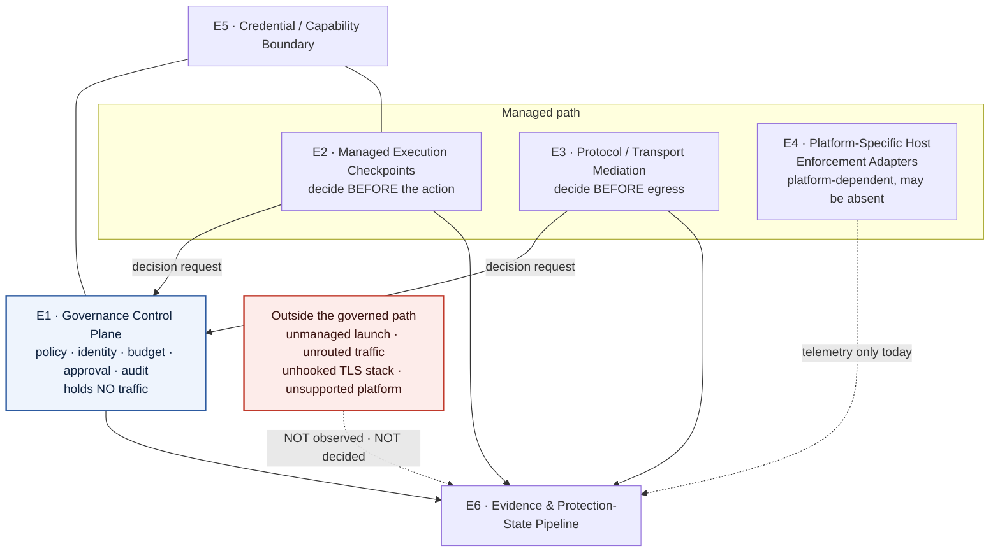

# ADR 0033: Canonical Governance & Enforcement Architecture

**Status**: Accepted
**Date**: 2026-08
**Ticket**: [AAASM-5604](https://lightning-dust-mite.atlassian.net/browse/AAASM-5604) (Epic [AAASM-5526](https://lightning-dust-mite.atlassian.net/browse/AAASM-5526))

This ADR is the **canonical architecture source** for how Agent Assembly governs and
enforces AI-agent behaviour. It replaces the "three universal interception layers"
framing — the fixed `SDK → Proxy → eBPF` pipeline — with six named architectural
elements, and it separates the **logical** architecture from the **deployment**
topology and from **platform-specific** implementation mechanisms. It fixes the
placement of the gateway as a control-plane/runtime service rather than a fourth
interception layer, and it re-describes Linux eBPF as *one possible implementation
mechanism* behind a Platform-Specific Host Enforcement Adapter rather than as the
abstraction itself.

It **complements and does not supersede**
[ADR 0002](0002-sdk-security-boundary.md) (the SDK is not a security boundary),
[ADR 0004](0004-governance-enforcement-flow.md) (all client↔core governance traffic
crosses the single `aa-sdk-client` transport boundary),
[ADR 0015](0015-dlp-trust-boundary-and-redaction-semantics.md) (fail-closed
redaction),
[ADR 0018](0018-canonical-runtime-verdict-and-enriched-decision-record.md) (the
five-way `RuntimeVerdict`),
[ADR 0029](0029-capability-over-permission-derivation.md) (declared vs. effective
capability),
[ADR 0030](0030-developer-integration-boundaries-and-trust-model.md) (developer
integration boundaries, the protection-state ladder and its evidence rules) and
[ADR 0032](0032-local-first-sensitive-data-provider-architecture.md) (local-first
sensitive-data detection). Where any of those ADRs states a mechanism, this ADR
places that mechanism in the canonical model; it does not restate or relax it.

It deliberately does **not** define documentation source-of-truth, claim-precedence
or waiver rules. Those are owned by
[AAASM-5621](https://lightning-dust-mite.atlassian.net/browse/AAASM-5621) and its ADR.
This ADR supplies the *architecture vocabulary* that the documentation-governance
model will police; it does not police documentation itself.

---

## Context

### What the superseded model asserts

The current material states the model as a fixed, ordered pipeline. From
`docs/src/introduction/three-layer-model.md:1-9`: *"Agent Assembly intercepts agent
actions at **three independent layers**, each catching what the layers above it
might miss."* The same page orders them *"lowest latency first, highest detection
authority first"* and describes layer 3 as catching *"Everything else, including
bypass attempts."* `docs/src/architecture/README.md:32-40` renders it as a single
`3 interception layers (SDK · proxy · eBPF)` box feeding the runtime. The repository's
own `CLAUDE.md` and `.claude/CLAUDE.md` repeat it, and `README.md` carries it to every
first-time reader.

### Why it is wrong

The model is not merely imprecise; each of its load-bearing claims is contradicted by
the implementation.

1. **It conflates a logical role with an implementation mechanism.** "eBPF" is a Linux
   kernel facility, not an architectural role. Naming the layer after the mechanism
   makes the architecture untranslatable to any platform that lacks that mechanism —
   which is every platform except Linux.

2. **It presents a Linux-only, x86_64-only mechanism as the universal final layer.**
   `aa-runtime` depends on `aa-ebpf` only under
   `[target.'cfg(target_os = "linux")'.dependencies]` (`aa-runtime/Cargo.toml:81-82`).
   Off Linux every loader entry point returns
   `EbpfError::ProgramLoad("eBPF is only supported on Linux")`
   (`aa-ebpf/src/loader.rs:90-93`, `:128-131`, `:530-533`, `:578-581`, `:630-634`) and
   the runtime emits a `LayerDegradation` (`aa-runtime/src/runtime.rs:393-405`,
   `:492-506`, `:550-563`). Even on Linux the file-I/O kprobes attach exclusively to
   x86_64 syscall entry symbols — all fourteen targets in
   `aa-ebpf/src/kprobe.rs:145-160` are `__x64_sys_*`, and no `__arm64_sys_*` target
   exists anywhere in the eBPF crates. A "final layer that catches everything" is in
   fact a mechanism available on one OS and one CPU architecture.

3. **It implies a fixed ordered pipeline where the code models an independently
   probed capability set.** `aa-runtime/src/layer.rs:10-21` defines `LayerSet` as a
   *bitflag*, and `LayerDetector::detect` (`:164-179`) probes each member
   independently: eBPF requires kernel ≥ 5.8, a BTF blob at `/sys/kernel/btf/vmlinux`,
   and a reachable privileged loader-daemon socket (`:133-135`); the proxy requires
   Linux-or-macOS and an `aa-proxy` binary on `$PATH` (`:142-145`); SDK is recorded as
   *"always available"* (`:19`, `:169`). There is no ordering, no fall-through, and no
   guarantee that any given member is present. Absent members are not "covered by the
   layer below" — they are simply absent.

4. **It implies uniform prevention authority.** The three named layers do not have
   comparable authority, and two of them cannot prevent anything at all:
   - Every TLS, file-I/O and exec eBPF program is observe-only and returns `0` after
     submitting telemetry (`aa-ebpf-probes/src/syscall_guard.rs:3-4`). The path
     blocklist sets an alert bit and lets the syscall proceed
     (`aa-ebpf-probes/src/main.rs:119-121`; `aa-ebpf-probes/src/maps.rs:94-95`:
     *"this layer is **OBSERVE-ONLY** (it sets an alert flag; it does not deny)"*).
     `PathVerdict::Deny` (`aa-ebpf/src/maps.rs:16`) is a misleading name for an event
     trigger.
   - The single enforcing program, the syscall guard, does not perform a synchronous
     deny. It sends `bpf_send_signal(SIGKILL)`
     (`aa-ebpf-probes/src/syscall_guard.rs:174-176`, `:193-195`), and its own
     documentation records the consequence (`:55-60`): *"the offending syscall still
     executes once before the task dies — a single `connect`/`sendto`/`write`/`unlink`
     can land. A truly synchronous deny (return `-EPERM` before the handler runs) needs
     seccomp-BPF or an LSM `bpf_lsm` hook, which is out of scope here."* No `bpf_lsm`
     hook, `SEC("lsm/…")` program or `bpf_override_return` call exists in the tree.
   - `aa-gateway` has no dependency on `aa-ebpf`. No eBPF signal is consulted in any
     allow/deny decision; eBPF events terminate in the audit publisher and the
     correlation engine.

5. **It leaves the gateway unplaced**, which invites readers to file it as a fourth
   interception layer. The gateway does not intercept anything: it holds the policy
   source of truth, the agent registry, budgets, approvals and audit, and it answers
   decision requests. Interception happens elsewhere and is *routed to* it.

6. **It presents self-reported availability as coverage.** `AA_LAYERS`
   (`aa-runtime/src/layer.rs:182-197`) replaces the entire probe result with an
   environment variable. `probe_proxy` is satisfied by a binary being on `$PATH`
   (`:142-145`), which says nothing about whether any traffic is routed through it.
   `SDK` is asserted unconditionally, whether or not any agent adopted it.

### The constraint that forces the design

Two facts cannot both be accommodated by a single ordered pipeline:

- **Coverage is a property of the deployment, not of the product.** Whether an action
  is governed depends on whether the process was launched onto a managed path, whether
  its traffic was routed through the mediator, whether the platform has a host adapter,
  and whether that adapter is healthy. Every one of those is a per-host, per-tool,
  per-launch fact.
- **Different mechanisms decide at different times relative to the action.** A
  pre-execution wrapper decides *before*; a transport mediator decides *before egress
  but after the caller committed*; the syscall guard reacts *after the syscall ran*;
  an audit consumer learns *afterwards*. Collapsing these into "layers" of one pipeline
  erases the distinction that determines what may truthfully be claimed.

An architecture description that cannot express "this mechanism is absent on this
platform" or "this mechanism detects but does not prevent" will keep producing
overstated claims, because the vocabulary has no way to state the limitation.

### Threat model

Three adversaries want different answers from this architecture.

| Adversary | Capability | What must still hold |
| --- | --- | --- |
| **An unmanaged process** — an agent that never adopted the SDK, was not launched through `aasm run`, or had its proxy environment removed | Runs as the developer's own UID; can unset `HTTPS_PROXY`, use a TLS stack the uprobes do not hook (Go `crypto/tls`, Node's statically linked BoringSSL — `aa-ebpf-probes/src/ssl_probes.rs:19-27`), or simply never link the SDK | The product must report this as **outside the governed path**, not as governed. Absence of an event must never render as absence of activity. |
| **A steered agent inside the boundary** (the ADR 0015 adversary) | Controls payload content; may try to make the product *report* protection it does not have | Reported protection state must never exceed the evidence (ADR 0030 §4.2). Missing evidence resolves downward. |
| **An evaluator misled by the product's own description** | Reads the website, Docs Hub or repo README and provisions on that basis | Every claim must name its platform, its decision timing and its failure posture. A reader must not be able to conclude "eBPF catches bypass attempts on my Mac" or "this cannot be bypassed" from any published sentence. |

The third adversary is the one this ADR exists for. The other two are already
addressed by ADR 0015 and ADR 0030; this ADR ensures the architecture *vocabulary*
does not undo them.

The developer's own UID is not an adversary here — consistent with ADR 0030, host-level
tamper prevention against the user's own account is an explicit non-goal.

---

## Decision

### 1. The canonical model is six elements, not three layers

Agent Assembly's governance architecture is described by the following six elements.
They are **roles**, not products, not crates and not an ordered pipeline. A deployment
instantiates some subset of them; which subset is a deployment fact, and the product
must report it rather than assume it.

| # | Element | What it is | Implemented today by | Availability |
| --- | --- | --- | --- | --- |
| **E1** | **Governance Control Plane** | The authority that holds policy, identity, budgets, approvals and audit, and answers decision requests. Holds no traffic. | `aa-gateway` (gRPC: `PolicyService`, `AgentLifecycleService`, `AuditService`, `ApprovalService`, `SecretsService`, `TopologyService`, `InvalidationService` — `aa-gateway/src/server.rs:22-28`), `aa-api` (HTTP/OpenAPI read surface), `aa-storage*` | Platform-independent |
| **E2** | **Managed Execution Checkpoints** | Points on a *managed path* where an action is presented for a decision before it runs. | `aa-runtime`'s `handle_policy_query` (`aa-runtime/src/pipeline/mod.rs:159-175`, body `:407-542`); `aa-sdk-client::query_policy` + `resolve_decision` (`aa-sdk-client/src/client.rs:247-279`, `decision.rs:58-95`); `aasm run` managed launch (`aa-cli/src/commands/run.rs`); `aa-sandbox` for WASM-marked tools | Checkpoint reachable only if the agent opts in (see §4) |
| **E3** | **Protocol / Transport Mediation** | A mediator placed on the wire that can refuse, redact or rewrite a request before it leaves the machine. | `aa-proxy` — CONNECT-time egress control, in-tunnel host re-check, credential/DLP scan, MCP `tools/call` adjudication | Unix only; see §5 |
| **E4** | **Platform-Specific Host Enforcement Adapters** | The *abstraction* for OS-level mediation of processes, files, syscalls and TLS. Each platform needs its own mechanism, and a platform without one has none. | **Linux:** eBPF via the privileged `aa-ebpf-loaderd` (`aa-ebpf/src/bin/loaderd.rs`). **macOS:** CA-trust-store integration only (`aa-proxy/src/tls/keychain.rs`), plus an opt-in root-owned managed-settings write. **Windows:** none. | Per-platform; see §5 |
| **E5** | **Credential / Capability Boundary** | What a component is *allowed to ask for*, and how a credential or capability is bound to an identity. | `aa-security` (scanner, redaction, canonical policy AST — a leaf crate with no inherent authority); `credential_token` validation in `PolicyService::check_action` (`aa-gateway/src/service/policy_service.rs:1623-1625`); `did:key` registration (ADR 0004); DI-API capability tokens and the compile-time `aa-devtool-contract` boundary (ADR 0030) | Platform-independent |
| **E6** | **Evidence & Protection-State Pipeline** | How a protection *claim* is substantiated, degraded, and reported. | ADR 0030 §4's protection-state ladder; adjudication reported by the component that actually decided (`aa-proxy/src/probe_adjudication.rs:1-14`); audit publication; `LayerDegradation` reporting | Platform-independent |

Two structural rules follow, and they are the point of the model:

- **An element may be absent.** Absence is a reportable state (E6), never a silent
  fall-through to another element. There is no "layer below" that picks up what an
  absent element would have done.
- **An element's authority is a property of the element, not of the model.** E1 decides
  but holds no traffic. E3 holds traffic and can refuse it. E4's Linux implementation
  today mostly observes. Nothing in the model implies that these are interchangeable.

### 2. The Governance Control Plane is not an interception layer

`aa-gateway` is a **control-plane / runtime service**. It is a request/response policy
oracle: `PolicyService::check_action` (`aa-gateway/src/service/policy_service.rs:1599`)
→ `PolicyEngine::evaluate` (`aa-gateway/src/engine/mod.rs:946`, routing to
`evaluate_primary` or `evaluate_with_cascade` at `:974-978`). The agent's bytes never
traverse it.

`check_action` is a real decision pipeline, not a logger — credential-token validation
short-circuits to `Deny` (`policy_service.rs:1623-1625`), observe-mode applies a shadow
transform (`:1646-1648`), approval submission blocks (`:1652-1657`), anomaly detection
can be promoted to a hard `Deny` (`:1662-1663`), atomic budget reservation can `Deny`
(`:1669`), and agent suspension is enforced (`:1700`).

But its Deny stops nothing by itself. **The gateway prevents only transitively, and is
exactly as strong as the caller that blocks on its answer:**

| Caller | Blocks on the answer? | Consequence of `Deny` |
| --- | --- | --- |
| `aa-proxy` (`proxy/mod.rs:433-484`) | Yes, synchronously, before dialling upstream | Bytes do not leave the machine. This is the strongest binding in the system. |
| `aa-runtime` `handle_policy_query` (`pipeline/mod.rs:452-487`) | Yes | A `Deny` is returned to the SDK — which must then honour it (§4). |

Therefore: **the gateway is E1 and only E1.** Describing it as a fourth interception
layer misstates both what it holds (no traffic) and what it can do alone (nothing to
the traffic). Conversely, describing the interception elements without the gateway
misstates where the decision is actually made.

### 3. Three views, kept distinct

Most of the confusion this ADR corrects comes from collapsing three different pictures
into one diagram. They must be published separately and labelled.

#### 3.1 Logical view — roles and the decision relationship

The dashed edge from E4 is not a drafting shortcut: on Linux today the host adapter
feeds the evidence pipeline and is **not** consulted in any allow/deny decision (§5.1).

#### 3.2 Deployment view — what is actually running

The deployment view answers "which processes exist on this host, and what is wired to
what". It is the only view in which coverage can be assessed, because coverage depends
on process launch and traffic routing, not on architecture.

| Process | Role | Present when |
| --- | --- | --- |
| `aa-gateway` | E1 | Operator runs it (local or remote mode) |
| `aa-runtime` | E2 chokepoint; UDS server at `/tmp/aa-runtime-{agent_id}.sock` (`aa-runtime/src/ipc/server.rs:38`) | Operator runs it |
| `aa-proxy` | E3 | Binary on `$PATH` **and** started (`aasm proxy start`, PID file at `$AA_DATA_DIR/proxy.pid` — `aa-cli/src/commands/proxy/pid.rs:55-65`) or spawned by `aa-runtime` |
| `aa-ebpf-loaderd` | E4 (Linux) | Linux, privileged, socket present at `/run/aa-ebpf-loaderd.sock` |
| The agent / dev tool process | The governed subject | Launched by the operator — **on or off the managed path** |

`LayerDetector::detect` (`aa-runtime/src/layer.rs:164-179`) reports a *deployment* fact,
and reports it weakly: `probe_proxy` is satisfied by `which::which("aa-proxy")`
(`:142-145`), and `AA_LAYERS` (`:182-197`) overrides the probes entirely. A detected
layer set is therefore **an availability hint, not evidence of coverage** (§7).

#### 3.3 Platform-specific view — mechanisms, per OS

This view must never be merged into the logical view, because a mechanism named in it
does not exist on every platform. See §5 for the verified matrix.

### 4. Governed path and outside-boundary semantics

**Definition.** An action is on the **governed (managed) path** when, before it takes
effect, it is presented to a checkpoint (E2) or a mediator (E3) that is configured to
consult the control plane (E1) and to honour the answer.

An action is **outside the boundary** when any link in that chain is missing. The
verified ways this happens today:

| Condition | Mechanism | Evidence |
| --- | --- | --- |
| The agent never calls the checkpoint | `query_policy` is a voluntary call over UDS; a non-cooperating process simply does not make it | `aa-sdk-client/src/client.rs:247-279` |
| The SDK's answer is not honoured | `resolve_decision` has **no in-tree caller that refuses to execute**; refusal lives in the out-of-repo FFI shims | `aa-sdk-client/src/decision.rs:32-33`: *"The SDK remains **advisory** … This is a defense-in-depth posture, not the primary gate."* |
| Traffic is not routed to the mediator | `HTTPS_PROXY` is injected only on the managed launch path; an ambient or removed value changes coverage | `aa-cli/src/commands/run.rs:322-326`; adapters at `aa-devtool-codex/src/lib.rs:301`, `aa-devtool-windsurf/src/lib.rs:312`, `aa-devtool-claude-code/src/lib.rs:379` |
| The tool has no managed launch at all | `aa-devtool-copilot::build_launch_command` returns `AdapterError::LaunchFailed` (`src/lib.rs:347-354`); `aa-devtool-saas` is hard-capped at `L1Observe` (`src/adapter.rs:66,121`) | No proxy env is injected, so no data-path mediation exists for these tools |
| The host is mediated but the destination is not inspected | `llm_only` defaults to **true**: any host outside the built-in LLM set or operator `mitm_hosts` is **transparently tunnelled, uninspected** | `aa-proxy/src/proxy/mod.rs:1058-1061`; `aa-proxy/src/config.rs:346` |
| The TLS stack is not hooked | The uprobes hook only OpenSSL `SSL_read`/`SSL_write`; Go `crypto/tls` and Node's statically linked BoringSSL expose no such symbols | `aa-ebpf-probes/src/ssl_probes.rs:19-27` |
| The platform has no host adapter | macOS and Windows — §5 | — |

**The semantic rule.** For anything outside the boundary the product knows *nothing*.
It must not report the action as allowed, as clean, or as absent. The only truthful
report is that the action was **not observed** and its governance state is
**Unmeasured**. This is ADR 0030 §4.2 rule 2 ("missing evidence lowers the state, never
raises it") applied to the architecture as a whole.

Correspondingly, an empty audit log is evidence about the *observer*, not about the
agent.

