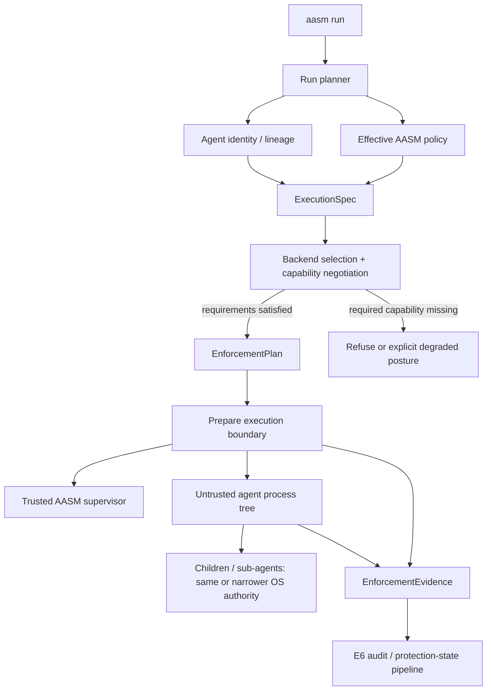

# ADR 0035: Agent Execution Isolation & Pluggable Enforcement Backends

**Status**: Proposed
**Date**: 2026-08
**Ticket**: [AAASM-5703](https://lightning-dust-mite.atlassian.net/browse/AAASM-5703) (Epic [AAASM-5702](https://lightning-dust-mite.atlassian.net/browse/AAASM-5702))

This ADR defines how Agent Assembly turns a governed launch into an **evidence-backed
execution boundary** for an untrusted AI-agent process tree. It makes `aasm run` the
canonical managed-execution front door, separates whole-agent native isolation from the
existing WASM/WASI tool sandbox, and establishes a backend-neutral contract so one AASM
policy can be lowered into different enforcement substrates without making any substrate
the policy model.

It **complements and does not supersede**
[ADR 0033](0033-canonical-governance-and-enforcement-architecture.md). ADR 0033 remains
the canonical source for the six architectural elements and for truthful claims about
decision timing and evidence. This ADR occupies the execution-specific part of that
model:

- **E2 · Managed Execution Checkpoints** — `aasm run` resolves the launch and its
  required capabilities before the untrusted process starts.
- **E4 · Platform-Specific Host-Level Interception Adapters** — a concrete isolation
  backend realizes the OS/runtime-specific restrictions it actually supports.
- **E5 · Credential / Capability Boundary** — the launched process receives only the
  ambient authority and delegated capabilities its execution plan permits.
- **E6 · Evidence & Protection-State Pipeline** — the product reports requested,
  planned, achieved and unmeasured controls separately; backend availability is never
  evidence of enforcement by itself.

The existing [`aa-sandbox`](../../../aa-sandbox/README.md) remains the WebAssembly/WASI
sandbox for **individual WASM-marked tool executions**. This ADR defines a different
boundary: confinement and supervision of the **agent's native process and descendants**.
The two mechanisms may be composed but must never share a name or claim merely because
both use the word "sandbox".

---

## Amendment — AAASM-5751 (2026-08-14): filesystem path scope becomes policy-expressible

**Scope of this amendment: one decision below gains a concrete policy node, and one
recorded fact about the schema is corrected. No decision is reversed or superseded.**

### Why an amendment rather than a new ADR

The *principle* was already decided here. [Backend capability
examples](#backend-capability-examples) states that the capability vocabulary must
distinguish **"Filesystem | read/write/create/delete scope"**, and
[decision 3](#3-isolation-class-is-not-backend-identity) states that policy describes
required isolation properties portable across backends. Adding a filesystem path-scope
node executes a decision this ADR already made; recording it as a *new* ADR would fork
the record for a question that is already answered.

It is not "no ADR action" either. Until AAASM-5751, no policy node could name a path, so
`aa_isolation::lowering` reported both filesystem domains at
`ScopeGranularity::WholeDomainOnly` and its module documentation said the schema carried
"no path scope". Shipping the node makes that recorded text false, and a decision record
that has gone stale is worse than one that never existed.

It amends **this** ADR and not [ADR 0033](0033-canonical-governance-and-enforcement-architecture.md):
0033 stays the canonical source for the §6 claim vocabulary, which this amendment does not
touch, and it carries a separate open amendment under AAASM-5654. Two concurrent edits to
0033 would conflict for no benefit — nothing here needs a §6 term that does not already
exist.

### What is now expressible

A `filesystem:` section on the policy `spec`, with an operator-authored allow-list of
absolute path prefixes per verb:

```yaml
spec:
  filesystem:
    read:
      allow: ["/workspace", "/usr/share/dict"]
    write:
      allow: ["/workspace/build"]
```

Normative reading of the three states, which must not collapse into one:

| Authored form | Meaning | Lowers to |
| --- | --- | --- |
| Section absent | The operator stated nothing about paths. **Not a grant.** | `DomainCoverage::NotStated`; no requirement from this node |
| `allow:` present and non-empty | Only these subtrees may be reached; everything else must be prevented | `Lowered { granularity: Enumerated }`, `RequirementScope::Selectors` |
| `allow:` present and empty | A restriction is in force and permits nothing — the **most** restrictive posture | `Lowered { granularity: WholeDomainOnly }`, `RequirementScope::Whole` |

An empty `allow:` deliberately reads as deny-all rather than as "no restriction". That
matches `aa_policy::check_network_egress`'s live treatment of an empty egress allowlist
and refuses to repeat the canonical `NetworkPolicy` doc-comment's opposite reading, which
is the fail-open shape AAASM-3728/AAASM-3730 already had to close once.

A whole-domain capability denial (`capabilities.deny: [file_read]`) outranks the path
allow-list, exactly as a `network_outbound` denial outranks `network.allowlist`: lowering
the narrower node under a broader denial would emit a requirement permitting paths the
same document forbids.

Across a policy cascade the merge is **most-restrictive-wins**: the effective permitted set
is the *intersection* of every tier that declared the node, computed over path subtrees
rather than over strings, so a narrower tier can only ever shrink a broader one. A cascade
carrying **no documents at all** is a refusal, not an empty intersection —
[ADR 0024](0024-empty-cascade-semantics.md) §6(2) already settled that an absent cascade is
*Unconfigured*, never permission.

### What deliberately remains unrepresentable

`NameResolution`, `Ipc`, `Credential` and `Resource` keep reporting
`DomainCoverage::PolicyCannotExpress`. This is recorded as **accepted, measured risk**,
not as a set of domains nothing could use: measured against the Sandlock backend's
`capability.rs`, `Ipc` and `Credential` are `Mediation::Enforce` with
`SupportLevel::Partial` and `Resource` is `Mediation::Enforce`, so for those three the
backend can enforce something an operator has no way to ask for. They stay unexpressed
because no acceptance criterion under Epic AAASM-5702 requires operator-authored control
of them, and ambient credential authority is handled procedurally by AAASM-5709 rather
than as a policy node. Speculative schema is a public contract that cannot be withdrawn;
a named gap can be closed at any time.

Two sources of paths that already exist in the codebase were examined and **rejected** as
policy sources:

- `SENSITIVE_MUTATION_DENY_DEFAULTS` (`aa-security/src/policy/ebpf.rs`) is the eBPF
  layer's own implementation floor, not something an operator wrote. Consuming it would
  make one backend's lowering the policy semantics, which
  [decision 2](#2-aasm-owns-the-execution-contract-backends-own-mechanism-specific-realization)
  forbids.
- `tools[].requires_approval_if` path prefixes *are* operator-authored, but they mean
  **approval**, not denial. A confined process has no approval channel, so lowering them
  to a prevention requirement would silently convert "ask a human" into a hard block.
  Stronger than what the operator wrote is still wrong.

### Consequence for existing text

Where this ADR and code derived from it describe filesystem policy as a whole-domain
boolean, that description is superseded **for path scope only**. The remaining filesystem
gaps this ADR names are unchanged and still reported per domain: create/rename/write and
delete are not separable verbs, and the backend's own sensitive-path defaults are still
not re-derived as policy.

---

## Context

Agent Assembly already owns the governance semantics above execution: agent identity and
lineage, organization/team policy, approvals, budgets, MCP governance, sensitive-data
controls, developer-tool integration, transport mediation, audit and evidence-backed
protection state. `aasm run` already performs a managed launch for supported AI developer
tools: it resolves policy, registers an identity, applies managed settings and proxy
configuration, builds the child environment, starts the child and supervises lifecycle.

What it does **not** currently establish is a general synchronous OS-enforced boundary
around the whole native process tree. A child that is not mediated by an SDK or proxy can
still exercise capabilities exposed by its host identity unless another host mechanism
constrains them. Linux eBPF improves evidence and detection, but ADR 0033 records that its
current file/TLS/exec probes are observational and its opt-in syscall guard terminates
asynchronously. The source says so in-code: *"`bpf_send_signal` is asynchronous; the
SIGKILL lands at the next signal-check point, so **this** syscall still runs once before
the task dies"* (`aa-ebpf-probes/src/syscall_guard.rs:189-192`). Under ADR 0033 §6 that
mechanism reaches **Detected**, not **Denied before execution**, and the two are not
interchangeable.

The security requirement is therefore not "put the agent in another process". A parent
process is not a security boundary by itself. The requirement is that a **trusted
supervisor establishes kernel/runtime-enforced restrictions before executing the
untrusted child**, and that those restrictions cover descendants according to explicit
inheritance semantics.

The product requirement is also not "build another sandbox". Sandlock, seccomp/Landlock,
gVisor, Firecracker and future platform mechanisms solve different portions of execution
isolation. Re-implementing all of them would duplicate mature low-level work while still
leaving Agent Assembly's higher-level questions unanswered: which agent is acting, under
which policy, which capabilities are required, which controls were actually applied, and
what evidence justifies the UI or audit claim.

### The commercial constraint

Agent Assembly is an open-core product with commercial extensions. A backend strategy
must therefore preserve a clean product boundary between AASM-owned governance semantics
and third-party isolation implementations. Built-in or redistributed backends should
prefer permissive licenses (for example Apache-2.0/MIT/BSD) and carry explicit
third-party notices, provenance and SBOM data. A backend with materially different
copyleft or service terms requires a separate product/legal decision; it must not enter a
proprietary distribution accidentally through an implementation shortcut.

### The performance and compatibility constraint

No isolation mechanism is universally best. Coding agents are unusually syscall- and
I/O-heavy: they traverse repositories, spawn compilers and test runners, use Git, package
managers and language toolchains, open many small files and maintain network sessions.
A stronger userspace-kernel or microVM boundary may impose a different compatibility or
performance cost than a process-level Landlock/seccomp boundary. Conversely, a process
sandbox shares more host-kernel attack surface than a userspace kernel or VM.

Consequently, **performance and compatibility are measured backend properties**, not
architecture claims. The product must not encode one mechanism as "strong" merely by
name, nor choose a universal backend without workload evidence.

---

## Threat model

The default threat model for this ADR is:

1. **The agent and all code it causes to execute are untrusted.** The agent may
   adaptively enumerate files, environment, network routes, metadata endpoints, IPC,
   sockets, credentials, process state and alternate execution paths.
2. **The host operator and AASM supervisor are trusted.** Protecting a machine from its
   own root/administrator account is not provided merely by this local execution model.
3. **The process tree is the minimum native execution security unit.** Threads share an
   address space and other process state and are not accepted as mutually hostile
   security domains.
4. **A descendant cannot gain broader authority by ordinary fork/exec.** Child and
   sub-agent processes remain at the same or narrower effective capability scope unless
   an explicit delegated-capability mechanism is introduced and evidenced.
5. **The absence of an event is not proof that the agent did nothing.** An unsupported,
   bypassed or uninstrumented path is reported according to ADR 0033/0030 evidence
   semantics, never inferred clean.

This ADR does not claim protection against a trusted host operator deliberately removing
AASM, replacing its binaries, changing the kernel, modifying a policy they are authorized
to modify, or otherwise exercising administrator ownership of the machine.

---

## Decision

### 1. `aasm run` is the canonical managed-execution front door

Agent Assembly will evolve the existing `aasm run` surface rather than create a separate
product-shaped `aasm sandbox run` command.

Existing developer-tool forms remain backward compatible:

```text
aasm run claude [args...]
aasm run codex [args...]
aasm run windsurf [args...]
```

A generic execution target will allow arbitrary agents/commands to enter the same
identity, policy, lifecycle, isolation and evidence flow. The exact CLI grammar is an
implementation/API review item; the intended shape is equivalent to:

```text
aasm run exec -- python ai_agent_main.py
```

Isolation is a property of the run, not a separate lifecycle.

### 2. AASM owns the execution contract; backends own mechanism-specific realization

The durable contract consists of four conceptual objects (names may be refined without
changing their semantics):

- **`ExecutionSpec`** — the identity-bound, policy-derived statement of the process to
  run and the capabilities/resources it requires or forbids.
- **`CapabilitySet`** — a backend's machine-readable statement of what it can enforce,
  observe or cannot represent on this host/version.
- **`EnforcementPlan`** — the resolved lowering from `ExecutionSpec` to a selected
  backend, including unsupported/degraded requirements before launch.
- **`EnforcementEvidence`** — the post-prepare/runtime facts that justify which
  [ADR 0033 §6](0033-canonical-governance-and-enforcement-architecture.md#6-claim-vocabulary--decision-timing-and-failure-posture-are-part-of-every-claim)
  claim term the product may attach to each control for this run.

A concrete backend implements an internal contract equivalent to:

```rust
trait IsolationBackend {
    fn capabilities(&self) -> CapabilitySet;
    fn plan(&self, spec: &ExecutionSpec) -> Result<EnforcementPlan>;
    fn prepare(&self, plan: EnforcementPlan) -> Result<PreparedExecution>;
    fn spawn(&self, prepared: PreparedExecution) -> Result<ExecutionHandle>;
    fn evidence(&self, handle: &ExecutionHandle) -> EnforcementEvidence;
}
```

The trait shape above is illustrative; the semantic separation is normative.

A backend may use Sandlock, native Landlock/seccomp, gVisor, a microVM, an enterprise
host mechanism or a future platform adapter. None of those names appear in the canonical
AASM policy vocabulary merely because an implementation uses them.

### 3. Isolation class is not backend identity

User/product policy describes the **required isolation properties**, not the preferred
vendor or mechanism. AASM may expose stable requirement classes such as process,
userspace-kernel, microVM/hardware-backed or automatic selection, but a class is not a
promise that one named backend will always implement it.

Concrete backend selection is an execution-plan fact. Advanced diagnostics may expose or
pin a backend for reproducibility, but ordinary policy should survive a backend change.

Backend replaceability is an **implementation property of this design, not the product
value**. What the product offers is *portable policy semantics* — one AASM policy that
keeps its meaning across execution substrates — together with the *evidence* that records
which controls that policy actually achieved on a given run. The backend interface exists
to preserve those two things. Material derived from this ADR must not present
pluggability itself as the benefit.

### 4. Capability negotiation happens before the untrusted process starts

The execution planner resolves policy requirements against the selected backend's actual
host capabilities before launch.

For every required control, planning resolves to exactly one outcome. This ADR does not
invent a parallel vocabulary for those outcomes: each maps onto a term already defined by
ADR 0033 §6, which stays authoritative for the terms themselves.

| Planning outcome | ADR 0033 §6 term the run may then claim |
| --- | --- |
| The backend has a mechanism that refuses the action before it takes effect | **Denied before execution** |
| The backend can report the action but cannot refuse it before effect | **Observed** / **Detected** |
| No applicable mechanism exists on this host, backend or backend version | **Unsupported** |
| A planned control is configured but unavailable, and posture permits proceeding | **Degraded**, carrying both the planned and the achieved level |
| Nothing inspected this action or payload | **Unmeasured** |

The following are normative:

- A required pre-effect control that the selected backend can only observe **must not be
  promoted to *Denied before execution***.
- The default for an unmet required capability is **refusal before launch**.
- ***Degraded*** is reachable only where policy or operator posture explicitly permits it,
  and it must carry both levels into E6 evidence and audit rather than presenting the run
  as equivalently protected.
- A backend that is implemented but not validated for production use is ***Experimental***;
  a control that is decided but not implemented is ***Planned*** and carries no capability
  claim. Neither may be reported as an achieved control.

### 5. The trusted supervisor stays outside the confined process tree

The AASM control/runtime process must not share the hostile process's security boundary in
a way that grants the child access to supervisor memory, privileged descriptors or
credentials simply because both participate in one launch.

Where process-level sandbox initialization requires post-fork/pre-exec work, implementation
should prefer a deliberately small and auditable launcher/helper boundary. Complex
Landlock/seccomp/namespace setup must not be casually accumulated in an async runtime's
`pre_exec` callback, where post-fork restrictions make ordinary allocation, locks and
library behavior unsafe or difficult to audit.

The target process and descendants execute inside the prepared boundary; the supervisor
coordinates lifecycle, evidence and policy outside it.

### 6. Descendant confinement is part of correctness

An agent that can escape merely by spawning a child has no meaningful process boundary.
Therefore an execution backend is not considered capable of a process/filesystem/network
restriction unless its semantics cover the descendant processes relevant to that
restriction, or the limitation is explicitly surfaced in `CapabilitySet` and evidence.

Sub-agent identity may become narrower or more specific at the governance layer, but
ordinary process creation must not widen OS capabilities.

### 7. `aa-sandbox` remains the tool sandbox

`aa-sandbox` continues to execute WASM-marked tools using Wasmtime/WASI controls such as
preopened filesystem paths, instruction fuel and memory limits. It is not renamed into or
silently reused as the whole-agent native process boundary.

A native agent may call a WASM tool inside `aa-sandbox`; that is composition of two
boundaries, not evidence that either one replaces the other.

### 8. Linux process isolation is the first implementation target; Sandlock is the first candidate backend

The first production experiment will target Linux process confinement using a
permissively licensed existing substrate rather than immediately reimplementing every
Landlock/seccomp edge case. Sandlock is the initial candidate because its process-based
model maps closely to the required trusted-supervisor/restricted-child shape and provides
useful Linux isolation primitives.

This is intentionally a **candidate implementation decision, not policy architecture**.
AASM may replace or supplement it with a native Linux backend after compatibility,
performance, security surface, release cadence and feature requirements are measured.

No Linux backend implies macOS or Windows support. Platform-specific mechanisms remain
separate E4 decisions and capability reports.

### 9. Ambient credentials are capabilities, not convenient environment

The execution plan must treat inherited credentials, sensitive environment variables,
open file descriptors, sockets and similar ambient authority as part of E5. The target
state is least-authority inheritance and brokered/delegated credentials where practical.

This ADR does not claim that credential brokering is complete. Existing credential and
secret-hardening work remains authoritative for its implementation. Until then, evidence
must distinguish credentials intentionally delegated to the child from ambient authority
that could not yet be removed.

### 10. Evidence is first-class output of execution

A successful process spawn is not evidence that every desired control was enforced.
`aasm run --dry-run` and runtime status will evolve to expose at least:

- requested isolation/capabilities;
- selected backend and backend version/provenance;
- planned controls, each with the ADR 0033 §6 term it is expected to reach;
- requirements resolved as **Unsupported** or **Degraded**, the latter naming the planned
  level alongside the achieved one;
- evidence sources available after prepare/start;
- the resulting launch posture: ready, refused or explicitly degraded.

The exact UI may evolve, but requested-versus-achieved separation is normative.

### 11. Backend provenance and license compatibility are release inputs

A distributed backend must have recorded license, source/version provenance, modification
status and SBOM/third-party-notice handling. Permissive dependencies are preferred for
built-in OSS/commercial distribution paths. A backend whose license or hosted-service
terms materially change the commercial obligations cannot be enabled as an equivalent
built-in implementation without review.

This requirement prevents implementation substitution from silently changing the legal
or distribution boundary of the product.

**Scope of this section.** It records an engineering and release-process requirement —
which facts a backend must carry, and which changes require review before it ships. It is
not legal advice and does not interpret any licence. Whether a particular licence or
hosted-service term is acceptable for a given distribution channel is a decision for the
product and legal owners; this ADR records that the question must be asked, not what the
answer is.

---

## Initial execution flow



Transport mediation, MCP decisions, DLP and WASM tool sandboxing remain composable
controls around this execution flow. The diagram does not turn them into one ordered
fallback pipeline; ADR 0033's independent-element rule still applies.

---

## Backend capability examples

The capability vocabulary must describe semantics rather than product names. Candidate
axes include:

| Capability | Required distinction |
| --- | --- |
| Filesystem | read/write/create/delete scope; pre-effect deny vs observation |
| Network | destination/port/protocol scope; DNS behavior; pre-egress deny vs observation |
| Syscall | synchronous errno/kill/trap/observe semantics |
| Process tree | fork/exec inheritance, maximum descendants, signal/control semantics |
| Resources | CPU, memory, PIDs, wall time, file size / descriptor limits |
| IPC | Unix sockets, shared memory, namespaces and inherited descriptors |
| Credentials | removed, delegated, brokered, visible-to-child or unmeasured |
| Platform boundary | shared host kernel, userspace kernel, guest kernel/microVM |
| Evidence | which ADR 0033 §6 term the control reaches, and whether that rests on configuration, an exercised code path or independent verification |

A single boolean `sandbox=true` or `supported=true` is insufficient.

---

## Alternatives considered

### Reimplement native Landlock/seccomp/namespaces immediately

Rejected for the first delivery. It would make low-level correctness and kernel corner
cases the critical path before AASM has validated its execution contract, CLI and policy
semantics. A native backend remains a valid later optimization or independence strategy.

### Hard-wire Sandlock into `aasm run`

Rejected. It would make an upstream implementation part of the product model, couple
policy vocabulary to one Linux mechanism, complicate macOS/Windows/server evolution and
increase exposure to upstream compatibility, release or license changes.

### Treat backend pluggability itself as the product moat

Rejected as positioning. Replaceability is an architectural advantage, but customers buy
the governance outcome: one policy, controlled capabilities and evidence across execution
environments. The backend interface exists to preserve that product contract.

### Treat current eBPF enforcement as equivalent to a process sandbox

Rejected. ADR 0033 §6 places the eBPF syscall guard at **Detected** plus asynchronous
termination, and explicitly not at **Denied before execution**; the guard's own source
records that the offending syscall runs once before the SIGKILL lands
(`aa-ebpf-probes/src/syscall_guard.rs:189-192`). A pre-effect confinement requirement is
therefore not satisfied by enabling the syscall guard, and evidence from one term of the
§6 vocabulary cannot be relabelled as a stronger one.

### Create `aasm sandbox run`

Rejected. It would split identity/policy/lifecycle semantics into competing launch paths
and make isolation appear optional or separate from governed execution. `aasm run` is
already the managed-launch surface and should be extended.

### Isolate an agent thread inside a trusted process

Rejected as a hostile-code boundary. Threads share process address space and substantial
state; the security unit here is a separately confined process tree.

### Require a microVM for every launch

Rejected as the universal default. MicroVMs can offer a stronger kernel boundary for
some workloads but impose deployment, startup, filesystem/toolchain and compatibility
costs that are inappropriate to assume for all local developer-agent runs. They remain a
future backend class for risk profiles that justify them.

---

## Consequences

### Positive

- AASM owns durable agent-execution semantics without reimplementing every isolation
  primitive.
- Backends can evolve or be replaced without changing organization/agent policy language.
- Local process isolation, server userspace-kernel isolation and future microVM execution
  can share one evidence and governance model.
- A failed or partial backend cannot truthfully appear equivalent to successful
  enforcement.
- The open-source/commercial boundary can be managed independently from a particular
  permissively licensed substrate.

### Costs

- Capability negotiation is more complex than a boolean sandbox flag.
- Every backend needs conformance, adversarial, compatibility and performance evidence.
- AASM must maintain backend-version and platform capability matrices.
- Cross-platform support remains uneven until platform-specific backends are actually
  implemented.
- Process isolation adds new packaging and third-party supply-chain responsibilities.

---

## Validation requirements

Before a backend can support a prevention claim:

- [ ] Each claimed capability has a precise decision-timing definition.
- [ ] Required-capability failure refuses launch or enters an explicitly permitted weaker posture.
- [ ] Descendant processes are covered or the limitation is surfaced before launch.
- [ ] Adversarial tests attempt direct filesystem, network, process, IPC and credential bypass paths.
- [ ] Negative controls prove the harness fails when an enforcement mechanism is removed/bypassed.
- [ ] Representative coding-agent performance/compatibility tests are recorded.
- [ ] Backend provenance, version, license and SBOM/notice requirements are recorded.
- [ ] E6 output never promotes **Observed**/**Detected** into **Denied before execution**, and never reports backend availability or configuration as an achieved control.

---

## Reconsideration triggers

Re-open this ADR when any of the following changes the durable contract:

1. A backend requires policy semantics that cannot be represented by `ExecutionSpec` or
   the capability model without naming the backend.
2. A production native-Linux backend replaces the initial third-party substrate and
   exposes a materially different trust or descendant model.
3. gVisor/userspace-kernel or microVM execution becomes a default rather than an optional
   risk-tier backend.
4. macOS Endpoint Security/App Sandbox or a Windows host mechanism becomes a production
   whole-agent execution boundary.
5. Root/admin-resistant managed-device protection becomes a product requirement.
6. Credential brokering changes the meaning of ambient authority available to the child.
7. Licensing or distribution constraints make a currently supported backend incompatible
   with an OSS or commercial channel.

---

## Implementation ownership

Implementation is tracked by Epic
[AAASM-5702](https://lightning-dust-mite.atlassian.net/browse/AAASM-5702). This ADR defines
the durable product/system decision; it does not prescribe branch/PR scheduling or CI
procedure. Those remain contributor workflow concerns under the repository's existing
process documentation.