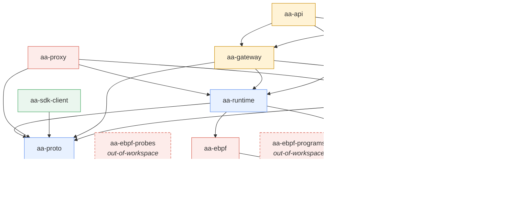
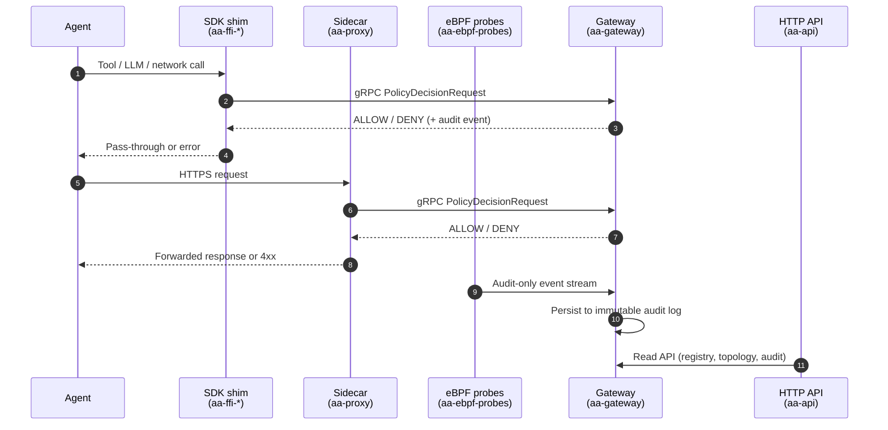
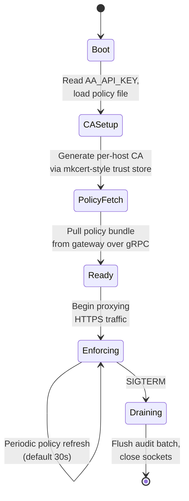
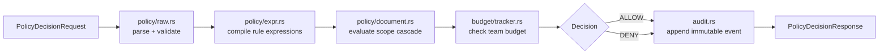

# Architecture Overview

This chapter describes how `agent-assembly` is composed and how its parts interact at runtime.

## Crate dependency graph

The Cargo workspace declares **29 member crates** in the top-level `Cargo.toml`; the diagram below highlights the core architectural crates (storage drivers, dev-tool adapters, and test harnesses are omitted for clarity). Two additional eBPF crates (`aa-ebpf-probes`, `aa-ebpf-programs`) live alongside but are intentionally outside the workspace because they compile for the `bpfel-unknown-none` BPF target — they are built by `aa-ebpf/build.rs` via `aya-build`. Edges in the diagram below are derived from `path` dependencies declared in each crate's `Cargo.toml`.

Dashed nodes are *out-of-workspace* — they cannot be selected with `cargo -p`. `aa-sdk-client` is the shared, FFI-agnostic SDK runtime-client (UDS transport, wire codec, lifecycle, and an optional `aa-security` advisory preflight) that the per-language FFI shims wrap; the Python, Node, and Go shims all live in the sibling `python-sdk` / `node-sdk` / `go-sdk` repos and consume it via a pinned git SHA (AAASM-2560/2561/2704), so none are workspace members. The monorepo no longer hosts any FFI shim.

## Three-layer interception model

`agent-assembly` enforces governance at three independently-deployable layers, ordered lowest-latency first and highest-detection-authority first:

| Layer | Crate(s) | Where it runs | Bypass risk | Tradeoff |
|---|---|---|---|---|
| **1 — In-process SDK** | `aa-wasm` (in-workspace) + the `aa-sdk-client`-based Python/Node/Go shims in the sibling `python-sdk` / `node-sdk` / `go-sdk` repos | Inside the agent process | Highest (agent could skip the SDK) | Fastest path; requires SDK adoption |
| **2 — Sidecar proxy** | `aa-proxy` | Adjacent process / sidecar container | Medium (network egress only) | Catches everything routed through the proxy without code changes |
| **3 — eBPF** | `aa-ebpf`, `aa-ebpf-common`, `aa-ebpf-probes`, `aa-ebpf-programs` | Linux kernel | Lowest (catches bypass attempts) | Linux-only; requires elevated privileges |

Layers compose: a deployment can run any subset. Audit events from each layer carry the same wire format defined in `aa-proto`, so the gateway sees a single unified view regardless of which layer produced an event.

## IPC flow

The gateway is the central control plane. Each interception layer reaches it through a different transport, but all messages share the protobuf schema in `aa-proto`:

- **SDK ↔ Gateway**: synchronous gRPC over Unix domain socket (default `/tmp/aa-runtime-<agent-id>.sock`) or TCP for cross-host deployments. Request and response types live in `aa-proto`.
- **Proxy ↔ Gateway**: same gRPC client surface as the SDK; the proxy adapts inbound HTTPS into `PolicyDecisionRequest` calls.
- **eBPF ↔ Gateway**: one-way audit events; eBPF cannot block in-kernel for bypass-detection use cases — it observes and forwards.
- **API ↔ Gateway**: in-process — `aa-api` depends on `aa-gateway` directly and exposes its read APIs over HTTP via `utoipa`.

## Sidecar lifecycle

`aa-proxy` runs as a sidecar adjacent to the agent. Its lifecycle has five phases:

| Phase | What happens |
|---|---|
| **Boot** | Read environment (`AA_API_KEY`, `AA_GATEWAY_ADDR`, `AA_AGENT_ID`) and the policy file at `/etc/aa/policy.toml` (or `AA_POLICY_PATH`). |
| **CA Setup** | Generate or load a per-host CA used to MitM HTTPS for governed destinations. The agent must trust this CA — the docker-compose example mounts it from a shared volume. |
| **Policy Fetch** | Open a gRPC stream to `aa-gateway`; receive the active policy bundle. Cache locally for offline survivability. |
| **Enforcing** | Forward outbound HTTPS, calling `PolicyDecisionRequest` on the gateway for governed action types. Allowed traffic is re-encrypted with the upstream certificate the proxy verified itself. |
| **Draining** | On `SIGTERM`, stop accepting new connections, finish in-flight requests, flush the audit batch, then exit. |

A readiness probe is exposed at `http://localhost:8080/ready` throughout the Enforcing phase (this is the endpoint the docker-compose healthcheck polls).

## Policy evaluation path

When `aa-gateway` receives a `PolicyDecisionRequest`, it walks four stages before returning a decision. The implementation lives under [`aa-gateway/src/policy/`](https://github.com/AI-agent-assembly/agent-assembly/tree/master/aa-gateway/src/policy):

1. **Parse + validate** — `policy/raw.rs` deserialises the active policy bundle (TOML or YAML) and `policy/validator.rs` enforces structural invariants such as scope wellformedness and unique rule names.
2. **Compile** — `policy/expr.rs` turns rule predicates into a typed expression tree the engine can evaluate against the request's `ActionType`, target, and labels.
3. **Evaluate scope cascade** — `policy/document.rs` walks scopes in `org → team → agent → tool` order and applies a *most-restrictive-wins* merge. Cycle detection prevents circular delegation.
4. **Budget check** — `budget/tracker.rs` consults the per-team budget (using `budget/pricing.rs` cost tables); a request that would breach the budget downgrades from `ALLOW` to `DENY`.
5. **Audit** — every decision (allow or deny) is appended to the immutable audit log via `audit.rs`. The reader API is exposed by `audit_reader.rs` and surfaced over HTTP by `aa-api`.

Latency targets and current p99 measurements live in the [Benchmarks — Policy Check p99](benchmarks/policy-check-p99.md) chapter.
