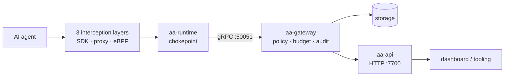

# Architecture

This chapter is the engineering map of `agent-assembly` — the open-source core
that governs AI agents by intercepting their actions at three independent layers
and routing every action through one central **gateway**.

It is written for contributors and integrators who want to understand *how the
system is built*, not just how to operate it. For the system-level overview,
see [System architecture](system-architecture.md); for the
security rationale, see the [Security Model](../security/overview.md).

## Pages in this chapter

- **[System architecture](system-architecture.md)** — the big picture: the 28
  workspace crates, the three interception layers, the gateway / API / runtime /
  storage split, and the gRPC / HTTP / UDS transport topology, with a mermaid
  system diagram.
- **[Component deep-dives](components.md)** — a per-crate tour of responsibilities,
  key types, and dependencies: gateway, policy engine, budgets, runtime, the
  three interception crates, API, CLI, foundation crates, storage, and cache.
- **[Key workflows](workflows.md)** — policy evaluation, agent registration,
  budget tracking & rollup, and the interception/enforcement path, each as a
  mermaid sequence or flow diagram grounded in the real code path.
- **[Data flows](data-flows.md)** — how an intercepted event travels from a layer
  through the gateway, the policy engine, and the write-boundary sanitizer into
  durable, tamper-evident storage.
- **[Building & contributing](building.md)** — build, test, and lint basics for
  working on the workspace.

## The model in one diagram

Start with [System architecture](system-architecture.md).
