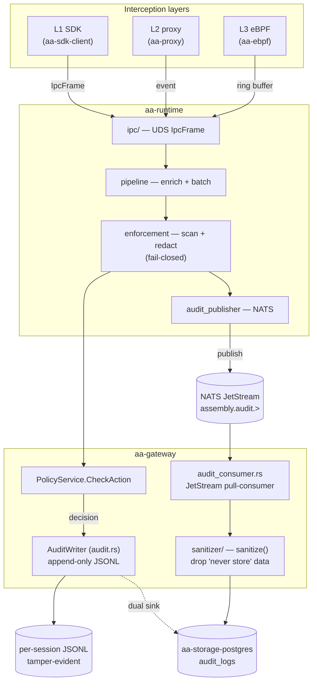
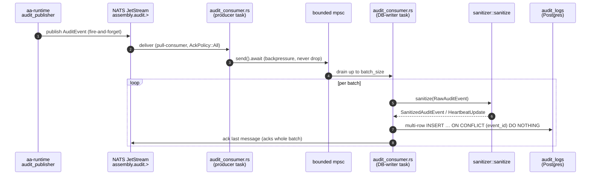
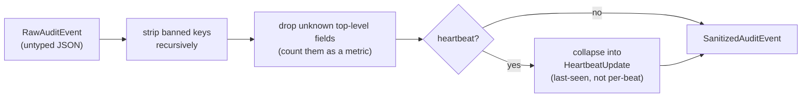
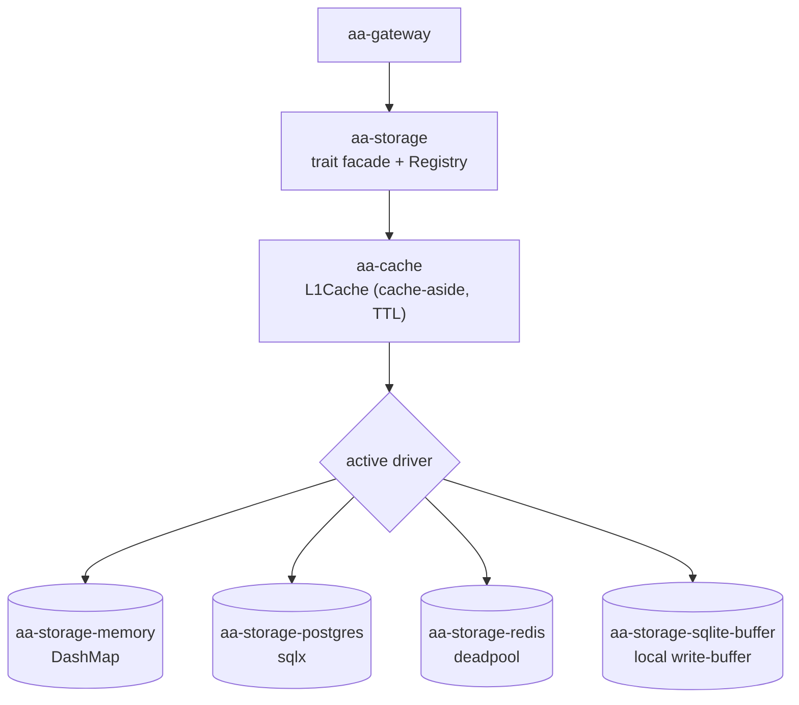

# Data flows

This page follows the **data** — not the control decisions — through the system:
how an intercepted event becomes a decision, then a durable, tamper-evident
audit record. For the decision logic itself, see [Key workflows](workflows.md);
for the trust view, see the [Security Model](../security/audit-assurance.md).

---

## End-to-end: layer → gateway → policy → audit → storage

There are **two paths** an audit record can take, and the design is
deliberately layered so neither is a single point of failure:

1. **Synchronous decision audit (in-gateway).** Every `CheckAction` decision is
   appended by `AuditWriter` (`aa-gateway/src/audit.rs`) as one JSON line to a
   per-session JSONL file. The JSONL file is the **tamper-evident primary
   record** (hash-chained `AuditEntry`). When a durable `StorageBackend` is
   configured, the writer follows each JSONL append with
   `storage.append_audit_event(...)` (the *dual-sink* path); a storage failure is
   logged but never stops the pipeline, and a restart can replay missed entries
   from the JSONL file.
2. **Asynchronous event stream (via NATS).** `aa-runtime`'s `audit_publisher`
   publishes audit records to the NATS subject
   `assembly.audit.<tenant>.<agent>` and returns control to the agent
   immediately (fire-and-forget). The gateway's `audit_consumer` is a durable
   JetStream pull-consumer over `assembly.audit.>` that batches, sanitises, and
   persists to Postgres.

---

## The audit write path in detail

Properties enforced by `aa-gateway/src/audit_consumer.rs`:

- **Batching** — the writer drains the channel into batches and writes each with
  a single multi-row `INSERT`, one DB round-trip and one ack per batch.
- **Idempotency** — each event becomes an `AuditLogRecord` keyed by its own
  `event_id`; `ON CONFLICT (event_id) DO NOTHING` dedupes retries and intra-batch
  repeats (bumping `aa_audit_duplicates_total`).
- **At-least-once** — `AckPolicy::All` acks the batch's last message only after
  the whole batch persists; a failed batch is left un-acked so NATS redelivers
  after `ack_wait`.
- **Backpressure** — the channel is bounded; a full channel makes the producer
  *await* room rather than drop, so bursts queue durably in JetStream
  (`aa_audit_consumer_channel_depth` exposes the in-flight depth).

---

## The write-boundary sanitizer

Before *anything* reaches `audit_logs`, the consumer runs the write-boundary
`sanitize()` pass (`aa-gateway/src/sanitizer/`). The sanitizer is the *last* line
of defense and never trusts the inbound shape — it operates on the untyped JSON
tree as received:

Four classes of "never store" data are dropped at this boundary regardless of
what an upstream SDK or proxy emitted: raw LLM prompts / completions, full
tool-call payloads, eBPF packet bodies, and per-heartbeat sequence records.
Counting unknown fields means a newly-emitting sender is noticed rather than
silently persisted.

> **Two-layer defense:** the *sender* (runtime enforcement) is the first line —
> it scans and redacts before forwarding; the *sanitizer* is the last line — it
> strips before persisting. Neither trusts the other. See
> [trust boundaries](../security/trust-boundaries.md).

---

## Storage data flow

The gateway never talks to a concrete database directly — it goes through the
`aa-storage` trait facade, and the active **driver** decides where bytes land.

- **L1 cache.** Read-heavy stores (e.g. the policy store) are fronted by
  `aa-cache::L1Cache`, a `DashMap`-backed cache-aside layer with TTL and
  stampede protection — concurrent misses for the same key collapse to one
  backend load.
- **Driver selection.** `aa-storage`'s `Registry` + `register_builtin_drivers`
  resolves the configured backend at boot; `aasm config validate` and
  `aasm config boot` exercise this loader.
- **Audit storage shape.** `audit_entry_to_storage_event`
  (`aa-gateway/src/storage/audit_bridge.rs`) maps a hash-chained `AuditEntry`
  into the storage `AuditEvent` keyed by `event_id`; the Postgres driver writes
  it as a metadata-only `audit_logs` row (no raw payloads — those were already
  dropped by the sanitizer).

---

## Summary of the data's journey

| Stage | Component | Form of the data |
|---|---|---|
| Observe | L1/L2/L3 layer | agent action → `aa-proto` event |
| Normalise | `aa-runtime` pipeline | `EnrichedEvent` |
| Redact | `aa-runtime` enforcement | secrets scanned, oversized redacted whole |
| Decide | `aa-gateway` policy engine | `Allow` / `Deny` / `RequireApproval` |
| Record (sync) | `AuditWriter` | hash-chained JSONL line (+ optional dual sink) |
| Publish (async) | `audit_publisher` → NATS | `assembly.audit.<tenant>.<agent>` |
| Sanitise | `sanitizer::sanitize` | "never store" data stripped |
| Persist | `aa-storage-postgres` | `audit_logs` row, deduped by `event_id` |
