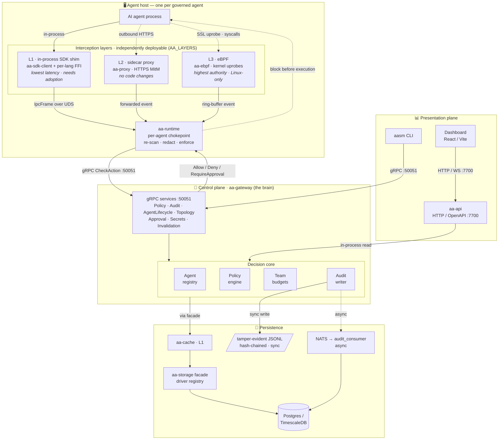
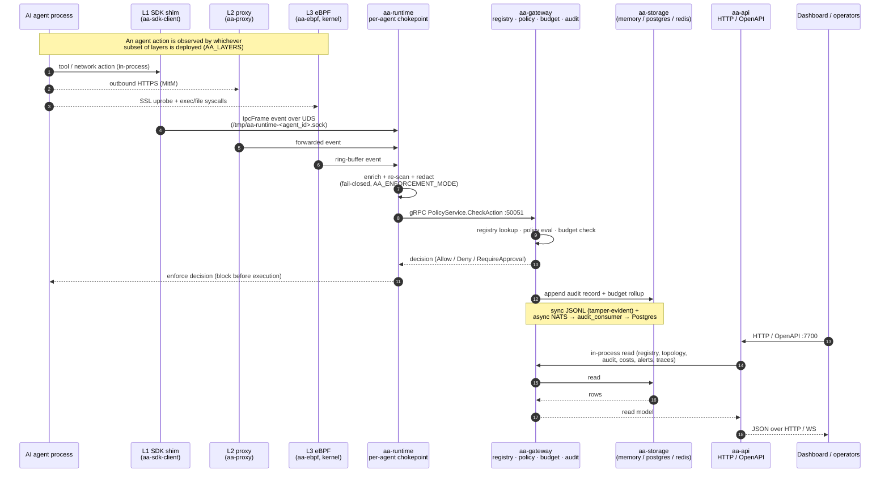

# Infrastructure overview — end-to-end design & dataflow

This page is the **operator's deployment map**: it follows a single agent action
all the way across the running infrastructure, from the agent process to the
dashboard, and lists the **real config knobs** for each hop. Where the other
architecture pages explain *crates* ([System architecture](system-architecture.md)),
*decisions* ([Key workflows](workflows.md)), and *data shape*
([Data flows](data-flows.md)), this page is the wiring diagram you reach for when
you have to actually stand the system up and know which environment variable
controls which boundary.

The product governs AI agents through **three independently-deployable
interception layers**, ordered by latency cost (lowest first) and detection
authority (highest first). All three converge on one central **gateway**, which
decides, records, and persists every action before serving it back to the
dashboard via the read API:

1. **L1 — in-process SDK shim** (`aa-sdk-client`, behind the per-language FFI).
   Fastest path; requires SDK adoption. Emits events to `aa-runtime` over a
   Unix domain socket.
2. **L2 — sidecar proxy** (`aa-proxy`). MitM of outbound HTTPS via a per-host CA;
   enforces network-egress policy with no code changes.
3. **L3 — eBPF** (`aa-ebpf`). Kernel uprobes on SSL libraries plus exec/file
   syscalls; catches everything, including bypass attempts. **Linux-only.**

`aa-runtime` is the per-agent chokepoint that re-scans every event (the SDK is
untrusted) and forwards it to `aa-gateway` over gRPC. The gateway holds the
**registry**, the **policy engine**, and per-team **budgets**, writes an
**audit** record, persists through the `aa-storage` facade, and exposes its read
surfaces over HTTP/OpenAPI through `aa-api` for the **dashboard**.

This page gives you **two complementary views** of the same system:

1. **[Architecture at a glance](#architecture-at-a-glance--components-layers--relations)** —
   a *static* map of the components, the layers/planes they live in, and the
   relations (and transports/ports) between them. Read this first for the whole
   picture.
2. **[Request flow over time](#request-flow-over-time-a-single-agent-action)** — a
   *dynamic* trace of one agent action moving through those components, top to
   bottom, with the enforcement decision returning before execution.

---

## Architecture at a glance — components, layers & relations

The system is organised into four planes. An action is observed in the **agent
host**, decided in the **control plane**, recorded in the **persistence** plane,
and surfaced to humans through the **presentation** plane. Solid arrows are the
in-band enforcement path; dashed arrows are out-of-band observation, async
persistence, or the enforcement decision returning to the agent. Edge labels name
the **transport and port**.

How to read it quickly:

- **Layers stack by trade-off, not sequence.** L1→L2→L3 go from lowest latency to
  highest detection authority; you deploy the subset you need (`AA_LAYERS`), and
  whichever fire all converge on the one `aa-runtime` chokepoint.
- **One brain, many services.** Every gRPC service is a façade onto the same
  decision core (registry · policy · budgets · audit). `aa-api` reads that core
  **in-process** — it is not a second source of truth.
- **The control plane is the only writer of record.** Agents and the dashboard
  never touch persistence directly; all reads and writes funnel through the
  gateway and its `aa-cache`/`aa-storage` facade.

---

## Request flow over time: a single agent action

Three properties this diagram encodes that matter operationally:

- **Pre-execution enforcement.** The decision returns to `aa-runtime` *before*
  the agent's action runs, so a `Deny` blocks the action rather than recording it
  after the fact.
- **The runtime never trusts the SDK.** `aa-runtime` re-scans and redacts every
  event in its enforcement stage (`aa-runtime/src/pipeline/enforcement.rs`)
  regardless of which layer produced it — the SDK is an *optimisation*, not a
  trust boundary.
- **Two audit sinks, neither a single point of failure.** The synchronous,
  hash-chained JSONL write is the tamper-evident primary record; the asynchronous
  NATS → `audit_consumer` → Postgres path is the queryable store the dashboard
  reads. See [Data flows](data-flows.md) for the full audit write path.

---

## Per-component configuration notes

Each hop below lists the **real environment variables / config knobs** that
control it, the file where the knob is read, and its default where one exists.
All variable names are verified against the source; defaults are quoted from the
code.

### L1 — in-process SDK shim (`aa-sdk-client`)

The SDK client resolves where to reach the runtime/gateway and how the agent
identifies itself. (The per-language FFI shims pin `aa-sdk-client` by git SHA and
expose these through their own SDK config too.)

| Knob | Where | Purpose / default |
|---|---|---|
| `AA_GATEWAY_ENDPOINT` | `aa-sdk-client/src/config.rs` (also read by `aa-runtime`) | gRPC endpoint of the gateway. Default `http://127.0.0.1:50051`. This is the gRPC `:50051` port, **not** the HTTP/OpenAPI URL. |
| `AA_AGENT_ID` | `aa-runtime/src/config.rs` | Agent identity; **required** by the runtime. Also names the UDS at `/tmp/aa-runtime-<agent_id>.sock`. |
| `AA_GATEWAY_FAIL_CLOSED` | `aa-runtime/src/config.rs` | Whether an unreachable gateway denies (fail-closed) rather than allows. |

### Layer selection (which layers run)

| Knob | Where | Purpose |
|---|---|---|
| `AA_LAYERS` | `aa-runtime/src/layer.rs` | Comma-separated override of the active layer set. Tokens: `sdk`, `proxy`, `ebpf` (unknown tokens ignored). When unset, the runtime probes for eBPF/proxy availability. |

### L2 — sidecar proxy (`aa-proxy`)

All read in `aa-proxy/src/config.rs`:

| Knob | Purpose / default |
|---|---|
| `AA_PROXY_ADDR` | Proxy bind address. |
| `AA_CA_DIR` | Directory for the per-host MitM CA material. |
| `AA_PROXY_GATEWAY_ENDPOINT` | gRPC endpoint the proxy forwards decisions to. |
| `AA_PROXY_NETWORK_ALLOWLIST` | Comma-separated egress allowlist. |
| `AA_PROXY_DENIED_HOSTS` | Comma-separated host denylist. |
| `AA_PROXY_CREDENTIAL_ACTION` | Action on a detected credential: `block`, `redact_only`, or `alert_only`. |

### L3 — eBPF (`aa-ebpf`, Linux-only)

eBPF probe activation is driven by env vars read by `aa-runtime`: the eBPF layer
is selected via `AA_LAYERS` (`aa-runtime/src/layer.rs`), and the loader is tuned
by `AA_EBPF_INPROCESS_LOAD`, `AA_EBPF_CONFINE_PID`, `AA_EBPF_POLICY_PATH`, and
`AA_EBPF_LOADERD_SOCK` (`aa-runtime/src/ebpf_control.rs`). Events surface to
`aa-runtime` over the kernel ring buffer. (`AA_TLS_BPF` / `AA_EXEC_BPF` /
`AA_FILE_IO_BPF` are **not** runtime env vars — they are the compiled-in BPF
objects in `aa-ebpf`, verified against the build-time `AA_*_BPF_SHA256`
digests.) eBPF is **Linux-only**; on other platforms `cargo check -p aa-ebpf` is
the supported path and the layer is unavailable at runtime.

### `aa-runtime` — the per-agent chokepoint

Read in `aa-runtime/src/config.rs`:

| Knob | Purpose / default |
|---|---|
| `AA_AGENT_ID` | **Required.** Names the UDS `/tmp/aa-runtime-<agent_id>.sock`. |
| `AA_POLICY_PATH` | Path to the policy document; empty string disables policy loading. |
| `AA_METRICS_ADDR` | Prometheus metrics bind address. Default `0.0.0.0:8080`. |
| `AA_ENFORCEMENT_MODE` | `enforce` (default), `observe`, or `disabled`. **Not read by `aa-runtime`** — the CLI (`aa-cli/src/commands/run.rs`) injects it into the launched *agent's* child-process env for the SDK to consume, so setting it on the `aa-runtime` sidecar has no effect. |
| `AA_ENFORCEMENT_MAX_FIELD_BYTES` | Oversized-field threshold; the enforcement stage redacts whole fields over the limit (fail-closed). |
| `AA_GATEWAY_ENDPOINT` | gRPC endpoint of the gateway (shared with the SDK client). |
| `AA_GATEWAY_FAIL_CLOSED` | Deny when the gateway is unreachable. |

### `aa-gateway` — registry, policy engine, budgets, audit

| Knob | Where | Purpose |
|---|---|---|
| `AA_MODE` | `aa-gateway/src/main.rs` | Deployment mode: `legacy-grpc`, `local`, or `remote`. The gRPC service is always exposed; `--mode` overrides the env var. |
| `AAASM_GATEWAY_PORT` | `aa-core/src/config.rs` | Gateway port in `local` mode. |
| `AA_AUDIT_DIR` | `aa-gateway/src/server.rs` | Directory for the tamper-evident JSONL audit log. |
| `AA_DATA_DIR` | `aa-gateway/src/policy/history/config.rs` | Base data dir; e.g. policy history lands under `$AA_DATA_DIR/policy-history/`. |
| `AA_AUDIT_NATS_URL` + `AA_AUDIT_POSTGRES_URL` | `aa-gateway/src/audit_consumer.rs` | Both must be set to enable the async audit consumer (NATS → Postgres). |

The default gRPC listen address is `127.0.0.1:50051`; the seven gRPC services
(`PolicyService`, `AuditService`, `AgentLifecycleService`, `TopologyService`,
`ApprovalService`, `SecretsService`, `InvalidationService`) are registered
together in `aa-gateway/src/server.rs` and can be served over TCP or UDS.

### Persistence — `aa-storage` drivers

The gateway never talks to a concrete database directly; it goes through the
`aa-storage` trait facade fronted by the `aa-cache` L1 cache, and the active
driver decides where bytes land.

| Knob | Where | Purpose |
|---|---|---|
| `AAASM_DATABASE_URL` | `aa-gateway/src/storage/postgres.rs`, `timescale.rs` | Postgres/Timescale connection string for the durable audit + state store. |
| `TIMESCALEDB_AVAILABLE` | `aa-gateway/src/storage/postgres.rs` | When `!= "1"`, tests/loader run against vanilla PostgreSQL instead of TimescaleDB. |

Driver selection is resolved at boot by `aa-storage`'s `Registry` +
`register_builtin_drivers`; `aasm config validate` / `aasm config boot` exercise
this loader. See [Data flows → Storage data flow](data-flows.md#storage-data-flow).

### `aa-api` — HTTP / OpenAPI read surface

| Knob | Where | Purpose / default |
|---|---|---|
| `AA_API_ADDR` | `aa-api/src/config.rs`, `aa-api/src/bin/aa-api-server.rs` | HTTP bind address. Default `127.0.0.1:7700` (`DEFAULT_ADDR`). |
| `AA_AUTH` | `aa-auth/src/config.rs` | `off` disables auth (all requests treated as admin, logged as a warning); anything else = on. |
| `AA_JWT_SECRET` | `aa-auth/src/config.rs` | HMAC key for JWT; **required** when auth is on, with a minimum length. |
| `AA_API_KEYS_PATH` | `aa-auth/src/config.rs` | Path to the API-keys file. Default `~/.aa/api-keys.json`. |
| `AA_RATE_LIMIT_RPM` | `aa-auth/src/config.rs` | Requests per minute per key. Default `1000`. |
| `AASM_API_AUTH` / `AASM_API_KEY` | `aa-api/src/state.rs` | Alternate auth toggle (`AASM_API_AUTH=off`) and key for the API surface. |

### Dashboard / `aasm` CLI

| Knob | Where | Purpose |
|---|---|---|
| `AASM_DASHBOARD_PORT` | `aa-cli/src/config.rs`, `aa-cli/src/commands/dashboard/{start,open}.rs` | Port the dashboard server listens on / the CLI connects to (overridable by `--port`). |
| `AAASM_DASHBOARD_DIST` | `aa-gateway/src/dashboard_server.rs` | Path to the built dashboard static assets. |

The dashboard speaks HTTP/OpenAPI (and WS) to `aa-api` on `:7700`; the `aasm`
CLI speaks gRPC to the gateway on `:50051`.

---

## Where to go next

- **[System architecture](system-architecture.md)** — the crate map and
  transport topology behind this deployment.
- **[Key workflows](workflows.md)** — policy evaluation, agent registration, and
  the enforcement path as sequence diagrams.
- **[Data flows](data-flows.md)** — the full audit write path and the
  write-boundary sanitizer.
- **[Security Model](../security/overview.md)** — the same system viewed through
  trust boundaries and defense-in-depth.
