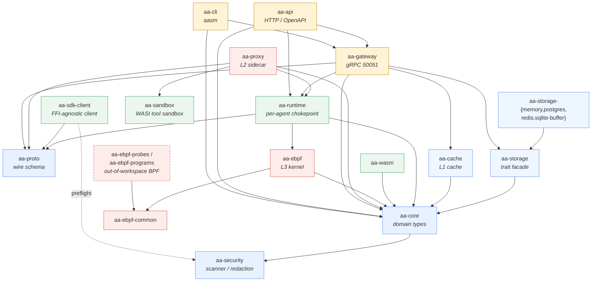
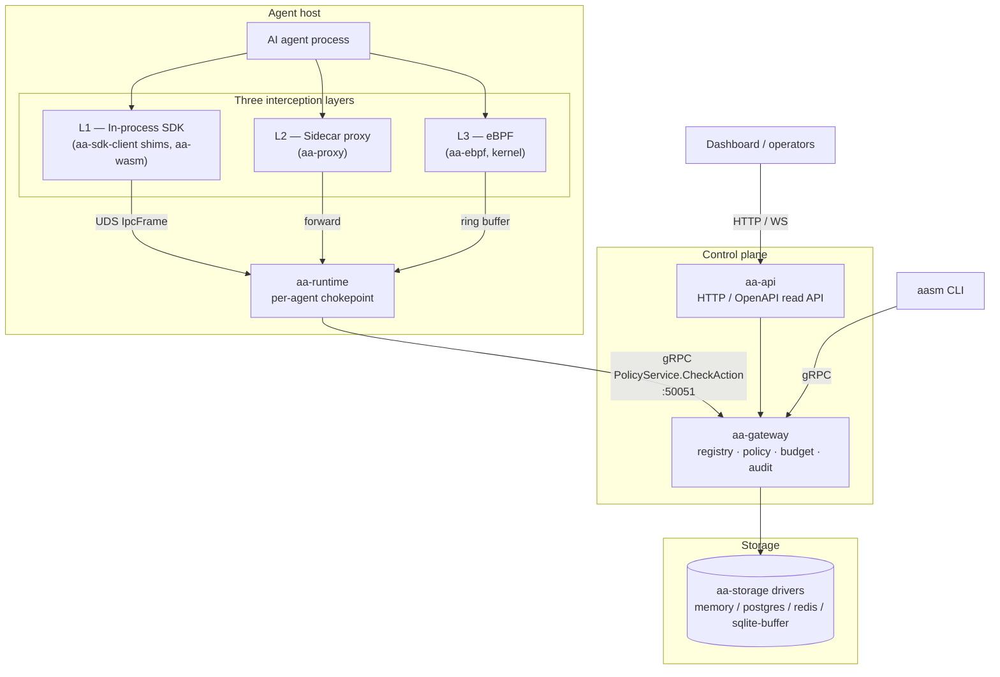
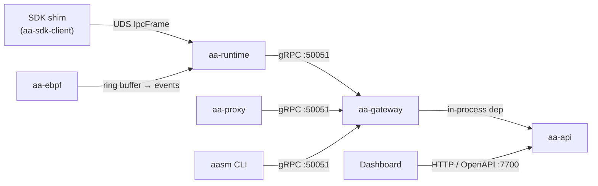

# System architecture

This page is the big-picture map of `agent-assembly`: the workspace crates, how
the three interception layers feed one central **gateway**, and which transport
each component speaks. Read it first; the [component deep-dives](components.md),
[key workflows](workflows.md), and [data flows](data-flows.md) pages zoom into
each piece.

For the trust-boundary view of the same system — what each layer is trusted to
do and where the authoritative checks live — see the
[Security Model](../security/README.md).

## The one-sentence model

> Agents act; the three interception layers observe those actions and forward
> them to the gateway; the gateway evaluates **policy**, tracks **budgets**, and
> writes an **audit** record before returning *allow* or *deny*.

The gateway is the single decision-maker. The interception layers differ only in
*where* they sit and *how much* they can bypass — they all converge on the same
protobuf wire format defined in `aa-proto` and the same `PolicyService` RPC.

## Workspace at a glance

The Cargo workspace declares **28 member crates** in the top-level
[`Cargo.toml`](https://github.com/ai-agent-assembly/agent-assembly/blob/master/Cargo.toml).
They group into a handful of architectural roles:

| Role | Crates | What they own |
|---|---|---|
| **Foundation** | `aa-core`, `aa-proto`, `aa-security` | Domain types (`AgentId`, `AuditEntry`, policy types), the gRPC/protobuf wire schema, and the credential scanner / redaction primitives. |
| **Storage** | `aa-storage`, `aa-storage-memory`, `aa-storage-postgres`, `aa-storage-redis`, `aa-storage-sqlite-buffer`, `aa-cache` | Storage trait facade + pluggable drivers, plus the in-process L1 cache. |
| **Runtime / interception** | `aa-runtime`, `aa-ebpf`, `aa-ebpf-common`, `aa-proxy`, `aa-sdk-client`, `aa-wasm`, `aa-sandbox` | The per-agent runtime chokepoint, the kernel/proxy/SDK interception layers, the FFI-agnostic SDK client, and the WASM tool sandbox. |
| **Control plane** | `aa-gateway`, `aa-api`, `aa-cli` | The governance gateway (gRPC), the HTTP/OpenAPI read API, and the `aasm` operator CLI. |
| **Dev-tool adapters** | `aa-devtool`, `aa-devtool-claude-code`, `aa-devtool-codex`, `aa-devtool-copilot`, `aa-devtool-windsurf`, `aa-devtool-saas`, plus the `examples/aa-devtool-sample-myeditor` sample | Adapters that wire common AI dev tools into the governance fabric. |
| **Test / conformance** | `conformance`, `aa-integration-tests` | The cross-crate trait conformance harness and the end-to-end integration suite. |

Two further eBPF crates — `aa-ebpf-probes` and `aa-ebpf-programs` — live
alongside the workspace but are intentionally **out of workspace**: they compile
for the `bpfel-unknown-none` BPF target and are built by `aa-ebpf`'s `build.rs`
via `aya-build`, so they cannot be selected with `cargo -p`.

The per-language SDK *shims* (Python / Node / Go) do **not** live in this
monorepo. They wrap `aa-sdk-client` and consume it via a pinned git SHA from the
sibling `python-sdk` / `node-sdk` / `go-sdk` repositories.

## Crate / component map

The diagram highlights the core architectural crates; storage drivers,
dev-tool adapters, and test harnesses are folded into summary nodes for clarity.
Edges follow real `path` dependencies in each crate's `Cargo.toml`.

`aa-core` and `aa-proto` are the two foundation leaves everything else builds on:
`aa-core` holds the Rust domain model and the storage traits, `aa-proto` holds
the protobuf schema that crosses every process boundary.

## How the layers, gateway, API, runtime, and storage fit together

- The **interception layers** are deployment-independent: a deployment can run
  any subset (SDK only, SDK + proxy, all three). Each layer turns an agent
  action into an event in the `aa-proto` schema.
- **`aa-runtime`** is the per-agent chokepoint. Because the SDK is untrusted, the
  runtime re-scans every event (the enforcement stage in
  `aa-runtime/src/pipeline/enforcement.rs`) before forwarding it.
- **`aa-gateway`** is the brain. It hosts the agent registry, the policy engine,
  per-team budgets, and the audit pipeline, and it serves gRPC on `:50051`.
- **`aa-api`** depends on `aa-gateway` in-process and re-exposes its read surfaces
  over HTTP with an OpenAPI schema (via `utoipa`) for the dashboard and tooling.
- **Storage** is a pluggable trait facade (`aa-storage`) with swappable drivers,
  fronted by an in-process L1 cache (`aa-cache`).

## Transport topology

Every cross-process message rides one of three transports. All gRPC and
Unix-socket payloads share the `aa-proto` schema.

| Transport | Default endpoint | Carries | Who speaks it |
|---|---|---|---|
| **gRPC** | `127.0.0.1:50051` (TCP) or UDS | `PolicyService`, `AuditService`, `AgentLifecycleService`, `TopologyService`, `ApprovalService`, `SecretsService`, `InvalidationService` | `aa-runtime`, `aa-proxy`, `aa-cli` → `aa-gateway` |
| **HTTP / OpenAPI** | `127.0.0.1:7700` (`AA_API_ADDR`) | Read APIs: registry, topology, audit, costs, alerts, traces | Dashboard / tooling → `aa-api` |
| **Unix domain socket (UDS)** | per-agent socket | `IpcFrame` events from the in-process SDK | SDK shim → `aa-runtime` |

The seven gRPC services are registered together in
[`aa-gateway/src/server.rs`](https://github.com/ai-agent-assembly/agent-assembly/blob/master/aa-gateway/src/server.rs);
the gateway can serve them over either TCP (`serve_tcp`) or a Unix socket
(`serve_uds`). The default gRPC listen address is `127.0.0.1:50051`; the HTTP API
default bind is `127.0.0.1:7700` (constant `DEFAULT_ADDR` in
[`aa-api/src/config.rs`](https://github.com/ai-agent-assembly/agent-assembly/blob/master/aa-api/src/config.rs),
overridable via `AA_API_ADDR`).

## Where to go next

- **[Component deep-dives](components.md)** — per-crate responsibilities, key
  types, and dependencies.
- **[Key workflows](workflows.md)** — policy evaluation, agent registration,
  budget rollup, and the enforcement path as sequence diagrams.
- **[Data flows](data-flows.md)** — how an intercepted event travels from a layer
  through the gateway to the audit log and storage.
- **[Security Model](../security/README.md)** — the same system viewed through
  trust boundaries and defense-in-depth.
