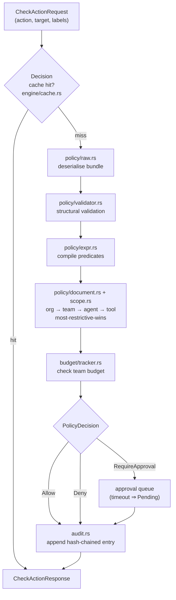
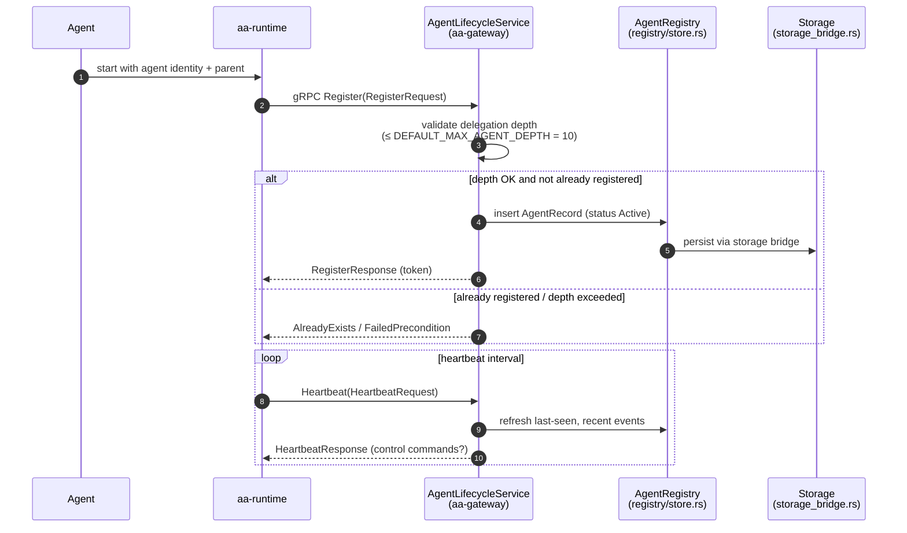
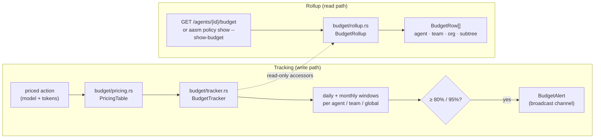
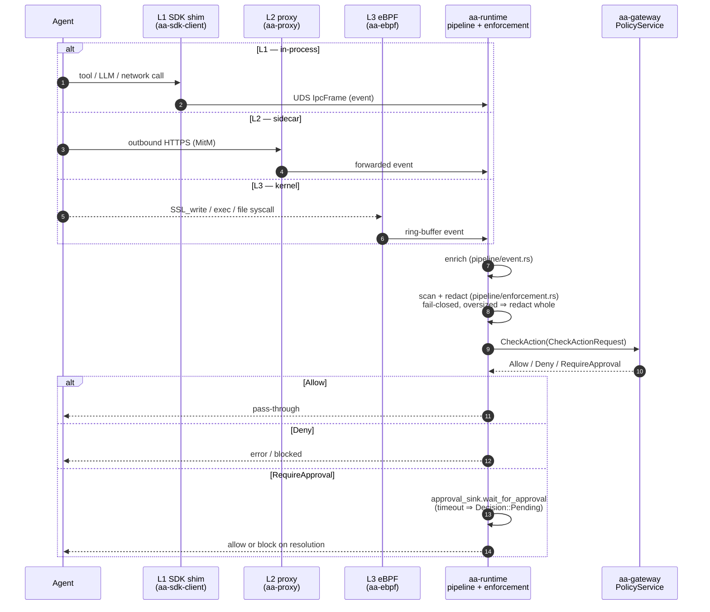

# Key workflows

This page traces the four workflows that define `agent-assembly`'s runtime
behaviour, each grounded in the real code path:

- [Policy evaluation](#policy-evaluation)
- [Agent registration](#agent-registration)
- [Budget tracking & rollup](#budget-tracking--rollup)
- [Interception & enforcement](#interception--enforcement)

For component-level detail behind each box, see
[Component deep-dives](components.md); for the bird's-eye map, see
[System architecture](system-architecture.md).

---

## Policy evaluation

When `aa-gateway` receives a `PolicyService.CheckAction` RPC, the policy engine
under [`aa-gateway/src/policy/`](https://github.com/ai-agent-assembly/agent-assembly/tree/master/aa-gateway/src/policy)
walks parse → compile → scope cascade → budget → decision, then audits the
result. The decision type (`engine/decision.rs`) is one of **Allow**, **Deny**,
or **RequireApproval**.

1. **Decision cache** — `engine/cache.rs` short-circuits repeat lookups for the
   same `(scope, action)` key.
2. **Parse + validate** — `policy/raw.rs` deserialises the active bundle;
   `policy/validator.rs` enforces structural invariants (well-formed scopes,
   unique rule names).
3. **Compile** — `policy/expr.rs` turns rule predicates into a typed expression
   tree evaluated against the request's `ActionType`, target, and labels.
4. **Scope cascade** — `policy/document.rs` + `scope.rs` walk
   `org → team → agent → tool` and merge *most-restrictive-wins*, with cycle
   detection on delegation.
5. **Budget check** — `budget/tracker.rs` (priced via `budget/pricing.rs`)
   downgrades an otherwise-allowed request to **Deny** if it would breach a
   budget.
6. **Decision** — `engine/decision.rs` yields `Allow`, `Deny { reason }`, or
   `RequireApproval { timeout_secs }`.
7. **Audit** — every decision is appended to the hash-chained audit log via
   `audit.rs` before the response is returned.

Latency targets and current p99 measurements live in
[Benchmarks — Policy Check p99](../benchmarks/policy-check-p99.md).

---

## Agent registration

Registration flows through `AgentLifecycleService.Register`
([`aa-gateway/src/service/lifecycle_service.rs`](https://github.com/ai-agent-assembly/agent-assembly/blob/master/aa-gateway/src/service/lifecycle_service.rs)),
which validates delegation depth and writes into the `DashMap`-backed
`AgentRegistry`. Agents then keep their record live with periodic `Heartbeat`s.

- **Delegation depth** — a sub-agent's depth must not exceed
  `DEFAULT_MAX_AGENT_DEPTH` (10); over-deep registrations are rejected.
- **Lineage** — the registry records parent/child links (`registry/lineage.rs`)
  so the topology tree and orphan handling (`registry/orphan.rs`) work.
- **Control stream** — `ControlStream` lets the gateway push commands (e.g.
  `SuspendCommand`) back to a live agent.
- **Deregister** — on shutdown the agent calls `Deregister`; orphaned children
  are handled per the configured `OrphanMode`.

---

## Budget tracking & rollup

Every priced action updates the in-memory `BudgetTracker`; the dashboard, SDK,
and CLI read a composed `BudgetRollup` across agent / team / org / subtree
scopes.

- **Pricing** — `budget/pricing.rs` converts model + token counts into a USD
  cost.
- **Windows** — `BudgetTracker` keeps daily and monthly windows for each agent,
  each team, and the global total.
- **Alerts** — crossing 80 % or 95 % of a limit emits a `BudgetAlert` on a
  broadcast channel (capacity 64) for live dashboards.
- **Rollup** — `budget/rollup.rs` composes a `BudgetRow` per scope
  (`agent`, `team:<id>`, `org`, `subtree`) using the tracker's read-only
  accessors — narrowest scope first. The same rollup drives both the HTTP
  endpoint and `aasm policy show <agent_id> --show-budget`.

---

## Interception & enforcement

An agent action is observed by one of the three layers, normalised into the
`aa-proto` wire format, re-scanned by `aa-runtime`, then sent to the gateway for
a decision. The runtime is the **mandatory chokepoint**: it never trusts the
SDK's assertions.

Key invariants from `aa-runtime/src/pipeline/enforcement.rs`:

- The runtime **re-scans every event unconditionally** — there is no
  `already_scanned` / `clean` wire marker, and none is honoured.
- Enforcement is **fail-closed**: a field larger than `max_field_bytes`
  (default 64 KiB) cannot be fully scanned, so it is redacted *whole*
  (`[REDACTED:OVERSIZED]`) rather than partially forwarded.
- The credential scanner / redaction primitives come from the `aa-security`
  leaf crate.

The eBPF layer is observe-and-forward for bypass-detection: it cannot block
in-kernel, so it streams audit events while the SDK and proxy layers carry the
synchronous allow/deny. For the trust rationale, see
[three-layer defense](../security/three-layer-defense.md).

---

## Where each event goes next

Once a decision is made, the event flows into the audit and storage pipeline —
covered in detail on the [Data flows](data-flows.md) page.
