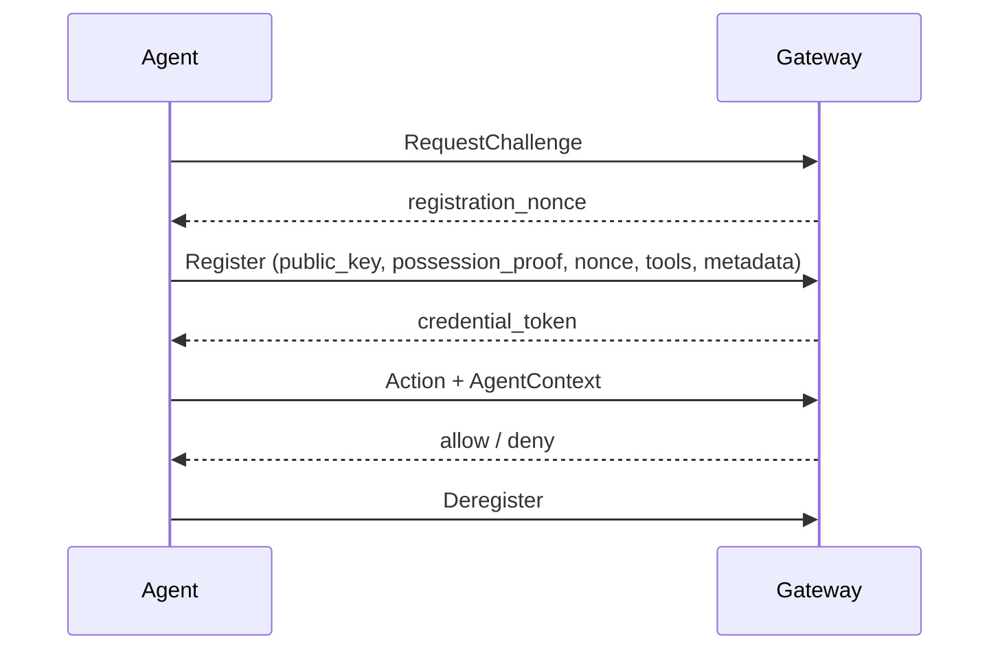

# Agent

## Definition

An **agent** is the workload Agent Assembly governs: an LLM-driven program that
decides, at runtime, which actions to take to accomplish a goal. From the
gateway's point of view an agent is a stable identity that performs *actions* —
calling a tool, making an LLM request, or reaching out over the network. Each
agent is organized under a **team** and an **org**, which is the scope at which
policy and budget are applied.

Two identity types distinguish a long-lived agent from a single run.
`aa_core::identity::AgentId` is the stable identifier carried across every
session; `SessionId` is generated fresh for each execution and ties together all
governance events within that run. Both are opaque 16-byte wrappers over UUID v4
raw bytes. The `AgentContext` carries these together with the OS process ID, a
start timestamp, free-form metadata, the governance level, and the agent's
position in any delegation hierarchy (`parent_agent_id`, `root_agent_id`,
`depth`, `team_id`).

> `aa-core` defines **two distinct types both named `AgentId`**, and they are not
> interchangeable. `identity::AgentId` is the opaque 16-byte runtime id described
> above. `types::AgentId` is a separate newtype over a validated
> `<tenant>/<agent>` string — the human-routable identifier that storage drivers
> persist and round-trip, for example `acme/billing-bot`. Read the module path,
> not the type name, when following either through the code.

## How it works

An agent's lifecycle has three phases:

1. **Register.** Registration is two round trips, not one. The SDK first calls
   `RequestChallenge` to obtain a single-use `registration_nonce`, then calls
   `Register` with the agent's name, framework (for example `langgraph` or
   `crewai`), declared tool names, an Ed25519 `public_key`, metadata, that
   `registration_nonce`, and a `possession_proof` — a 64-byte Ed25519 signature
   over the nonce. The gateway consumes the nonce (so it cannot be replayed) and
   verifies the proof against the submitted `public_key`; a missing nonce, a
   missing proof, or a proof that does not verify is rejected as unauthenticated.
   Only then does it store an `AgentRecord` and issue the short-lived
   `credential_token` the agent presents on subsequent calls. Proving possession
   of the private key at registration is what stops a caller from claiming
   someone else's public key. It is *not* on its own enough to stop a caller
   claiming someone else's **identity** — the proof says nothing about which key
   the `agent_id` names — so the gateway separately requires the DID to embed the
   presented key; see [DID](did.md).
2. **Operate.** For each governed action the runtime builds an `AgentContext`
   and submits it for a decision. The gateway evaluates [policy](policy.md),
   tracks budget, and records an [audit](audit.md) entry — for both allows and
   denies. Sub-agents spawned by an agent inherit lineage so a delegation chain
   can be reconstructed from any node.
3. **Deregister.** A clean shutdown unwinds the SDK hooks and closes the gateway
   connection. An agent that never deregisters is swept on **age, not silence**:
   the registry compares *now* against the record's `registered_at` timestamp and
   force-deregisters any still-`Active` agent older than the maximum configured
   for its team. Heartbeat activity does not extend that window, and an agent
   whose team has no maximum configured is never swept by age at all. Each
   eviction emits an `AgentForceDeregistered` audit event.



## Example

Each SDK wires an agent into the gateway with a single call. Tool invocations
after that point are governed.

```python
from agent_assembly import init_assembly

with init_assembly(
    gateway_url="http://localhost:7391",
    api_key="dev-key",
    agent_id="quickstart-agent",
    mode="sdk-only",
):
    ...  # every governed tool call now goes through the policy gate
```

```ts
import { initAssembly } from "@agent-assembly/sdk";

const ctx = await initAssembly({
  gatewayUrl: "http://localhost:7391",
  agentId: "demo",
  langchain: { tools: { searchWeb } },
});
await ctx.shutdown();
```

```go
ctx := assembly.WithAgentID(context.Background(), "my-agent")
a, err := assembly.Init(ctx, assembly.WithGatewayURL(url), assembly.WithAPIKey(key))
if err != nil {
    log.Fatal(err)
}
defer a.Close()
```

## Related

- [Policy](policy.md) — what an agent is and is not allowed to do.
- [Approval](approval.md) — how an agent's high-risk actions reach a human.
- [Trace](trace.md) — how an agent's actions are observed per session.
- [DID](did.md) — the cryptographic identity an agent registers with.
- [API reference](../api-reference.md) — `aa-core` (`AgentId`, `AgentContext`)
  and `aa-gateway` (registry, lifecycle service) rustdoc entry points.
- Quickstart (tracked under AAASM-418) — end-to-end first-run walkthrough.
