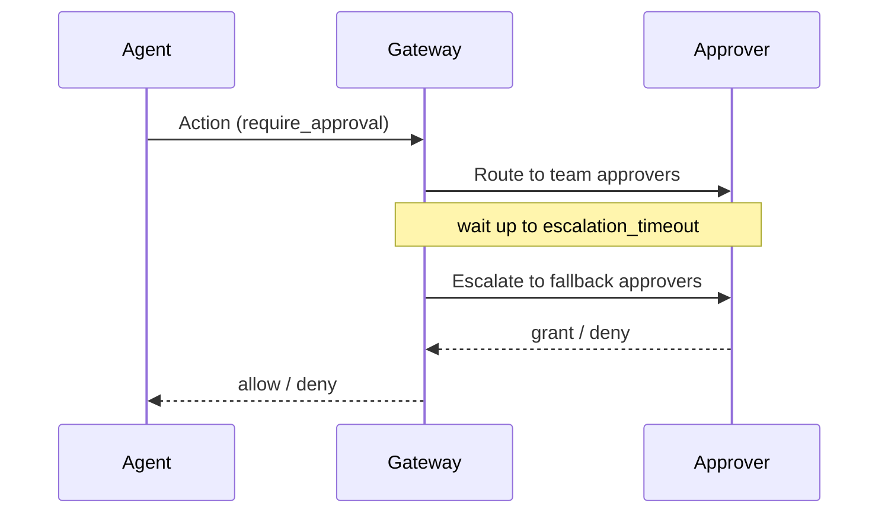

# Approval

## Definition

An **approval** is a human-in-the-loop (HITL) checkpoint: a high-risk action is
held by the gateway until a designated person grants or denies it. Approvals
turn a binary allow/deny policy into a third path — *require approval* — so an
agent can attempt a sensitive action while a human stays in control of whether
it actually runs.

An approval request is categorized by an `ApprovalKind`: `spawn` (an agent tried
to spawn a child agent), `tool_use` (an agent invoked a tool that requires
approval), `budget_increase` (an agent requested more budget), or a
caller-defined `custom` kind. The kind is used as a routing key so different
action types can reach different approvers within the same team.

## How it works

An approval is raised by a **per-tool `requires_approval_if` guard expression
that evaluates true**. There is no rule-list `effect: require_approval` — see
[Policy](policy.md) for why the document schema is section-based. The expression
lives under `tools:`, either on the named tool or on the `"*"` wildcard entry that
covers unlisted tools; the exact entry wins when both are present. Because it is a
*guard* clause, a resolution failure fails **closed**: if a variable the
expression depends on cannot be resolved, the clause fires and the action is held
for approval rather than allowed through. Each such failure is written to the
audit trail, so a decision made on degraded context is never invisible.

Once a request is raised the gateway:

1. **Routes** the request using the requesting agent's `team_id`. Each team's
   `TeamRoutingConfig` names an ordered list of `approvers`, an
   `escalation_timeout_secs`, and a fallback list of `escalation_approvers`,
   optionally filtered by `ApprovalKind`. Lookup is *exact kind → team-wide →
   global default*, so a caller never gets "no route": a team with no configured
   row falls back to a global default of **1800 seconds** with **`OrgAdmin` as
   both primary and escalation approver**. An orphan agent — one whose
   `AgentContext` carries no `team_id` — skips the lookup and routes straight to
   `OrgAdmin`. A per-policy override on the request takes priority over the
   team-level value.
2. **Waits** for a decision. The action blocks until an approver responds or the
   timeout expires. The default approval timeout is 300 seconds; a policy may
   override it via `approval_timeout_secs`.
3. **Escalates** if the first approvers do not respond before
   `escalation_timeout_secs`. A restart-safe scheduler fires the escalation and
   re-routes the request to the `escalation_approvers`.
4. **Resolves.** A grant lets the action proceed; a deny blocks it; a timeout
   resolves to *pending/denied* so a stalled request never silently allows.

Every transition is recorded in the [audit](audit.md) trail —
`ApprovalRequested`, `ApprovalRouted`, `ApprovalEscalated`, `ApprovalGranted`,
`ApprovalDenied`, and `ApprovalTimedOut` — so the full decision history is
reconstructable.



## Example

Who can approve is configured per team. A routing entry pairs the primary
approvers with an escalation fallback:

```json
{
  "team_id": "platform",
  "approvers": ["ops-oncall"],
  "escalation_timeout_secs": 300,
  "escalation_approvers": ["eng-manager"],
  "approval_kind": "tool_use"
}
```

Note that `escalation_timeout_secs` is set explicitly here; omit the team row
entirely and the global default of 1800 seconds applies instead.

The policy that triggers this flow gates the tool itself. `approval_timeout_secs`
sets how long the held action waits before timing out, and the `approval:` section
overrides the escalation timeout and escalation role for this document:

```yaml
apiVersion: agent-assembly/v1
kind: Policy
metadata:
  name: writes-need-approval
spec:
  approval_timeout_secs: 300
  approval:
    timeout_seconds: 600
    escalation_role: OrgAdmin
  tools:
    db_write:
      allow: true
      requires_approval_if: "governance_level >= L2"
    file_write:
      allow: true
      requires_approval_if: 'path starts_with "/etc"'
```

`approval:` accepts exactly `timeout_seconds` and `escalation_role`. It is not a
list of approvers — who can approve is the routing config's job, not the policy
document's — and an unrecognised key inside the section is rejected rather than
ignored.

## Related

- [Policy](policy.md) — the `require_approval` effect that triggers an approval.
- [Audit](audit.md) — the `Approval*` events recorded for each transition.
- [Agent](agent.md) — the `team_id` that determines routing.
- [API reference](../api-reference.md) — `aa-gateway` approval router and
  escalation scheduler rustdoc entry points; `aa-core` (`ApprovalKind`).
- Quickstart (tracked under AAASM-418) — approving an action end-to-end.
