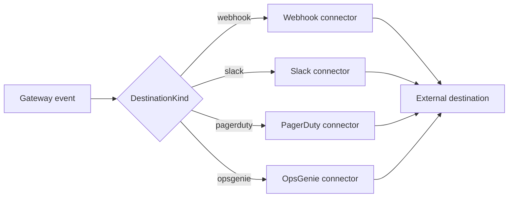

# Connector

## Definition

A **connector** is an outbound dispatcher that delivers a governance
notification to an external destination — a webhook endpoint, a Slack channel,
PagerDuty, or OpsGenie. Given a destination and a message, the connector for that
destination's kind knows how to format the payload, egress to it safely, and
report what the far end said.

> **Current state.** Destinations are configurable, validated, bindable to alert
> rules, and firable on demand. What does *not* exist yet is the automatic path:
> the only code that invokes a connector in a running server is the manual test
> endpoint below. An alert rule carries `destination_ids` and the rule evaluator
> returns whether the rule fired, but nothing yet joins the two, so a configured
> destination will not receive anything until someone fires it. Treat this page as
> the mechanism, not as a delivery guarantee.

A **destination** is the configured target; a **connector** is the code that
delivers to it. Each destination has a `DestinationKind` — `webhook`, `slack`,
`pagerduty`, or `opsgenie` — and the gateway selects the matching connector at
dispatch time.

## How it works

Every connector implements one trait, `NotificationConnector`, with a single
async method:

```rust
#[async_trait::async_trait]
pub trait NotificationConnector: Send + Sync {
    async fn dispatch(
        &self,
        destination: &Destination,
        req: &DispatchRequest,
        pinned: &[SocketAddr],
    ) -> Result<DispatchOutcome, ConnectorError>;
}
```

That fourth parameter is the SSRF defence, and it is why the trait is not simply
`(destination, req)`. A webhook or Slack URL is caller-controlled, so the egress
guard resolves and vets it *before* dispatch and hands the vetted socket addresses
down as `pinned`. A connector egressing to a caller-controlled host must pin its
outbound connection to exactly those addresses, so a DNS rebind between the check
and the connect cannot redirect the request at an internal target. An empty slice
means "do not pin" — used for the hard-coded vendor hosts (PagerDuty, OpsGenie)
and when the operator has opted out of the guard. Redirects are never followed,
for the same reason: a 3xx from an allowlisted destination could otherwise bounce
the request to loopback, RFC1918, or a cloud metadata endpoint.

A `DispatchRequest` carries a `severity` label (for example `LOW` or
`CRITICAL`) and a human-readable `message`. On success the connector returns a
`DispatchOutcome` with the delivery timestamp, the observed HTTP status, and a
bounded snippet of the destination's response body. On failure it returns a
`ConnectorError`: `Http { status, body }` when the destination replied non-2xx,
or `Transport` when delivery failed before an HTTP response (DNS, TCP, TLS, or
timeout). Response bodies are capped (2048 bytes) so error envelopes stay
bounded.

All connectors share one pooled `reqwest` client so connection reuse and TLS
configuration are consistent. PagerDuty and OpsGenie are gated behind cargo
features (`connector-pagerduty`, `connector-opsgenie`) so the binary stays small
when only webhook and Slack are needed. A kind whose feature is off resolves to an
`UnsupportedConnector` that fails closed rather than silently doing nothing.

Connectors are test-fired through the control-plane API, whose whole surface is
nested under `/api/v1`:

```
POST /api/v1/alerts/destinations/{id}/test
```

The body is optional; `severity` defaults to `LOW` and `message` to a placeholder.
The response carries the delivery timestamp and the destination's own status and
body snippet, so a misconfigured webhook is diagnosable from the response rather
than from server logs.



## Example

Supported connector types map one-to-one to `DestinationKind`:

| Kind        | Delivers to                          | Feature-gated |
|-------------|--------------------------------------|---------------|
| `webhook`   | A generic webhook URL                | no            |
| `slack`     | A Slack incoming-webhook URL         | no            |
| `pagerduty` | PagerDuty Events API v2 routing key  | yes           |
| `opsgenie`  | OpsGenie REST API key + team         | yes           |

A destination is bound to an alert rule by id, not by a policy section — the
policy document schema has no notification keys at all, and would reject them (see
[Policy](policy.md) on fail-closed validation). The binding lives on the rule:

```json
{
  "name": "daily budget nearly spent",
  "description": "Warn ops before the cap starts denying actions",
  "metric": "budget_spent_pct",
  "operator": ">",
  "threshold": 80,
  "evaluationWindowSeconds": 300,
  "severity": "HIGH",
  "destinationIds": ["slack-ops"],
  "dedupWindowSeconds": 3600,
  "enabled": true
}
```

`destinationIds` must be non-empty and every id must already exist in the
destination registry, so a rule cannot be saved pointing at a destination that was
never configured. The metric vocabulary is `budget_spent_pct`, `anomaly_score`,
`approval_pending_age`, and `policy_violation_count`; the evaluation window must be
300, 900, or 3600 seconds. Per the note at the top of this page, satisfying such a
rule does not yet deliver anything on its own.

## Related

- [Policy](policy.md) — why a notification cannot be configured from a policy
  document, and what the document schema does accept.
- [Audit](audit.md) — the durable record alongside outbound notifications.
- [Approval](approval.md) — approvals frequently route through the same
  notification destinations.
- [API reference](../api-reference.md) — `aa-api` destinations / connectors
  (`NotificationConnector`, `DestinationKind`) rustdoc entry points.
- Quickstart (tracked under AAASM-418) — wiring a first destination end-to-end.
