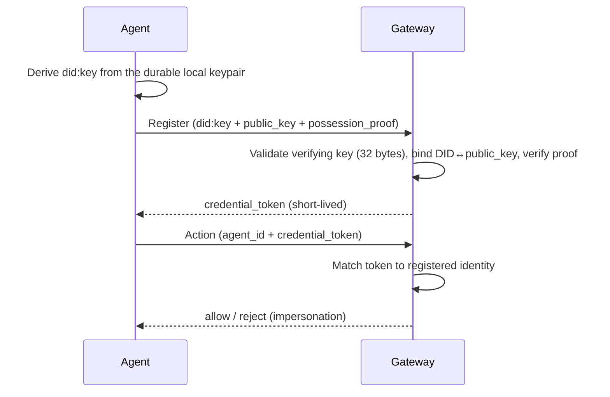

# DID

## Definition

A **DID** (Decentralized Identifier) is a self-describing identifier whose
trust is rooted in a public key rather than in a central registrar. Agent
Assembly uses the `did:key` method, where the identifier encodes an Ed25519
public key directly — for example
`did:key:z6Mkm5rByiqq5UNbvPFPfXtGJwdg2kD1T`. The DID *is* the key, so anyone
holding the DID can verify a signature without consulting an external directory.

## How it works

When an agent registers, it presents an Ed25519 `public_key` alongside its name,
framework, and declared tools, plus a `possession_proof` over a gateway-issued
challenge nonce — see [Agent](agent.md) for that two-round-trip exchange. The
gateway validates that the key is a well-formed Ed25519 verifying key (32 bytes,
hex-encoded) before storing the agent's `AgentRecord`, and rejects anything
malformed at the lifecycle boundary.

**Two identifiers, at two different layers.** On the wire the `agent_id` *must
itself* be a syntactically-valid `did:key`; a plain string is rejected with
`InvalidArgument: agent_id is not a did:key DID (missing "did:key:" prefix)`.
What you *configure* is a human-readable identifier — for example
`"quickstart-agent"` — which also names sockets and tags events. The SDK resolves
that identifier to the `did:key` it registers under by loading (or, on first use,
enrolling) a **durable local keypair** for it and encoding that key's public half,
so asking twice returns the same DID.

**The DID is therefore derived, not chosen.** Since AAASM-5332 the keypair is
randomly generated and persisted rather than derived from the identifier — before
that, the private key was computable by anyone who could read an agent id.
Resolving an identifier to its DID is consequently a fallible, filesystem-touching
operation instead of a hash; that is the cost of the DID meaning something.

Handing a *provisioned* `did:key` in as the configured identifier is refused
locally (`ProvisionedDidUnsupported`) rather than passed through. The reason is
not that a possession proof would fail to verify — it would verify fine against
the key the client actually holds. It is that the client sends the `public_key`
of *its own* durable key, and the gateway requires the DID to embed *that* key
(see the binding check below), so a caller-supplied DID was guaranteed to be
rejected as `Unauthenticated`. Refusing locally turns a confusing remote
rejection into an error that names the real problem, and forecloses the worse
alternative of silently registering under a DID other than the one the operator
named. Where an identity cannot be resolved it surfaces as a visible
`<no-durable-identity-key>` placeholder — chosen precisely because it is *not*
shaped like a DID, so an unresolved identity is never mistaken for a registered one.

**The DID must bind the presented key.** `agent_id` and `public_key` are both
caller-supplied, and the possession proof only proves the caller holds
`public_key` — *not* that it is the key the `did:key` names. Without a further
check an attacker could pair a victim's DID with their own keypair and squat that
identity, so the gateway decodes the Ed25519 key embedded in the DID and requires
it to equal the supplied `public_key` (32 bytes, hex-encoded). A malformed DID or
key is `InvalidArgument`; a well-formed DID embedding a *different* key is
`Unauthenticated`. This gates every path that issues or consumes a challenge
nonce, so it cannot be sidestepped by registering in two steps.

In return the gateway issues a short-lived `credential_token`. That token — not
the public key — is what the agent presents on subsequent calls, and it is the
basis of the zero-trust agent-to-agent (A2A) check: when agent A calls a tool
exposed by agent B, the gateway validates the supplied `credential_token`
against the **callee's** registered token *before any policy rule runs*. An
impersonator presenting another agent's `agent_id` with its own token is
rejected at the front door and the attempt is recorded as
`A2AImpersonationAttempted` in the [audit](audit.md) log.



**Why a DID for agent identity.** Agents are ephemeral and may be spawned by
other agents across teams and orgs. A key-rooted identifier gives each agent a
verifiable identity that does not depend on a shared secret or a central
authority, and lets the gateway distinguish the *callee* (the agent performing
an action) from the *caller* (an attestation, not a credential) on every A2A
dispatch.

**Key rotation.** There is no rotate-key operation, and that is a consequence of
the model rather than a gap in the API surface: with `did:key` the identifier *is*
the key, so a new key is a new identity, not the same identity wearing a new
credential. Replacing a key therefore means registering under the new DID and
retiring the old registration through the normal lifecycle — deregistration, or the
registry's age sweep (see [Agent](agent.md)). The consequence worth planning for is
that the two DIDs are distinct principals in the [audit](audit.md) trail, so a
rotation is visible as a handover between identities rather than as a silent
in-place swap.

## Example

A registration carries the DID and the Ed25519 key that DID embeds. The
DID-shaped `agent_id` below is the one used across the conformance vectors; note
that `public_key` is plain hex, because that is what the binding check decodes —
the vectors themselves carry a `ed25519:z…` placeholder there, which exercises
serialization rather than validation and would not pass a real registration:

```json
{
  "agent_id": "did:key:z6Mkm5rByiqq5UNbvPFPfXtGJwdg2kD1T",
  "public_key": "<64 hex chars — 32-byte Ed25519 verifying key>",
  "framework": "langgraph"
}
```

A delegated sub-agent references its parent the same way — here with the
serialization vectors' abbreviated stand-ins, which are *not* well-formed
multibase DIDs and stand in for two real `did:key:z…` values:

```json
{
  "agent_id": "did:key:child",
  "parent_agent_id": "did:key:parent"
}
```

## Related

- [Agent](agent.md) — the identity a DID names and the registration lifecycle.
- [Audit](audit.md) — `A2AImpersonationAttempted` and A2A audit events.
- [Approval](approval.md) — `spawn` approvals gate delegated identities.
- [Agent-to-agent identity](../operations/a2a-identity.md) — the full
  zero-trust A2A verification flow.
- [API reference](../api-reference.md) — `aa-gateway` lifecycle service and
  registry rustdoc entry points.
