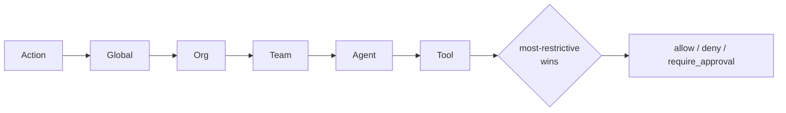

# Policy

## Definition

A **policy** is a declarative document — written in YAML — that states what
agents are and are not allowed to do. It is **not a rule list**. A document is a
set of independent *sections*, each governing one dimension of behaviour, and the
gateway evaluates them in a fixed order to reach one of three outcomes: *allow*,
*deny*, or *requires approval*. Policy is evaluated **server-side, in the
gateway** — never by the agent or the dashboard — so the workload it governs
cannot tamper with the decision.

## How it works

A document may be written in either of two accepted shapes. The **envelope** form
carries `apiVersion`, `kind`, `metadata`, and a `spec` holding the sections; this
is what every file under `policy-examples/` uses. The **bare** form puts the same
sections at the top level with no envelope. The validator tries the envelope first
and, when a `spec` key is present, parses its inner value; otherwise it reads the
document flat. Both forms are equally valid.

Inside `spec` (or at the top level, in the bare form) the accepted keys are
exactly:

| key | governs |
| --- | --- |
| `version` | document version tag |
| `scope` | which agents this document applies to |
| `network` | egress domain `allowlist` |
| `schedule` | `active_hours` — `start`, `end`, `timezone` |
| `budget` | per-agent / per-team / per-org daily and monthly USD caps, `action_on_exceed` |
| `data` | `sensitive_patterns`, `credential_action`, `locale_packs` |
| `tools` | per-tool `allow`, `limit_per_hour`, `requires_approval_if` |
| `capabilities` | capability-string `allow` and `deny` lists |
| `filesystem` | `read` and `write` path-prefix allowlists |
| `syscalls` | kernel syscall `allow` list |
| `approval_timeout_secs` | how long a held action waits (default 300) |
| `approval` | `timeout_seconds` and `escalation_role` overrides |

There is **no `tier` key and no `rules` key**, in either form. The validator
fails closed on anything it does not recognise: an unknown top-level key is a
hard error naming the valid set, and a top-level `rules:` gets its own dedicated
refusal —

```
unsupported rule-list policy schema (top-level 'rules:'); the gateway uses a
section-based schema (network/schedule/budget/data/tools/capabilities) and
refuses to load this document to avoid an allow-all fallback
```

That message is deliberate. A rule-list document that merely failed to match
anything would load cleanly and permit everything, so the gateway refuses to load
it at all rather than degrade to an allow-all. The same fail-closed rule applies
inside each section: a typo in a nested key is rejected, never ignored, so a
misspelling cannot silently drop a restriction.

Policies are **scoped and they cascade.** A document's `scope` field attaches it
to one of five levels — `global`, `org:<id>`, `team:<id>`, `agent:<uuid>`, or
`tool:<name>`. When an action is evaluated the engine walks those scopes in the
order `Global → Org → Team → Agent → Tool` and merges them with a
**most-restrictive-wins** rule. A broad organizational deny therefore cannot be
loosened by a narrower team- or agent-level allow. `Tool` sits at the
most-restrictive end so a policy can deny one MCP server for every agent in a
team even when team-level rules would otherwise permit it.



Budget participates in the decision, through **two distinct mechanisms that are
worth keeping apart.** The first is *reactive* and applies to every governed
action: once an agent's monthly cap — or, failing that, its daily cap — is
already exceeded, the evaluation stage that checks spend denies whatever comes
next, whichever kind of action it is. A `budget.action_on_exceed` of `suspend`
additionally suspends the agent rather than only refusing the one action. The
second is *pre-emptive* and applies to LLM calls only: before an LLM request is
allowed through, the gateway prices it, reserves the projected spend against the
ancestor chain under a lock, and rewrites its own allow into a hard deny when the
call cannot be afforded. Nothing is charged in that case. So "a request that
*would* breach the limit is refused before it runs" is true of LLM calls
specifically; for every other action the cap bites on the request *after* the one
that crossed it.

## Example

A document that gates writes behind human approval, caps spend, and restricts
egress — using the envelope form, as the shipped examples do:

```yaml
apiVersion: agent-assembly/v1
kind: Policy
metadata:
  name: medium-risk-approval-gate
spec:
  version: "1.0"
  scope: team:platform
  approval_timeout_secs: 300
  tools:
    "*":
      allow: true
    db_write:
      allow: true
      requires_approval_if: "governance_level >= L2"
    file_delete:
      allow: false
  budget:
    daily_limit_usd: 25.0
    monthly_limit_usd: 400.0
    action_on_exceed: deny
  network:
    allowlist:
      - api.openai.com
      - api.anthropic.com
  schedule:
    active_hours:
      start: "09:00"
      end: "18:00"
      timezone: Asia/Taipei
```

Every section is optional; an absent section imposes no restriction of its own,
which is why `scope` and cascading matter — the restriction usually comes from a
broader document. Drop the `apiVersion`/`kind`/`metadata`/`spec` wrapper and
promote the sections to the top level and the same document parses identically.

Reference documents live under `policy-examples/` — `low-risk`, `medium-risk`,
`high-risk`, `strict`, `balanced`, `audit-only`, plus capability, filesystem, and
file-delete examples. They are named for the posture they express, not keyed by a
`tier` field; the risk level is the combination of sections each one sets, and
there is no tier keyword anywhere in the schema.

## Related

- [Approval](approval.md) — what `require_approval` triggers and who can decide.
- [Audit](audit.md) — the record every allow and deny produces.
- [Agent](agent.md) — the identity policy is scoped to and evaluated for.
- [Capability matrix](../governance/capability-matrix.md) — capability
  allow/deny restrictions referenced by policy scopes.
- [API reference](../api-reference.md) — `aa-gateway` policy engine
  (`PolicyScope`, `PolicyDocument`) rustdoc entry points.
- Quickstart (tracked under AAASM-418) — applying a first policy end-to-end.
