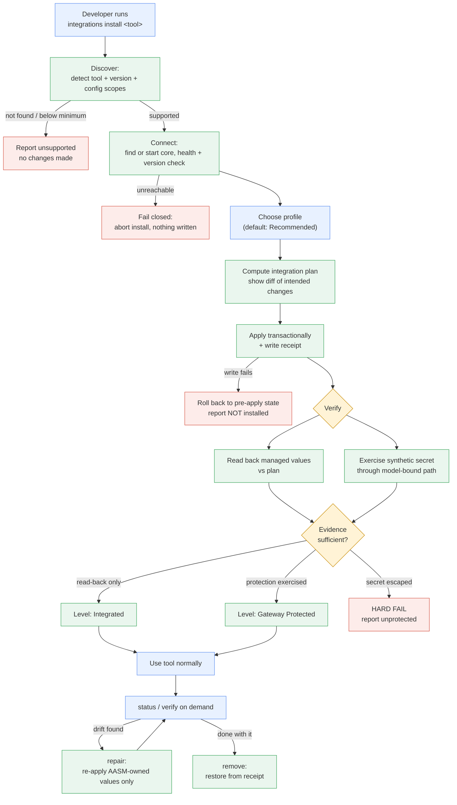
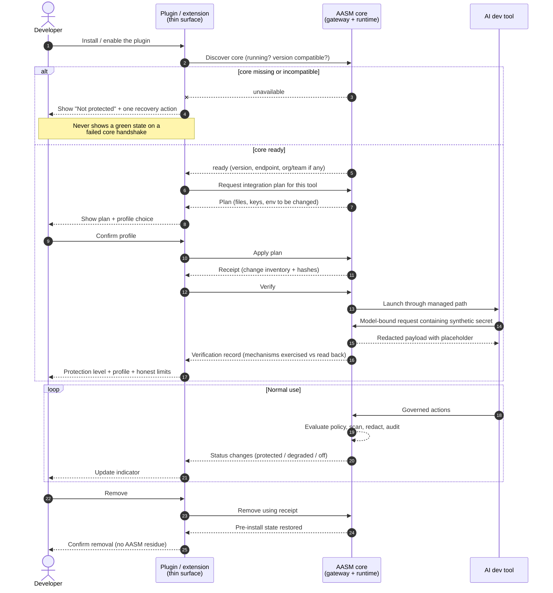

# Developer Integrations — Product Capability Brief

This brief defines the **canonical Developer Integration experience**: how a developer installs
Agent Assembly protection into an AI development tool, what protection they get, what they
provably do *not* get, and how the experience fails. It is the product-level source of truth that
the lifecycle contract (`AAASM-5277`), the plan/receipt/rollback model (`AAASM-5278`), the local
integration API (`AAASM-5279`), the CLI surface (`AAASM-5280`) and the Claude Code
productization (`AAASM-5281`) all implement against.

> **Status:** product definition. Behaviour described here is either (a) grounded in code that
> exists today and cited as such, or (b) explicitly marked **_planned_** with the ticket that
> builds it. Nothing here should be read as a shipped capability unless it is cited to code.
>
> This document deliberately does **not** fill in the Claude Code row of the
> [L0–L3 Capability Matrix](../governance/capability-matrix.md). That row was filled by
> `AAASM-5284` from the `AAASM-5276` evidence and is canonical there, not here.

---

## 1. Purpose and scope

### Why this document exists

The dev-tool governance work to date is organised around *technical* primitives: the
`DevToolAdapter` trait, per-tool adapter crates, the `aasm run` launcher, the gateway and the
proxy. Those primitives are necessary but they are not a product. A developer cannot currently
answer three questions without reading source code:

1. What do I run to become protected?
2. How do I know protection is actually *on*, as opposed to merely *configured*?
3. What is still able to leak?

Every one of those questions is a product question with a security consequence. Answering them
inconsistently per tool is how a governance product ends up over-claiming. This brief fixes the
answers once, at the product layer, so that every tool integration either implements them or
declares the gap explicitly.

### The thin-surface principle

> **Plugins, extensions and installers are thin integration and UX surfaces. The security core —
> policy evaluation, sensitive-data detection, redaction, approval, and audit — lives in Agent
> Assembly and is never reimplemented inside a plugin.**

This is a security boundary, not a code-organisation preference. A plugin runs inside a host
process that the user (and the agent under governance) can influence: it can be disabled,
downgraded, or fed a tampered configuration. If a plugin *decided* whether a secret may leave the
machine, the enforcement decision would sit inside the thing being governed. Instead:

| Concern | Owner | Why |
|---|---|---|
| Detecting the tool, planning changes, writing native config, rendering status | Integration surface (plugin / extension / CLI installer) | Host-specific, UX-shaped, non-authoritative |
| Policy evaluation and the resulting verdict | `aa-gateway` policy engine | Single decision point; auditable |
| Sensitive-data detection and redaction | `aa-security` scanner, driven authoritatively by `aa-runtime` | Must run where the tool cannot suppress it |
| Egress allow/deny on the wire | `aa-gateway` allowlist + `aa-proxy` | Enforced on decrypted traffic, no tool cooperation needed |
| Audit record of what happened | `aa-gateway` audit path | Written outside the governed process |

A corollary the whole document depends on: **an integration surface may never be the source of a
protection claim.** It reports what the core observed; it does not assert protection on the
core's behalf.

### In scope

- The persona set, entry points and end-to-end journey every tool integration must support.
- The user-visible protection profiles and protection levels, with testable definitions.
- Truthful guarantee and limitation copy, reusable verbatim by the CLI, a future UI and public docs.
- The MVP boundary and the non-goals that must not be quietly re-entered.
- The acceptance-test scenarios the `AAASM-5276` Spike is expected to satisfy.

### Out of scope

- Choosing the IPC transport between an integration client and the core (`AAASM-5279`).
- The concrete API/trait shape of the lifecycle contract (`AAASM-5275`, `AAASM-5277`).
- Implementing any CLI or plugin UI (`AAASM-5280`, `AAASM-5282`).
- Per-tool tier declarations — those belong in the
  [L0–L3 Capability Matrix](../governance/capability-matrix.md).

---

## 2. MCP is one optional tool capability, not the plugin architecture

**MCP is not the integration mechanism, and no integration is required to use it.** "Plugin" here
is a *product and distribution* concept — the thing a developer installs. MCP is one of several
*mechanisms* an integration may drive, and for several tools it is not the most useful one.

Conflating the two is a live risk because the word "plugin" is overloaded by the tools themselves.
The concrete failure mode it would cause: designing the lifecycle around an MCP server would make
protection depend on the agent choosing to call a tool — an agent-cooperative design, which is
exactly the property enforcement must not have.

The mechanisms an integration may use, and what each is good for:

| Mechanism | What it can do | Agent-cooperative? |
|---|---|---|
| **Managed settings** (tool-native config file) | Constrain what the tool will do at startup — permission lists, MCP server enable/disable. For Claude Code this is `settings.json`; the adapter owns exactly four keys (`permissions`, `permissionMode`, `enabledMcpjsonServers`, `disabledMcpjsonServers`) and preserves every other key (`aa-devtool-claude-code/src/apply.rs`). | No — applied before the agent runs |
| **Managed launch** (`aasm run`) | Start the tool as a child process with governance identity and proxy routing injected (`AA_AGENT_ID`, `AA_TEAM_ID`, `HTTPS_PROXY` — `aa-cli/src/commands/run.rs`). | No |
| **Model gateway / base URL** | Route model-bound traffic through a governed endpoint so requests are scanned before egress. | No |
| **HTTP/HTTPS proxy** | Intercept outbound HTTPS at the wire via `aa-proxy`'s per-host CA, independent of the tool's cooperation. | No |
| **Hooks / permission callbacks** | Let the tool ask AASM for a verdict before performing an action, enabling approval flows. | Partly — the tool must invoke the hook |
| **Environment injection** | Carry identity and endpoint configuration into the tool process. | No |
| **MCP configuration** | Govern *which* MCP servers the tool may load, and optionally expose AASM capabilities as MCP tools. | Loading control: no. Tool exposure: yes |
| **IDE extension API** | Surface status/UX inside an editor, and where the host allows it, veto actions. | Depends on host |
| **Host enforcement** (OS-level) | Constrain the process regardless of its configuration. **Opt-in only** (`AAASM-5298`) — reachable through the explicitly authorized, read-back-verified managed-settings install, never by default. See §7.3. | No |

Read the table by the last column. The mechanisms that produce a real guarantee are the ones the
governed agent cannot decline. MCP appears twice, and only its *loading control* half is
non-cooperative — which is why MCP is classified as **optional, defence-in-depth**, never as a
required substrate.

---

## 3. Personas and entry points

Four personas. They differ less in *what* protection they need than in **what they must never be
required to understand** — which is the constraint that actually shapes the product. The
"must not have to understand" column is therefore normative: if an integration forces a persona to
learn one of those concepts, the integration has failed for that persona regardless of whether
protection works.

### 3.1 Individual developer (local)

| | |
|---|---|
| **Entry point** | A single command (`aasm integrations install claude-code` — shipped, `AAASM-5280`) or an install action inside the tool. |
| **Mental model** | "I want my coding agent not to leak my secrets." No org, no policy authoring. |
| **Must not have to understand** | MCP, proxies, CA certificates, `settings.json` paths, gateway endpoints, enforcement modes, `GovernanceLevel`. |
| **Policy source** | The chosen protection profile's built-in defaults. |
| **Success signal** | A status line naming the protection level and the profile, plus a passing protection test — not "installed successfully". |
| **Primary failure risk** | Silent no-op: the config was written, the tool never routed through it, and status still claims protection. §7 entry criteria exist to make this impossible. |

### 3.2 Team developer (org-managed policy)

| | |
|---|---|
| **Entry point** | Same install surface, plus a connect step that binds the machine to an org/team identity. |
| **Mental model** | "My employer has rules; I want to be compliant without babysitting it." |
| **Must not have to understand** | Policy YAML, cascade merge order, RBAC, where policy is stored. |
| **Policy source** | Org/team policy cascade resolved by the gateway — the local profile choice is bounded by it and cannot loosen it. |
| **Success signal** | Status shows the governing team and that the effective policy came from the org, not from a local default. |
| **Primary failure risk** | A local profile silently overriding org policy. The merge is most-restrictive-wins (`aa-gateway/src/engine/decision.rs`), so a local profile may only *tighten*. |

### 3.3 CLI-first user

| | |
|---|---|
| **Entry point** | Terminal, scripted or interactive; expects exit codes and machine-readable output. |
| **Mental model** | "This is a tool in my shell; it should compose." |
| **Must not have to understand** | Any GUI concept. Prompts must be skippable with explicit flags. |
| **Requirements it adds** | Non-interactive mode, deterministic exit codes, stable structured output, and idempotent re-invocation (running install twice must not double-apply or fail). |
| **Success signal** | `verify` exits zero and prints the exercised protection level. |
| **Primary failure risk** | Interactive-only flows that break automation, and status output that is human prose only. |

### 3.4 IDE / plugin-first user

| | |
|---|---|
| **Entry point** | The tool's own extension or plugin surface; may never open a terminal. |
| **Mental model** | "I installed a thing in my editor and now I'm protected." |
| **Must not have to understand** | That a separate core runtime exists at all — until it stops, at which point they must be told plainly. |
| **Requirements it adds** | The extension must discover or start the core, degrade visibly (not silently) when it cannot, and never make an enforcement decision locally. |
| **Success signal** | A persistent, honest status indicator that distinguishes *protected*, *degraded* and *off* — three states, never two. |
| **Primary failure risk** | A green indicator that reflects plugin health rather than core-observed protection. The indicator must be driven by core-reported evidence (§7). |

### 3.5 What is common to all four

Every persona shares one requirement: **the difference between "configured" and "protected" must
be visible in the product, not only in the docs.** That single requirement is what §7's entry
criteria and §11's acceptance scenarios exist to enforce.

## 4. The canonical journey

Every tool integration implements the same nine stages. A tool that cannot support a stage
declares it unsupported rather than skipping it silently — a skipped stage is indistinguishable
from a broken one, and the failure surfaces later as an over-claimed protection level.

```text
Discover → Install → Connect → Choose profile → Apply → Verify → Use → Diagnose/Repair → Remove
```

The stage order encodes one deliberate decision: **Verify comes after Apply and before Use, and
it is the only stage permitted to raise the displayed protection level.** Apply changes
configuration; only Verify produces evidence that protection was exercised. Everything in §7
follows from that split.

### 4.1 Discover

| | |
|---|---|
| **User does** | Nothing, or runs a status/list command. |
| **AASM does** | Probes for the tool and its version. For Claude Code, `detect()` resolves the `claude` binary and validates the reported version against `MIN_VERSION` (`1.0.0`), treating anything lower as *absent* rather than partially supported (`aa-devtool-claude-code/src/lib.rs`). Resolves which settings scopes exist (project `.claude/settings.json` when a `.claude/` directory is present in the working directory, otherwise `~/.claude/settings.json`). |
| **Evidence produced** | A tool inventory record: kind, version, config paths, and the adapter's declared `GovernanceLevel` cap. |
| **Can fail** | Tool absent; version below minimum; config directory unreadable (`AdapterError::DetectionFailed` — distinct from `ToolNotFound`, because "permission denied" must not be reported as "not installed"). |

### 4.2 Install

| | |
|---|---|
| **User does** | Issues one install action and, if the plan touches something they own, confirms it. |
| **AASM does** | Computes an **integration plan** before mutating anything — the exact set of files, keys and env changes it intends to make — then applies it transactionally and writes an **installation receipt** (shipped, `AAASM-5278`), on top of the managed-key merge with atomic write (temp file + rename) that preserves all unmanaged keys. |
| **Evidence produced** | The plan (reviewable before apply) and the receipt (the sole basis for later drift detection and removal). |
| **Can fail** | Insufficient permissions; a conflicting managed configuration already present from another tool; partial application (see §9.3). |
| **Invariant** | **Idempotent.** A second install on an unchanged system produces no additional change and no error. |

### 4.3 Connect

| | |
|---|---|
| **User does** | Nothing for local-only use. A team developer authenticates to their org. |
| **AASM does** | Discovers a running local core, or starts one; performs a health/readiness check and a version-compatibility check before declaring the integration usable. Acquires the gateway/proxy endpoint to be injected at launch. |
| **Evidence produced** | A recorded core version, endpoint and connection identity; for team users, the resolved org/team. |
| **Can fail** | Core missing or not ready (§9.1); version mismatch between the integration client and the core (§9.6); org authentication failure. |

### 4.4 Choose profile

| | |
|---|---|
| **User does** | Picks `Recommended`, `Strict` or `Observe only` — or accepts the default, which is `Recommended`. |
| **AASM does** | Resolves the profile into concrete policy settings (§6). For an org-managed machine the profile is *bounded by* org policy and may only tighten it. |
| **Evidence produced** | The effective resolved settings, with each value attributed to its source (profile default vs org policy). |
| **Can fail** | A requested profile is looser than org policy — resolved by clamping to the org value and saying so, never by silently accepting the looser choice. |

### 4.5 Apply

| | |
|---|---|
| **User does** | Waits. |
| **AASM does** | Executes the plan: writes managed settings, registers the tool with the gateway, and prepares managed launch. Writes only AASM-owned keys. |
| **Evidence produced** | Receipt updated with the applied change inventory and a content hash per managed value, so later drift can be detected by comparison rather than by guessing. |
| **Can fail** | Write failure mid-plan → roll back to the pre-apply state recorded in the receipt; report the integration as *not installed*, never as partially protected. |

### 4.6 Verify

| | |
|---|---|
| **User does** | Runs verify, or it runs automatically at the end of install. |
| **AASM does** | Reads back every managed value and compares it to the plan, **and** exercises protection end-to-end with a synthetic secret: a value that matches the deterministic scanner is placed into a model-bound path, routed to a controlled endpoint, and the result is asserted (§11.3–§11.5). |
| **Evidence produced** | A verification record naming which mechanisms were confirmed *by exercise* and which only *by read-back*. These are reported separately; only the former raises the protection level. |
| **Can fail** | Read-back mismatch; the synthetic secret reaching the endpoint (§9.5) — a hard failure that must never be reported as a warning. |

### 4.7 Use

| | |
|---|---|
| **User does** | Uses the tool exactly as before. |
| **AASM does** | Applies the profile's enforcement posture on every governed action, records audit events, and holds the protection level current — including downgrading it if the core stops mid-session. |
| **Evidence produced** | Audit events carrying finding *metadata* only, never raw secret values (`aa-security/src/redaction.rs`). |
| **Can fail** | Core stops mid-session (§9.1); the tool is upgraded underneath the integration (§9.7); the user launches the tool outside the managed path, which is a **bypass, not a failure**, and is reported as such. |
| **Invariant** | Normal operation must not be degraded into something the developer works around. A protection that makes the tool unpleasant gets uninstalled, which is a net security loss. |

### 4.8 Diagnose / Repair

| | |
|---|---|
| **User does** | Runs status, and repair if status reports drift. |
| **AASM does** | Compares live state against the receipt across *every* managed mechanism, classifies each difference as AASM-repairable drift or a deliberate user change, and re-applies only AASM-owned values. |
| **Evidence produced** | A per-mechanism drift report: expected, actual, and the action taken. |
| **Can fail** | Drift that repair cannot resolve (e.g. the tool removed the config surface entirely) → escalate to reinstall, and drop the protection level in the meantime. |
| **Invariant** | Repair never rewrites a key AASM does not own, even when that key is the cause of the drift. It reports it instead. |

### 4.9 Remove

| | |
|---|---|
| **User does** | Runs remove. |
| **AASM does** | Uses the receipt to restore the pre-install value of every managed key — restoring the original value where one existed, deleting the key where none did — and removes only AASM-owned artifacts. |
| **Evidence produced** | A removal report, and a post-removal state that a test can compare **semantically** against the pre-install snapshot. Byte-exactness is *not* claimed — accepted constraint C3: the settings document is reserialised on write, so non-canonical formatting is not reproduced verbatim. |
| **Can fail** | Receipt missing or corrupt → refuse to guess. Report what AASM believes it owns and require explicit confirmation before touching anything. |
| **Invariant** | Unrelated user configuration is preserved through the whole install→remove cycle. Removal must leave no AASM residue and no collateral deletion. |

## 5. Journey diagrams

Both entry points drive the **same** lifecycle against the **same** core. They differ only in
where the user stands and how status is surfaced. That is the point of the diagrams: if the two
paths could reach different protection outcomes, the integration surface would be making security
decisions, which §1 forbids.

### 5.1 CLI-first onboarding



### 5.2 Plugin / extension-first onboarding

The plugin never decides anything. Every arrow that crosses into the core is a request for a
verdict or for evidence; every status the plugin renders is something the core told it.



## 6. Protection profiles

A profile is a **named bundle of concrete core settings**, not a mood. Every profile below is
defined by the five things a user can actually observe a difference in: the `EnforcementMode`, what
happens to a sensitive-data finding, the approval posture, the network-egress posture, and what
the user sees. Adjectives like "balanced" or "maximum" are deliberately absent — if a profile
cannot be distinguished by one of those five columns, it should not exist.

`EnforcementMode` (`aa-core/src/policy.rs`) has exactly three values, and only two of them are
reachable from a profile:

| Mode | Effect | Reachable from a profile? |
|---|---|---|
| `Enforce` (default) | Deny blocks, redact strips, pending halts execution. | Yes — `Recommended`, `Strict` |
| `Observe` | Decisions computed and audited as shadow events; nothing applied. | Yes — `Observe only` |
| `Disabled` | Policy evaluation skipped entirely. | **No.** Valid only in hermetic test environments; no user-facing profile maps to it, ever. |

### 6.1 Profile definitions

| | **Recommended** (default) | **Strict** | **Observe only** |
|---|---|---|---|
| **`EnforcementMode`** | `Enforce` | `Enforce` | `Observe` |
| **Sensitive-data finding on a model-bound path** | **Redact and proceed.** The match is replaced with a `[REDACTED:<kind>]` placeholder and the request continues (`aa-security` `redact()`; policy pipeline Stage 6 redacts and never denies). | **Redact and proceed by default; block the request when the finding is in a configured high-severity class** — _planned_ (`AAASM-5277`, `AAASM-5281`). Blocking on a scanner finding is **not** core behaviour today; Stage 6 redacts unconditionally. Until that lands, `Strict` differs from `Recommended` on the other four rows only. | **Record only.** The finding is audited; the payload is forwarded unchanged. |
| **Unscannable (oversized) field** | Replaced wholesale with `[REDACTED:OVERSIZED]` — fail-closed (`aa-runtime` `OversizedPolicy::RedactWhole`). | Same. | Recorded; forwarded unchanged, because `Observe` applies nothing. |
| **Approval posture** | Approval required only where policy declares it (`requires_approval_if` → `RequireApproval`). Pending halts execution until decided. | Approval required for the declared cases **plus** destructive tool classes; an approval that times out resolves as deny. | No approval prompts. A would-be `RequireApproval` is audited as a shadow decision and the action proceeds. |
| **Network egress** | Policy allowlist enforced at Stage 2 and at the wire by `aa-proxy`; hosts outside a non-empty allowlist are denied. | Same enforcement, with a narrower default allowlist: model provider endpoints and the local gateway only. | Egress evaluated and audited; nothing blocked. |
| **Budget** | Enforced (`action_on_exceed`, default `Deny`). | Enforced; `Suspend` available. | Tracked and audited; not enforced. |
| **What the user sees** | Occasional "a secret was removed from this request" notices; approval prompts only where policy asks for them. | More prompts and more blocked egress; the trade is explicit. | No interruptions at all, plus a **standing warning that nothing is being enforced**. |
| **Intended for** | Default for every persona unless org policy says otherwise. | Regulated repositories, shared machines, high-sensitivity work. | Evaluating impact before enforcing, and diagnosing whether AASM is the cause of a tool problem. |

### 6.2 Rules that bind all profiles

- **`Observe only` must never be displayed as protection.** Status output for `Observe only` says
  *monitoring*, and any protection level shown alongside it is annotated as not enforced. This is
  the single most likely place for the product to accidentally lie.
- **Org policy clamps the profile.** Profiles resolve into policy inputs that merge with the org
  cascade under most-restrictive-wins. A local profile can tighten; it can never loosen. Choosing
  `Observe only` on an org-managed machine whose policy is `Enforce` yields `Enforce`, and the UI
  says why.
- **A profile never changes what is *detected*** — only what is *done* about it. Detection and
  audit run identically across all three, which is what makes `Observe only` a usable dry run for
  `Recommended`.
- **Switching profile is not a reinstall.** It re-resolves policy inputs; managed settings that
  encode policy are re-applied through the same plan/receipt path so drift detection stays valid.

## 7. Protection levels

A **profile** is what the user chose. A **level** is what the system can prove it is currently
doing. They are separate because a user can choose `Strict` on a machine where the tool is not
routed through the gateway — and the honest answer there is `Integrated`, not `Strict protection
active`.

> **The governing rule: the existence of a configuration file is never sufficient evidence for a
> protection level.** Configuration expresses intent. A level is a claim about behaviour, and a
> claim about behaviour requires an observation of behaviour. Every entry criterion below is
> written to be executable by a test, which is why §11 can assert against them directly.

### 7.1 Integrated

| | |
|---|---|
| **What it protects** | The tool's *startup posture*. Managed settings constrain what the tool will agree to do — permission lists, which MCP servers it may load — and the tool is registered with the gateway so its actions are attributable and auditable. |
| **Testable entry criteria** | **All** must hold: (1) a valid installation receipt exists; (2) every managed key read back from the live config equals the planned value by content hash; (3) the detected tool version is at or above the adapter's minimum; (4) the tool has been launched at least once through the managed path *and* the gateway observed the resulting registration event. Criterion 4 is what makes this a behavioural claim — (1)–(3) alone are configuration and are explicitly **not** sufficient. |
| **Bypasses that remain** | Launching the tool outside the managed path. Editing the managed config by hand (detectable as drift, but only at the next status check). Any model-bound traffic that does not traverse the gateway — at this level, *all* of it. Anything the tool's own config surface cannot express. |
| **Maps to `GovernanceLevel`** | `L1Observe` as a floor. It may reach `L3Native` **for individual capability dimensions** that the tool's native configuration genuinely governs — for Claude Code the MCP enable/disable lists are the candidate — but only per-dimension and only once the [capability matrix](../governance/capability-matrix.md) declares it from `AAASM-5276` evidence. |
| **Honest limit** | **Integrated cannot claim host-level bypass prevention.** It also cannot claim sensitive-data protection, because nothing is inspecting model-bound content at this level. |

### 7.2 Gateway Protected

| | |
|---|---|
| **What it protects** | Model-bound and tool-bound traffic in flight. Requests traverse the AASM gateway/proxy, so the runtime scanner inspects them, secrets are redacted before egress, egress allowlists are enforced, approvals can halt an action, and every decision is audited. |
| **Testable entry criteria** | Everything required for `Integrated`, **plus** a completed protection exercise within the current configuration: a synthetic secret placed in a model-bound path resulted in (a) the controlled endpoint receiving no raw secret, (b) a redaction finding recorded, and (c) the agent receiving a semantics-preserving placeholder. A reachable gateway is not sufficient; a configured proxy address is not sufficient; **traffic must have been observed and acted on**. |
| **Bypasses that remain** | Direct provider connections that do not honour the injected proxy/base URL (an unmanaged launch, a hardcoded endpoint, a separate credential). Traffic from tools other than the governed one. Certificate-pinned clients that reject the proxy CA. Content the deterministic scanner does not match — detection is pattern-based, so *unknown* secret shapes pass through. Anything at all if the user stops the core. |
| **Maps to `GovernanceLevel`** | `L2Enforce` — "allow / deny, approval, redaction, and budget enforcement", which is precisely what traversal of the gateway provides. |
| **Honest limit** | **Gateway Protected cannot claim host-level bypass prevention either.** It protects the paths it sees. A user or an agent that can start a process outside the managed path is outside its scope, by construction. |

### 7.3 Host Enforced

| | |
|---|---|
| **What it protects** | The tool's *policy surface*, not just its configuration: the governing document lives where the developer running the tool cannot rewrite it, so unsetting a variable or editing a settings file cannot widen it. |
| **Testable entry criteria** | §7.2, **plus** an endpoint managed-settings file that Agent Assembly installed under explicit administrator authorization and then read back and verified — exact authorized bytes, valid managed-settings document carrying the managed-only keys, owned by the expected principal, not writable by anyone else. |
| **Availability** | **Opt-in, macOS, one privileged file write** (`AAASM-5298`). Reached only through `aasm integrations install claude-code --install-managed-settings`; never part of a default install, never implied by a profile, and unreachable at `user` or `project` scope. `aasm` itself never runs as root. Kernel-level enforcement stays out of scope: macOS Endpoint Security and Network Extension remain explicit non-goals (§10), and `aa-ebpf` is Linux-only and is a **detection** layer that cannot modify traffic in flight. |
| **What it does not claim** | That a bypass was demonstrated to fail. Anthropic documents the managed-only keys as non-overridable; Agent Assembly has **not** measured a real override attempt against a managed device (the open half of `AAASM-5276` condition C6). Every `Host Enforced` reading carries that caveat in its evidence detail. |
| **Product requirement** | The level must be **named with its reason whenever it is not active**, and **with its caveat whenever it is**. Silence reads as "there is nothing above what I have", which is the over-claim this whole section exists to prevent. |
| **Maps to `GovernanceLevel`** | Nothing today. It is not `L3Native`: `L3Native` means AASM writes the tool's *own* native configuration so governance survives AASM going offline — that is a property of `Integrated`, not a host-level control. Host enforcement is orthogonal to the L0–L3 scale, which describes what a tool adapter achieves, not what the OS enforces. |

### 7.4 Level reporting rules

- **Report the highest level whose criteria are *currently* met**, and re-evaluate rather than
  cache. A level earned at install time is not still true after the core stops.
- **Report the mechanisms behind the level**, split into "exercised" and "read back". A user
  who can see which is which can reason about their own risk; a user shown a single word cannot.
- **Always report the next level up and why it is not active.** For a **default** install that is
  `Host Enforcement: not installed — requires --install-managed-settings` (or, off macOS,
  `unavailable on this platform`).
- **Degrade loudly.** Losing a criterion mid-session drops the level and surfaces it. There is no
  state in which the level shown is higher than the evidence supports.

## 8. Product guarantees and their limits

The copy below is written to be used **verbatim** by the CLI, a future UI and public docs. Each
guarantee is paired with its own limitation, and the two must always travel together — a guarantee
quoted without its limit becomes an over-claim the moment it leaves this page.

Two words carry weight throughout and are used precisely:

- **"supported path"** — a path AASM actually observes: traffic through the managed launch and the
  gateway/proxy, from the governed tool, in the current session. Everything else is unsupported,
  which is not the same as unprotected-by-accident; it is out of scope by construction.
- **"detected"** — matched by the deterministic scanner's pattern set. Detection is not
  comprehension. AASM does not claim to recognise every secret, only the shapes it knows.

### G1 — Sensitive-data handling on supported model-bound paths

> **We guarantee:** on supported model-bound paths, content is scanned before it leaves the
> machine, and every detected secret is replaced with a `[REDACTED:<kind>]` placeholder so the raw
> value is not transmitted. A field too large to scan reliably is replaced wholesale with
> `[REDACTED:OVERSIZED]` rather than forwarded — the scanner fails closed. The agent still
> receives a semantics-preserving placeholder, so the request remains usable.

> **This does NOT guarantee:** that every secret is found. Detection is deterministic and
> pattern-based (`aa-security` `CredentialScanner`), so a credential whose shape is not in the
> pattern set — a bespoke internal token, a secret with no distinguishing prefix, a value split
> across fields — passes through unrecognised. It also does not cover unsupported paths: a direct
> provider connection that ignores the managed proxy/base URL is never scanned. Redaction is not
> encryption and not a data-loss-prevention product.

### G2 — Tool and action monitoring, and approval

> **We guarantee:** governed actions from the managed tool are evaluated against policy before
> they take effect and are recorded in the audit log with agent attribution. Under an `Enforce`
> profile, a denial blocks the action and an action requiring approval halts until a human
> decides. With no applicable policy the system fails closed and denies.

> **This does NOT guarantee:** that every action the tool takes is visible. Enforcement reaches
> the surfaces AASM manages; an action performed through a mechanism the tool does not route
> through those surfaces is neither seen nor blocked. Under an `Observe only` profile **nothing is
> blocked at all** — decisions are computed and audited, and the action proceeds. Approval
> coverage is bounded by what the tool's own hook/callback surface exposes, which varies per tool
> and is declared in the [capability matrix](../governance/capability-matrix.md).

### G3 — Local-only raw-content processing

> **We guarantee:** scanning and redaction of your content happen locally, in the AASM runtime on
> your machine. Raw file contents and raw prompt text are not shipped to Agent Assembly
> infrastructure in order to be analysed.

> **This does NOT guarantee:** that your content stays on your machine overall — the entire point
> of the tool is to send prompts to a model provider, and AASM's job is to make what is sent safe,
> not to prevent sending. Nor does it guarantee that a future org-managed deployment transmits
> nothing: policy documents, audit *metadata* and decision records may be forwarded to a control
> plane where one is configured. Metadata is not raw content, but it is not nothing either.

### G4 — Audit data minimisation

> **We guarantee:** raw secret material is never written to AASM logs, traces, audit events,
> installation receipts, API responses or diagnostic output. Findings are recorded as metadata —
> kind, position, count — and the redaction record deliberately stores no raw value
> (`aa-security/src/redaction.rs`). Diagnostics intended for support are subject to the same rule.

> **This does NOT guarantee:** that *undetected* secrets are absent from audit records. If the
> scanner did not recognise a value (see G1), that value was never classified as a secret and may
> appear in a recorded payload like any other content. Nor does it govern the tool's own logs:
> Claude Code's transcripts, your shell history and your provider's server-side logs are outside
> AASM's control entirely.

### G5 — Drift detection and repair

> **We guarantee:** the installation receipt records what AASM changed, so status can compare live
> state against it across every managed mechanism, report each difference, and re-apply only
> AASM-owned values. Where drift means protection is no longer active, the reported protection
> level drops.

> **This does NOT guarantee:** real-time detection. Drift is found when status/verify runs, so a
> window exists between a change and its discovery. Repair is also deliberately narrow: AASM will
> not overwrite a key it does not own, even when that key is the cause — it reports and stops.
> Some drift is unrepairable in place (the tool removed the config surface, the tool's schema
> changed) and requires a reinstall.

### G6 — Removal and restoration

> **We guarantee:** removal uses the receipt to restore the pre-install value of every managed
> key — restoring the original where one existed and deleting the key where none did — and removes
> only AASM-owned artifacts. Unrelated user configuration is preserved through the entire
> install→use→remove cycle, because AASM writes only its four managed keys and merges them over
> existing content with an atomic write (`aa-devtool-claude-code/src/apply.rs`).

> **This does NOT guarantee:** restoration without a receipt. If the receipt is missing or
> corrupt, AASM refuses to guess and requires explicit confirmation rather than deleting on a
> hunch. It also does not undo changes AASM did not make: config the *user* edited after install
> is left as the user left it, and any change made by the tool itself is out of scope.

### G7 — What we never claim

Stated positively so it can be quoted directly:

- We do not claim host-level bypass prevention. A user or process able to launch the tool outside
  the managed path is outside our enforcement, at every level available in this MVP.
- We do not claim protection for unmanaged direct provider connections.
- We do not claim complete secret detection.
- We do not claim protection while the core is stopped. Protection is a running-system property;
  when the core is down the product says *not protected*, not *protection unknown*.

## 9. Failure journeys

**Default posture: fail closed.** When AASM cannot establish that protection is active, it reports
*not protected* and — where a decision is required — denies. The gateway already behaves this way:
an empty policy cascade returns `Deny { reason: "no policy — fail-closed" }` rather than allowing
(`aa-gateway/src/engine/decision.rs`).

Failing closed does *not* mean bricking the developer's tool. The tool remains usable; what fails
closed is the **protection claim** and any decision AASM is asked to make. The two exceptions
below are marked explicitly, and both are exceptions in *availability*, never in claim: in both
cases the product says it is not protecting.

| # | Failure | Detection signal | User-visible message intent | Recovery path | Fails |
|---|---|---|---|---|---|
| 9.1 | **Core runtime missing or stopped** | Health/readiness probe fails at connect, or the connection drops mid-session. | "Agent Assembly is not running. Your tool still works, but it is **not protected** right now." Never "protection status unknown". | Start the core; status re-evaluates and restores the level automatically. If it stopped mid-session, say when protection ended. | **Closed** — level drops to none, decisions deny. *Availability exception:* the tool is not prevented from running. |
| 9.2 | **Unsupported tool version** | Detected version below the adapter minimum, or above a tested maximum. | "This version of the tool is not supported yet. Nothing was changed." Name the detected and required versions. | Upgrade or downgrade the tool; or wait for adapter support. | **Closed** — install refuses; a below-minimum install is treated as *absent* rather than partially governed. |
| 9.3 | **Partial installation** | The plan did not complete: applied changes are a strict subset of the plan, or read-back disagrees with the plan. | "Installation did not complete and has been rolled back. You are not protected." Never present a partial install as reduced protection. | Automatic rollback to the pre-apply state from the receipt, then report the blocking cause. | **Closed** — never report a partially applied plan as any protection level. |
| 9.4 | **Config conflict** | A managed key already holds a value AASM did not write, or another manager owns the same surface. | "Something else is managing this setting. Here is the conflict; choose whether to take it over." Show both values. | Explicit user decision. AASM records the pre-existing value in the receipt first, so removal can restore it. | **Closed** — do not silently overwrite; do not silently skip and claim success. |
| 9.5 | **Protection test failure** (synthetic secret reached the endpoint) | The verify exercise observed the raw synthetic value at the controlled endpoint, or no redaction finding was recorded. | "Protection could not be verified — a test secret was not blocked. Treat this integration as **not protecting**." A hard failure, never a warning. | Report which mechanism was expected to redact and did not; keep the level at most `Integrated`; offer repair/reinstall. | **Closed** — this is the one result that must never be downgraded to advisory. |
| 9.6 | **Plugin / core version mismatch** | Version compatibility check at connect, or a contract call rejected by the core. | "The plugin and Agent Assembly core versions are not compatible. Upgrade *this* component." Name which side to move. | Upgrade the mismatched component; the integration reconnects and re-verifies. | **Closed** — refuse to operate on an unverified contract rather than guessing at compatibility. |
| 9.7 | **Tool update invalidates the integration** | Post-upgrade drift: managed keys missing, config schema changed, or the version moves outside the supported range. | "The tool updated and your protection needs re-applying. You are not protected until it is." Do not imply this was the user's mistake. | Re-run repair; if the schema changed, reinstall. If the new version is unsupported, fall back to 9.2. | **Closed** — level drops immediately on detected drift, before repair is attempted. |

### 9.8 Cross-cutting rules for every failure

- **One cause, one action.** Each message names what happened and the single next action. A
  failure message that offers three options is a message the user will ignore.
- **Never green on a failed check.** No failure path may leave a protection level displayed that
  its criteria (§7) no longer support.
- **Diagnostics are subject to G4.** Any diagnostic bundle produced during triage is scanned and
  redacted like any other output; troubleshooting is not an exemption from data minimisation.
- **A bypass is not a failure.** Launching the tool outside the managed path is reported as an
  unprotected launch, not as an AASM error — the distinction matters because the remedy is
  different and blaming the system trains users to ignore real failures.

## 10. MVP scope and non-goals

### 10.1 What the MVP is

**macOS + Claude Code + the existing deterministic scanner + a local runtime/gateway.**

That narrowness is the point. Proving one vertical slice end-to-end — install, verify with real
evidence, use, detect drift, repair, remove — tells us whether the *lifecycle* works. Adding tools
before the lifecycle is proven multiplies unvalidated surface by unvalidated tools, and the first
honest failure would then be indistinguishable from an integration bug.

| Dimension | MVP | Rationale |
|---|---|---|
| Platform | macOS | One host platform; host-level enforcement is out of scope anyway, so a second platform adds no new security property. |
| Tool | Claude Code | Adapter primitives already exist (`aa-devtool-claude-code`), and it is a CLI, so managed launch and proxy routing are viable. |
| Detection | The existing deterministic `aa-security` scanner | Deterministic and testable. No new detection engine is in scope. |
| Runtime | Local core (gateway + runtime + proxy) on the developer's machine | Keeps raw-content processing local (G3) and removes control-plane dependencies from the critical path. |
| Distribution | CLI installer; a reference plugin shell may be prototyped (`AAASM-5282`) | A marketplace-grade extension is a distribution problem, not a lifecycle problem. |

### 10.2 The model stays multi-tool

Restricting the *MVP* to one tool must not restrict the *model* to one tool. The following stay
tool-neutral and are validated against the existing Codex / Copilot / Windsurf adapters as well:
the nine-stage journey (§4), the three profiles (§6), the three protection levels and their entry
criteria (§7), the guarantee set (§8), the failure taxonomy (§9), and the lifecycle contract those
imply. Any design that can only be expressed for Claude Code is a design defect, and `AAASM-5277`
is where that is caught.

### 10.3 Explicit non-goals

Each of these is a thing someone will reasonably propose. Each is out of scope, with a reason —
because "no" without a reason gets re-litigated.

| Non-goal | Why |
|---|---|
| **macOS Endpoint Security / Network Extension** | A kernel-level route to host enforcement, and it carries entitlement, signing and distribution burdens far beyond MVP validation. `Host Enforced` (§7.3) is reached instead through an opt-in, authorized, read-back-verified managed-settings install (`AAASM-5298`); ES/NE's absence means that route specifically stays out of scope, not that §7.3 is unreachable. |
| **Windows / Linux host enforcement** | Same reasoning; different mechanisms. `aa-ebpf` is Linux-only and is a detection layer that cannot modify traffic, so it is not a substitute. |
| **Marketplace extensions** | Publishing to a tool's extension marketplace is a distribution and review-process problem. A reference shell (`AAASM-5282`) is enough to prove the plugin path. |
| **Dynamic Rust plugin loading** | Adapters are build-time linked today; there is no `inventory`-style registration and no shared-library loading (`docs/src/devtools/plugins.md`). Adding dynamic loading would introduce a code-loading trust boundary for no MVP benefit. |
| **Claiming protection for unmanaged direct provider connections** | A connection AASM never sees cannot be protected by AASM. Claiming otherwise would invalidate every guarantee in §8. |
| **Selecting the final IPC transport** | Owned by `AAASM-5279`; a product brief must not prejudge it. |
| **Additional detection providers** (e.g. richer PII/secret engines) | The deterministic scanner is the MVP's detection surface. Swapping it changes what G1 means and needs its own evaluation. |
| **Codex / Copilot / Windsurf / JetBrains productization** | Their adapters exist; productizing their *lifecycle* comes after the lifecycle is proven once. |

## 11. Acceptance-test scenarios for the `AAASM-5276` Spike

These are the scenarios the Spike must be able to execute and report on. They are written in
Given/When/Then so they can be lifted directly into the Spike harness and, later, into the
conformance suite (`AAASM-5283`).

Every scenario shares one design rule, and it is the reason the list exists at all:

> **A scenario passes on observed behaviour, never on the presence of configuration.** Any
> assertion satisfiable by reading a config file is not an acceptance test — it is a read-back
> check, and §7 forbids raising a protection level on one.

**Environment for all scenarios:** macOS; a supported Claude Code release; a temporary repository;
a local AASM core; a mock model provider endpoint that records every request body it receives; and
a synthetic secret whose value matches the deterministic scanner's pattern set and appears nowhere
else on the machine.

### 11.1 Idempotent install

> **Given** a machine with Claude Code installed and no AASM integration,
> **When** `install` is run and then run a second time with no intervening change,
> **Then** the first run produces an integration plan, applies it and writes a receipt; the second
> run reports no changes required, exits successfully, applies no additional mutation, and leaves
> the managed configuration and receipt byte-identical to the first run's result.

### 11.2 Unrelated user settings preserved

> **Given** a Claude Code settings file containing user-authored keys outside the AASM-managed set,
> and a snapshot taken beforehand,
> **When** install, verify, repair and remove are each executed in sequence,
> **Then** every unmanaged key retains its original value and ordering-independent content at every
> step, and after removal the file (or its absence) matches the pre-install snapshot **semantically**
> (accepted constraint C3 — restore is semantics-exact, not byte-exact).

### 11.3 Synthetic secret never reaches the model provider

> **Given** a temporary repository containing the synthetic secret, an integration installed under
> the `Recommended` profile, and model traffic routed to the mock provider,
> **When** Claude Code is launched through the managed path and the secret-bearing content is
> caused to enter a model-bound context,
> **Then** the mock provider records at least one request (proving the path was actually exercised)
> and **no** recorded request body contains the raw synthetic value in any encoding the harness
> checks for.

> **Note:** the "at least one request" clause is load-bearing. A test where no traffic reached the
> provider would also satisfy "no raw secret received" while proving nothing.

### 11.4 Agent still receives a usable placeholder

> **Given** the conditions of 11.3,
> **When** the redacted request is delivered,
> **Then** the payload contains a semantics-preserving placeholder in place of the secret (the
> `[REDACTED:<kind>]` form), the surrounding content is otherwise intact, and the Claude Code
> session continues without error — demonstrating that protection does not break the tool.

### 11.5 Raw secret absent from audit, logs, traces and diagnostics

> **Given** a completed run of 11.3,
> **When** the AASM audit events, application logs, traces, the installation receipt, the status
> and verify output, and any generated diagnostic bundle are collected,
> **Then** none of them contains the raw synthetic value, while the redaction *finding metadata*
> (kind and count) is present — proving the secret was detected rather than merely never seen.

### 11.6 Drift detected and repaired in at least two mechanisms

> **Given** a verified installation,
> **When** two distinct managed mechanisms are perturbed independently — for example an
> AASM-managed settings key is edited by hand, and the proxy/gateway endpoint the integration
> injects is changed,
> **Then** `status` reports drift for **both**, naming expected versus actual per mechanism; the
> reported protection level drops before repair is attempted; `repair` restores only AASM-owned
> values; a subsequent `verify` re-exercises protection (not just read-back) and restores the
> level; and any user-authored key touched during the perturbation is left unmodified by repair.

### 11.7 Removal restores pre-install state

> **Given** a snapshot of all affected configuration taken before install,
> **When** the full install → verify → use → remove cycle completes,
> **Then** every managed key is restored to its pre-install value — or deleted where none existed —
> no AASM-owned artifact remains, the post-removal state matches the snapshot **semantically**
> (accepted constraint C3 — restore is semantics-exact, not byte-exact), and Claude Code
> launches and operates normally afterwards.

### 11.8 Protection-level reporting distinguishes the three levels

> **Given** three configurations — (a) managed settings applied but the tool never launched through
> the managed path, (b) a fully verified installation with protection exercised per 11.3, and
> (c) any installation on macOS,
> **When** `status` is invoked in each,
> **Then** (a) reports at most `Integrated` and explicitly does **not** claim sensitive-data
> protection; (b) reports `Gateway Protected` and names the mechanisms confirmed by exercise as
> distinct from those confirmed by read-back; and (c) in every case names `Host Enforced` rather
> than omitting it — with the reason it is not active on a default install, and with the caveat on
> what the attestation covers when an authorized managed-settings install has been verified.

### 11.9 Core stopped mid-session fails closed

> **Given** a verified installation with an active Claude Code session,
> **When** the AASM core is stopped,
> **Then** the reported protection level drops to none within the product's stated detection
> window, status says *not protected* (not "unknown"), and no output continues to display a
> protection level whose §7 criteria are no longer met.

### 11.10 Observe-only profile never reads as protection

> **Given** an installation under the `Observe only` profile,
> **When** the conditions of 11.3 are repeated,
> **Then** the decision is computed and audited as a shadow event, the payload is forwarded
> unchanged (the mock provider **does** receive the synthetic value), and status describes the
> state as monitoring with a standing not-enforcing warning — never as protected.

> **Note:** this scenario deliberately asserts that the secret *does* reach the provider. That is
> the correct behaviour for `EnforcementMode::Observe`, and asserting it is how the product proves
> its own honesty: the profile that does not protect must not be able to look like the one that
> does.

### 11.11 Unmanaged launch is reported as a bypass

> **Given** a verified installation,
> **When** Claude Code is launched directly, outside the managed path,
> **Then** the session is not protected, and status reports an unprotected launch as a **bypass**
> rather than as an AASM failure — establishing that the product can distinguish "we are broken"
> from "you went around us".

### 11.12 Scenario-to-criteria map

| Scenario | Primary product claim under test |
|---|---|
| 11.1 | §4.2 idempotence |
| 11.2, 11.7 | G6 removal and restoration |
| 11.3, 11.4 | G1 sensitive-data handling; §7.2 entry criteria |
| 11.5 | G4 audit data minimisation |
| 11.6 | G5 drift detection and repair; §9.7 |
| 11.8 | §7 level reporting rules; C3, C4 |
| 11.9 | §9.1 fail-closed; G7 |
| 11.10 | §6.2 "`Observe only` is never protection" |
| 11.11 | §7.1/§7.2 remaining bypasses; §9.8 |

## 12. Assumptions register

The two tables below are deliberately separated. **Accepted constraints** are decisions already
made — they are not open questions and should not be re-argued in implementation tickets.
**Assumptions requiring validation** are beliefs this brief rests on that could turn out to be
wrong; each names the ticket that would prove or disprove it. If one is invalidated, the
corresponding section of this document changes rather than being quietly worked around.

### 12.1 Accepted constraints (decided — do not re-litigate)

| # | Constraint | Consequence |
|---|---|---|
| C1 | The security core lives in Agent Assembly; integration surfaces are thin and non-authoritative. | §1. No enforcement logic ships inside a plugin. |
| C2 | MCP is optional, never the plugin architecture. | §2. No lifecycle stage may require MCP. |
| C3 | `Integrated` and `Gateway Protected` cannot claim host-level bypass prevention. | §7. Stated in product copy, not only in docs. |
| C4 | `Host Enforced` is reachable only through an explicit, authorized, read-back-verified managed-settings install; a successful *normal* installation never implies it, and when it is not active the reason is reported rather than hidden. | §7.3, §10.3. |
| C5 | Default posture is fail-closed. | §9. |
| C6 | MVP is macOS + Claude Code; the model stays multi-tool. | §10. |
| C7 | Detection is the existing deterministic scanner; it is incomplete by nature. | G1. Never claim complete detection. |
| C8 | `EnforcementMode::Disabled` is never reachable from a user-facing profile. | §6. |
| C9 | Local policy may only tighten org policy, never loosen it (most-restrictive-wins). | §3.2, §6.2. |
| C10 | Raw secret material never enters logs, traces, audit, receipts, API responses or diagnostics. | G4. |

### 12.2 Assumptions requiring validation

| # | Type | Assumption | If wrong | Validated by |
|---|---|---|---|---|
| A1 | Product | Low-friction, verifiable onboarding materially improves adoption over manually composing adapter + launcher + gateway primitives. | The install surface is not where the adoption barrier is; effort should move elsewhere. | Post-MVP usage evidence; no ticket yet. |
| A2 | Product | Three profiles are enough, and `Recommended` is the right default for all four personas. | Profile set is re-cut before it reaches public docs. | `AAASM-5281`, `AAASM-5284` |
| A3 | Product | Developers accept a protection level that honestly excludes host-level bypass. | Product must either narrow its claims further or fund host enforcement. | `AAASM-5276` UX evidence |
| A4 | Architecture | Claude Code exposes a stable managed-settings surface, and the four managed keys are sufficient to express the profile behaviours. | Managed settings drop to defence-in-depth; more weight moves onto gateway/proxy. | `AAASM-5276` §A |
| A5 | Architecture | Model-bound traffic can be reliably routed through the gateway/proxy via base URL or proxy env, surviving streaming, tool calls, retries and history compaction. | `Gateway Protected` is unreachable for some flows and must be scoped per-flow. | `AAASM-5276` §A, §D |
| A6 | Architecture | A plan → apply → receipt → drift → rollback model can be implemented transactionally over the tool's config surfaces. | Idempotence and clean removal (G6) cannot be guaranteed as written. | `AAASM-5278` |
| A7 | Architecture | The existing primitives compose into the lifecycle with only limited extension. | Larger build than the backlog assumes; Stories need rescoping. | `AAASM-5276` (Go / Conditional Go / No-Go) |
| A8 | Architecture | A capability-based contract expresses all four current adapters without Claude-Code-specific leakage. | §10.2's multi-tool claim fails. | `AAASM-5277` |
| A9 | Security | Redaction on a model-bound path preserves enough semantics that the agent still functions. | Users disable protection to get work done — worse than not shipping it. | `AAASM-5276` §D |
| A10 | Security | A local integration API can be exposed to CLI and plugin clients without creating a privilege-escalation path into the core. | The plugin path is blocked until the boundary is redesigned. | `AAASM-5279` |
| A11 | Security | Drift across managed mechanisms is detectable by comparison against a receipt, with no false "protected" state in the window between checks. | Periodic or event-driven verification becomes mandatory, not optional. | `AAASM-5278`, `AAASM-5283` |
| A12 | Security | The deterministic scanner's coverage is adequate for a credible MVP protection claim. | G1's limitation must be stated more prominently, or detection must be extended (currently a non-goal). | `AAASM-5276` §D |
| A13 | UX | Users can tell "configured" from "protected" when the product distinguishes them. | The distinction needs stronger UI treatment than status text. | `AAASM-5280`, `AAASM-5282` |
| A14 | UX | A three-state indicator (protected / degraded / off) is understood without documentation. | Indicator design is revised before public docs. | `AAASM-5282`, `AAASM-5284` |
| A15 | UX | Install-time latency and per-request overhead stay within what developers tolerate. | Profiles or interception points must be re-tuned. | `AAASM-5276` (latency/startup observations) |

---

## References

- [L0–L3 Governance Capability Matrix](../governance/capability-matrix.md) — canonical tier
  definitions and per-tool declarations, including the Claude Code row.
- [Onboarding a Developer Integration](onboarding.md) — the install → verify → operate → remove
  path with the commands and exit codes that exist today.
- [Protection levels](protection-levels.md) — §7 restated as an operational reference.
- [Limitations and known bypasses](limitations.md) — the demonstrated-versus-inferred bypass
  split and the other honest limits.
- [Protection and enforcement](../security/protection-model.md) — the policy pipeline, redaction
  semantics and fail-closed behaviour this brief's guarantees rest on.
- [Three-layer defense in depth](../security/three-layer-defense.md) — SDK / proxy / eBPF.
- `aa-core/src/dev_tool.rs` — `GovernanceLevel` (`L0Discover` … `L3Native`).
- `aa-core/src/policy.rs` — `EnforcementMode` (`Enforce` / `Observe` / `Disabled`).
- `AAASM-5275` — plugin, adapter, lifecycle API and core-runtime boundaries.
- `AAASM-5276` — Claude Code lifecycle Spike (consumes §11 of this document).
- `AAASM-5277` … `AAASM-5281` — lifecycle contract, plan/receipt/rollback, local integration API,
  CLI commands, Claude Code productization.
- `AAASM-5284` — public onboarding, protection-level and limitation docs.
