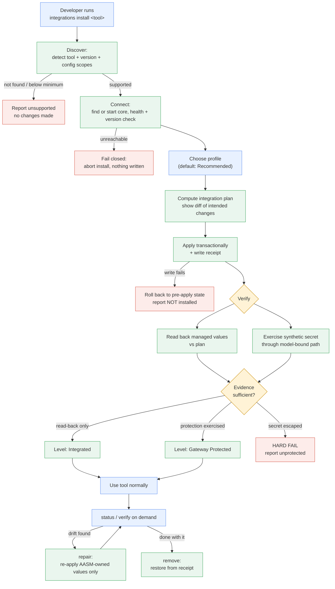
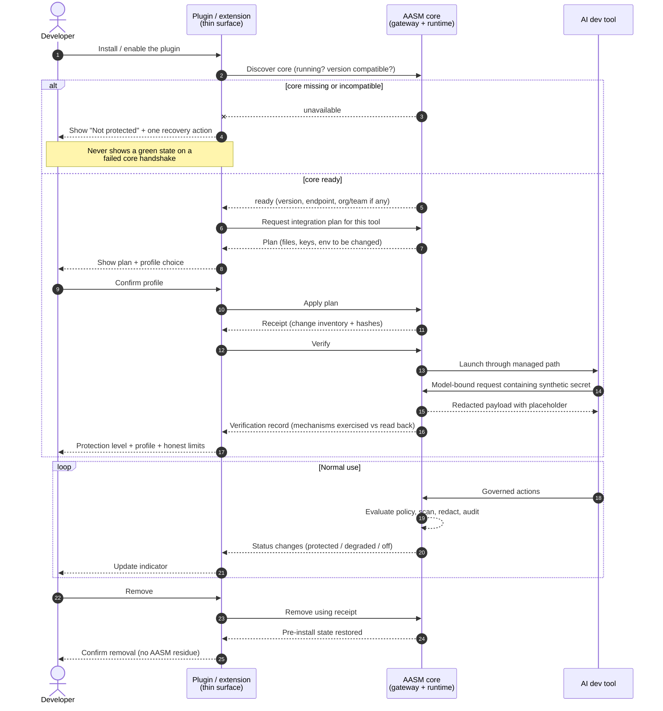

# Developer Integrations — Product Capability Brief

This brief defines the **canonical Developer Integration experience**: how a developer installs
Agent Assembly protection into an AI development tool, what protection they get, what they
provably do *not* get, and how the experience fails. It is the product-level source of truth that
the lifecycle contract (`AAASM-5277`), the plan/receipt/rollback model (`AAASM-5278`), the local
integration API (`AAASM-5279`), the CLI surface (`AAASM-5280`) and the Claude Code
productization (`AAASM-5281`) all implement against.

> **Status:** product definition. Behaviour described here is either (a) grounded in code that
> exists today and cited as such, or (b) explicitly marked **_planned_** with the ticket that
> builds it. Nothing here should be read as a shipped capability unless it is cited to code.
>
> This document deliberately does **not** fill in the Claude Code row of the
> [L0–L3 Capability Matrix](../governance/capability-matrix.md) — that row stays `TBD` until
> `AAASM-5276` produces evidence and `AAASM-5284` publishes it.

---

## 1. Purpose and scope

### Why this document exists

The dev-tool governance work to date is organised around *technical* primitives: the
`DevToolAdapter` trait, per-tool adapter crates, the `aasm run` launcher, the gateway and the
proxy. Those primitives are necessary but they are not a product. A developer cannot currently
answer three questions without reading source code:

1. What do I run to become protected?
2. How do I know protection is actually *on*, as opposed to merely *configured*?
3. What is still able to leak?

Every one of those questions is a product question with a security consequence. Answering them
inconsistently per tool is how a governance product ends up over-claiming. This brief fixes the
answers once, at the product layer, so that every tool integration either implements them or
declares the gap explicitly.

### The thin-surface principle

> **Plugins, extensions and installers are thin integration and UX surfaces. The security core —
> policy evaluation, sensitive-data detection, redaction, approval, and audit — lives in Agent
> Assembly and is never reimplemented inside a plugin.**

This is a security boundary, not a code-organisation preference. A plugin runs inside a host
process that the user (and the agent under governance) can influence: it can be disabled,
downgraded, or fed a tampered configuration. If a plugin *decided* whether a secret may leave the
machine, the enforcement decision would sit inside the thing being governed. Instead:

| Concern | Owner | Why |
|---|---|---|
| Detecting the tool, planning changes, writing native config, rendering status | Integration surface (plugin / extension / CLI installer) | Host-specific, UX-shaped, non-authoritative |
| Policy evaluation and the resulting verdict | `aa-gateway` policy engine | Single decision point; auditable |
| Sensitive-data detection and redaction | `aa-security` scanner, driven authoritatively by `aa-runtime` | Must run where the tool cannot suppress it |
| Egress allow/deny on the wire | `aa-gateway` allowlist + `aa-proxy` | Enforced on decrypted traffic, no tool cooperation needed |
| Audit record of what happened | `aa-gateway` audit path | Written outside the governed process |

A corollary the whole document depends on: **an integration surface may never be the source of a
protection claim.** It reports what the core observed; it does not assert protection on the
core's behalf.

### In scope

- The persona set, entry points and end-to-end journey every tool integration must support.
- The user-visible protection profiles and protection levels, with testable definitions.
- Truthful guarantee and limitation copy, reusable verbatim by the CLI, a future UI and public docs.
- The MVP boundary and the non-goals that must not be quietly re-entered.
- The acceptance-test scenarios the `AAASM-5276` Spike is expected to satisfy.

### Out of scope

- Choosing the IPC transport between an integration client and the core (`AAASM-5279`).
- The concrete API/trait shape of the lifecycle contract (`AAASM-5275`, `AAASM-5277`).
- Implementing any CLI or plugin UI (`AAASM-5280`, `AAASM-5282`).
- Per-tool tier declarations — those belong in the
  [L0–L3 Capability Matrix](../governance/capability-matrix.md).

---

## 2. MCP is one optional tool capability, not the plugin architecture

**MCP is not the integration mechanism, and no integration is required to use it.** "Plugin" here
is a *product and distribution* concept — the thing a developer installs. MCP is one of several
*mechanisms* an integration may drive, and for several tools it is not the most useful one.

Conflating the two is a live risk because the word "plugin" is overloaded by the tools themselves.
The concrete failure mode it would cause: designing the lifecycle around an MCP server would make
protection depend on the agent choosing to call a tool — an agent-cooperative design, which is
exactly the property enforcement must not have.

The mechanisms an integration may use, and what each is good for:

| Mechanism | What it can do | Agent-cooperative? |
|---|---|---|
| **Managed settings** (tool-native config file) | Constrain what the tool will do at startup — permission lists, MCP server enable/disable. For Claude Code this is `settings.json`; the adapter owns exactly four keys (`permissions`, `permissionMode`, `enabledMcpjsonServers`, `disabledMcpjsonServers`) and preserves every other key (`aa-devtool-claude-code/src/apply.rs`). | No — applied before the agent runs |
| **Managed launch** (`aasm run`) | Start the tool as a child process with governance identity and proxy routing injected (`AA_AGENT_ID`, `AA_TEAM_ID`, `HTTPS_PROXY` — `aa-cli/src/commands/run.rs`). | No |
| **Model gateway / base URL** | Route model-bound traffic through a governed endpoint so requests are scanned before egress. | No |
| **HTTP/HTTPS proxy** | Intercept outbound HTTPS at the wire via `aa-proxy`'s per-host CA, independent of the tool's cooperation. | No |
| **Hooks / permission callbacks** | Let the tool ask AASM for a verdict before performing an action, enabling approval flows. | Partly — the tool must invoke the hook |
| **Environment injection** | Carry identity and endpoint configuration into the tool process. | No |
| **MCP configuration** | Govern *which* MCP servers the tool may load, and optionally expose AASM capabilities as MCP tools. | Loading control: no. Tool exposure: yes |
| **IDE extension API** | Surface status/UX inside an editor, and where the host allows it, veto actions. | Depends on host |
| **Host enforcement** (OS-level) | Constrain the process regardless of its configuration. **Not available in this MVP** — see §7. | No |

Read the table by the last column. The mechanisms that produce a real guarantee are the ones the
governed agent cannot decline. MCP appears twice, and only its *loading control* half is
non-cooperative — which is why MCP is classified as **optional, defence-in-depth**, never as a
required substrate.

---

## 3. Personas and entry points

Four personas. They differ less in *what* protection they need than in **what they must never be
required to understand** — which is the constraint that actually shapes the product. The
"must not have to understand" column is therefore normative: if an integration forces a persona to
learn one of those concepts, the integration has failed for that persona regardless of whether
protection works.

### 3.1 Individual developer (local)

| | |
|---|---|
| **Entry point** | A single command (`aasm integrations install claude-code` — _planned_, `AAASM-5280`) or an install action inside the tool. |
| **Mental model** | "I want my coding agent not to leak my secrets." No org, no policy authoring. |
| **Must not have to understand** | MCP, proxies, CA certificates, `settings.json` paths, gateway endpoints, enforcement modes, `GovernanceLevel`. |
| **Policy source** | The chosen protection profile's built-in defaults. |
| **Success signal** | A status line naming the protection level and the profile, plus a passing protection test — not "installed successfully". |
| **Primary failure risk** | Silent no-op: the config was written, the tool never routed through it, and status still claims protection. §7 entry criteria exist to make this impossible. |

### 3.2 Team developer (org-managed policy)

| | |
|---|---|
| **Entry point** | Same install surface, plus a connect step that binds the machine to an org/team identity. |
| **Mental model** | "My employer has rules; I want to be compliant without babysitting it." |
| **Must not have to understand** | Policy YAML, cascade merge order, RBAC, where policy is stored. |
| **Policy source** | Org/team policy cascade resolved by the gateway — the local profile choice is bounded by it and cannot loosen it. |
| **Success signal** | Status shows the governing team and that the effective policy came from the org, not from a local default. |
| **Primary failure risk** | A local profile silently overriding org policy. The merge is most-restrictive-wins (`aa-gateway/src/engine/decision.rs`), so a local profile may only *tighten*. |

### 3.3 CLI-first user

| | |
|---|---|
| **Entry point** | Terminal, scripted or interactive; expects exit codes and machine-readable output. |
| **Mental model** | "This is a tool in my shell; it should compose." |
| **Must not have to understand** | Any GUI concept. Prompts must be skippable with explicit flags. |
| **Requirements it adds** | Non-interactive mode, deterministic exit codes, stable structured output, and idempotent re-invocation (running install twice must not double-apply or fail). |
| **Success signal** | `verify` exits zero and prints the exercised protection level. |
| **Primary failure risk** | Interactive-only flows that break automation, and status output that is human prose only. |

### 3.4 IDE / plugin-first user

| | |
|---|---|
| **Entry point** | The tool's own extension or plugin surface; may never open a terminal. |
| **Mental model** | "I installed a thing in my editor and now I'm protected." |
| **Must not have to understand** | That a separate core runtime exists at all — until it stops, at which point they must be told plainly. |
| **Requirements it adds** | The extension must discover or start the core, degrade visibly (not silently) when it cannot, and never make an enforcement decision locally. |
| **Success signal** | A persistent, honest status indicator that distinguishes *protected*, *degraded* and *off* — three states, never two. |
| **Primary failure risk** | A green indicator that reflects plugin health rather than core-observed protection. The indicator must be driven by core-reported evidence (§7). |

### 3.5 What is common to all four

Every persona shares one requirement: **the difference between "configured" and "protected" must
be visible in the product, not only in the docs.** That single requirement is what §7's entry
criteria and §11's acceptance scenarios exist to enforce.

## 4. The canonical journey

Every tool integration implements the same nine stages. A tool that cannot support a stage
declares it unsupported rather than skipping it silently — a skipped stage is indistinguishable
from a broken one, and the failure surfaces later as an over-claimed protection level.

```text
Discover → Install → Connect → Choose profile → Apply → Verify → Use → Diagnose/Repair → Remove
```

The stage order encodes one deliberate decision: **Verify comes after Apply and before Use, and
it is the only stage permitted to raise the displayed protection level.** Apply changes
configuration; only Verify produces evidence that protection was exercised. Everything in §7
follows from that split.

### 4.1 Discover

| | |
|---|---|
| **User does** | Nothing, or runs a status/list command. |
| **AASM does** | Probes for the tool and its version. For Claude Code, `detect()` resolves the `claude` binary and validates the reported version against `MIN_VERSION` (`1.0.0`), treating anything lower as *absent* rather than partially supported (`aa-devtool-claude-code/src/lib.rs`). Resolves which settings scopes exist (project `.claude/settings.json` when a `.claude/` directory is present in the working directory, otherwise `~/.claude/settings.json`). |
| **Evidence produced** | A tool inventory record: kind, version, config paths, and the adapter's declared `GovernanceLevel` cap. |
| **Can fail** | Tool absent; version below minimum; config directory unreadable (`AdapterError::DetectionFailed` — distinct from `ToolNotFound`, because "permission denied" must not be reported as "not installed"). |

### 4.2 Install

| | |
|---|---|
| **User does** | Issues one install action and, if the plan touches something they own, confirms it. |
| **AASM does** | Computes an **integration plan** before mutating anything — the exact set of files, keys and env changes it intends to make — then applies it transactionally and writes an **installation receipt** (_planned_, `AAASM-5278`). Today the primitive underneath exists: managed-key merge with atomic write (temp file + rename) preserving all unmanaged keys. |
| **Evidence produced** | The plan (reviewable before apply) and the receipt (the sole basis for later drift detection and removal). |
| **Can fail** | Insufficient permissions; a conflicting managed configuration already present from another tool; partial application (see §9.3). |
| **Invariant** | **Idempotent.** A second install on an unchanged system produces no additional change and no error. |

### 4.3 Connect

| | |
|---|---|
| **User does** | Nothing for local-only use. A team developer authenticates to their org. |
| **AASM does** | Discovers a running local core, or starts one; performs a health/readiness check and a version-compatibility check before declaring the integration usable. Acquires the gateway/proxy endpoint to be injected at launch. |
| **Evidence produced** | A recorded core version, endpoint and connection identity; for team users, the resolved org/team. |
| **Can fail** | Core missing or not ready (§9.1); version mismatch between the integration client and the core (§9.6); org authentication failure. |

### 4.4 Choose profile

| | |
|---|---|
| **User does** | Picks `Recommended`, `Strict` or `Observe only` — or accepts the default, which is `Recommended`. |
| **AASM does** | Resolves the profile into concrete policy settings (§6). For an org-managed machine the profile is *bounded by* org policy and may only tighten it. |
| **Evidence produced** | The effective resolved settings, with each value attributed to its source (profile default vs org policy). |
| **Can fail** | A requested profile is looser than org policy — resolved by clamping to the org value and saying so, never by silently accepting the looser choice. |

### 4.5 Apply

| | |
|---|---|
| **User does** | Waits. |
| **AASM does** | Executes the plan: writes managed settings, registers the tool with the gateway, and prepares managed launch. Writes only AASM-owned keys. |
| **Evidence produced** | Receipt updated with the applied change inventory and a content hash per managed value, so later drift can be detected by comparison rather than by guessing. |
| **Can fail** | Write failure mid-plan → roll back to the pre-apply state recorded in the receipt; report the integration as *not installed*, never as partially protected. |

### 4.6 Verify

| | |
|---|---|
| **User does** | Runs verify, or it runs automatically at the end of install. |
| **AASM does** | Reads back every managed value and compares it to the plan, **and** exercises protection end-to-end with a synthetic secret: a value that matches the deterministic scanner is placed into a model-bound path, routed to a controlled endpoint, and the result is asserted (§11.3–§11.5). |
| **Evidence produced** | A verification record naming which mechanisms were confirmed *by exercise* and which only *by read-back*. These are reported separately; only the former raises the protection level. |
| **Can fail** | Read-back mismatch; the synthetic secret reaching the endpoint (§9.5) — a hard failure that must never be reported as a warning. |

### 4.7 Use

| | |
|---|---|
| **User does** | Uses the tool exactly as before. |
| **AASM does** | Applies the profile's enforcement posture on every governed action, records audit events, and holds the protection level current — including downgrading it if the core stops mid-session. |
| **Evidence produced** | Audit events carrying finding *metadata* only, never raw secret values (`aa-security/src/redaction.rs`). |
| **Can fail** | Core stops mid-session (§9.1); the tool is upgraded underneath the integration (§9.7); the user launches the tool outside the managed path, which is a **bypass, not a failure**, and is reported as such. |
| **Invariant** | Normal operation must not be degraded into something the developer works around. A protection that makes the tool unpleasant gets uninstalled, which is a net security loss. |

### 4.8 Diagnose / Repair

| | |
|---|---|
| **User does** | Runs status, and repair if status reports drift. |
| **AASM does** | Compares live state against the receipt across *every* managed mechanism, classifies each difference as AASM-repairable drift or a deliberate user change, and re-applies only AASM-owned values. |
| **Evidence produced** | A per-mechanism drift report: expected, actual, and the action taken. |
| **Can fail** | Drift that repair cannot resolve (e.g. the tool removed the config surface entirely) → escalate to reinstall, and drop the protection level in the meantime. |
| **Invariant** | Repair never rewrites a key AASM does not own, even when that key is the cause of the drift. It reports it instead. |

### 4.9 Remove

| | |
|---|---|
| **User does** | Runs remove. |
| **AASM does** | Uses the receipt to restore the pre-install value of every managed key — restoring the original value where one existed, deleting the key where none did — and removes only AASM-owned artifacts. |
| **Evidence produced** | A removal report, and a post-removal state that a test can compare byte-for-byte against the pre-install snapshot. |
| **Can fail** | Receipt missing or corrupt → refuse to guess. Report what AASM believes it owns and require explicit confirmation before touching anything. |
| **Invariant** | Unrelated user configuration is preserved through the whole install→remove cycle. Removal must leave no AASM residue and no collateral deletion. |

## 5. Journey diagrams

Both entry points drive the **same** lifecycle against the **same** core. They differ only in
where the user stands and how status is surfaced. That is the point of the diagrams: if the two
paths could reach different protection outcomes, the integration surface would be making security
decisions, which §1 forbids.

### 5.1 CLI-first onboarding



### 5.2 Plugin / extension-first onboarding

The plugin never decides anything. Every arrow that crosses into the core is a request for a
verdict or for evidence; every status the plugin renders is something the core told it.



## 6. Protection profiles

A profile is a **named bundle of concrete core settings**, not a mood. Every profile below is
defined by the five things a user can actually observe a difference in: the `EnforcementMode`, what
happens to a sensitive-data finding, the approval posture, the network-egress posture, and what
the user sees. Adjectives like "balanced" or "maximum" are deliberately absent — if a profile
cannot be distinguished by one of those five columns, it should not exist.

`EnforcementMode` (`aa-core/src/policy.rs`) has exactly three values, and only two of them are
reachable from a profile:

| Mode | Effect | Reachable from a profile? |
|---|---|---|
| `Enforce` (default) | Deny blocks, redact strips, pending halts execution. | Yes — `Recommended`, `Strict` |
| `Observe` | Decisions computed and audited as shadow events; nothing applied. | Yes — `Observe only` |
| `Disabled` | Policy evaluation skipped entirely. | **No.** Valid only in hermetic test environments; no user-facing profile maps to it, ever. |

### 6.1 Profile definitions

| | **Recommended** (default) | **Strict** | **Observe only** |
|---|---|---|---|
| **`EnforcementMode`** | `Enforce` | `Enforce` | `Observe` |
| **Sensitive-data finding on a model-bound path** | **Redact and proceed.** The match is replaced with a `[REDACTED:<kind>]` placeholder and the request continues (`aa-security` `redact()`; policy pipeline Stage 6 redacts and never denies). | **Redact and proceed by default; block the request when the finding is in a configured high-severity class** — _planned_ (`AAASM-5277`, `AAASM-5281`). Blocking on a scanner finding is **not** core behaviour today; Stage 6 redacts unconditionally. Until that lands, `Strict` differs from `Recommended` on the other four rows only. | **Record only.** The finding is audited; the payload is forwarded unchanged. |
| **Unscannable (oversized) field** | Replaced wholesale with `[REDACTED:OVERSIZED]` — fail-closed (`aa-runtime` `OversizedPolicy::RedactWhole`). | Same. | Recorded; forwarded unchanged, because `Observe` applies nothing. |
| **Approval posture** | Approval required only where policy declares it (`requires_approval_if` → `RequireApproval`). Pending halts execution until decided. | Approval required for the declared cases **plus** destructive tool classes; an approval that times out resolves as deny. | No approval prompts. A would-be `RequireApproval` is audited as a shadow decision and the action proceeds. |
| **Network egress** | Policy allowlist enforced at Stage 2 and at the wire by `aa-proxy`; hosts outside a non-empty allowlist are denied. | Same enforcement, with a narrower default allowlist: model provider endpoints and the local gateway only. | Egress evaluated and audited; nothing blocked. |
| **Budget** | Enforced (`action_on_exceed`, default `Deny`). | Enforced; `Suspend` available. | Tracked and audited; not enforced. |
| **What the user sees** | Occasional "a secret was removed from this request" notices; approval prompts only where policy asks for them. | More prompts and more blocked egress; the trade is explicit. | No interruptions at all, plus a **standing warning that nothing is being enforced**. |
| **Intended for** | Default for every persona unless org policy says otherwise. | Regulated repositories, shared machines, high-sensitivity work. | Evaluating impact before enforcing, and diagnosing whether AASM is the cause of a tool problem. |

### 6.2 Rules that bind all profiles

- **`Observe only` must never be displayed as protection.** Status output for `Observe only` says
  *monitoring*, and any protection level shown alongside it is annotated as not enforced. This is
  the single most likely place for the product to accidentally lie.
- **Org policy clamps the profile.** Profiles resolve into policy inputs that merge with the org
  cascade under most-restrictive-wins. A local profile can tighten; it can never loosen. Choosing
  `Observe only` on an org-managed machine whose policy is `Enforce` yields `Enforce`, and the UI
  says why.
- **A profile never changes what is *detected*** — only what is *done* about it. Detection and
  audit run identically across all three, which is what makes `Observe only` a usable dry run for
  `Recommended`.
- **Switching profile is not a reinstall.** It re-resolves policy inputs; managed settings that
  encode policy are re-applied through the same plan/receipt path so drift detection stays valid.

## 7. Protection levels

A **profile** is what the user chose. A **level** is what the system can prove it is currently
doing. They are separate because a user can choose `Strict` on a machine where the tool is not
routed through the gateway — and the honest answer there is `Integrated`, not `Strict protection
active`.

> **The governing rule: the existence of a configuration file is never sufficient evidence for a
> protection level.** Configuration expresses intent. A level is a claim about behaviour, and a
> claim about behaviour requires an observation of behaviour. Every entry criterion below is
> written to be executable by a test, which is why §11 can assert against them directly.

### 7.1 Integrated

| | |
|---|---|
| **What it protects** | The tool's *startup posture*. Managed settings constrain what the tool will agree to do — permission lists, which MCP servers it may load — and the tool is registered with the gateway so its actions are attributable and auditable. |
| **Testable entry criteria** | **All** must hold: (1) a valid installation receipt exists; (2) every managed key read back from the live config equals the planned value by content hash; (3) the detected tool version is at or above the adapter's minimum; (4) the tool has been launched at least once through the managed path *and* the gateway observed the resulting registration event. Criterion 4 is what makes this a behavioural claim — (1)–(3) alone are configuration and are explicitly **not** sufficient. |
| **Bypasses that remain** | Launching the tool outside the managed path. Editing the managed config by hand (detectable as drift, but only at the next status check). Any model-bound traffic that does not traverse the gateway — at this level, *all* of it. Anything the tool's own config surface cannot express. |
| **Maps to `GovernanceLevel`** | `L1Observe` as a floor. It may reach `L3Native` **for individual capability dimensions** that the tool's native configuration genuinely governs — for Claude Code the MCP enable/disable lists are the candidate — but only per-dimension and only once the [capability matrix](../governance/capability-matrix.md) declares it from `AAASM-5276` evidence. |
| **Honest limit** | **Integrated cannot claim host-level bypass prevention.** It also cannot claim sensitive-data protection, because nothing is inspecting model-bound content at this level. |

### 7.2 Gateway Protected

| | |
|---|---|
| **What it protects** | Model-bound and tool-bound traffic in flight. Requests traverse the AASM gateway/proxy, so the runtime scanner inspects them, secrets are redacted before egress, egress allowlists are enforced, approvals can halt an action, and every decision is audited. |
| **Testable entry criteria** | Everything required for `Integrated`, **plus** a completed protection exercise within the current configuration: a synthetic secret placed in a model-bound path resulted in (a) the controlled endpoint receiving no raw secret, (b) a redaction finding recorded, and (c) the agent receiving a semantics-preserving placeholder. A reachable gateway is not sufficient; a configured proxy address is not sufficient; **traffic must have been observed and acted on**. |
| **Bypasses that remain** | Direct provider connections that do not honour the injected proxy/base URL (an unmanaged launch, a hardcoded endpoint, a separate credential). Traffic from tools other than the governed one. Certificate-pinned clients that reject the proxy CA. Content the deterministic scanner does not match — detection is pattern-based, so *unknown* secret shapes pass through. Anything at all if the user stops the core. |
| **Maps to `GovernanceLevel`** | `L2Enforce` — "allow / deny, approval, redaction, and budget enforcement", which is precisely what traversal of the gateway provides. |
| **Honest limit** | **Gateway Protected cannot claim host-level bypass prevention either.** It protects the paths it sees. A user or an agent that can start a process outside the managed path is outside its scope, by construction. |

### 7.3 Host Enforced

| | |
|---|---|
| **What it would protect** | The machine, not the integration. Enforcement applied at the operating-system boundary so a process cannot escape by unsetting an environment variable, launching the tool directly, or opening its own socket. |
| **Testable entry criteria** | An OS-level enforcement facility is installed, active, and demonstrated to block a *deliberately unmanaged* launch — i.e. the bypass that defeats §7.1 and §7.2 must be shown to fail. |
| **Availability** | **Not available in this MVP.** macOS Endpoint Security and Network Extension are explicit non-goals (§10), and Windows/Linux host enforcement is out of scope. The `aa-ebpf` layer is Linux-only and is a **detection** layer — it observes SSL and exec/file syscalls but cannot modify traffic in flight, so it cannot supply this level either. |
| **Product requirement** | The level must be **named and reported as unavailable**, not hidden. A user reading status must be able to see that a stronger tier exists and that this machine does not have it. Silence here reads as "there is nothing above what I have", which is the over-claim this whole section exists to prevent. |
| **Maps to `GovernanceLevel`** | Nothing today. It is not `L3Native`: `L3Native` means AASM writes the tool's *own* native configuration so governance survives AASM going offline — that is a property of `Integrated`, not a host-level control. Host enforcement is orthogonal to the L0–L3 scale, which describes what a tool adapter achieves, not what the OS enforces. |

### 7.4 Level reporting rules

- **Report the highest level whose criteria are *currently* met**, and re-evaluate rather than
  cache. A level earned at install time is not still true after the core stops.
- **Report the mechanisms behind the level**, split into "exercised" and "read back". A user
  who can see which is which can reason about their own risk; a user shown a single word cannot.
- **Always report the next level up and why it is not active.** For every MVP install that is
  `Host Enforcement: unavailable on this platform`.
- **Degrade loudly.** Losing a criterion mid-session drops the level and surfaces it. There is no
  state in which the level shown is higher than the evidence supports.

## 8. Product guarantees and their limits

The copy below is written to be used **verbatim** by the CLI, a future UI and public docs. Each
guarantee is paired with its own limitation, and the two must always travel together — a guarantee
quoted without its limit becomes an over-claim the moment it leaves this page.

Two words carry weight throughout and are used precisely:

- **"supported path"** — a path AASM actually observes: traffic through the managed launch and the
  gateway/proxy, from the governed tool, in the current session. Everything else is unsupported,
  which is not the same as unprotected-by-accident; it is out of scope by construction.
- **"detected"** — matched by the deterministic scanner's pattern set. Detection is not
  comprehension. AASM does not claim to recognise every secret, only the shapes it knows.

### G1 — Sensitive-data handling on supported model-bound paths

> **We guarantee:** on supported model-bound paths, content is scanned before it leaves the
> machine, and every detected secret is replaced with a `[REDACTED:<kind>]` placeholder so the raw
> value is not transmitted. A field too large to scan reliably is replaced wholesale with
> `[REDACTED:OVERSIZED]` rather than forwarded — the scanner fails closed. The agent still
> receives a semantics-preserving placeholder, so the request remains usable.

> **This does NOT guarantee:** that every secret is found. Detection is deterministic and
> pattern-based (`aa-security` `CredentialScanner`), so a credential whose shape is not in the
> pattern set — a bespoke internal token, a secret with no distinguishing prefix, a value split
> across fields — passes through unrecognised. It also does not cover unsupported paths: a direct
> provider connection that ignores the managed proxy/base URL is never scanned. Redaction is not
> encryption and not a data-loss-prevention product.

### G2 — Tool and action monitoring, and approval

> **We guarantee:** governed actions from the managed tool are evaluated against policy before
> they take effect and are recorded in the audit log with agent attribution. Under an `Enforce`
> profile, a denial blocks the action and an action requiring approval halts until a human
> decides. With no applicable policy the system fails closed and denies.

> **This does NOT guarantee:** that every action the tool takes is visible. Enforcement reaches
> the surfaces AASM manages; an action performed through a mechanism the tool does not route
> through those surfaces is neither seen nor blocked. Under an `Observe only` profile **nothing is
> blocked at all** — decisions are computed and audited, and the action proceeds. Approval
> coverage is bounded by what the tool's own hook/callback surface exposes, which varies per tool
> and is declared in the [capability matrix](../governance/capability-matrix.md).

### G3 — Local-only raw-content processing

> **We guarantee:** scanning and redaction of your content happen locally, in the AASM runtime on
> your machine. Raw file contents and raw prompt text are not shipped to Agent Assembly
> infrastructure in order to be analysed.

> **This does NOT guarantee:** that your content stays on your machine overall — the entire point
> of the tool is to send prompts to a model provider, and AASM's job is to make what is sent safe,
> not to prevent sending. Nor does it guarantee that a future org-managed deployment transmits
> nothing: policy documents, audit *metadata* and decision records may be forwarded to a control
> plane where one is configured. Metadata is not raw content, but it is not nothing either.

### G4 — Audit data minimisation

> **We guarantee:** raw secret material is never written to AASM logs, traces, audit events,
> installation receipts, API responses or diagnostic output. Findings are recorded as metadata —
> kind, position, count — and the redaction record deliberately stores no raw value
> (`aa-security/src/redaction.rs`). Diagnostics intended for support are subject to the same rule.

> **This does NOT guarantee:** that *undetected* secrets are absent from audit records. If the
> scanner did not recognise a value (see G1), that value was never classified as a secret and may
> appear in a recorded payload like any other content. Nor does it govern the tool's own logs:
> Claude Code's transcripts, your shell history and your provider's server-side logs are outside
> AASM's control entirely.

### G5 — Drift detection and repair

> **We guarantee:** the installation receipt records what AASM changed, so status can compare live
> state against it across every managed mechanism, report each difference, and re-apply only
> AASM-owned values. Where drift means protection is no longer active, the reported protection
> level drops.

> **This does NOT guarantee:** real-time detection. Drift is found when status/verify runs, so a
> window exists between a change and its discovery. Repair is also deliberately narrow: AASM will
> not overwrite a key it does not own, even when that key is the cause — it reports and stops.
> Some drift is unrepairable in place (the tool removed the config surface, the tool's schema
> changed) and requires a reinstall.

### G6 — Removal and restoration

> **We guarantee:** removal uses the receipt to restore the pre-install value of every managed
> key — restoring the original where one existed and deleting the key where none did — and removes
> only AASM-owned artifacts. Unrelated user configuration is preserved through the entire
> install→use→remove cycle, because AASM writes only its four managed keys and merges them over
> existing content with an atomic write (`aa-devtool-claude-code/src/apply.rs`).

> **This does NOT guarantee:** restoration without a receipt. If the receipt is missing or
> corrupt, AASM refuses to guess and requires explicit confirmation rather than deleting on a
> hunch. It also does not undo changes AASM did not make: config the *user* edited after install
> is left as the user left it, and any change made by the tool itself is out of scope.

### G7 — What we never claim

Stated positively so it can be quoted directly:

- We do not claim host-level bypass prevention. A user or process able to launch the tool outside
  the managed path is outside our enforcement, at every level available in this MVP.
- We do not claim protection for unmanaged direct provider connections.
- We do not claim complete secret detection.
- We do not claim protection while the core is stopped. Protection is a running-system property;
  when the core is down the product says *not protected*, not *protection unknown*.

## 9. Failure journeys

<!-- populated in a later commit -->

## 10. MVP scope and non-goals

<!-- populated in a later commit -->

## 11. Acceptance-test scenarios for the `AAASM-5276` Spike

<!-- populated in a later commit -->

## 12. Assumptions register

<!-- populated in a later commit -->

---

## References

- [L0–L3 Governance Capability Matrix](../governance/capability-matrix.md) — canonical tier
  definitions and per-tool declarations. The Claude Code row is `TBD` by design.
- [Protection and enforcement](../security/protection-model.md) — the policy pipeline, redaction
  semantics and fail-closed behaviour this brief's guarantees rest on.
- [Three-layer defense in depth](../security/three-layer-defense.md) — SDK / proxy / eBPF.
- `aa-core/src/dev_tool.rs` — `GovernanceLevel` (`L0Discover` … `L3Native`).
- `aa-core/src/policy.rs` — `EnforcementMode` (`Enforce` / `Observe` / `Disabled`).
- `AAASM-5275` — plugin, adapter, lifecycle API and core-runtime boundaries.
- `AAASM-5276` — Claude Code lifecycle Spike (consumes §11 of this document).
- `AAASM-5277` … `AAASM-5281` — lifecycle contract, plan/receipt/rollback, local integration API,
  CLI commands, Claude Code productization.
- `AAASM-5284` — public onboarding, protection-level and limitation docs.
