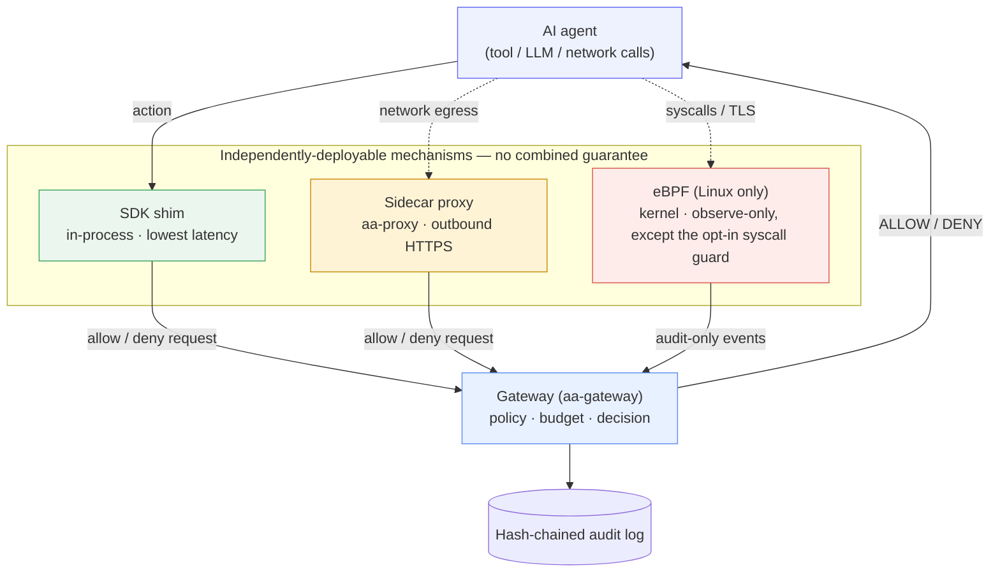

# Enforcement mechanisms at a glance

To govern an action, the runtime first has to *see* it. Agent Assembly can
observe agent actions through **three independently-deployable mechanisms** —
the SDK, the sidecar proxy, and eBPF — and routes every observed action to one
central [gateway](../architecture/README.md) for a decision. This page is a
teaser; the [Security Model](../security/overview.md) covers *why* each
mechanism is built the way it is and what it defends against, and
[Architecture](../architecture/README.md) covers *how* each is implemented.

**A deployment runs whatever subset of these it installs.** They are not fixed
layers with a guaranteed combined coverage — each reaches a different claim
level, and a mechanism that is absent or unable to attach is a reportable state,
never a silent gap the others fill in behind it.

## The three mechanisms

They differ by a deliberate trade-off — **lowest latency first, highest
detection authority first**:

| Mechanism | Runs in | Crate(s) | Latency | Catches | Trade-off |
|---|---|---|---|---|---|
| **SDK (in-process)** | The agent's own process | `aa-sdk-client` + per-language shims, `aa-wasm` | Lowest | Framework tool calls the SDK is wired into | Fastest path; but requires the agent to adopt the SDK and call its initializer, and an agent could skip it. |
| **Sidecar proxy** | An adjacent process / sidecar | `aa-proxy` | Medium | Outbound HTTP/1.1 that is *routed to it* and whose host is under MitM | No agent code change, but the process must honour the proxy environment and trust the local CA; sees only what is routed through it. |
| **eBPF (kernel)** | The Linux kernel | `aa-ebpf` and friends | Highest cost | OpenSSL TLS plaintext, `exec` and file syscalls — **observed, not blocked** | Highest *detection* authority; Linux only (file-I/O kprobes x86_64-only), needs a privileged loader daemon, and fails open if it cannot attach. |

The in-process SDK is the cheapest place to make a decision, but it is also the
easiest for an agent to avoid — it lives inside the very process you do not
fully trust. eBPF is the most expensive to run, but it watches from the kernel,
below anything the agent can reach, so it can *report* actions the other two
never saw — including deliberate attempts to bypass the SDK.

Note the distinction that decides what each mechanism can promise: the proxy
**denies an action before it runs**, when the traffic actually routes through
it; the SDK evaluates before the call but is **advisory** —
`aa-sdk-client` has no in-tree caller that refuses, and a non-cooperating
process simply never asks it (`aa-sdk-client/src/decision.rs:32-33`, ADR 0002);
eBPF **reports what it observed**. Its probes emit telemetry and return no
verdict, so an action it sees is an action that already happened.

## What deploying more than one buys you

These mechanisms are independently deployable, not stacked layers with a
combined guarantee. A deployment runs whatever subset fits its constraints, and
because every mechanism reports to the same gateway using the same audit wire
format, the gateway sees one unified view no matter which mechanisms produced
the events — but that shared reporting does not turn three conditional
mechanisms into one unconditional one.

Deploying more of them raises the cost of evading undetected; it does not close
the gap into a guarantee. Coverage is still bounded by each mechanism's own
precondition — an action escapes governance entirely if it is not a wrapped
tool call, is not routed through the proxy, and either does not use OpenSSL or
does not run on a Linux host with eBPF loaded. See [Enforcement paths and their
limitations](../security/enforcement-paths-and-limitations.md) for the full
account, and [known limitations](../devtools/limitations.md) for the residual
gaps, split into the ones that have been *demonstrated* and the ones that are
*inferred*.

The gateway is the single brain behind all three: it holds the agent registry,
evaluates [policy](concepts.md#policy), enforces [budgets](concepts.md#budget),
and appends the [audit](concepts.md#audit) record before answering allow or
deny.

## Where to go next

- [Security Model](../security/overview.md) — the threat model and *why* these
  mechanisms exist, including what each one is and is not trusted to do.
- [Enforcement paths and their limitations](../security/enforcement-paths-and-limitations.md) —
  the full account of what each mechanism catches and what its precondition is.
- [Architecture](../architecture/README.md) — the crate-level *how*: the
  gateway, the policy engine, the transports, and the full interception data
  flow.
