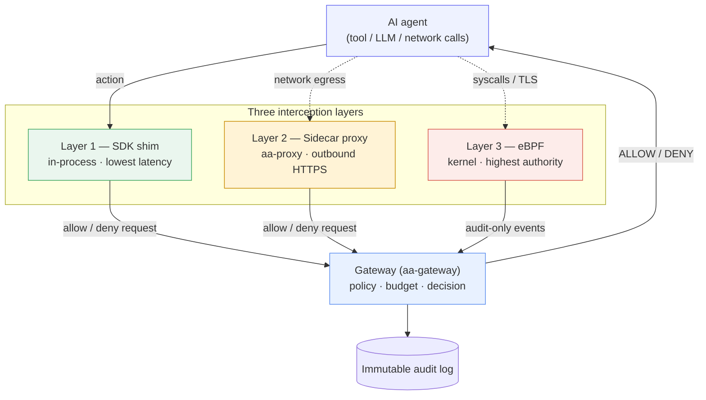

# The three-layer interception model at a glance

To govern an action, the runtime first has to *see* it. Agent Assembly intercepts
agent actions at **three independent layers**, each catching what the layers
above it might miss, and routes every observed action to one central
[gateway](../architecture/index.md) for a decision. This page is a teaser; the
[Security Model](../security/overview.md) covers *why* the layers are arranged this
way and what each defends against, and [Architecture](../architecture/index.md)
covers *how* each is implemented.

## The three layers

The layers are ordered by a deliberate trade-off — **lowest latency first,
highest detection authority first**:

| Layer | Runs in | Crate(s) | Latency | Catches | Trade-off |
|---|---|---|---|---|---|
| **1 — SDK (in-process)** | The agent's own process | `aa-sdk-client` + per-language shims, `aa-wasm` | Lowest | What the SDK is wired into | Fastest path; but requires the agent to adopt the SDK, and an agent could skip it. |
| **2 — Sidecar proxy** | An adjacent process / sidecar | `aa-proxy` | Medium | Outbound HTTPS, with no code change | Catches network egress the SDK missed; sees only what is routed through it. |
| **3 — eBPF (kernel)** | The Linux kernel | `aa-ebpf` and friends | Highest cost | Everything else, including bypass attempts | Highest detection authority; Linux-only and needs elevated privileges. |

The **latency-vs-authority trade-off** is the key idea. The in-process SDK is the
cheapest place to make a decision, but it is also the easiest for an agent to
avoid — it lives inside the very process you do not fully trust. The eBPF layer is
the most expensive to run, but it watches from the kernel, below anything the
agent can reach, so it catches actions the higher layers never saw — including
deliberate attempts to bypass the SDK.

## How they compose

The layers are not alternatives; they **stack**. A deployment runs whatever
subset fits its constraints, and because every layer reports to the same gateway
using the same audit wire format, the gateway sees one unified view no matter
which layers produced the events. Coverage is the **union** of the layers you
deploy: the SDK handles the fast common path, the proxy backstops network egress
without touching agent code, and eBPF is the floor that catches what slips past
both. Run all three and an action has nowhere to hide.

The gateway is the single brain behind all three: it holds the agent registry,
evaluates [policy](concepts.md#policy), enforces [budgets](concepts.md#budget),
and appends the [audit](concepts.md#audit) record before answering allow or deny.

## Where to go next

- [Security Model](../security/overview.md) — the threat model and *why* this layered
  defense closes the gaps, including what each layer is and is not trusted to do.
- [Architecture](../architecture/index.md) — the crate-level *how*: the gateway,
  the policy engine, the transports, and the full interception data flow.
