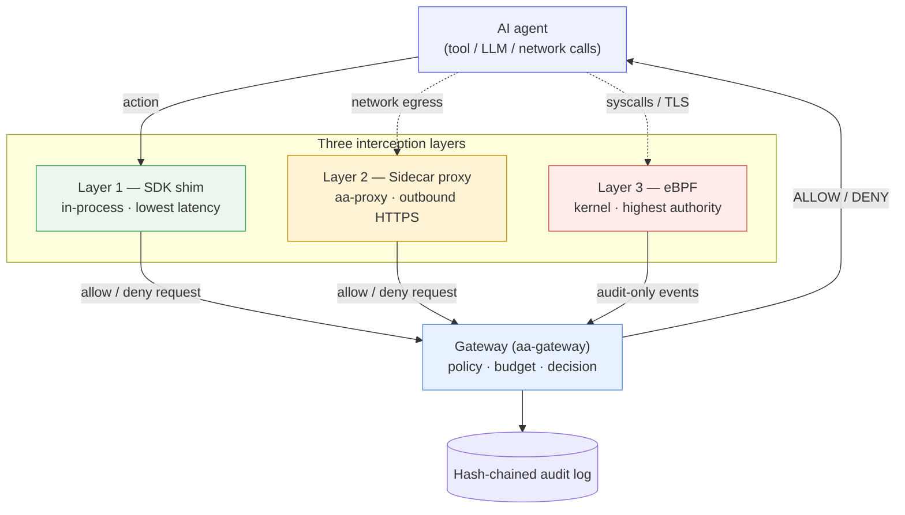

# The three-layer interception model at a glance

To govern an action, the runtime first has to *see* it. Agent Assembly intercepts
agent actions at **three independent layers**, each catching what the layers
above it might miss, and routes every observed action to one central
[gateway](../architecture/index.md) for a decision. This page is a teaser; the
[Security Model](../security/overview.md) covers *why* the layers are arranged this
way and what each defends against, and [Architecture](../architecture/index.md)
covers *how* each is implemented.

## The three layers

The layers are ordered by a deliberate trade-off — **lowest latency first,
highest detection authority first**:

| Layer | Runs in | Crate(s) | Latency | Catches | Trade-off |
|---|---|---|---|---|---|
| **1 — SDK (in-process)** | The agent's own process | `aa-sdk-client` + per-language shims, `aa-wasm` | Lowest | Framework tool calls the SDK is wired into | Fastest path; but requires the agent to adopt the SDK and call its initializer, and an agent could skip it. |
| **2 — Sidecar proxy** | An adjacent process / sidecar | `aa-proxy` | Medium | Outbound HTTP/1.1 that is *routed to it* and whose host is under MitM | No agent code change, but the process must honour the proxy environment and trust the local CA; sees only what is routed through it. |
| **3 — eBPF (kernel)** | The Linux kernel | `aa-ebpf` and friends | Highest cost | OpenSSL TLS plaintext, `exec` and file syscalls — **observed, not blocked** | Highest *detection* authority; Linux only (file-I/O kprobes x86_64-only), needs a privileged loader daemon, and fails open if it cannot attach. |

The **latency-vs-authority trade-off** is the key idea. The in-process SDK is the
cheapest place to make a decision, but it is also the easiest for an agent to
avoid — it lives inside the very process you do not fully trust. The eBPF layer is
the most expensive to run, but it watches from the kernel, below anything the
agent can reach, so it can *report* actions the higher layers never saw —
including deliberate attempts to bypass the SDK.

Note the distinction the table draws, because it decides what each layer can
promise: layer 2 **denies an action before it runs**; layer 1 evaluates before
the call but is **advisory** — `aa-sdk-client` has no in-tree caller that
refuses, and a non-cooperating process simply never asks it
(`aa-sdk-client/src/decision.rs:32-33`, ADR 0002); layer 3 **reports
what it observed**. Its probes emit telemetry and return no verdict, so an action
it sees is an action that already happened.

## How they compose

The layers are not alternatives; they **stack**. A deployment runs whatever
subset fits its constraints, and because every layer reports to the same gateway
using the same audit wire format, the gateway sees one unified view no matter
which layers produced the events. Coverage is the **union** of the layers you
deploy: the SDK handles the fast common path, the proxy backstops network egress
without touching agent code, and eBPF is the observation floor that reports what
slipped past both.

Running all three narrows the gap; it does not close it. Coverage is still
bounded by each layer's own preconditions — an action escapes governance
entirely if it is not a wrapped tool call, is not routed through the proxy, and
either does not use OpenSSL or does not run on a Linux host with the eBPF
layer loaded. The
[known limitations](../devtools/limitations.md) page enumerates the residual
gaps, split into the ones that have been *demonstrated* and the ones that are
*inferred*.

```mermaid
graph TD
    classDef agent fill:#eef2ff,stroke:#6366f1
    classDef l1 fill:#eaf6ee,stroke:#3aa55b
    classDef l2 fill:#fff3d6,stroke:#c98a00
    classDef l3 fill:#fdecea,stroke:#d75748
    classDef gw fill:#e8f1ff,stroke:#5b8def

    Agent["AI agent<br/>(tool / LLM / network calls)"]:::agent

    subgraph Interception["Three interception layers"]
        L1["Layer 1 — SDK shim<br/>in-process · lowest latency"]:::l1
        L2["Layer 2 — Sidecar proxy<br/>aa-proxy · outbound HTTPS"]:::l2
        L3["Layer 3 — eBPF<br/>kernel · highest authority"]:::l3
    end

    GW["Gateway (aa-gateway)<br/>policy · budget · decision"]:::gw
    Audit[("Hash-chained audit log")]

    Agent -->|"action"| L1
    Agent -.->|"network egress"| L2
    Agent -.->|"syscalls / TLS"| L3

    L1 -->|"allow / deny request"| GW
    L2 -->|"allow / deny request"| GW
    L3 -->|"audit-only events"| GW

    GW -->|"ALLOW / DENY"| Agent
    GW --> Audit
```

The gateway is the single brain behind all three: it holds the agent registry,
evaluates [policy](concepts.md#policy), enforces [budgets](concepts.md#budget),
and appends the [audit](concepts.md#audit) record before answering allow or deny.

## Where to go next

- [Security Model](../security/overview.md) — the threat model and *why* this layered
  defense closes the gaps, including what each layer is and is not trusted to do.
- [Architecture](../architecture/index.md) — the crate-level *how*: the gateway,
  the policy engine, the transports, and the full interception data flow.
