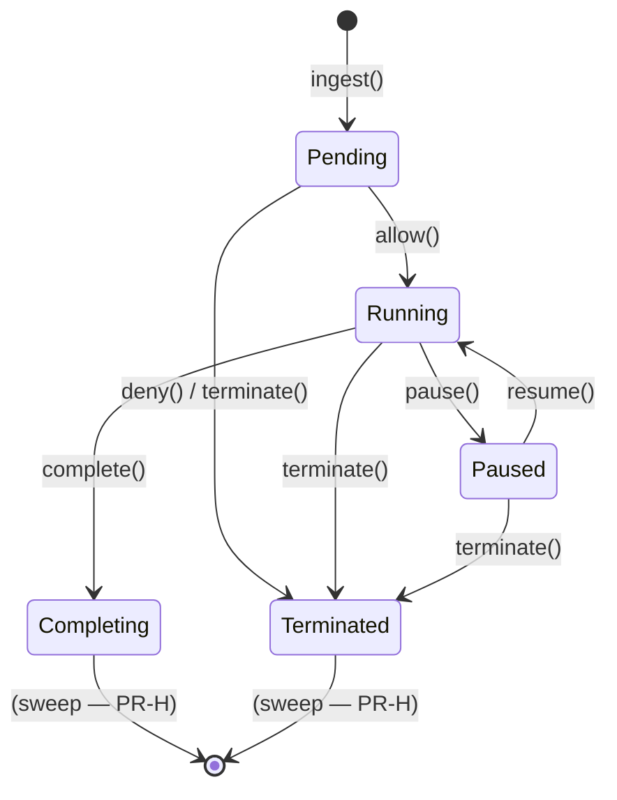

# In-Flight Ops Registry — Architecture

> **Status:** Active design — PR-A landed (AAASM-1422).
> **Scope:** Gateway-side tracking of agent operations from `CheckActionRequest`
> ingestion through to terminal `Completing`/`Terminated` states, the IPC
> protocol that lets the dashboard observe and control those operations, and
> the SDK return-channel that propagates control signals back to running
> agents.

## 1 — Why this exists

The original audit pipeline records what *already happened* (`AuditEvent` is
post-facto and immutable). The Live Ops dashboard ([AAASM-1326], [AAASM-1334])
needs a *live* view of operations *currently in flight*: which agents are
running right now, which are paused, which were just terminated. None of that
existed before AAASM-1525 / AAASM-1422.

AAASM-1415 shipped the `POST /api/v1/ops/{id}/{pause,resume,terminate}` route
shells as **stubs that return 202 + log** so the dashboard's row-action menu
could be wired without 404-ing. AAASM-1525 added the `OpsRegistry` skeleton in
`aa-api` with a 3-state machine (Running / Paused / Terminated) and a
client-driven `POST /api/v1/ops` registration endpoint. **AAASM-1422 closes
the remaining gap**: gateway-side ingestion from the policy-check path, a
5-state model that distinguishes pre-allow from post-completion, and a sub-task
plan for the IPC protocol and SDK enforcement.

## 2 — Decisions recorded for this iteration

| Decision | Choice | Why |
|---|---|---|
| **Op identifier** (AC #2 of AAASM-1422) | `op_id = "{trace_id}:{span_id}"` | Already in `CheckActionRequest`; distributed-tracing-native; lets the dashboard re-match same-id `OpStateChanged` WebSocket events without a new id allocator. No protobuf changes required for PR-A. |
| **Crate home** | `aa-gateway::ops`, re-exported via `aa_api::ops` | Mirrors `BudgetTracker`, `AgentRegistry`, `PolicyEngine`. `PolicyServiceImpl` (in `aa-gateway`) can ingest without a reverse-crate dep into `aa-api`. |
| **State model** | 5 states: `Pending`, `Running`, `Paused`, `Completing`, `Terminated` | Distinguishes "policy allow not yet decided" (`Pending`) and "action finished, draining" (`Completing`) from the active middle states. Aligns with AAASM-1422 description. |
| **Storage primitive** | `DashMap<String, OpRecord>` | Lock-free concurrent reads, shard-level write locks. Identical to `BudgetTracker.per_agent`. |
| **Ingestion entry point** | `OpsRegistry::ingest(op_id) -> OpRecord` keyed by `{trace_id}:{span_id}`, idempotent | Called from `PolicyServiceImpl::check_action` *before* policy evaluation so the op appears in `Pending` state even if the policy decision takes time. |
| **Allow transition** | `OpsRegistry::allow(op_id)`: `Pending → Running` | Called from `PolicyServiceImpl::check_action` after an `Allow` decision. |
| **Complete transition** | `OpsRegistry::complete(op_id)`: `Running → Completing` | Drained-out terminal state; entries stay readable briefly so the dashboard can render the completion before they're swept. |
| **Sweep policy (out of scope for PR-A)** | TBD in PR-H | Today the registry grows monotonically. Sweep / TTL is a follow-up. |

## 3 — Data model

```rust
// aa-gateway/src/ops/mod.rs

pub enum OpState {
    Pending,     // ingested, awaiting policy decision
    Running,     // policy allowed; agent is actively executing
    Paused,      // operator paused via POST /api/v1/ops/{id}/pause
    Completing,  // action signalled complete, draining
    Terminated,  // operator terminated, or policy denied
}

pub struct OpRecord {
    pub op_id: String,        // "{trace_id}:{span_id}"
    pub state: OpState,
    pub registered_at: String,// RFC 3339 — first time the op id was seen
    pub updated_at: String,   // RFC 3339 — most recent transition
}

pub enum OpsError {
    NotFound,
    InvalidTransition,
}

pub struct OpsRegistry { /* DashMap<String, OpRecord> */ }
```

## 4 — State machine



Transition rules:

| From → To | Method | Notes |
|---|---|---|
| (none) → `Pending` | `ingest(op_id)` | Idempotent re-call returns the existing record unchanged. |
| `Pending` → `Running` | `allow(op_id)` | Called from policy-engine `Allow` path. |
| `Pending` → `Terminated` | `terminate(op_id)` | Policy `Deny` path may take this directly (PR-H). |
| `Running` → `Paused` | `pause(op_id)` | Operator action via HTTP. |
| `Paused` → `Running` | `resume(op_id)` | Operator action via HTTP. |
| `Running` → `Completing` | `complete(op_id)` | Called by SDK when the agent finishes the action (PR-E/F/G). |
| any non-terminal → `Terminated` | `terminate(op_id)` | Operator force-termination. |
| any other pair | (invalid) | Returns `OpsError::InvalidTransition`. |

The registry remains **idempotent on terminal states**: calling `terminate` on
an already-`Terminated` op returns the existing record without erroring.

## 5 — Ingestion path

```
agent ──gRPC──▶ PolicyServiceImpl::check_action(req)
                  │
                  ├─▶ ops_registry.ingest("{trace_id}:{span_id}")
                  │     // entry created in `Pending`
                  │
                  ├─▶ engine.evaluate(req)  ─▶  EvaluationResult
                  │
                  ├─▶ if Allow:
                  │      ops_registry.allow(op_id)   // Pending → Running
                  │   if Deny:
                  │      ops_registry.terminate(op_id) // Pending → Terminated  (PR-H)
                  │
                  └─▶ Response { decision, reason, ... }
```

This means: by the time the SDK receives the `CheckActionResponse`, the
gateway-side registry has the op recorded and the dashboard sees it in the
correct state via the WebSocket stream (PR-B).

PR-A ships the `ingest()` + `allow()` call sites. The `terminate()` on `Deny`
is deferred to PR-H so PR-A keeps a small surface area.

## 6 — IPC sketch (PR-D)

Today the gateway → SDK channel is request/response only (`CheckActionRequest`
→ `CheckActionResponse`). For real pause / terminate enforcement, the SDK
must learn about state changes *while the action is in flight*.

Two viable shapes:

1. **Server-streaming `OpControlStream`** — SDK opens a long-lived stream on
   `register_agent`. Gateway pushes `{op_id, signal: pause|resume|terminate}`
   messages. SDK acknowledges via a separate unary RPC. (Recommended in PR-D.)
2. **Bidirectional `OperationChannel`** — replace per-action `CheckAction` with
   a single bidi stream. Heavier protocol churn; deferred.

The SDK then cooperatively yields on `pause`, resumes on `resume`, and
fast-fails on `terminate`. Each SDK (Python / Node / Go) ships its own
enforcement layer in PR-E / PR-F / PR-G.

## 7 — Dashboard correlation (PR-C)

Today the dashboard's `useLiveOpsStream` hook builds an in-memory map keyed by
`GovernanceEvent.id` (monotonic, unique per event). Two events for the same
op therefore can't be correlated — the override-clear logic in `LiveOpsPage`
never sees its target id again.

After PR-B/PR-C, the WebSocket emits a new `OpStateChanged` payload variant:

```jsonc
{
  "event_type": "ops_change",
  "agent_id": "agent-7",
  "payload": {
    "op_id": "trace-abc:span-1",   // stable across the op's lifetime
    "state": "running",            // OpState serialized snake_case
    "updated_at": "2026-05-20T09:32:20.822Z"
  }
}
```

The dashboard then keys its map by `payload.op_id`. The override-clear logic
matches on the same key, so a `pause` followed by the server's confirming
`paused` event auto-clears the optimistic state without manual intervention.

## 8 — Sub-task plan

| Sub-task | Scope | Touches |
|---|---|---|
| **PR-B** | `aa-proto` + `aa-api` `OpStateChanged` event type & payload schema | `proto/`, `aa-api/src/models/`, OpenAPI |
| **PR-C** | Dashboard id-model rework — `useLiveOpsStream` correlates by `op_id`, override auto-clear | `dashboard/src/` |
| **PR-D** | Gateway → SDK bidirectional return-channel: proto `OpControlStream` + `aa-proto` regen | `proto/`, SDK shims |
| **PR-E** | `python-sdk` cooperative pause + fast-fail terminate at shim layer | `python-sdk` repo |
| **PR-F** | `node-sdk` equivalent | `node-sdk` repo |
| **PR-G** | `go-sdk` equivalent | `go-sdk` repo |
| **PR-H** | Replace AAASM-1415 stub handlers with registry-backed transitions; emit `OpStateChanged` on each transition; add `Pending → Terminated` on policy Deny; add sweep policy | `aa-api/src/routes/ops.rs`, `aa-gateway/src/service/policy_service.rs` |

## 9 — Out of scope for this Task (AAASM-1422)

- Persistence across gateway restarts (registry is in-memory; restart re-empties
  it and the dashboard reconciles via the existing WS reconnect).
- Multi-gateway cluster coordination (sharded by `agent_id`-affinity in a later
  release; not on the roadmap for v0.0.1).
- Cross-team aggregation views beyond what the existing Live Ops page surfaces.

## 10 — References

- [AAASM-1422] — this Task
- [AAASM-1415] — stub `/ops/{id}/{pause,resume,terminate}` endpoints
- [AAASM-1525] — `OpsRegistry` skeleton with 3-state machine
- [AAASM-1326] / [AAASM-1334] — Live Ops dashboard design + row actions

[AAASM-1326]: https://lightning-dust-mite.atlassian.net/browse/AAASM-1326
[AAASM-1334]: https://lightning-dust-mite.atlassian.net/browse/AAASM-1334
[AAASM-1415]: https://lightning-dust-mite.atlassian.net/browse/AAASM-1415
[AAASM-1422]: https://lightning-dust-mite.atlassian.net/browse/AAASM-1422
[AAASM-1525]: https://lightning-dust-mite.atlassian.net/browse/AAASM-1525
