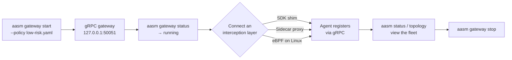
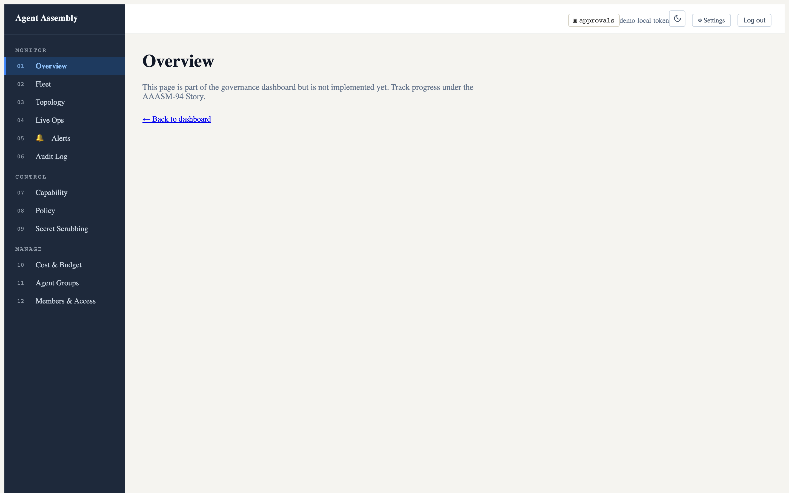

# First run

This walkthrough takes you from a freshly installed `aasm` to a running
governance gateway that is ready for an agent to connect. Every command and its
output below was captured from a real `v0.0.1-beta.3` build.

## The flow



> **Two endpoints, one gateway.** The gateway speaks **gRPC on `127.0.0.1:50051`**
> — this is what SDK shims and the sidecar proxy connect to. The operator
> commands `aasm status`, `aasm agent`, and `aasm topology` talk to the gateway's
> **HTTP API on `http://localhost:8080`**. In the OSS alpha the gRPC listener is
> what `aasm gateway start` brings up; until an HTTP API server is also serving
> on `8080`, the HTTP-backed commands report `unreachable`. That is expected and
> called out at each step below.

## 1. Start the gateway

Point the gateway at one of the bundled reference policies. `policy-examples/`
ships `low-risk.yaml`, `medium-risk.yaml`, and `high-risk.yaml`; `low-risk`
allows and audits everything, which is the easiest starting point.

```console
$ aasm gateway start --policy policy-examples/low-risk.yaml
Gateway started on grpc://127.0.0.1:50051  (pid 74472)
Logs: /Users/you/.aasm/logs/gateway.log
```

This spawns `aa-gateway` as a detached background process listening for gRPC on
`127.0.0.1:50051`. (If you built from source, ensure `aa-gateway` is reachable —
`aasm gateway start` looks in `$PATH`, `~/.cargo/bin`, and `./target/{debug,release}`.)

> **Alternative — from a source checkout without installing:** the gateway can be
> run directly with Cargo, which is the form the rest of the book uses:
>
> ```sh
> cargo run -p aa-gateway -- --policy policy-examples/low-risk.yaml
> ```
>
> It listens on the same `127.0.0.1:50051`.

## 2. Confirm it is running

```console
$ aasm gateway status
Gateway: running  pid=74472  listen=127.0.0.1:50051  uptime=5s
```

If nothing is running you get a non-zero exit and:

```console
$ aasm gateway status
Gateway: not running
```

Tail the gateway log at any time with `aasm gateway logs`.

## 3. Check overall status

`aasm status` gives the fleet-wide picture — gateway health, registered agents,
pending approvals, and budget. It queries the **HTTP API at `http://localhost:8080`**:

```console
$ aasm status
Agent Assembly Status
─────────────────────────────────────
  Gateway:   http://localhost:8080
  Health:    ✗ unreachable
─────────────────────────────────────

RUNTIME HEALTH
──────────────
  API:         ✗ unreachable
  Uptime:      0s
  Connections: 0
  Lag:         0 ms

ACTIVE AGENTS
─────────────
  (no agents registered)

PENDING APPROVALS
─────────────────
  Count:  0

BUDGET STATUS
─────────────
  Daily spend : $-- (no limit set)
  Date:           --
  (no per-agent data)

Error: gateway is not running. Start it with: aasm start
```

The `unreachable` health here reflects the gRPC-vs-HTTP split described above:
the gRPC gateway from step 1 is up, but the HTTP API on `8080` is not being
served in this OSS-only setup. Once an API server is serving on `8080` (for
example through the hosted control plane, or a future OSS API server), `Health`
flips to reachable and registered agents appear in `ACTIVE AGENTS`.

Add `--watch` to auto-refresh the display every 5 seconds, or `--json` for a
machine-readable header suitable for scripting and CI.

## 4. Observe an agent

Agents register with the gateway through an **interception layer** — they are
not created from the CLI. Wire one of the SDKs into your agent, or front it with
the sidecar proxy, and point it at the gateway:

- **SDK shim (in-process):** install [python-sdk](https://github.com/ai-agent-assembly/python-sdk),
  [node-sdk](https://github.com/ai-agent-assembly/node-sdk), or
  [go-sdk](https://github.com/ai-agent-assembly/go-sdk) and follow that SDK's
  quickstart. The shim reports every action to the gateway over gRPC.
- **Sidecar proxy (no code changes):** run `aasm proxy start` to intercept the
  agent's outbound HTTPS and forward governance decisions to the gateway.
- **eBPF (Linux only):** kernel hooks catch everything else, including bypass
  attempts.

A quick way to exercise the sidecar path end-to-end is the bundled Docker
Compose stack, which runs `aa-runtime` as a sidecar against a stub agent:

```sh
cd examples/docker-compose
AA_API_KEY=dev-local-key docker compose up
```

The sidecar exposes the agent IPC socket at
`/tmp/aa-runtime-my-agent-001.sock` and a readiness probe at
`http://localhost:8080/ready`.

Once an agent is registered and the HTTP API is reachable, list the fleet:

```sh
aasm agent list          # all registered agents
aasm agent inspect <id>  # detail for one agent
```

Until then these commands report the API as unreachable:

```console
$ aasm agent list
error: API request failed: error sending request for url (http://localhost:8080/api/v1/agents)
```

## 5. View the topology

`aasm topology` visualizes the agent fleet — trees, lineage, teams, and
aggregate stats. Like `aasm status`, it reads the HTTP API:

```sh
aasm topology overview   # fleet-wide overview
aasm topology tree <id>  # subtree rooted at an agent
aasm topology stats      # aggregate statistics
```

With no reachable API it reports:

```console
$ aasm topology overview
error: registry unreachable — check --api-url
```

## 6. Open a dashboard

For a live, interactive view there are two consoles:

- **Web dashboard** — `aasm dashboard start` serves the embedded SPA at
  `http://127.0.0.1:3000` (port configurable; see
  [Configuration](configuration.md)). It blocks until `Ctrl-C`; use
  `aasm dashboard open` to launch your browser against an already-running server.
- **Terminal (TUI) dashboard** — `aasm dashboard` opens an interactive in-terminal
  dashboard for real-time monitoring, no browser required.

The web dashboard's app shell looks like this after you sign in — the full
governance navigation (Monitor / Control / Manage) down the left, with the
approvals indicator, theme toggle, Settings, and Log out across the top:



> The data panels are empty here because this is the open-source local-mode
> gateway, which serves the SPA but not the populated data API (that lives in
> the hosted control plane). See
> [Observe in the dashboard](../usage-guide/observe-in-dashboard.md) for the
> full picture, including the live-operations and dark-mode views.

## 7. Stop the gateway

When you are done, shut the gateway down cleanly (SIGTERM, escalating to SIGKILL
after the timeout):

```sh
aasm gateway stop
```

## Where to go next

- [CLI Reference](../cli/overview.md) — every `aasm` command and flag.
- [Usage Guide](../usage-guide/govern-an-agent.md) — govern an agent end-to-end, author
  policies, and set budgets.
- [Security Model](../security/overview.md) — the threat model and the three-layer
  defense-in-depth rationale.
