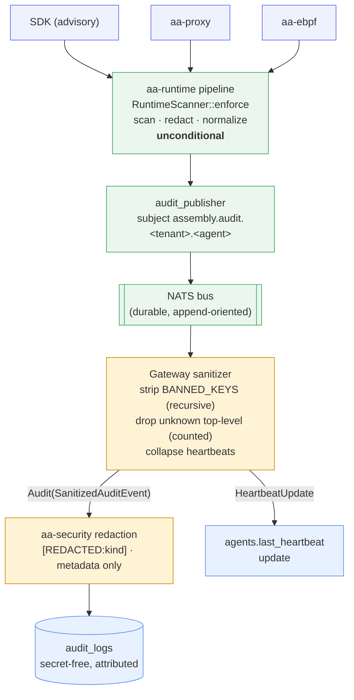

# Audit and assurance

Governance is only credible if there is a trustworthy record of what happened.
Agent Assembly's audit pipeline is designed so that the trail is **free of
secrets**, **tamper-evident**, and supports **non-repudiation** — even when an
upstream sender (an SDK, a proxy, an eBPF probe) emits something it should not.
This page covers the write-boundary sanitizer, redaction, and the publish path.
For where audit sits in the wider system, see
[Architecture](../architecture/README.md).

## The write-boundary sanitizer

Every audit event the gateway is about to persist passes first through
`sanitize` (`aa-gateway/src/sanitizer/`). The module's own description states the
principle: *"The sender is the first line of defense; this module is the last."*
It **never trusts the inbound shape** — it operates on the untyped JSON tree as
received and:

- **strips banned keys recursively** at any depth,
- **drops unknown top-level fields**, counting them so a newly-emitting sender is
  noticed (a drift signal), and
- **collapses heartbeats** into a single "last seen" update on the agent row
  instead of writing a per-beat record.

The four classes of "never store" data are removed regardless of what any
upstream emits: raw LLM prompts/completions, full tool-call payloads, eBPF
packet bodies, and per-heartbeat sequence records. The `BANNED_KEYS` list
(`aa-gateway/src/sanitizer/rules.rs`) is deliberately a *superset* — defense in
depth means erring toward dropping — and includes `prompt`, `completion`,
`llm_input`, `llm_output`, `tool_payload`, `tool_response`, `tool_args`,
`tool_result`, `packet_body`, `packet_payload`, and `heartbeat_seq`.

The sanitizer returns a `SanitizeOutcome` — either an `Audit(SanitizedAuditEvent)`
to persist, or a `HeartbeatUpdate` to fold into the agent's "last seen" field
(`aa-gateway/src/sanitizer/event.rs`). The `SanitizedAuditEvent` type is a
constructor-guarded wrapper, so a value can only exist *after* it has been
through the banned-key pass.

## Redaction: secrets never reach the record

The sanitizer removes whole banned containers; the `aa-security` scanner removes
secrets that appear *inside otherwise-legitimate* fields. Both run on the audit
path. At the gateway audit-write boundary (`aa-gateway/src/audit.rs`) the
`CredentialScanner` detects a secret and `redact()` replaces it with a
`[REDACTED:<kind>]` label; the resulting `Redaction`
(`aa-security/src/redaction.rs`) stores **only finding metadata — kind and
offset — never the raw value**. Combined with the runtime's authoritative
re-scan (see [Protection and enforcement](protection-model.md)), a secret is
redacted *before forward* and again *before persist*, so it never lands in
`audit_logs`.

## Tamper-evidence and non-repudiation

Audit events are published off the runtime via the NATS audit publisher
(`aa-runtime/src/audit_publisher/`). Each entry is published to a structured,
tenant- and agent-scoped subject derived by `subject_for`
(`aa-runtime/src/audit_publisher/subject.rs`):

```
assembly.audit.<tenant>.<agent>
```

where `<tenant>` is the entry's org id (falling back to team id, then
`default`) and `<agent>` is the agent id rendered as a hyphenated UUID. Scoping
every record to an immutable tenant+agent identity means a record cannot be
silently reattributed, and routing through a durable message bus separates the
**production** of audit evidence (the runtime, which an agent cannot reach into)
from its **consumption** (the gateway/storage), so the trail is not rewritable
by the governed party. This separation, plus the constructor-guarded sanitized
type and metadata-only redaction, is what makes the record **non-repudiable**:
the governed action and its decision are recorded by trusted components, with no
path for the agent to alter or suppress its own history.

## End-to-end audit data flow



The record that reaches `audit_logs` has passed an authoritative redaction in
the runtime, a recursive banned-key strip in the sanitizer, and a final
metadata-only credential redaction — and is bound to an immutable tenant+agent
subject. No single compromised or careless sender can defeat the trail.
