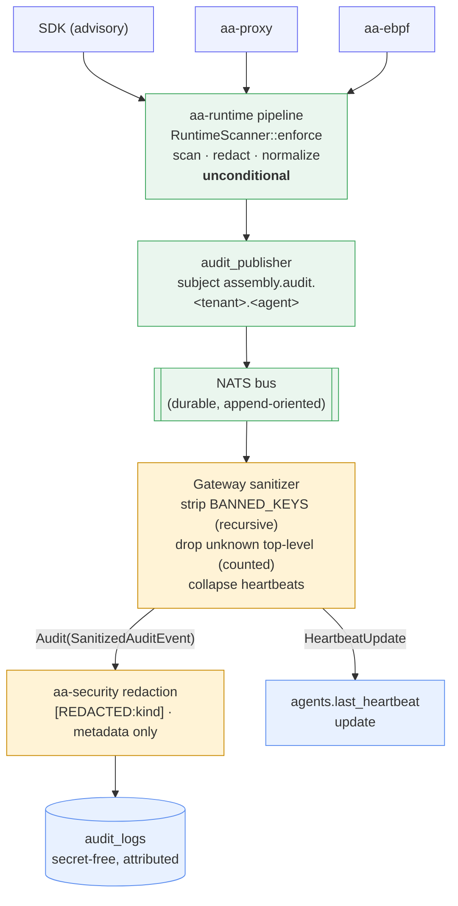

# Audit and assurance

Governance is only credible if there is a trustworthy record of what happened.
Agent Assembly's audit pipeline is designed so that the trail is **free of
secrets**, **tamper-evident**, and supports **non-repudiation** — even when an
upstream sender (an SDK, a proxy, an eBPF probe) emits something it should not.
This page covers the write-boundary sanitizer, redaction, and the publish path.
For where audit sits in the wider system, see
[Architecture](../architecture/README.md).

## The write-boundary sanitizer

Every audit event the gateway is about to persist passes first through
`sanitize` (`aa-gateway/src/sanitizer/`). The module's own description states the
principle: *"The sender is the first line of defense; this module is the last."*
It **never trusts the inbound shape** — it operates on the untyped JSON tree as
received and:

- **strips banned keys recursively** at any depth,
- **drops unknown top-level fields**, counting them so a newly-emitting sender is
  noticed (a drift signal), and
- **collapses heartbeats** into a single "last seen" update on the agent row
  instead of writing a per-beat record.

The four classes of "never store" data are removed regardless of what any
upstream emits: raw LLM prompts/completions, full tool-call payloads, eBPF
packet bodies, and per-heartbeat sequence records. The `BANNED_KEYS` list
(`aa-gateway/src/sanitizer/rules.rs`) is deliberately a *superset* — defense in
depth means erring toward dropping — and includes `prompt`, `completion`,
`llm_input`, `llm_output`, `tool_payload`, `tool_response`, `tool_args`,
`tool_result`, `packet_body`, `packet_payload`, and `heartbeat_seq`.

The sanitizer returns a `SanitizeOutcome` — either an `Audit(SanitizedAuditEvent)`
to persist, or a `HeartbeatUpdate` to fold into the agent's "last seen" field
(`aa-gateway/src/sanitizer/event.rs`). The `SanitizedAuditEvent` type is a
constructor-guarded wrapper, so a value can only exist *after* it has been
through the banned-key pass.

## Redaction: secrets never reach the record

The sanitizer removes whole banned containers; the `aa-security` scanner removes
secrets that appear *inside otherwise-legitimate* fields. Both run on the audit
path. At the gateway audit-write boundary (`aa-gateway/src/audit.rs`) the
`CredentialScanner` detects a secret and `redact()` replaces it with a
`[REDACTED:<kind>]` label; the resulting `Redaction`
(`aa-security/src/redaction.rs`) stores **only finding metadata — kind and
offset — never the raw value**. Combined with the runtime's authoritative
re-scan (see [Protection and enforcement](protection-model.md)), a secret is
redacted *before forward* and again *before persist*, so it never lands in
`audit_logs`.

## Tamper-evidence and non-repudiation

Audit events are published off the runtime via the NATS audit publisher
(`aa-runtime/src/audit_publisher/`). Each entry is published to a structured,
tenant- and agent-scoped subject derived by `subject_for`
(`aa-runtime/src/audit_publisher/subject.rs`):

```
assembly.audit.<tenant>.<agent>
```

where `<tenant>` is the entry's org id (falling back to team id, then
`default`) and `<agent>` is the agent id rendered as a hyphenated UUID. Scoping
every record to an immutable tenant+agent identity means a record cannot be
silently reattributed, and routing through a durable message bus separates the
**production** of audit evidence (the runtime, which an agent cannot reach into)
from its **consumption** (the gateway/storage), so the trail is not rewritable
by the governed party. This separation, plus the constructor-guarded sanitized
type and metadata-only redaction, is what makes the record **non-repudiable**:
the governed action and its decision are recorded by trusted components, with no
path for the agent to alter or suppress its own history.

## Reaching the durable path: the publisher is opt-in

The publish path above is the route from the runtime to `audit_logs`, and it is
**switched off until an operator switches it on**. `build_audit_publisher`
(`aa-runtime/src/runtime.rs`) returns no publisher unless the runtime's
`AA_NATS_CONFIG_PATH` environment variable points at a readable
`agent-assembly.toml` carrying a `[gateway.nats]` table
(`aa-runtime/src/config.rs`). With the variable unset, the agent runs and the
runtime processes events, but the interception records it produces reach the
in-process broadcast channel and stop there.

```bash
# On the host running aa-runtime, before the agent starts.
export AA_NATS_CONFIG_PATH=/etc/aa/agent-assembly.toml   # must contain [gateway.nats]
export AA_AUDIT_BUFFER_PATH=/var/lib/aa/audit-buffer.db  # optional; defaults under the temp dir
```

The gateway side needs its NATS audit consumer running against the same server
and a Postgres instance holding `audit_logs`. That consumer is opt-in too:
`AuditConsumerConfig::from_env` (`aa-gateway/src/audit_consumer.rs`) returns a
disabled consumer unless **both** `AA_AUDIT_NATS_URL` and
`AA_AUDIT_POSTGRES_URL` are set. With both halves up, an interception record
becomes a durable row; with either half absent, it does not.

Three properties of the switch are worth stating, because each is a way an
operator can believe retention is on while it is off:

- **A misconfiguration degrades silently by design.** An unreadable path, an
  invalid config, an unopenable buffer, or a failed initial NATS connection each
  yield no publisher rather than a startup failure (AAASM-2547). The agent keeps
  governing; what it loses is retention.
- **While NATS is unreachable the entries spill to a local SQLite buffer**
  (`AA_AUDIT_BUFFER_PATH`) and replay when the connection returns. That buffer is
  on the agent's host, so it is a reconnect cushion rather than a second copy of
  the trail.
- **This switch is what an SDK-side claim of ADR 0033 §6 *Observed* rests on.**
  An SDK hands its record to the runtime's event channel; whether a durable event
  attributed to the action exists afterwards is decided here, on the runtime
  host, by this configuration. An SDK that cannot see this setting can claim the
  handoff and should stop there
  ([AAASM-5783](https://lightning-dust-mite.atlassian.net/browse/AAASM-5783)).

## What is retained, and what is deleted

Tamper-*evident* is not immutable. An audit guarantee that does not say what it
loses is not a guarantee, so this is the picture as of the defaults in code.

There are **four** distinct records, not one trail, and a bound that applies to
one of them does not apply to the others. They are not interchangeable, and none
is a backup of another. **A retention statement is only true of the record it
names**, which is why each row below names its own.

| Record | What it holds | Bound | What deletes it |
| --- | --- | --- | --- |
| **Gateway JSONL** — `<audit_dir>/<agent>-<session>.jsonl` (`aa-gateway/src/audit.rs`) | The hash-chained entries. This is the tamper-evident primary record, and the one `GET /api/v1/logs` serves (`aa-gateway/src/audit_reader.rs`) | **None** | **Nothing.** No rotation, size cap or retention pass exists for it in this repository |
| **Gateway SQL** — `audit_events` (`aa-gateway/migrations/postgres/0001_initial.sql`) | The dual-sink copy of the decision record. Carries **no** chain columns, so it is not the tamper-evident tier | Time: `hot_days` + `warm_days`, then `cold_action` | `apply_retention` issues `DELETE FROM audit_events` (`aa-gateway/src/storage/postgres.rs`, `sqlite.rs`) |
| **`audit_logs`** (`aa-storage-postgres/migrations/0004_audit_logs.sql`) | The metadata-only row written by the NATS audit consumer (`aa-storage-postgres/src/audit_sink.rs`) | **None** | **Nothing.** No retention pass in this repository targets this table |
| **Proxy prevention-evidence sink** (`aa-proxy/src/audit_jsonl.rs`) | Per-request refusal evidence held by the layer that sees the bytes | Size: `DEFAULT_MAX_SEGMENT_BYTES` × `DEFAULT_RETAINED_SEGMENTS` — 32 MiB × 3 segments; `max_age` unset | Oldest segment deleted on rotation; entries dropped when the channel is full. Both counted — see below |

So the honest summary is not "audit records are kept for a bounded time". It is:
**the tamper-evident record has no bound today, and the two records that are
bounded are the SQL copy and the proxy's evidence sink.** Anyone who needs the
chain itself pruned has to do it outside the product.

Four consequences worth stating plainly, because each one breaks an assumption
an operator can reasonably arrive at from the sections above:

- **The gateway SQL cutoff is `hot_days` + `warm_days`, not `warm_days`.**
  `apply_retention` computes its cold threshold as
  `now - (hot_days + warm_days)`, so at the defaults (30 and 90) a row is
  deleted once it is **120 days** old, not 90. The two numbers add; they are not
  a schedule of one absolute age followed by another.
- **`cold_action = Archive` is not implemented.** On Postgres it does not
  archive and it does not prune — `apply_retention` returns
  `RetentionError` and the whole pass fails
  (`aa-gateway/src/storage/postgres.rs`). On SQLite it logs a warning and
  **falls back to dropping the rows** (`aa-gateway/src/storage/sqlite.rs`), so
  selecting it deletes exactly the data an operator chose it to preserve.
  `Drop` is the only cold action that behaves as named.
- **On the proxy sink, size wins over age.** `max_age` is a *maximum* age, never
  a minimum guarantee — a busy proxy rotates a segment away before its age is up.
  That case is not silent: it increments `retention_shortfalls`, so an operator
  who configured 90 days and is actually getting three can tell.
- **A count taken from the proxy sink file is a lower bound**, never a total. Use
  the `SinkCompleteness` sidecar to find out whether the window you are reading
  is complete. The consumer-visible signal is its `window` field: `sealed()` sets
  it to `WindowCompleteness::Complete` only when `is_lossless()` holds — all six
  of `dropped_entries`, `discarded_segments`, `expired_segments`,
  `retention_shortfalls`, `write_failures` and `export_failures` at zero — and to
  `Lossy` otherwise. A rate computed over a `Lossy` window is a rate over an
  unknown denominator.

Request and response bodies are additionally truncated at
`MAX_PERSISTED_BODY_BYTES` (8 KiB), so a persisted body is evidence that a
request occurred and what it began with — not a full transcript of it.

This is why the front-page and overview copy says **tamper-evident** rather than
immutable or permanent. The two words answer different questions and only one of
them is answered here: the chain lets you detect *alteration*, and says nothing
at all about *deletion*. Note which way round the gap runs — the tamper-evident
record is the one with no retention bound, so "tamper-evident" must not be read
as shorthand for "and therefore pruned on a schedule"
([AAASM-5679](https://lightning-dust-mite.atlassian.net/browse/AAASM-5679)).

## End-to-end audit data flow


```mermaid
flowchart TD
    classDef src fill:#eef2ff,stroke:#6366f1
    classDef trusted fill:#eaf6ee,stroke:#3aa55b
    classDef guard fill:#fff3d6,stroke:#c98a00
    classDef store fill:#e8f1ff,stroke:#5b8def

    SDK["SDK (advisory)"]:::src
    PX["aa-proxy"]:::src
    BPF["aa-ebpf"]:::src

    RT["aa-runtime pipeline<br/>RuntimeScanner::enforce<br/>scan · redact · normalize<br/><b>unconditional</b>"]:::trusted
    PUB["audit_publisher<br/>subject assembly.audit.&lt;tenant&gt;.&lt;agent&gt;"]:::trusted
    BUS[["NATS bus<br/>(durable, append-oriented)"]]:::trusted

    SAN["Gateway sanitizer<br/>strip BANNED_KEYS (recursive)<br/>drop unknown top-level (counted)<br/>collapse heartbeats"]:::guard
    RED["aa-security redaction<br/>[REDACTED:kind] · metadata only"]:::guard

    HB["agents.last_heartbeat<br/>update"]:::store
    LOG[("audit_logs<br/>secret-free, attributed")]:::store

    SDK --> RT
    PX --> RT
    BPF --> RT
    RT --> PUB --> BUS --> SAN
    SAN -->|"Audit(SanitizedAuditEvent)"| RED --> LOG
    SAN -->|"HeartbeatUpdate"| HB
```

The record that reaches `audit_logs` has passed an authoritative redaction in
the runtime, a recursive banned-key strip in the sanitizer, and a final
metadata-only credential redaction — and is bound to an immutable tenant+agent
subject. No single compromised or careless sender can defeat the trail.
