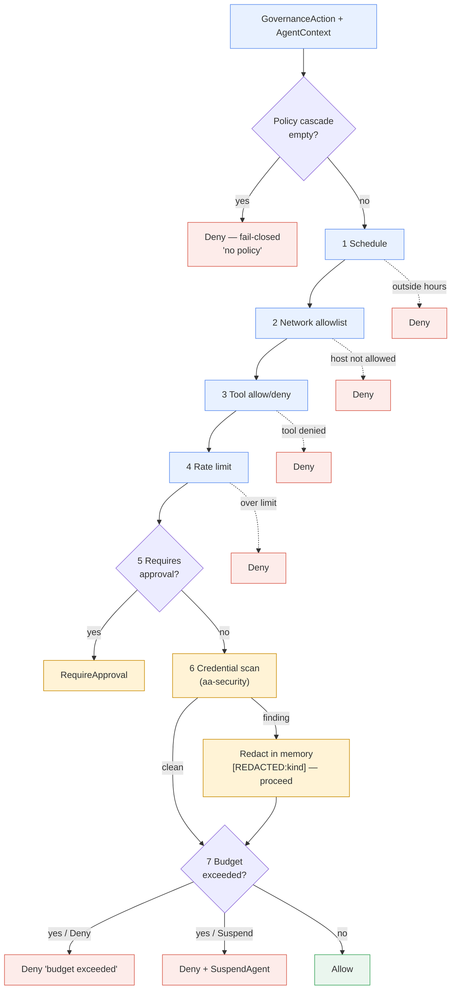

# Protection and enforcement

Once an action is observed (see
[Three-layer defense in depth](three-layer-defense.md)), it must be *decided
on* and, where necessary, *blocked or scrubbed*. This page covers the
enforcement machinery: policy evaluation, fail-closed behavior, network-egress
control, credential scanning & redaction, and budgets as a control. Every claim
below is grounded in the gateway, runtime, and security crates; for the broader
component picture see [Architecture](../architecture/README.md).

## Policy evaluation

The gateway is the authoritative decision point. The policy engine
(`aa-gateway/src/engine/mod.rs`) evaluates an `AgentContext` + `GovernanceAction`
and returns a `PolicyDecision` — `Allow`, `RequireApproval { reason,
timeout_secs }`, or `Deny { reason, source_scope }`
(`aa-gateway/src/engine/decision.rs`).

Evaluation runs as a staged pipeline. The single-policy path (`evaluate_primary`)
and the scoped-cascade path (`evaluate_with_cascade`) share the same stages:

| Stage | Check | Outcome on violation |
|---|---|---|
| 1 | Schedule / active-hours window | `Deny` "outside active hours" |
| 2 | Network allowlist (for `NetworkRequest`) | `Deny` "host not in network allowlist" |
| 3 | Tool allow/deny | `Deny` "tool denied by policy" |
| 4 | Tool rate limit | `Deny` "rate limit exceeded" |
| 5 | Approval condition (`requires_approval_if`) | `RequireApproval` |
| 6 | Credential / custom-pattern scan | **redact in memory — never deny** |
| 7 | Budget (monthly then daily) | `Deny` "budget exceeded" + optional `SuspendAgent` |

Stage 6 is notable: a credential finding **redacts** rather than denies, so a
governed action still proceeds but the secret never travels upstream. Denial is
reserved for policy, egress, rate, and budget violations.

### Scoped cascade and most-restrictive-wins

When scoped policies are loaded, the engine collects a cascade of
`PolicyDocument`s along the agent's lineage (Global → Org → Team → Agent) and
merges them with **most-restrictive-wins** semantics (`merge_decisions` in
`aa-gateway/src/engine/decision.rs`): any `Deny` short-circuits and wins;
otherwise the narrowest-scope `RequireApproval` wins; only an all-`Allow` cascade
returns `Allow`.

## Fail-closed behavior

The system denies whenever it cannot make a safe decision. Two load-bearing
examples:

- **Empty policy cascade → `Deny`.** `merge_decisions` returns a fail-closed
  `Deny { reason: "no policy — fail-closed", source_scope: Global }` for an
  empty cascade — it *never silently allows* (`aa-gateway/src/engine/decision.rs`).
- **Unscannable field → redact whole.** In the runtime enforcement stage, a
  secret-bearing field larger than `max_field_bytes` (default
  `DEFAULT_MAX_FIELD_BYTES = 64 KiB`) cannot be fully scanned, so it is replaced
  wholesale with `OVERSIZED_MARKER = "[REDACTED:OVERSIZED]"` rather than
  forwarded raw — `OversizedPolicy::RedactWhole`, the sole and default variant
  (`aa-runtime/src/pipeline/enforcement.rs`). The doc comment is explicit: *"The
  runtime is a security gate, so the policy is fail-closed."*

> **Null-as-no-match nuance.** Inside a single policy document, an *unresolvable*
> graph variable contributes nothing to the decision — a `deny` condition that
> references it does **not** fire (`aa-gateway/src/policy/context.rs`). This is a
> deliberate per-clause evaluation rule (*fail-open on missing context within a
> clause*), distinct from the system-level fail-closed default that governs the
> *absence of any policy*.

## Network-egress control

Egress is enforced at two tiers. In the gateway, `check_network_egress(host,
policy)` returns an `EgressDecision` against the policy's allowlist
(`aa-gateway/src/policy/network.rs`); a `NetworkRequest` to a host outside a
non-empty allowlist is denied at Stage 2. At the wire, the proxy independently
enforces egress on decrypted traffic with no agent code change (see
[Three-layer defense](three-layer-defense.md)), and the eBPF SSL uprobes observe
egress plaintext even when the proxy is bypassed.

## Credential scanning & redaction (`aa-security`)

The `aa-security` leaf crate is the credential-detection and redaction
primitive (extracted from `aa-core` per
[ADR 0002](../adr/0002-sdk-security-boundary.md), AAASM-2567). Its
`CredentialScanner` (`aa-security/src/scanner.rs`) compiles a single
**Aho-Corasick** automaton over literal secret prefixes and patterns, mapping
each match to a `CredentialKind`:

- LLM-provider keys (Anthropic, OpenAI),
- cloud keys (`AKIA…` AWS access key, GCP service account, Azure connection
  string),
- VCS tokens (`ghp_` PAT, `ghs_` app token),
- Slack tokens, database URLs (`postgres`, `mysql`, `mongodb`),
- private-key PEM blocks (RSA / EC / OpenSSH / generic / PGP).

A scan yields a `ScanResult`; `redact()` replaces each match with a
`[REDACTED:<kind>]` label, and the resulting `Redaction`
(`aa-security/src/redaction.rs`) stores **only finding metadata — never the raw
secret value**.

The same crate is wired in at every trusted point:

| Caller | Role |
|---|---|
| `aa-runtime` (`pipeline/enforcement.rs`, `RuntimeScanner::enforce`) | **Authoritative** — re-scans every event unconditionally on both the batch and the violation path |
| `aa-gateway` (`engine/mod.rs` Stage 6, `audit.rs`) | Scan-then-redact at evaluation and at the audit-write boundary |
| `aa-proxy` (`intercept/mod.rs`) | Wire-level scan driving `Block` / `ForwardRedacted` |
| SDK / `aa-sdk-client` | **Advisory preflight only** — best effort, never trusted |

The runtime's `RuntimeScanner` holds **one precompiled** scanner, built once at
pipeline start and reused per event — it is never rebuilt per event — and only
the allowlisted secret-bearing fields of each `Detail` variant (`ToolCall`,
`FileOp`, `Process`) are scanned. Variants with no free-text secret fields
(`LlmCall`, `Network`, `Violation`, `Approval`) are matched *explicitly with no
wildcard*, so adding a new detail variant fails to compile until its
secret-bearing fields are triaged.

## Budgets as a control

Budgets are a first-class *security* control against runaway spend, not merely a
cost report. The gateway's `BudgetTracker` (`aa-gateway/src/budget/`) tracks
per-agent, per-team, and per-org daily/monthly spend. At Stage 7 the engine
checks monthly then daily limits; on exceed it returns a `Deny` whose
side-effect is driven by the policy's `action_on_exceed`:

- `ActionOnExceed::Deny` — refuse the individual request, keep the agent active;
- `ActionOnExceed::Suspend` — attach `DenyAction::SuspendAgent` so the service
  layer suspends the agent.

The default when `action_on_exceed` is absent is `Deny`
(`aa-gateway/src/policy/validator.rs`).

## Decision flow

