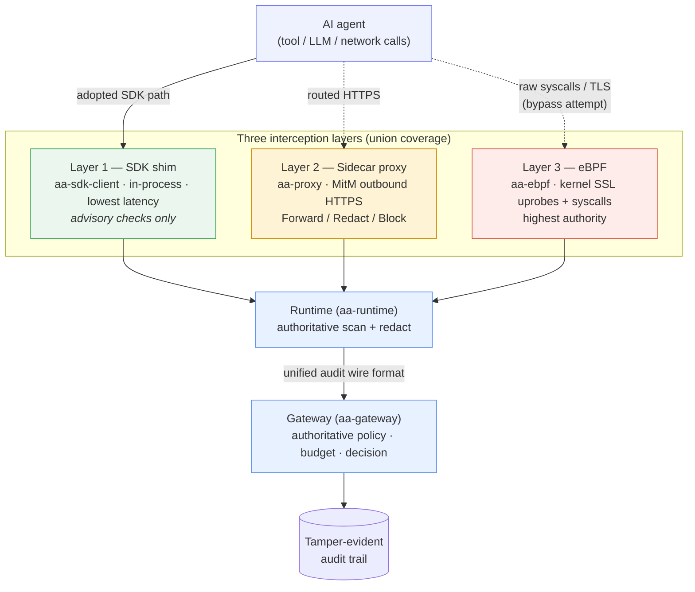
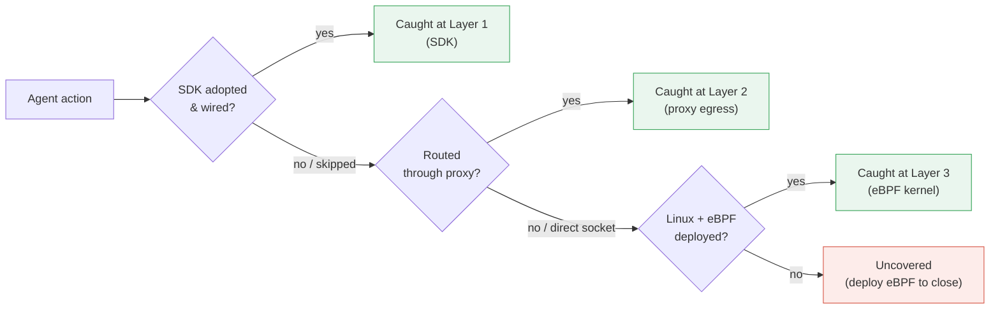

# Three-layer defense in depth

To govern an action, Agent Assembly must first *observe* it. It does so at
**three independent interception layers**, each catching what the layers above
it might miss, and routes every observed action to one central
[gateway](../architecture/index.md) for the decision. This page explains why
the layers are arranged the way they are and how they **compose** so an agent
cannot quietly slip through. For the policy decision itself, see
[Protection and enforcement](protection-model.md); for how implementation maps
to crates, see [Architecture](../architecture/index.md).

## The latency-vs-authority trade-off

The layers are ordered by a deliberate trade-off — **lowest latency first,
highest detection authority first**:

| Layer | Runs in | Crate(s) | Cost | Catches | Detection authority |
|---|---|---|---|---|---|
| **1 — SDK (in-process)** | The agent's own process | `aa-sdk-client` + per-language shims, `aa-wasm` | Lowest | What the SDK is wired into | Lowest — lives inside the untrusted process |
| **2 — Sidecar proxy** | An adjacent process / sidecar | `aa-proxy` | Medium | Outbound HTTPS, no code change | Medium — sees only routed traffic |
| **3 — eBPF (kernel)** | The Linux kernel | `aa-ebpf`, `aa-ebpf-probes` | Highest | Everything else, including bypass attempts | Highest — observes below anything the agent can reach |

The in-process SDK is the **cheapest** place to make a decision — but also the
easiest for an agent to avoid, because it lives inside the very process we do
not fully trust. The eBPF layer is the **most expensive** to run, but it watches
from the kernel, below anything the agent can reach, so it catches actions the
higher layers never saw — including deliberate attempts to bypass the SDK.
Authority is *inverse* to cost: the cheaper a layer is, the less you can trust it
to be present.

## What each layer catches

### Layer 1 — SDK shim (in-process)

The language SDKs call into a thin native shim over `aa-sdk-client`, which ships
events over a Unix domain socket to the runtime and applies pre-execution
allow/deny via wrapper functions. It is the fastest path and gives the richest
context (it sees the call *before* it happens), but it requires the agent to
adopt the SDK and can be skipped. **Its security checks are advisory only** —
see [Trust boundaries](trust-boundaries.md).

### Layer 2 — Sidecar proxy (`aa-proxy`)

The proxy terminates outbound TLS with a per-host certificate signed by a local
CA generated on first start (`aa-proxy/src/tls/ca.rs`), inspects the decrypted
request, and enforces network-egress and data policy at the wire — with **no
change to agent code**. The interceptor returns a `VerdictDecision` of
`Forward`, `ForwardRedacted`, `Block`, or `AlertAndForward`
(`aa-proxy/src/intercept/mod.rs`), and for MCP `tools/call` it can match on
arguments (`aa-proxy/src/intercept/mcp.rs`) — a precision the raw-bytes scanner
alone cannot reach. It catches egress the SDK missed, but sees only what is
routed through it.

### Layer 3 — eBPF (kernel)

The kernel layer attaches uprobes to the SSL library — `SSL_write` (outbound
plaintext) and `SSL_read` entry/exit (inbound plaintext) in
`aa-ebpf-probes/src/ssl_probes.rs` — and tracepoints/kprobes for process exec and
file syscalls (`aa-ebpf-probes/src/exec_probes.rs`, `aa-ebpf/src/kprobe.rs`).
Because it observes at the syscall / library boundary, it sees TLS plaintext and
process activity **even when the agent never adopted the SDK and never routed
through the proxy**. It is the floor. It is Linux-only and needs elevated
privileges.

## How the layers compose

The layers are **not alternatives** — they stack. A deployment runs whatever
subset fits its constraints, and because every layer reports to the same gateway
using the same audit wire format (`aa-proto` audit events), the gateway sees one
unified view no matter which layers produced the events. Coverage is the
**union** of the layers you deploy:

- the **SDK** handles the fast common path,
- the **proxy** backstops network egress without touching agent code,
- **eBPF** is the floor that catches what slips past both.

Run all three and an action has nowhere to hide — an attempt to evade a higher
layer simply surfaces at a lower one.

The second diagram makes the composition explicit: an action only escapes
governance if it evades *every deployed* layer. With eBPF present, the
bypass path collapses to "caught at Layer 3."
