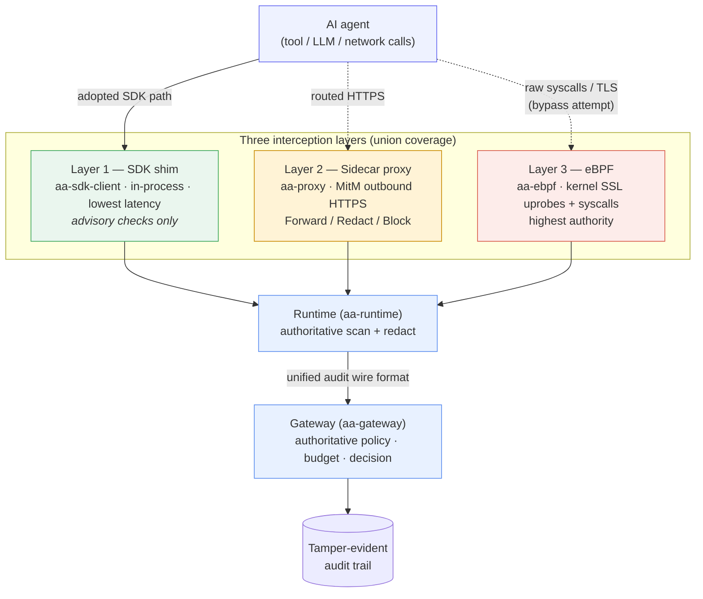
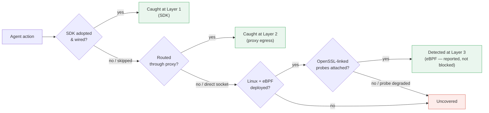

# Three-layer defense in depth

To govern an action, Agent Assembly must first *observe* it. It does so at
**three independent interception layers**, each catching what the layers above
it might miss, and routes every observed action to one central
[gateway](../architecture/index.md) for the decision. This page explains why
the layers are arranged the way they are and how they **compose** so an agent
cannot quietly slip through. For the policy decision itself, see
[Protection and enforcement](protection-model.md); for how implementation maps
to crates, see [Architecture](../architecture/index.md).

## The latency-vs-authority trade-off

The layers are ordered by a deliberate trade-off — **lowest latency first,
highest detection authority first**:

| Layer | Runs in | Crate(s) | Cost | Catches | Detection authority |
|---|---|---|---|---|---|
| **1 — SDK (in-process)** | The agent's own process | `aa-sdk-client` + per-language shims, `aa-wasm` | Lowest | Framework tool calls the SDK is wired into | Lowest — lives inside the untrusted process |
| **2 — Sidecar proxy** | An adjacent process / sidecar | `aa-proxy` | Medium | Outbound HTTP/1.1 routed to it, on a host under MitM | Medium — sees only routed traffic |
| **3 — eBPF (kernel)** | The Linux kernel | `aa-ebpf`, `aa-ebpf-probes` | Highest | OpenSSL TLS plaintext, `exec` and file syscalls — **observed, not blocked** | Highest *detection* authority — observes below anything the agent can reach, but returns no verdict |

The in-process SDK is the **cheapest** place to make a decision — but also the
easiest for an agent to avoid, because it lives inside the very process we do
not fully trust. The eBPF layer is the **most expensive** to run, but it watches
from the kernel, below anything the agent can reach, so it can *report* actions
the higher layers never saw — including deliberate attempts to bypass the SDK.
Authority is *inverse* to cost: the cheaper a layer is, the less you can trust it
to be present.

## What each layer catches

### Layer 1 — SDK shim (in-process)

The language SDKs call into a thin native shim over `aa-sdk-client`, which ships
events over a Unix domain socket to the runtime and applies pre-execution
allow/deny via wrapper functions. It is the fastest path and gives the richest
context (it sees the call *before* it happens), but it requires the agent to
adopt the SDK and can be skipped. **Its security checks are advisory only** —
see [Trust boundaries](trust-boundaries.md).

### Layer 2 — Sidecar proxy (`aa-proxy`)

The proxy terminates outbound TLS with a per-host certificate minted from a local
root CA generated on first start (`aa-proxy/src/tls/ca.rs`), inspects the
decrypted request, and enforces network-egress and data policy at the wire — with
**no change to agent code**, though not with no configuration. Three
preconditions decide whether it sees anything at all:

- **Routing.** There is no transparent redirect; the process must speak the HTTP
  proxy protocol to the listener. Two things inject `HTTP_PROXY`/`HTTPS_PROXY`:
  the managed launch (`aasm run`), which sets them for that child process only,
  and an installed developer integration, which writes them into the tool's own
  configuration so they persist across launches independently of `aasm run`
  (`aa-devtool-claude-code/src/lifecycle.rs:929-930`, and the equivalents for
  Codex and Windsurf). A tool started outside `aasm run` is therefore
  intercepted **if** an integration is installed for it, and not otherwise.
- **CA trust.** The client must trust the local root CA. On macOS the proxy
  installs it into the system trust store at start; on Linux it is a deliberate
  operator step, `sudo aasm proxy install-ca`
  (`aa-cli/src/commands/proxy/ca.rs:150-188`, which copies to
  `/usr/local/share/ca-certificates/` and runs `update-ca-certificates`).
  Windows is unsupported. Node-based tools additionally need
  `NODE_EXTRA_CA_CERTS`. Note the failure mode differs from the routing case
  above: an untrusted CA makes an intercepted connection *fail loudly*, whereas
  traffic that never reaches the proxy bypasses it silently.
- **Host selection and transport.** `llm_only` defaults to `true`, so only the
  built-in LLM hosts (and any operator-listed `mitm_hosts`) are decrypted;
  everything else is transparently tunnelled uninspected. Interception is
  HTTP/1.1 with `Content-Length` — no ALPN is negotiated, so HTTP/2, gRPC and
  WebSocket cannot be inspected on those hosts, and a chunked request is dropped
  without an HTTP response. On hosts that are not under MitM those protocols still
  work — tunnelled and uninspected.

The interceptor returns a `VerdictDecision` of
`Forward`, `ForwardRedacted`, `Block`, or `AlertAndForward`
(`aa-proxy/src/intercept/mod.rs`), and for MCP `tools/call` it can match on
arguments (`aa-proxy/src/intercept/mcp.rs`) — a precision the raw-bytes scanner
alone cannot reach. It catches egress the SDK missed, but sees only what is
routed through it.

### Layer 3 — eBPF (kernel)

The kernel layer attaches uprobes to the SSL library — `SSL_write` (outbound
plaintext) and `SSL_read` entry/exit (inbound plaintext) in
`aa-ebpf-probes/src/ssl_probes.rs` — and tracepoints/kprobes for process exec and
file syscalls (`aa-ebpf-probes/src/exec_probes.rs`, `aa-ebpf/src/kprobe.rs`).
Because it observes at the syscall / library boundary, it can see TLS plaintext
and process activity **even when the agent never adopted the SDK and never routed
through the proxy**. It is the observation floor.

Four constraints decide what that floor is actually worth, and each is visible in
the code rather than inferred:

- **It observes; it does not block.** The TLS, file-I/O and exec probes emit
  events and return, and a kprobe/tracepoint return value is not a verdict. The
  file-path blocklist in `aa-ebpf/src/maps.rs` only sets a flag on the emitted
  event. There is no LSM or seccomp hook anywhere in the tree, so no code path
  returns a denial. Treat a Layer 3 event as *detected*, never as *prevented*.
- **The one enforcing path kills asynchronously.** The opt-in syscall guard
  (`aa-ebpf-probes/src/syscall_guard.rs`, armed only when `AA_EBPF_CONFINE_PID`
  is set and policy lowers a non-empty allowlist) calls `bpf_send_signal` with
  `SIGKILL`. The signal is delivered at the next signal-check point, so the
  offending syscall completes before the task dies. That is containment after
  the fact, not a syscall firewall.
- **TLS visibility is OpenSSL only.** Attachment is by the `SSL_write` /
  `SSL_read` symbol names against a library found by scanning the process maps
  for `libssl.so` (`aa-ebpf/src/uprobe.rs`). A process using Go's `crypto/tls`,
  rustls, BoringSSL, GnuTLS or NSS — or a statically linked TLS stack — is
  invisible here and needs the proxy layer instead (AAASM-3872).
- **Linux, and it fails open.** There is no `cfg(target_arch)` gate in the eBPF
  crates: the TLS uprobes attach by symbol resolved from `/proc/<pid>/maps` and
  the exec tracepoints resolve offsets from live BTF, so both work on aarch64.
  It is the **file-I/O kprobes** that are x86_64-only — they target 14 hardcoded
  `__x64_sys_*` symbols (`aa-ebpf/src/kprobe.rs:145-160`). The runtime gate is
  three conditions, not two — kernel ≥ 5.8, BTF present, **and** a reachable
  loader-daemon socket at `/run/aa-ebpf-loaderd.sock`
  (`aa-runtime/src/layer.rs:119-135`) — and `AA_LAYERS` bypasses the probe
  entirely. If the layer cannot load or attach it degrades with a warning and
  the agent keeps running; the failure is recorded on the health endpoint, not
  enforced.

Privilege is **separated, not held by the runtime**. `aa-runtime` deliberately
carries no `CAP_BPF`/`CAP_PERFMON`: the privileged loader daemon owns every BPF
operation and the runtime delegates to it (AAASM-3605). That replaced an earlier
"runtime must be root" check precisely because a privileged runtime was the
detach-and-replace-the-probe attack surface.

## How the layers compose

The layers are **not alternatives** — they stack. A deployment runs whatever
subset fits its constraints, and because every layer reports to the same gateway
using the same audit wire format (`aa-proto` audit events), the gateway sees one
unified view no matter which layers produced the events. Coverage is the
**union** of the layers you deploy:

- the **SDK** handles the fast common path,
- the **proxy** backstops network egress without touching agent code,
- **eBPF** is the observation floor that reports what slipped past both.

Running all three narrows the gap and raises the cost of evading undetected. It
does not close the gap, because each layer carries its own precondition and the
union of three conditional layers is still conditional. An action escapes
governance entirely when *all* of the following hold: it is not a wrapped
framework tool call; it is not routed through the proxy (or its host is not
under MitM — under the default `llm_only` only the built-in LLM hosts are); and
either the process does not link OpenSSL or the host is not Linux with a
loadable eBPF layer (and, for file-I/O events specifically, x86_64).

That conjunction is not exotic. A tool launched outside `aasm run`, with no
integration installed, inherits neither the proxy environment nor the CA trust —
a *measured* bypass, not an inferred one. See [Limitations and known
bypasses](../devtools/limitations.md), which splits demonstrated bypasses from
inferred ones.

Note the surface can also widen without an operator touching an environment
variable: `mitm_hosts` is the union of `AA_PROXY_MITM_HOSTS` and the host lists
installed integrations drop into `~/.aasm/integrations/mitm-hosts.d/`
(`aa-proxy/src/config.rs:173`), so installing an integration can bring more hosts
under MitM than the operator's own configuration names.

```mermaid
graph TD
    classDef agent fill:#eef2ff,stroke:#6366f1
    classDef l1 fill:#eaf6ee,stroke:#3aa55b
    classDef l2 fill:#fff3d6,stroke:#c98a00
    classDef l3 fill:#fdecea,stroke:#d75748
    classDef gw fill:#e8f1ff,stroke:#5b8def

    Agent["AI agent<br/>(tool / LLM / network calls)"]:::agent

    subgraph Interception["Three interception layers (union coverage)"]
        L1["Layer 1 — SDK shim<br/>aa-sdk-client · in-process · lowest latency<br/><i>advisory checks only</i>"]:::l1
        L2["Layer 2 — Sidecar proxy<br/>aa-proxy · MitM outbound HTTPS<br/>Forward / Redact / Block"]:::l2
        L3["Layer 3 — eBPF<br/>aa-ebpf · kernel SSL uprobes + syscalls<br/>highest authority"]:::l3
    end

    GW["Gateway (aa-gateway)<br/>authoritative policy · budget · decision"]:::gw
    RT["Runtime (aa-runtime)<br/>authoritative scan + redact"]:::gw
    Audit[("Tamper-evident<br/>audit trail")]

    Agent -->|"adopted SDK path"| L1
    Agent -.->|"routed HTTPS"| L2
    Agent -.->|"raw syscalls / TLS<br/>(bypass attempt)"| L3

    L1 --> RT
    L2 --> RT
    L3 --> RT
    RT -->|"unified audit wire format"| GW
    GW --> Audit
```

```mermaid
flowchart LR
    classDef catch fill:#eaf6ee,stroke:#3aa55b
    classDef miss fill:#fdecea,stroke:#d75748

    A["Agent action"] --> Q1{"SDK adopted<br/>& wired?"}
    Q1 -->|yes| C1["Caught at Layer 1<br/>(SDK)"]:::catch
    Q1 -->|"no / skipped"| Q2{"Routed<br/>through proxy?"}
    Q2 -->|yes| C2["Caught at Layer 2<br/>(proxy egress)"]:::catch
    Q2 -->|"no / direct socket"| Q3{"Linux + eBPF<br/>deployed?"}
    Q3 -->|yes| Q4{"OpenSSL-linked<br/>probes attached?"}
    Q4 -->|yes| C3["Detected at Layer 3<br/>(eBPF — reported, not blocked)"]:::catch
    Q4 -->|"no / probe degraded"| U["Uncovered"]:::miss
    Q3 -->|no| U
```

The second diagram makes the composition explicit — and makes the residual gap
explicit too. An action escapes only if it evades every deployed layer, but
Layer 3's own precondition (OpenSSL, Linux, loader daemon reachable) is part of
that test, so "deploy eBPF" does not by itself collapse the bypass path. Note
also that reaching Layer 3 changes the outcome from *unseen* to *detected*, not
to *prevented*.
