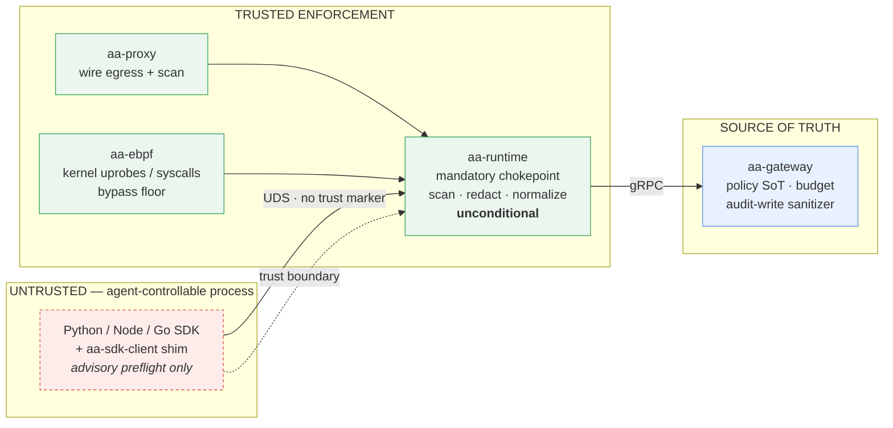

# Trust boundaries

The single most important decision in Agent Assembly's Security Model is
**where it places trust**. The answer is recorded formally in
[ADR 0002 — SDK Security Boundary](../adr/0002-sdk-security-boundary.md): the SDK
is *not* a trust boundary; the runtime and gateway are authoritative. This page
explains why, and how that decision is made bypass-resistant.

## Why the SDK is not a trust boundary

The fastest interception layer — the SDK — runs **inside the agent's own
process**, which is exactly the component the model does not trust (see the
[threat model](threat-model.md)). An attacker who controls the agent controls a
*modified, outdated, or stubbed SDK*. Therefore any guarantee anchored in the
SDK is not a guarantee at all: security must hold even when the SDK does nothing.

ADR 0002 audited the prior state and found enforcement in the wrong place — the
only credential scan on the SDK fast-path was *inside the SDK binding itself*,
while the trusted runtime forwarded the SDK's payload without independently
scanning it. A removed or bypassed SDK scanner would let raw secrets flow
`SDK → runtime → gateway`. The decision reversed this:

| Concern | Decision |
|---|---|
| Is the SDK a security boundary? | **No.** The SDK is untrusted. |
| Authoritative enforcement point | **`aa-runtime`** — scans, redacts, normalizes every event before forward/audit, unconditionally. |
| Source of truth | **Gateway / control-plane** — policy SoT; audit-write sanitizer as final backstop. |
| SDK-side detection | **Best-effort advisory preflight only.** No `clean` / `already_scanned` marker exists on the wire, and none is honored. |

> **Invariant.** Nothing the SDK asserts can shorten the runtime's work. The
> same `aa-security` scanner is *advisory* inside the SDK and *authoritative*
> inside `aa-runtime`. **Position — not code — confers authority.**

## Why the runtime / gateway is authoritative

The SDK event fast-path is `SDK → UDS → aa-runtime → gRPC → gateway`. The runtime
is the **mandatory chokepoint**: every event must pass through it. So that is
where the authoritative work lives. `RuntimeScanner::enforce`
(`aa-runtime/src/pipeline/enforcement.rs`) scans, redacts, and normalizes every
secret-bearing field, and the pipeline `run()` loop
(`aa-runtime/src/pipeline/mod.rs`) calls it **before any forward or audit, on
every path** — both the batched path and the immediate policy-violation path.
Its doc comment states the rule directly:

> *Runs unconditionally — no field of the event can request that scanning be
> skipped, and there is no SDK trust marker on the wire.*

The gateway, in turn, is the source of truth for **policy** (the agent cannot
author its own policy) and applies a final write-boundary
[sanitizer](audit-assurance.md) before anything is persisted.

## Bypass resistance — eBPF catches what the SDK and proxy miss

Trust placement answers *"what if the SDK lies?"* Bypass resistance answers
*"what if the agent skips the SDK entirely?"* The
[three-layer model](three-layer-defense.md) is the structural answer: a higher
layer evaded simply surfaces at a lower one. An agent that skips the SDK and the
proxy and links TLS directly is still observed by the eBPF `SSL_write` /
`SSL_read` uprobes and exec/file syscall hooks
(`aa-ebpf-probes/src/ssl_probes.rs`, `aa-ebpf-probes/src/exec_probes.rs`),
because the kernel sits below anything the agent can reach.

This is verified, not asserted. The bypass-resistance suite drives the public
`aa_runtime::pipeline::run` loop end-to-end and proves every inbound event is
scanned + redacted before forward/audit on **both** paths, with the raw secret
never leaving the runtime regardless of SDK behavior
(`aa-runtime/tests/aaasm_2568_gate_verification.rs`). The "no trust marker" guard
is partly compile-time — the exhaustive, wildcard-free match over `Detail`
variants forces any new secret-bearing field to be triaged before it compiles.

## Trust-boundary diagram

Everything left of the runtime is untrusted and can only *advise*; everything
from the runtime rightward is authoritative. The dashed edge is the trust
boundary itself — the SDK's assertions stop there. See
[ADR 0002](../adr/0002-sdk-security-boundary.md) for the full decision record and
the boundary-first migration order that ensured SDK-side scanning was never
removed before the runtime became authoritative.
