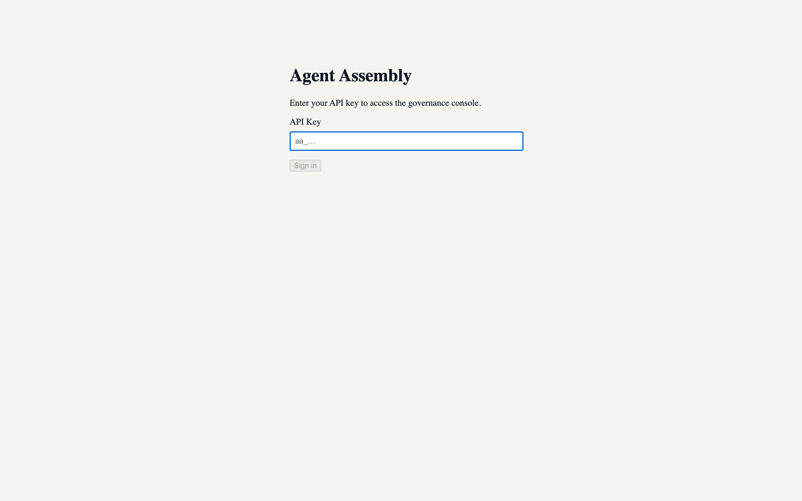
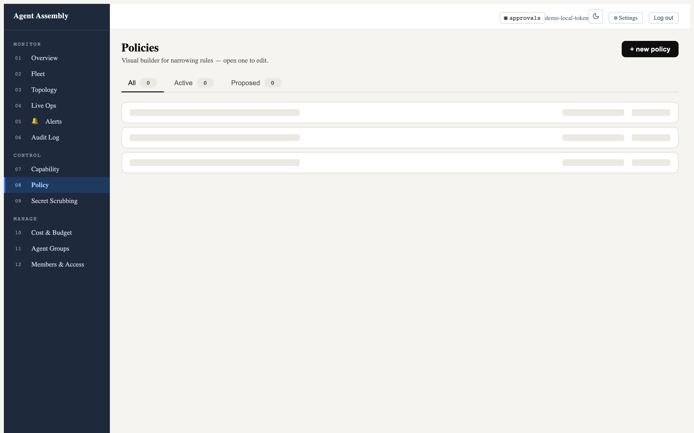
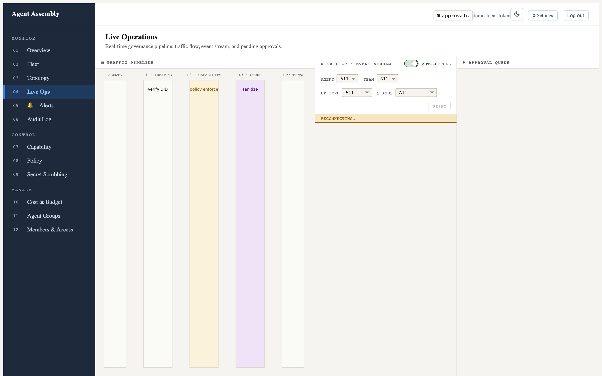
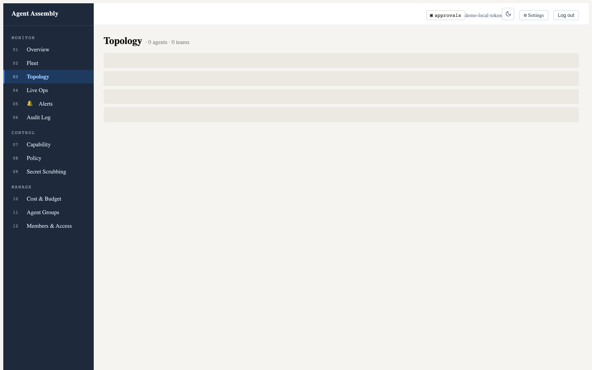
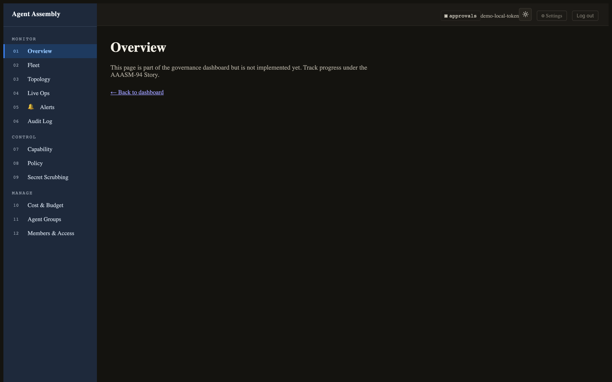

# Observe in the dashboard

**Goal.** Watch the governed fleet in real time. Agent Assembly ships two
observation surfaces from the same `aasm` binary: a **web dashboard** (a
Vite/React SPA) and an in-terminal **TUI**. This page shows what each looks like
and how to bring it up.

## The web dashboard

The dashboard is a single-page React app. In production it is embedded into the
gateway and served at `/`; for UI development it runs under Vite on port `3000`
and proxies `/api` to the control-plane API on port `8080`.

### Bring it up locally

The local-mode gateway serves the compiled SPA on its HTTP port (`7391` by
default). Build the dashboard bundle once, then start the gateway pointed at it:

```console
$ cd dashboard && pnpm install && pnpm build      # produces dashboard/dist/
$ cd .. && aasm start --mode local --port 7391
# the dashboard is now at http://127.0.0.1:7391/
```

### The login screen

The dashboard authenticates with an API key. This screen renders entirely
client-side, so it is the same whether or not a backend is reachable:



### The app shell and navigation

After authenticating, the canonical 12-route navigation appears, grouped into
**Monitor** (Overview, Fleet, Topology, Live Ops, Alerts, Audit Log),
**Control** (Capability, Policy, Secret Scrubbing), and **Manage** (Cost &
Budget, Agent Groups, Members & Access). The header carries the approvals
indicator, a light/dark theme toggle, Settings, and Log out:


### An implemented page — Policies

The Policies page is the visual policy builder. It shows All / Active / Proposed
tabs and a **+ new policy** action; opening a row drops into the editor:



### More implemented routes — Live Ops and Topology

The **Live Operations** route renders the real-time governance layout: the
L1→L2→L3 traffic pipeline (Identity → Capability → Scrub → External), a
`tail -f` event stream with agent/team/op-type/status filters and an auto-scroll
toggle, and the approval queue. Against the local-mode gateway the event stream
shows "reconnecting…" (no backend feed) and the columns are empty, but the full
operator layout is real:



The **Topology** route lists agents and teams; here it honestly reports
`0 agents · 0 teams` because the fleet data API is not part of the local runtime:



### Light and dark themes

The header theme toggle flips the entire token-driven UI between light and dark.
Here is the Overview route in dark mode:



> **Honest caveat — what renders locally vs. what needs the hosted backend.**
> The screenshots above are all real captures of the `0.0.1-beta.4` SPA
> served by the local-mode gateway. The data panels are empty (zero policies,
> zero agents, "not implemented yet" on some routes) because the dashboard's
> data API — `/api/v1/fleet`, `/api/v1/policies`, `/api/v1/capability/matrix`,
> and the auth-token endpoint — is provided by the **SaaS/cloud control plane on
> port 8080**, which is not part of the open-source local runtime. The
> local-mode gateway on `7391` serves the SPA and a small set of endpoints
> (`/healthz`, `/api/v1/admin/status`), so the chrome, navigation, theming, and
> page shells are fully real while the populated tables require the hosted
> backend. Routes still marked "not implemented yet" (e.g. Overview) render a
> ComingSoon placeholder by design in this build.

## The terminal TUI

For operators who live in a terminal, `aasm dashboard` (no subcommand) launches
an interactive full-screen TUI built on `ratatui`, with a live feed and
keyboard-driven approval handling:

```console
$ aasm dashboard
# ...full-screen TUI; press 'q' to quit
```

```text
Open an interactive TUI dashboard for real-time governance monitoring

Usage: aasm dashboard [OPTIONS] [COMMAND]

Commands:
  start  Serve the embedded SPA at http://127.0.0.1:<port>. Blocks until Ctrl-C
  open   Open the browser to an already-running dashboard
  stop   Stop a dashboard server started with `aasm dashboard start`
```

The TUI polls the control-plane REST API and subscribes to a WebSocket feed for
live events; selecting a pending approval lets you approve or reject it inline
(`y` / `n`).

> **Honest caveat — no live TUI screenshot here.** The TUI requires an
> interactive terminal (it switches to the alternate screen and raw mode) and a
> reachable events/approvals API (port 8080) to display populated panels. Driven
> headlessly against the empty local backend it renders the frame but with no
> data to show, so a meaningful still capture is not reproducible in this
> environment — the launch command and `--help` above are real, and the panels
> populate once the hosted control plane (or a backend with live agents) is
> connected.

### Serving the SPA without a browser launch helper

`aasm dashboard start` serves the embedded SPA directly and blocks until Ctrl-C;
`aasm dashboard open` opens your browser to an already-running server, and
`aasm dashboard stop` stops a server started with `start`. Pass `--port` (or set
`AASM_DASHBOARD_PORT`) to choose the port, and `--open` to launch the browser
once it is ready.

## Result

You can observe the fleet either in the browser (rich, point-and-click) or in
the terminal (fast, keyboard-driven), both from the same binary and both backed
by the same gateway.
