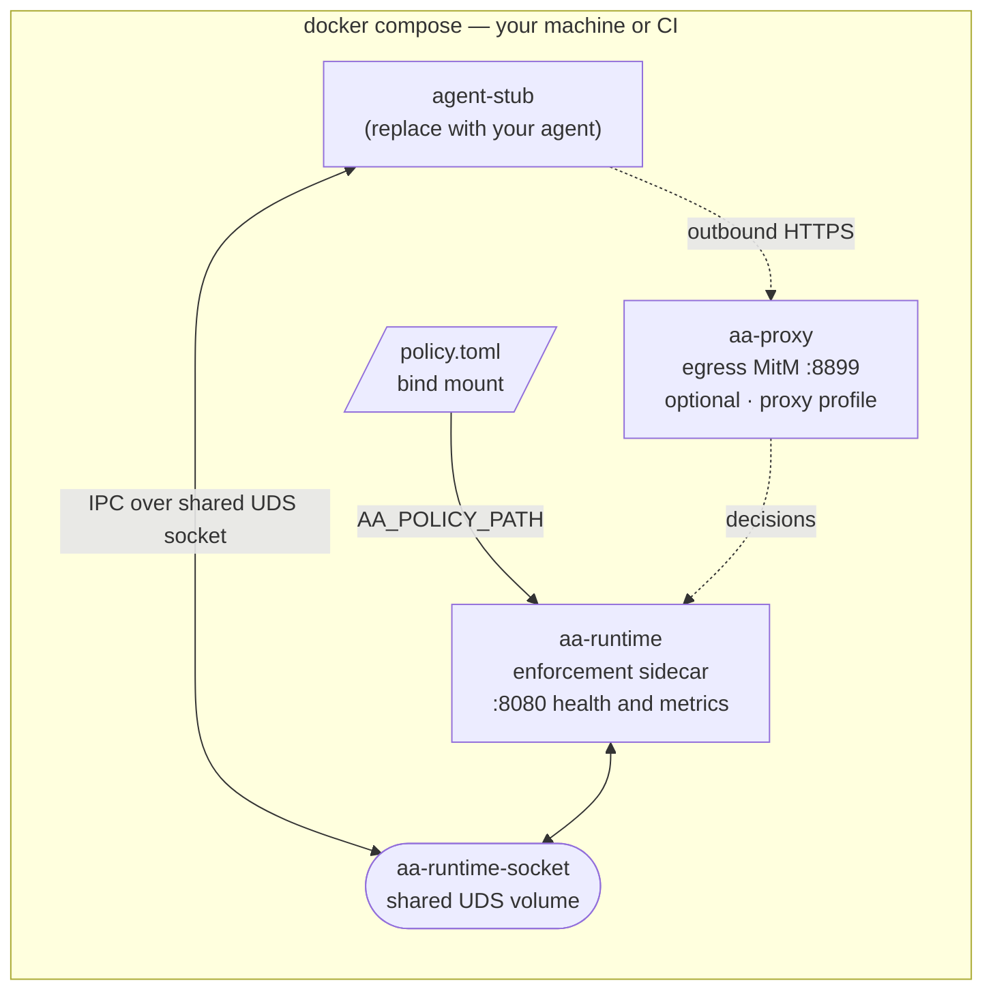

# Self-hosting the open-source stack

Agent Assembly is open source. You can **self-host it yourself** — stand the
infrastructure up, run it, and maintain it — using the sample Docker Compose stack
in [`examples/docker-compose/`](https://github.com/ai-agent-assembly/agent-assembly/tree/master/examples/docker-compose).
This page is the quick path for developers: it shows the **infrastructure
architecture** (which containers exist, who each is for, and what each does), the
exact configuration, and how to bring it up.

> **"Open source" here means scope, not a crippled build.** Self-hosting runs the
> components that live in this open-source repository. The hosted **SaaS edition**
> additionally runs everything *for* you as a managed, multi-tenant service and adds
> the cloud/enterprise control-plane features that live outside this repo (managed
> persistence, SSO, compliance reporting). Nothing here is deliberately
> feature-limited — the example simply starts with the components that already ship
> a container image today.

## Infrastructure architecture

The example stack is a single-host Compose project. Your agent runs alongside an
`aa-runtime` enforcement sidecar; they share a Unix-domain-socket volume; an
optional `aa-proxy` adds code-free egress interception. Local policy comes from a
bind-mounted `policy.toml`.



### Containers — for whom, for what

| Container | Image / build | For whom | For what |
|---|---|---|---|
| `aa-runtime` | `ghcr.io/ai-agent-assembly/aa-runtime:latest` (pulled) | everyone self-hosting | The authoritative enforcement sidecar. Re-scans, redacts and enforces every agent action against your `policy.toml`, and serves health/metrics on `:8080`. This is the one container you always run. |
| `agent-stub` | `alpine:latest` placeholder | developers integrating an agent | A stand-in for **your** agent process. Swap in your own image, keep the same `AA_AGENT_ID`, and share the socket volume — that is all the wiring an agent needs. |
| `aa-proxy` | built from `aa-proxy/Dockerfile` (`proxy` profile) | teams wanting code-free egress control | Optional sidecar that MitM-intercepts outbound HTTPS to apply network-egress policy without touching agent code. |

### Completing the stack

The example focuses on the **enforcement data plane** (runtime + optional proxy),
because those ship a ready container image. The **control plane** — `aa-gateway`
(registry · policy service · budgets), `aa-api` (HTTP/OpenAPI), and the operator
`dashboard` — is **also open source in this repository**; it simply does not ship a
published container image *yet*, so to run it yourself today you build it from
source (`cargo build -p aa-gateway -p aa-api`, `pnpm --dir dashboard build`).
Publishing first-class images for these is tracked as follow-up work. The hosted
**SaaS edition** runs the complete control plane managed for you.

| Plane | Components | In this example | Run it yourself |
|---|---|---|---|
| Enforcement (data plane) | `aa-runtime`, `aa-proxy` | ✅ container images | pull / `--profile proxy` build |
| Control plane | `aa-gateway`, `aa-api`, `dashboard` | not yet (no published image) | open source in this repo — build from source; images pending |
| Managed cloud / enterprise | hosted multi-tenant persistence, SSO, compliance | — | hosted **SaaS edition** |

## What the stack runs

The compose file (`examples/docker-compose/docker-compose.yml`) defines these
services. Values below are taken directly from that file.

| Service | Image / build | Compose profile | Published port | Role |
|---|---|---|---|---|
| `aa-runtime` | `ghcr.io/ai-agent-assembly/aa-runtime:latest` | default | `8080:8080` | Authoritative enforcement sidecar (health + metrics) |
| `agent-stub` | `alpine:latest` (placeholder) | default | — | Stand-in agent sharing the runtime IPC socket |
| `aa-proxy` | built from `../../aa-proxy/Dockerfile` (context = repo root) | `proxy` | `8899:8899` | Optional egress-interception (MitM HTTPS) proxy |

### Volumes

| Volume | Mounted at | Purpose |
|---|---|---|
| `aa-runtime-socket` | `/tmp` (in `aa-runtime` and `agent-stub`) | Shared Unix domain socket — the IPC channel lives at `/tmp/aa-runtime-<AA_AGENT_ID>.sock` |
| `../policy.toml` (bind) | `/etc/aa/policy.toml` (read-only) in `aa-runtime` | Local enforcement policy |

### Environment variables

`aa-runtime`:

| Variable | Value in the stack | Meaning |
|---|---|---|
| `AA_AGENT_ID` | `my-agent-001` | Agent identity; **must match** `agent-stub`. Names the IPC socket. |
| `AA_POLICY_PATH` | `/etc/aa/policy.toml` | Path to the mounted local policy file. |
| `AA_METRICS_ADDR` | `0.0.0.0:8080` (default) | Bind address for the health/metrics HTTP server. |
| `AA_GATEWAY_ENDPOINT` | _(unset)_ | Left unset for standalone, gateway-less enforcement. Set it to call a gateway (self-hosted from source, or the SaaS endpoint) instead. |

`agent-stub`:

| Variable | Value in the stack | Meaning |
|---|---|---|
| `AA_AGENT_ID` | `my-agent-001` | Must equal the runtime's `AA_AGENT_ID`. |
| `AA_GATEWAY_URL` | `https://api.agentassembly.io` | Gateway URL a real agent SDK would use (SaaS endpoint shown; point it at your self-hosted gateway if you run one). |
| `AA_API_KEY` | `${AA_API_KEY}` | Read from your shell environment. |

`aa-proxy` (only under the `proxy` profile):

| Variable | Value in the stack | Meaning |
|---|---|---|
| `AA_PROXY_ADDR` | `0.0.0.0:8899` | Proxy listen address. |
| `AA_PROXY_LLM_ONLY` | `false` | Intercept all egress, not just LLM calls. |
| `AA_PROXY_MCP_FAIL_OPEN` | `1` | **Demo only** — lets the proxy start without a reachable gateway. The proxy normally fails **closed** when its gateway is unreachable. |
| `AA_PROXY_GATEWAY_ENDPOINT` | _(unset)_ | Set to a gateway endpoint (self-hosted or SaaS) to enforce through it. |

## Quickstart

From a clone of the repository:

```bash
cd examples/docker-compose

# Runtime sidecar path (default profile: aa-runtime + agent-stub)
AA_API_KEY=dev-local-key docker compose up
```

`aa-runtime` starts, enforces locally from `../policy.toml`, exposes the IPC socket
at `/tmp/aa-runtime-my-agent-001.sock`, and serves health/metrics on `:8080`:

```bash
curl http://localhost:8080/ready
curl http://localhost:8080/health
curl http://localhost:8080/metrics
```

To additionally build and run the optional egress proxy on `:8899`:

```bash
AA_API_KEY=dev-local-key docker compose --profile proxy up
```

Tear down when finished:

```bash
docker compose down
# or, if you started the proxy profile:
docker compose --profile proxy down
```

## Replacing the agent stub

`agent-stub` is an `alpine` placeholder (the Python SDK is not yet published —
tracked in AAASM-55). To run a real agent, replace its `image:` with your agent
image, keep `AA_AGENT_ID` identical to `aa-runtime`, and keep the
`aa-runtime-socket` volume mounted at `/tmp`. See the example's
[README](https://github.com/ai-agent-assembly/agent-assembly/blob/master/examples/docker-compose/README.md)
for details.

## When you want it fully managed

If you would rather not run and maintain the infrastructure yourself — and want the
managed, multi-tenant control plane with durable audit history, the operator
dashboard, central registry, team budgets, SSO and compliance reporting — use the
hosted **SaaS edition**, which runs the complete stack for you.
