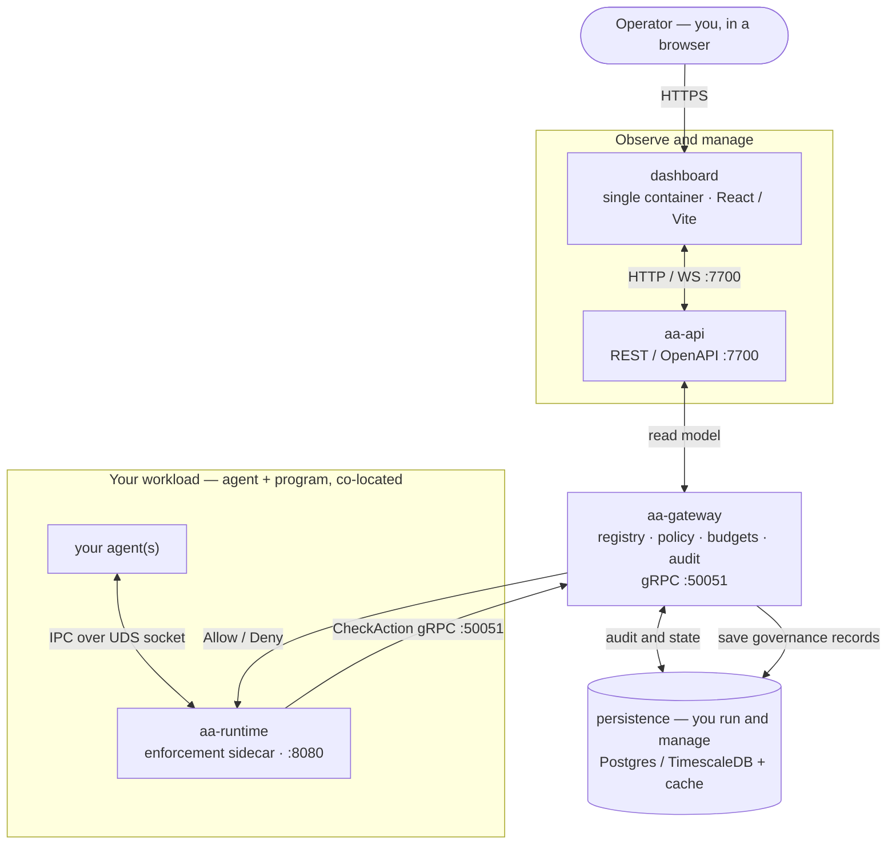

# Self-hosting the open-source stack

Agent Assembly is open source. You can **self-host it yourself** — stand the
infrastructure up, run it, and maintain it — using the sample Docker Compose stack
in [`examples/docker-compose/`](https://github.com/ai-agent-assembly/agent-assembly/tree/master/examples/docker-compose).
This page is the quick path for developers: it shows the **infrastructure
architecture** (which containers exist, who each is for, and what each does), the
exact configuration, and how to bring it up.

> **"Open source" here means scope, not a crippled build.** Self-hosting runs the
> components that live in this open-source repository. The hosted **SaaS edition**
> additionally runs everything *for* you as a managed, multi-tenant service and adds
> the cloud/enterprise control-plane features that live outside this repo (managed
> persistence, SSO, compliance reporting). Nothing here is deliberately
> feature-limited — the example simply starts with the components that already ship
> a container image today.

## Infrastructure architecture

The full self-host topology is a short, end-to-end chain. Operators work in the
**dashboard**; the dashboard reads everything through the **REST API** (`aa-api`);
the API fronts the **gateway** (the brain), which evaluates policy and saves
governance records to **persistence**; and your **agents run co-located with an
`aa-runtime` enforcement sidecar**, which checks every action with the gateway. So
the very actions your agents take are recorded in persistence and surface back in
the dashboard:

`you ⇄ dashboard ⇄ aa-api ⇄ aa-gateway ⇄ persistence ⇆ aa-runtime ⇄ your agents`



Two things to read from it:

- **The observability loop.** Your agents + `aa-runtime` produce the governance data
  (decisions, audit, budget usage); the gateway persists it; the dashboard reads it
  back through the API. That is how what your agents do shows up on screen.
- **What runs where.** The **dashboard is a single container**; **persistence is a
  standard datastore you run and manage** (e.g. Postgres / TimescaleDB); the
  **gateway + API** are the control plane; and **each agent runs next to its own
  `aa-runtime`** sidecar, sharing a Unix-domain socket.

### Containers — for whom, for what

| Container | Image / build today | For whom | For what |
|---|---|---|---|
| `dashboard` | build from source (`pnpm --dir dashboard build`); image pending | operators | **Single-container** web UI to observe governance and manage agents, policies and budgets — reads everything via the REST API. |
| `aa-api` | build from source (`cargo build -p aa-api`); image pending | operators (via dashboard) + tools | The REST / OpenAPI surface on `:7700` the dashboard reads; fronts the gateway read model. |
| `aa-gateway` | build from source (`cargo build -p aa-gateway`); image pending | the deployment | The brain — registry, policy evaluation, budgets, audit; decides each action and saves governance records to persistence. gRPC `:50051`. |
| persistence | **you run / manage** a standard `postgres` / `timescaledb` image | the deployment | Durable audit history + state that the dashboard displays. |
| `aa-runtime` | `ghcr.io/ai-agent-assembly/aa-runtime:latest` (pulled) | every agent | Enforcement sidecar **co-located with the agent** — the authoritative chokepoint that checks each action with the gateway. Serves health/metrics on `:8080`. |
| your agent(s) | your image | you | The workload being governed — runs beside its runtime, sharing the UDS socket. |
| `aa-proxy` (optional) | build from `aa-proxy/Dockerfile` (`proxy` profile) | teams wanting code-free egress control | MitM-intercepts outbound HTTPS to apply network-egress policy without touching agent code. |

Everything above is **open source in this repository**. Today `aa-runtime` ships a
published image and `aa-proxy` builds from a Dockerfile; `aa-gateway`, `aa-api` and
`dashboard` you build from source (first-class images are tracked as follow-up); and
persistence is any standard Postgres / TimescaleDB you run. The hosted **SaaS
edition** runs this whole stack managed for you and adds the cloud / enterprise
control-plane features that live outside this repo.

## What the example Compose wires today

The sample `docker-compose.yml` starts the subset that ships container images out of
the box — your agent placeholder, its `aa-runtime` sidecar, and the optional egress
proxy — so you see enforcement working immediately, then grow toward the full
topology above by adding persistence, gateway, API and dashboard.


The compose file (`examples/docker-compose/docker-compose.yml`) defines these
services. Values below are taken directly from that file.

| Service | Image / build | Compose profile | Published port | Role |
|---|---|---|---|---|
| `aa-runtime` | `ghcr.io/ai-agent-assembly/aa-runtime:latest` | default | `8080:8080` | Authoritative enforcement sidecar (health + metrics) |
| `agent-stub` | `alpine:latest` (placeholder) | default | — | Stand-in agent sharing the runtime IPC socket |
| `aa-proxy` | built from `../../aa-proxy/Dockerfile` (context = repo root) | `proxy` | `8899:8899` | Optional egress-interception (MitM HTTPS) proxy |

### Volumes

| Volume | Mounted at | Purpose |
|---|---|---|
| `aa-runtime-socket` | `/tmp` (in `aa-runtime` and `agent-stub`) | Shared Unix domain socket — the IPC channel lives at `/tmp/aa-runtime-<AA_AGENT_ID>.sock` |
| `../policy.toml` (bind) | `/etc/aa/policy.toml` (read-only) in `aa-runtime` | Local enforcement policy |

### Environment variables

`aa-runtime`:

| Variable | Value in the stack | Meaning |
|---|---|---|
| `AA_AGENT_ID` | `my-agent-001` | Agent identity; **must match** `agent-stub`. Names the IPC socket. |
| `AA_POLICY_PATH` | `/etc/aa/policy.toml` | Path to the mounted local policy file. |
| `AA_METRICS_ADDR` | `0.0.0.0:8080` (default) | Bind address for the health/metrics HTTP server. |
| `AA_GATEWAY_ENDPOINT` | _(unset)_ | Left unset for standalone, gateway-less enforcement. Set it to call a gateway (self-hosted from source, or the SaaS endpoint) instead. |

`agent-stub`:

| Variable | Value in the stack | Meaning |
|---|---|---|
| `AA_AGENT_ID` | `my-agent-001` | Must equal the runtime's `AA_AGENT_ID`. |
| `AA_GATEWAY_URL` | `https://api.agentassembly.io` | Gateway URL a real agent SDK would use (SaaS endpoint shown; point it at your self-hosted gateway if you run one). |
| `AA_API_KEY` | `${AA_API_KEY}` | Read from your shell environment. |

`aa-proxy` (only under the `proxy` profile):

| Variable | Value in the stack | Meaning |
|---|---|---|
| `AA_PROXY_ADDR` | `0.0.0.0:8899` | Proxy listen address. |
| `AA_PROXY_LLM_ONLY` | `false` | Intercept all egress, not just LLM calls. |
| `AA_PROXY_MCP_FAIL_OPEN` | `1` | **Demo only** — lets the proxy start without a reachable gateway. The proxy normally fails **closed** when its gateway is unreachable. |
| `AA_PROXY_GATEWAY_ENDPOINT` | _(unset)_ | Set to a gateway endpoint (self-hosted or SaaS) to enforce through it. |

## Quickstart

From a clone of the repository:

```bash
cd examples/docker-compose

# Runtime sidecar path (default profile: aa-runtime + agent-stub)
AA_API_KEY=dev-local-key docker compose up
```

`aa-runtime` starts, enforces locally from `../policy.toml`, exposes the IPC socket
at `/tmp/aa-runtime-my-agent-001.sock`, and serves health/metrics on `:8080`:

```bash
curl http://localhost:8080/ready
curl http://localhost:8080/health
curl http://localhost:8080/metrics
```

To additionally build and run the optional egress proxy on `:8899`:

```bash
AA_API_KEY=dev-local-key docker compose --profile proxy up
```

Tear down when finished:

```bash
docker compose down
# or, if you started the proxy profile:
docker compose --profile proxy down
```

## Replacing the agent stub

`agent-stub` is an `alpine` placeholder (the Python SDK is not yet published —
tracked in AAASM-55). To run a real agent, replace its `image:` with your agent
image, keep `AA_AGENT_ID` identical to `aa-runtime`, and keep the
`aa-runtime-socket` volume mounted at `/tmp`. See the example's
[README](https://github.com/ai-agent-assembly/agent-assembly/blob/master/examples/docker-compose/README.md)
for details.

## When you want it fully managed

If you would rather not run and maintain the infrastructure yourself — and want the
managed, multi-tenant control plane with durable audit history, the operator
dashboard, central registry, team budgets, SSO and compliance reporting — use the
hosted **SaaS edition**, which runs the complete stack for you.
