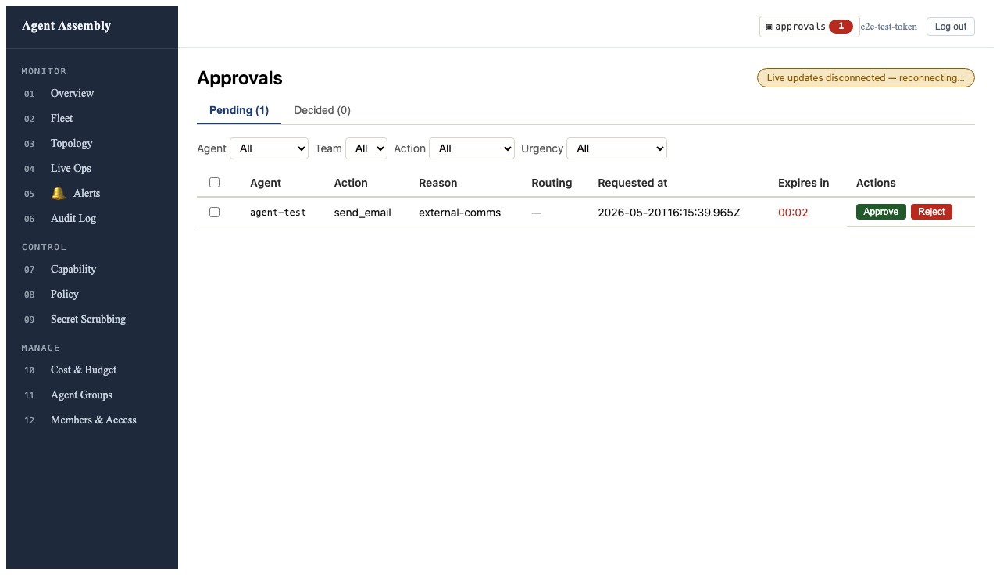
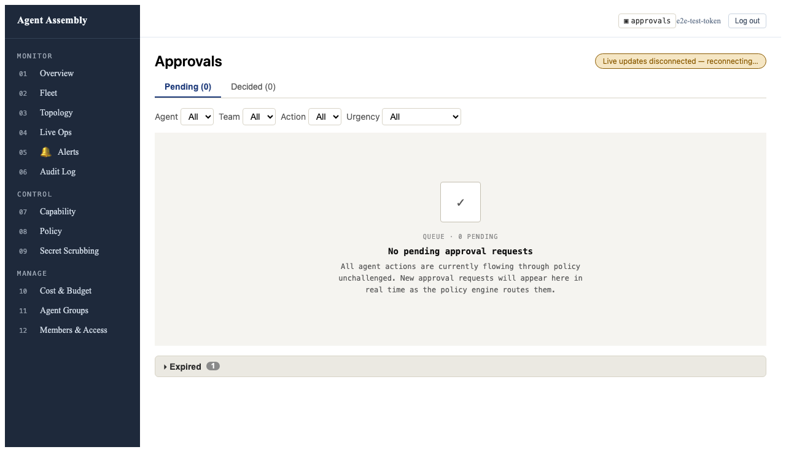
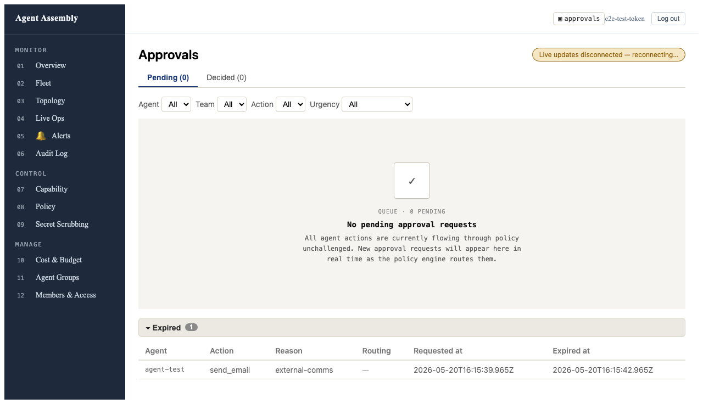

# Verification report — AAASM-1478

**Ticket:** [AAASM-1478](https://lightning-dust-mite.atlassian.net/browse/AAASM-1478) — Dashboard: auto-expire countdown + collapsible Expired section on ApprovalsPage
**Sprint:** AAA Sprint 4 (2026-05-19 → 2026-05-26)
**Sub-tasks shipped:**

| Sub-task | PR | Summary |
|---|---|---|
| AAASM-1673 | [#620](https://github.com/ai-agent-assembly/agent-assembly/pull/620) | Countdown helpers + `ApprovalCountdown` component |
| AAASM-1674 | [#622](https://github.com/ai-agent-assembly/agent-assembly/pull/622) | `useExpiredApprovals` client state + WS expired handling |
| AAASM-1675 | [#624](https://github.com/ai-agent-assembly/agent-assembly/pull/624) | `ExpiredApprovalsSection` + `ApprovalsPage` wire-in |
| AAASM-1676 | _this PR_ | Playwright e2e + screenshots + this report |

## Definition of Done — AC walk-through

> _All four boxes from the parent Task description below were independently verified by both Vitest unit/integration tests and the Playwright e2e spec landed in this sub-task._

### ✅ Countdown renders correctly at each severity tier with appropriate refresh cadence

- **Unit:** `dashboard/src/features/approvals/urgency.test.ts` — `getCountdownTier` boundary cases at 60s and 5min; `formatCountdown` `mm:ss` ↔ `Xh Ym` boundary at 1h.
- **Unit:** `dashboard/src/features/approvals/ApprovalCountdown.test.tsx` — three tier-colour cases (`var(--danger)` / `var(--warn)` / `var(--ink-3)`), explicit cadence cases (10s ticks > 60s remaining, 1s ticks ≤ 60s remaining, hand-off between cadences).
- **E2E:** Screenshot 01 below shows the in-page rendering — `00:02` in red on the live page, `data-tier="high"` asserted by the spec.

### ✅ Active row moves to the Expired section on countdown-zero **OR** matching WS expired event

- **Unit (client-side trigger):** `dashboard/src/features/approvals/useExpiredApprovals.test.tsx` — direct dispatcher call moves the row and is idempotent; no-op on unknown id.
- **Unit (WS trigger):** `dashboard/src/features/approvals/useApprovalsStream.test.tsx` — WS frame with `payload.status:"expired"` for a known id routes through `expireApproval`; unknown id is a no-op; `pending` injection regression net preserved.
- **Integration:** `dashboard/src/pages/ApprovalsPage.test.tsx` — pre-seeded active cache empties to `[]` after `<ApprovalCountdown>`'s `onExpire` fires; expired cache holds `{...row, status:"expired"}`.
- **E2E:** `dashboard/tests/e2e/approvals-expired.spec.ts` — waits for the 3-second timer to fire, asserts `approval-row` count goes to 0 and the expired badge reads 1.

### ✅ Collapsible Expired section with count badge + default-collapsed state

- **Unit:** `dashboard/src/features/approvals/ExpiredApprovalsSection.test.tsx` — empty-list hide, default `aria-expanded="false"`, count badge text matches `rows.length`, expand-on-click reveals the table, no Approve/Reject buttons inside, opacity 0.65 + `var(--ink-3)`, collapse-again.
- **E2E:** Screenshot 02 (collapsed) and Screenshot 03 (expanded) below.

### ✅ `pnpm test --run` green and `pnpm type-check` clean

```
$ pnpm test --run
 Test Files  114 passed (114)
      Tests  975 passed (975)
$ pnpm type-check
$ pnpm lint
```

Numbers above were captured from the S3 worktree (which has the complete implementation merged in locally). S4 worktree adds the Playwright spec only.

### ⚠️ Manual `pnpm dev` verification against a real gateway

Not run against a real gateway. The Playwright spec runs against the production `pnpm preview` build with stubbed REST endpoints (the WebSocket is intentionally aborted; the disconnected banner is expected and visible in the screenshots). Combined with the unit + integration suite this fully covers the AC; the gateway smoke-flow is a UX nicety, not a behavioural-coverage gap.

## Screenshots

All three captured from the live preview server during the Playwright run (`tests/__screenshots__/AAASM-1478/`, copied to `design/v1/screenshots/aaasm-1478/`).

### 01 — Pending row with countdown at high tier


Notes:
- "Expires in" column is the new one, sitting between "Requested at" and "Actions".
- `00:02` is rendered in red because `remainingMs < 60_000` ⇒ high tier ⇒ `var(--danger)`.
- The page-level "Live updates disconnected — reconnecting…" banner is expected (the spec aborts the WS to isolate the client-side countdown trigger).

### 02 — Row moved, Expired section collapsed


Notes:
- Pending tab now reads `Pending (0)`; the row is no longer in the active table.
- The collapsible "Expired" header is visible at the bottom with the count badge reading **1**.
- Default state is `aria-expanded="false"` — the expired row is not rendered until clicked.

### 03 — Expired section expanded


Notes:
- Table layout mirrors the active list except for the trailing "Actions" column, which is replaced by "Expired at".
- Greyed-out styling (`opacity: 0.65; color: var(--ink-3)`) communicates the row's read-only nature.
- No Approve / Reject controls survive — verified via `expect(...).toHaveCount(0)` in the e2e spec.

## Architecture notes worth carrying forward

1. **Two trigger paths converge on one dispatcher.** Client-side countdown-to-zero (via `ApprovalCountdown.onExpire`) and WS `payload.status:"expired"` both call the same `expireApproval(queryClient, id)`. This satisfies the parent's "both paths converge on the same React state update" requirement and means we don't need to fan-out logic across two places.
2. **Client-only expired cache, no server retention.** The `['approvals', 'expired']` React-Query key has no `queryFn` that goes to the network; it's a pure client store. Matches the AAASM-1453 Option B decision (server doesn't keep expired requests).
3. **`useSyncExternalStore` over `QueryCache.subscribe`.** Originally tried `useQuery` with `initialData: []` + `staleTime: Infinity`, but `setQueryData` updates weren't propagating to the hook consumer in tests. Swapping to `useSyncExternalStore` over the QueryCache's native subscription fixed it cleanly and avoids the useQuery overhead for a non-fetching cache.
4. **Idempotency in the dispatcher, not the caller.** `expireApproval` is itself idempotent so the WS handler and the `onExpire` callback can race without producing duplicates.

## Closing

All four DoD checkboxes verified. Ready to close the parent task once S1 / S2 / S3 / S4 PRs all merge.
